# STAT545 hw03

## This is hw03 from Lucy Mei.

## Gapminder data

```r
library(gapminder)
library(tidyverse)
```

```
## Loading tidyverse: ggplot2
## Loading tidyverse: tibble
## Loading tidyverse: tidyr
## Loading tidyverse: readr
## Loading tidyverse: purrr
## Loading tidyverse: dplyr
```

```
## Conflicts with tidy packages ----------------------------------------------
```

```
## filter(): dplyr, stats
## lag():    dplyr, stats
```

```r
library(knitr)
```

# My mission, high-level
1. Use dplyr and ggplot2 as tools.
2. Make observations about what my tables/figures show and about the process. 
3. Pick at least three of the tasks and make a table and figure.

# Task menu
## 1. Get the maximum and minimum of GDP per capita for all continents.
First, I am going to find the global max and min of GDP per capita (regardless of time) for all continents. 

```r
gdp <- gapminder %>% 
  group_by(continent) %>% 
  summarize(max_gdpPercap=max(gdpPercap), 
            min_gdpPercap=min(gdpPercap))

kable(gdp, align = 'c', format = 'markdown', digits = 2, col.names = c("Continent", "Maximum GDP per capita", "Minimum GDP per capita"))
```


| Continent | Maximum GDP per capita | Minimum GDP per capita |
|:---------:|:----------------------:|:----------------------:|
|  Africa   |        21951.21        |         241.17         |
| Americas  |        42951.65        |        1201.64         |
|   Asia    |       113523.13        |         331.00         |
|  Europe   |        49357.19        |         973.53         |
|  Oceania  |        34435.37        |        10039.60        |

```r
  ggplot(gdp, aes(continent, max_gdpPercap)) + 
    geom_point(aes(continent, max_gdpPercap,color=continent)) +
    geom_point(aes(continent, min_gdpPercap, color=continent)) + 
    theme_bw() + labs(x="Continent", y="Max and Min GDP per capita", title="The Maximum and Minimum GDP per capita of all Continents")
```

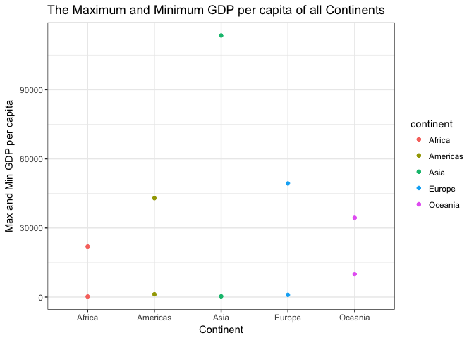<!-- -->
I put the max and min on one graph to compare the trends at the same time. In a larger scale, there is not much difference among the minimum GDP per capita of the continents. However, the maximum GDP per capita of Asia is much more higher than those of other continents. 


```r
ggplot(gdp, aes(continent, min_gdpPercap)) + 
  geom_bar(aes(continent, min_gdpPercap), stat="identity", fill=continent_colors)+
  theme_bw() + 
  labs(x="Continent", y="Minimum GDP per capita", title="The Minimum GDP per capita of all Continents")
```

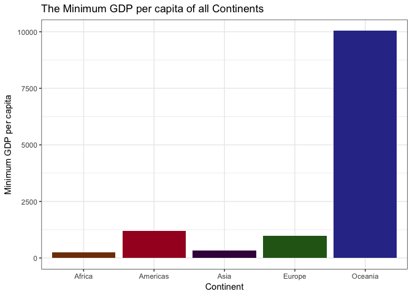<!-- -->
Since in the combined graph, due to the large scale, the difference of the minimum GDP per capita of continents is not obvious. Therefore, I plot it on a separate graph. Oceania has a very high minimum GDP per capita whereas the min GDP per capita is low in Africa and Asia.

Then, I explored a bit of the max and min according to time.

```r
gdp_time <- gapminder %>%
  group_by (continent, year) %>%
  summarize(mingdpt = min(gdpPercap), maxgdpt = max(gdpPercap))
kable(gdp_time, align = 'c', format = 'markdown', digits = 2, col.names = c("Continent", "Year", "Min GDP per capita", "Max GDP per capita"))
```


| Continent | Year | Min GDP per capita | Max GDP per capita |
|:---------:|:----:|:------------------:|:------------------:|
|  Africa   | 1952 |       298.85       |      4725.30       |
|  Africa   | 1957 |       336.00       |      5487.10       |
|  Africa   | 1962 |       355.20       |      6757.03       |
|  Africa   | 1967 |       412.98       |      18772.75      |
|  Africa   | 1972 |       464.10       |      21011.50      |
|  Africa   | 1977 |       502.32       |      21951.21      |
|  Africa   | 1982 |       462.21       |      17364.28      |
|  Africa   | 1987 |       389.88       |      11864.41      |
|  Africa   | 1992 |       410.90       |      13522.16      |
|  Africa   | 1997 |       312.19       |      14722.84      |
|  Africa   | 2002 |       241.17       |      12521.71      |
|  Africa   | 2007 |       277.55       |      13206.48      |
| Americas  | 1952 |      1397.72       |      13990.48      |
| Americas  | 1957 |      1544.40       |      14847.13      |
| Americas  | 1962 |      1662.14       |      16173.15      |
| Americas  | 1967 |      1452.06       |      19530.37      |
| Americas  | 1972 |      1654.46       |      21806.04      |
| Americas  | 1977 |      1874.30       |      24072.63      |
| Americas  | 1982 |      2011.16       |      25009.56      |
| Americas  | 1987 |      1823.02       |      29884.35      |
| Americas  | 1992 |      1456.31       |      32003.93      |
| Americas  | 1997 |      1341.73       |      35767.43      |
| Americas  | 2002 |      1270.36       |      39097.10      |
| Americas  | 2007 |      1201.64       |      42951.65      |
|   Asia    | 1952 |       331.00       |     108382.35      |
|   Asia    | 1957 |       350.00       |     113523.13      |
|   Asia    | 1962 |       388.00       |      95458.11      |
|   Asia    | 1967 |       349.00       |      80894.88      |
|   Asia    | 1972 |       357.00       |     109347.87      |
|   Asia    | 1977 |       371.00       |      59265.48      |
|   Asia    | 1982 |       424.00       |      33693.18      |
|   Asia    | 1987 |       385.00       |      28118.43      |
|   Asia    | 1992 |       347.00       |      34932.92      |
|   Asia    | 1997 |       415.00       |      40300.62      |
|   Asia    | 2002 |       611.00       |      36023.11      |
|   Asia    | 2007 |       944.00       |      47306.99      |
|  Europe   | 1952 |       973.53       |      14734.23      |
|  Europe   | 1957 |      1353.99       |      17909.49      |
|  Europe   | 1962 |      1709.68       |      20431.09      |
|  Europe   | 1967 |      2172.35       |      22966.14      |
|  Europe   | 1972 |      2860.17       |      27195.11      |
|  Europe   | 1977 |      3528.48       |      26982.29      |
|  Europe   | 1982 |      3630.88       |      28397.72      |
|  Europe   | 1987 |      3738.93       |      31540.97      |
|  Europe   | 1992 |      2497.44       |      33965.66      |
|  Europe   | 1997 |      3193.05       |      41283.16      |
|  Europe   | 2002 |      4604.21       |      44683.98      |
|  Europe   | 2007 |      5937.03       |      49357.19      |
|  Oceania  | 1952 |      10039.60      |      10556.58      |
|  Oceania  | 1957 |      10949.65      |      12247.40      |
|  Oceania  | 1962 |      12217.23      |      13175.68      |
|  Oceania  | 1967 |      14463.92      |      14526.12      |
|  Oceania  | 1972 |      16046.04      |      16788.63      |
|  Oceania  | 1977 |      16233.72      |      18334.20      |
|  Oceania  | 1982 |      17632.41      |      19477.01      |
|  Oceania  | 1987 |      19007.19      |      21888.89      |
|  Oceania  | 1992 |      18363.32      |      23424.77      |
|  Oceania  | 1997 |      21050.41      |      26997.94      |
|  Oceania  | 2002 |      23189.80      |      30687.75      |
|  Oceania  | 2007 |      25185.01      |      34435.37      |

```r
ggplot(gdp_time, aes(year, maxgdpt, color = continent)) +
  geom_point(aes(year, maxgdpt)) +
  geom_smooth(se=FALSE) +
  labs(x = "year", y = "Max GDP per capita", title = "Change of Maximum GDP per capita over time")
```

```
## `geom_smooth()` using method = 'loess'
```

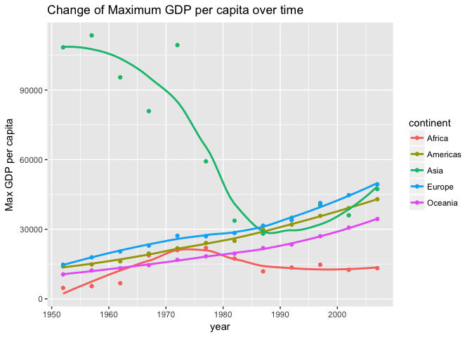<!-- -->

```r
ggplot(gdp_time, aes(year, mingdpt, color = continent)) +
  geom_point(aes(year, mingdpt)) +
  geom_smooth(se=FALSE) +
  labs(x = "year", y = "Min GDP per capita", title = "Change of Minimum GDP per capita over time")
```

```
## `geom_smooth()` using method = 'loess'
```

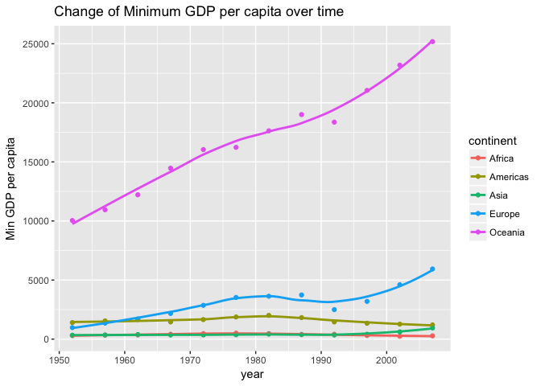<!-- -->
From the first plot, it shows the max GDP per capita of Asia dropped drastically between 1970 and 1980 whereas the min GDP per capita of Oceania remained high since 1950. 


## 2. Look at the spread of GDP per capita within the continents.
This is a summary table with several variables that allow us to understand the spread of GDP per capita of each continent.

```r
p1 <-gapminder %>% 
  group_by(continent) %>%
  summarize(mingdp = min(gdpPercap),
         maxgdp = max(gdpPercap),
         gdpmean = mean(gdpPercap), 
         gdpvariant = var(gdpPercap), 
         gdpmedian = median(gdpPercap))
kable(p1, align = 'c', format = 'markdown', digits = 2, col.names = c("Continent", "Min GDP per cap", "Max GDP per cap", "Mean", "Variant", "Median"))
```


| Continent | Min GDP per cap | Max GDP per cap |   Mean   |  Variant  |  Median  |
|:---------:|:---------------:|:---------------:|:--------:|:---------:|:--------:|
|  Africa   |     241.17      |    21951.21     | 2193.75  |  7997187  | 1192.14  |
| Americas  |     1201.64     |    42951.65     | 7136.11  | 40918591  | 5465.51  |
|   Asia    |     331.00      |    113523.13    | 7902.15  | 197272506 | 2646.79  |
|  Europe   |     973.53      |    49357.19     | 14469.48 | 87520020  | 12081.75 |
|  Oceania  |    10039.60     |    34435.37     | 18621.61 | 40436669  | 17983.30 |


```r
p2 <- ggplot(gapminder, aes(gdpPercap,lifeExp)) + 
  facet_wrap(~ continent) + 
  geom_point(aes(gdpPercap, lifeExp), color="skyblue3", alpha=0.25) +
  scale_x_log10()
p2 + 
  theme(strip.background = element_rect(fill="darkolivegreen2"),
           strip.text = element_text(face="bold")) + 
  labs(x="GDP per capita", y="Life Expectancy", title ="The relationship between Life Expectancy and GDP per capita of each continent")
```

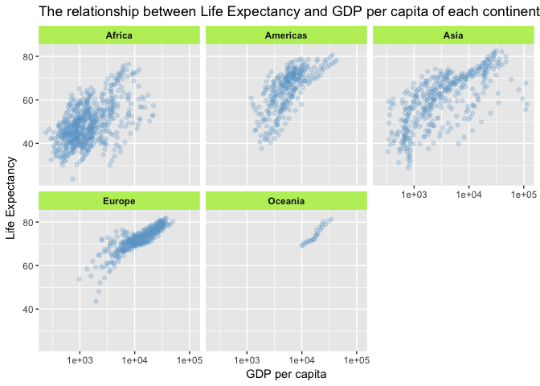<!-- -->
This is a figure relate GDP per capita to life expectancy.


```r
ggplot(gapminder, aes(gdpPercap)) +
  facet_wrap(~ continent) +
  geom_density(color = "skyblue2", fill="skyblue2") +
  labs(x="GDP per capita", y="Frequency", title = "The spread of GDP per capita of each continent")
```

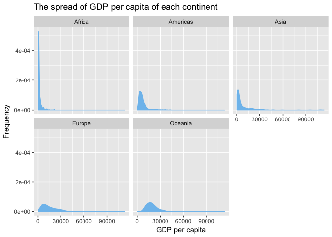<!-- -->
This figure displays the distribution of GDP per capita of each continent. 


## 3. Compute a trimmed mean of life expectancy for different years. Or a weighted mean, weighting by population. Just try something other than the plain vanilla mean.
This is a table with the mean of life expectancy weighted by population and the non-weighted mean is there as a comparison.

```r
lifeExpweighted <- gapminder %>%
  filter(continent =="Asia") %>%
  group_by(year) %>%
  summarize(Weightedmean = weighted.mean(lifeExp, pop), Mean = mean(lifeExp))

kable(lifeExpweighted, align = 'c', format = 'markdown', digits = 2, col.names = c("Year", "Weighted Mean", "Mean"))
```


| Year | Weighted Mean | Mean  |
|:----:|:-------------:|:-----:|
| 1952 |     42.94     | 46.31 |
| 1957 |     47.29     | 49.32 |
| 1962 |     46.57     | 51.56 |
| 1967 |     53.88     | 54.66 |
| 1972 |     57.52     | 57.32 |
| 1977 |     59.56     | 59.61 |
| 1982 |     61.57     | 62.62 |
| 1987 |     63.54     | 64.85 |
| 1992 |     65.15     | 66.54 |
| 1997 |     66.77     | 68.02 |
| 2002 |     68.14     | 69.23 |
| 2007 |     69.44     | 70.73 |


```r
ggplot(lifeExpweighted, aes(year, Mean)) +
  geom_line(aes(year, Weightedmean), color="blue") +
  geom_line(aes(year, Mean), color ="red") +
  labs(x="Year", y="Life expectancy", title="Change of life expectancy overtime (Mean and weighted mean)")
```

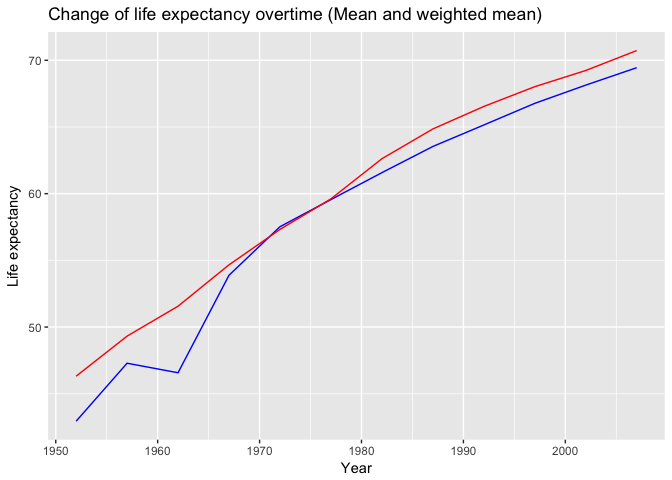<!-- -->
The mean and the population weighted mean of life expectancy varied before 1970. In 1970-1980, they are pretty much the same. From 1980 and after, they showed similar trends. 


## 4. How is life expectancy changing over time on different continents?


```r
l1 <- ggplot(gapminder, aes(year, lifeExp)) + 
  facet_wrap(~ continent) + 
  geom_point(aes(year, lifeExp), color = "skyblue", alpha=0.25) +
  geom_smooth(method = "loess",span=0.5, se=FALSE)
l1 + theme_bw() + 
  labs(x="Year", y="Life Expectancy", title = "Change of Life Expectancy over time")
```

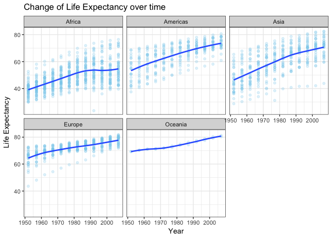<!-- -->
Life Expectancy of all continents is increasing with the life expectancy of Europe and Oceania show a lower increase rate. 


## 5. Report the absolute and/or relative abundance of countries with low life expectancy over time by continent: Compute some measure of worldwide life expectancy - you decide - a mean or median or some other quantile or perhaps your current age. Then determine how many countries on each continent have a life expectancy less than this bench mark, for each year.

```r
summary(gapminder)
```

```
##         country        continent        year         lifeExp     
##  Afghanistan:  12   Africa  :624   Min.   :1952   Min.   :23.60  
##  Albania    :  12   Americas:300   1st Qu.:1966   1st Qu.:48.20  
##  Algeria    :  12   Asia    :396   Median :1980   Median :60.71  
##  Angola     :  12   Europe  :360   Mean   :1980   Mean   :59.47  
##  Argentina  :  12   Oceania : 24   3rd Qu.:1993   3rd Qu.:70.85  
##  Australia  :  12                  Max.   :2007   Max.   :82.60  
##  (Other)    :1632                                                
##       pop              gdpPercap       
##  Min.   :6.001e+04   Min.   :   241.2  
##  1st Qu.:2.794e+06   1st Qu.:  1202.1  
##  Median :7.024e+06   Median :  3531.8  
##  Mean   :2.960e+07   Mean   :  7215.3  
##  3rd Qu.:1.959e+07   3rd Qu.:  9325.5  
##  Max.   :1.319e+09   Max.   :113523.1  
## 
```

```r
# The low life expectancy is set using mean = 59.47
```
I set the mark of low life expectancy using the mean, which is 59.47.
This is a table counting the number of countries of each continent with low life expectancy in each recorded year.

```r
ll1 <- gapminder %>%
  filter(lifeExp < 59.47) %>%
  group_by(continent, year) %>%
  summarize(country_count = n())

kable(ll1, align = 'c', format = 'markdown', digits = 2, col.names = c("Continent", "Year", "Number of Countries"))
```


| Continent | Year | Number of Countries |
|:---------:|:----:|:-------------------:|
|  Africa   | 1952 |         52          |
|  Africa   | 1957 |         52          |
|  Africa   | 1962 |         51          |
|  Africa   | 1967 |         50          |
|  Africa   | 1972 |         50          |
|  Africa   | 1977 |         49          |
|  Africa   | 1982 |         43          |
|  Africa   | 1987 |         39          |
|  Africa   | 1992 |         38          |
|  Africa   | 1997 |         39          |
|  Africa   | 2002 |         41          |
|  Africa   | 2007 |         40          |
| Americas  | 1952 |         19          |
| Americas  | 1957 |         15          |
| Americas  | 1962 |         13          |
| Americas  | 1967 |         10          |
| Americas  | 1972 |          8          |
| Americas  | 1977 |          7          |
| Americas  | 1982 |          5          |
| Americas  | 1987 |          2          |
| Americas  | 1992 |          1          |
| Americas  | 1997 |          1          |
| Americas  | 2002 |          1          |
|   Asia    | 1952 |         29          |
|   Asia    | 1957 |         26          |
|   Asia    | 1962 |         25          |
|   Asia    | 1967 |         23          |
|   Asia    | 1972 |         19          |
|   Asia    | 1977 |         14          |
|   Asia    | 1982 |         11          |
|   Asia    | 1987 |          8          |
|   Asia    | 1992 |          7          |
|   Asia    | 1997 |          6          |
|   Asia    | 2002 |          3          |
|   Asia    | 2007 |          1          |
|  Europe   | 1952 |          5          |
|  Europe   | 1957 |          3          |
|  Europe   | 1962 |          1          |
|  Europe   | 1967 |          1          |
|  Europe   | 1972 |          1          |


```r
ggplot(ll1, aes(year, country_count)) +
  facet_wrap(~ continent) +
  geom_area(fill="skyblue3") +
  theme_bw() +
  theme(strip.text = element_text(face="bold")) +
  labs(x="Number of countries", y="Year", title="Amount of countries with low expectancy over time")
```

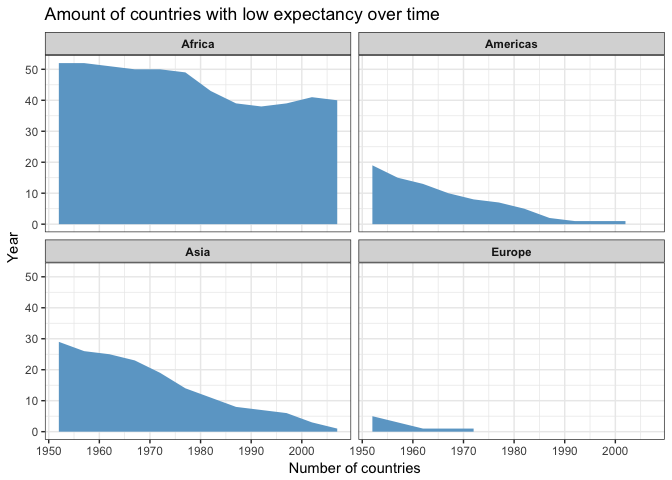<!-- -->
Many countries in Africa have low life expectancy whereas in Europe, people live over 60 years old since 1970. The life expectancy of Oceania is always higher than the set mark.


## 6. Make my own!
I am interested in examining the change of population between 1952 and 2007.

```r
oldworldpop <- gapminder %>%
  filter(year==1952) %>%
  group_by(continent) %>%
  summarize(total_pop= sum(pop))

kable(oldworldpop, align = 'c', format = 'markdown', digits = 2, col.names = c("Continent", "Total population"))
```


| Continent | Total population |
|:---------:|:----------------:|
|  Africa   |    237640501     |
| Americas  |    345152446     |
|   Asia    |    1395357351    |
|  Europe   |    418120846     |
|  Oceania  |     10686006     |

```r
oldpop <- c(237640501, 345152446, 1395357351,418120846,10686006)
oldcontinent <- c("Africa", "Americas", "Asia", "Europe", "Oceania")
pie(oldpop, labels=oldcontinent, main="The distribution of world population in 1952")
```

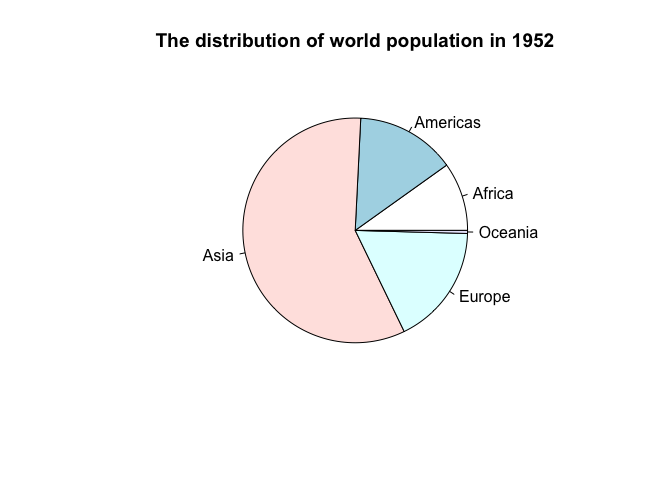<!-- -->

```r
newworldpop <- gapminder %>%
  filter(year==2007) %>%
  group_by(continent) %>%
  summarize(total_popnew= sum(as.numeric(pop)))

kable(newworldpop, align = 'c', format = 'markdown', digits = 2, col.names = c("Continent", "Total population"))
```


| Continent | Total population |
|:---------:|:----------------:|
|  Africa   |    929539692     |
| Americas  |    898871184     |
|   Asia    |    3811953827    |
|  Europe   |    586098529     |
|  Oceania  |     24549947     |

```r
newpop <- c(929539692, 898871184, 3811953827,586098529,24549947)
newcontinent <- c("Africa", "Americas", "Asia", "Europe", "Oceania")
pie(newpop, labels=newcontinent, main="The distribution of world population in 2007")
```

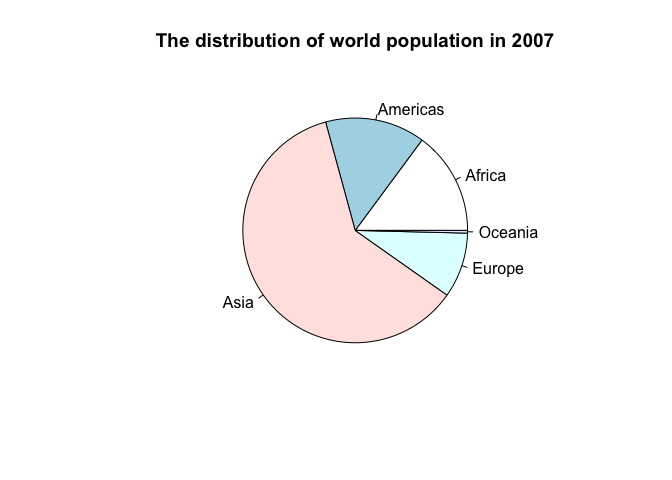<!-- -->
The population of Asia kept growing and population of Europe decreased.

# But I want to do more!

```r
table_graph <- tbl_df(gapminder)
table_graph1 <- table_graph %>%
  group_by(continent) %>%
  summarise(meanpop=mean(pop), medianpop=median(pop))
kable(table_graph1, align = 'c', format = 'markdown', digits = 2, col.names = c("Continent", "Mean", "Median"))
```


| Continent |   Mean   |  Median  |
|:---------:|:--------:|:--------:|
|  Africa   | 9916003  | 4579311  |
| Americas  | 24504795 | 6227510  |
|   Asia    | 77038722 | 14530830 |
|  Europe   | 17169765 | 8551125  |
|  Oceania  | 8874672  | 6403492  |

```r
ggplot(table_graph, aes(year, pop)) +
  facet_wrap(~ continent) +
  geom_point() +
  labs(x="Year", y="Population", title ="Change of population over time")
```

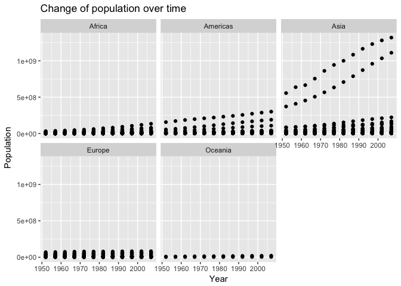<!-- -->

I tried to explore the layout stretch but I don't think it works.


# Report my process
1. I struggled on counting the occurence of a certain variable within a group. I tried to look for solution online but I couldn't find the one that I want. I am not sure if there is an easy way to do it.

2. There are many different types of graphs that I can make according to what I am looking for. So I tried to include different graphs.

3. When I am doing task 5, after I filtered out low life expectancy data, Oceania data disappears since the life expectancy of Oceania is always higher than the set mark. I am not sure how to keep the graph for Oceania eventhough it is blank.

4. In task 6, I want to generate pie chart but I am not sure how to generate it directly from my data set so I used a dump way to manually enter what I wanted to plot.


