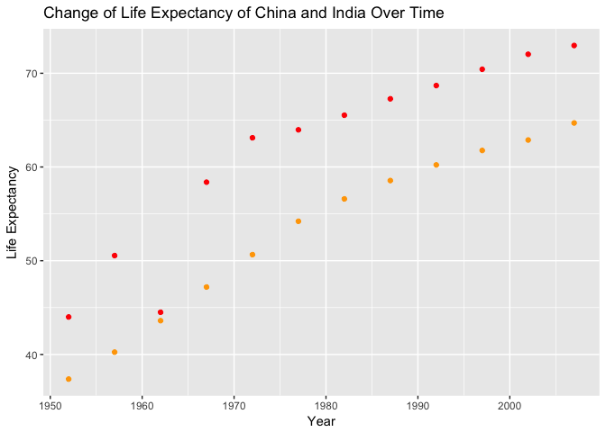
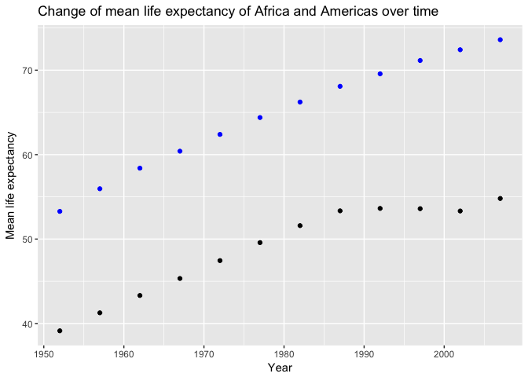
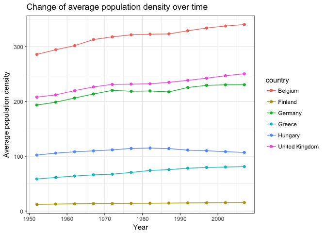

# hm04

This is homework 04 from Lucy Mei.


# Choose my own adventure.
1. Pick one of the data reshaping prompts and do it.
2. Pick a join prompt and do it.

# General data reshaping and relationship to aggregation.


```r
library(gapminder)
library(tidyverse)
```

```
## Loading tidyverse: ggplot2
## Loading tidyverse: tibble
## Loading tidyverse: tidyr
## Loading tidyverse: readr
## Loading tidyverse: purrr
## Loading tidyverse: dplyr
```

```
## Conflicts with tidy packages ----------------------------------------------
```

```
## filter(): dplyr, stats
## lag():    dplyr, stats
```

```r
library(tidyr)
library(dplyr)
```

Prompts: 
## Activity #1
Make my own cheatsheet similar to Tyler Rinker's minimal guide to tidyr.
### First, get my data.

```r
country_lifeExp <- gapminder %>%
  select(country, lifeExp, pop) %>%
  group_by(country) %>%
  summarize(mlifeExp = mean(lifeExp), mpop=mean(pop))
  

dat <- data.frame(country_lifeExp)
dat
```

```
##                      country mlifeExp        mpop
## 1                Afghanistan 37.47883  15823715.4
## 2                    Albania 68.43292   2580249.2
## 3                    Algeria 59.03017  19875406.2
## 4                     Angola 37.88350   7309390.1
## 5                  Argentina 69.06042  28602239.9
## 6                  Australia 74.66292  14649312.5
## 7                    Austria 73.10325   7583298.4
## 8                    Bahrain 65.60567    373913.2
## 9                 Bangladesh 49.83408  90755395.3
## 10                   Belgium 73.64175   9725118.7
## 11                     Benin 48.77992   4017496.7
## 12                   Bolivia 52.50458   5610395.2
## 13    Bosnia and Herzegovina 67.70783   3816524.8
## 14                  Botswana 54.59750    971186.2
## 15                    Brazil 62.23950 122312126.7
## 16                  Bulgaria 69.74375   8182985.3
## 17              Burkina Faso 44.69400   7548677.2
## 18                   Burundi 44.81733   4651608.3
## 19                  Cambodia 47.90275   8510430.7
## 20                  Cameroon 48.12850   9816648.4
## 21                    Canada 74.90275  24462967.3
## 22  Central African Republic 43.86692   2560963.0
## 23                      Chad 46.77358   5329256.3
## 24                     Chile 67.43092  11205725.3
## 25                     China 61.78514 958160051.9
## 26                  Colombia 63.89775  27256099.6
## 27                   Comoros 52.38175    361683.9
## 28          Congo, Dem. Rep. 44.54375  32681655.2
## 29               Congo, Rep. 52.50192   1923209.1
## 30                Costa Rica 70.18142   2400007.8
## 31             Cote d'Ivoire 48.43617   9153109.5
## 32                   Croatia 70.05592   4289916.2
## 33                      Cuba 71.04508   9232575.5
## 34            Czech Republic 71.51050   9986262.8
## 35                   Denmark 74.37017   4994187.3
## 36                  Djibouti 46.38075    260243.9
## 37        Dominican Republic 61.55450   5735697.4
## 38                   Ecuador 62.81683   8212243.4
## 39                     Egypt 56.24300  46522774.2
## 40               El Salvador 59.63333   4343441.4
## 41         Equatorial Guinea 42.96000    327551.0
## 42                   Eritrea 45.99925   2820216.8
## 43                  Ethiopia 44.47575  41632518.8
## 44                   Finland 72.99192   4771321.0
## 45                    France 74.34892  52952564.3
## 46                     Gabon 51.22050    795415.4
## 47                    Gambia 44.40058    793138.6
## 48                   Germany 73.44442  77547043.3
## 49                     Ghana 52.34067  12616626.4
## 50                    Greece 73.73317   9424181.1
## 51                 Guatemala 56.72942   6858694.8
## 52                    Guinea 43.23983   5360550.7
## 53             Guinea-Bissau 39.21025    882008.4
## 54                     Haiti 50.16525   5401633.8
## 55                  Honduras 57.92083   3920593.4
## 56          Hong Kong, China 73.49283   4792259.3
## 57                   Hungary 69.39317  10217645.7
## 58                   Iceland 76.51142    226978.1
## 59                     India 53.16608 701130739.8
## 60                 Indonesia 54.33575 148322833.3
## 61                      Iran 58.63658  42301706.8
## 62                      Iraq 56.58175  14187495.2
## 63                   Ireland 73.01725   3340825.9
## 64                    Israel 73.64583   3845610.8
## 65                     Italy 74.01383  54536958.0
## 66                   Jamaica 68.74933   2135122.8
## 67                     Japan 74.82692 111758808.0
## 68                    Jordan 59.78642   2667972.8
## 69                     Kenya 52.68100  18206250.2
## 70          Korea, Dem. Rep. 63.60733  16453881.2
## 71               Korea, Rep. 65.00100  36499386.3
## 72                    Kuwait 68.92233   1206495.6
## 73                   Lebanon 65.86567   2781846.4
## 74                   Lesotho 50.00708   1389696.4
## 75                   Liberia 42.47625   1813857.2
## 76                     Libya 59.30417   3166803.6
## 77                Madagascar 47.77058   9902402.2
## 78                    Malawi 43.35158   7016377.4
## 79                  Malaysia 64.27958  14574055.3
## 80                      Mali 43.41350   7112340.1
## 81                Mauritania 52.30208   1782723.8
## 82                 Mauritius 64.95325    926072.2
## 83                    Mexico 65.40883  68414297.4
## 84                  Mongolia 55.89033   1734850.7
## 85                Montenegro 70.29917    564269.7
## 86                   Morocco 57.60883  20555741.9
## 87                Mozambique 40.37950  12046695.3
## 88                   Myanmar 53.32167  33432292.5
## 89                   Namibia 53.49133   1157849.8
## 90                     Nepal 48.98633  16551744.6
## 91               Netherlands 75.64850  13786797.9
## 92               New Zealand 73.98950   3100032.2
## 93                 Nicaragua 58.34942   3040975.2
## 94                     Niger 44.55867   6857373.8
## 95                   Nigeria 43.58133  73708017.8
## 96                    Norway 75.84300   4031441.1
## 97                      Oman 58.44267   1438205.3
## 98                  Pakistan 54.88225  93683385.8
## 99                    Panama 67.80175   1985290.2
## 100                 Paraguay 66.80908   3555485.9
## 101                     Peru 58.85933  17559093.0
## 102              Philippines 60.96725  52636628.6
## 103                   Poland 70.17692  34323304.4
## 104                 Portugal 70.41983   9586273.9
## 105              Puerto Rico 72.73933   3115178.2
## 106                  Reunion 66.64425    518497.8
## 107                  Romania 68.29067  20819090.2
## 108                   Rwanda 41.48158   5298435.7
## 109    Sao Tome and Principe 57.89633    105977.8
## 110             Saudi Arabia 58.67875  12478368.0
## 111                  Senegal 50.62592   6446305.4
## 112                   Serbia 68.55100   8783886.8
## 113             Sierra Leone 36.76917   3605424.9
## 114                Singapore 71.22025   2667817.4
## 115          Slovak Republic 70.69608   4774507.1
## 116                 Slovenia 71.60075   1794381.4
## 117                  Somalia 40.98867   5197197.8
## 118             South Africa 53.99317  29928352.2
## 119                    Spain 74.20342  35851798.4
## 120                Sri Lanka 66.52608  14545831.8
## 121                    Sudan 48.40050  21560331.4
## 122                Swaziland 49.00242    679052.0
## 123                   Sweden 76.17700   8220028.9
## 124              Switzerland 75.56508   6384293.2
## 125                    Syria 61.34617   9865378.8
## 126                   Taiwan 70.33667  16874723.9
## 127                 Tanzania 47.91233  20499497.7
## 128                 Thailand 62.20025  44961631.2
## 129                     Togo 51.49875   2895964.0
## 130      Trinidad and Tobago 66.82800   1006469.7
## 131                  Tunisia 60.72100   6686770.2
## 132                   Turkey 59.69642  45909008.2
## 133                   Uganda 47.61883  14361049.4
## 134           United Kingdom 73.92258  56087800.7
## 135            United States 73.47850 228211232.5
## 136                  Uruguay 70.78158   2912487.2
## 137                Venezuela 66.58067  15129801.3
## 138                  Vietnam 57.47950  54568570.9
## 139       West Bank and Gaza 60.32867   1848606.5
## 140              Yemen, Rep. 46.78042  10843191.8
## 141                   Zambia 45.99633   6353804.8
## 142                 Zimbabwe 52.66317   7641966.1
```

### Gather in Action

```r
dat %>% 
  gather (factor, number, -c(country))
```

```
##                      country   factor       number
## 1                Afghanistan mlifeExp 3.747883e+01
## 2                    Albania mlifeExp 6.843292e+01
## 3                    Algeria mlifeExp 5.903017e+01
## 4                     Angola mlifeExp 3.788350e+01
## 5                  Argentina mlifeExp 6.906042e+01
## 6                  Australia mlifeExp 7.466292e+01
## 7                    Austria mlifeExp 7.310325e+01
## 8                    Bahrain mlifeExp 6.560567e+01
## 9                 Bangladesh mlifeExp 4.983408e+01
## 10                   Belgium mlifeExp 7.364175e+01
## 11                     Benin mlifeExp 4.877992e+01
## 12                   Bolivia mlifeExp 5.250458e+01
## 13    Bosnia and Herzegovina mlifeExp 6.770783e+01
## 14                  Botswana mlifeExp 5.459750e+01
## 15                    Brazil mlifeExp 6.223950e+01
## 16                  Bulgaria mlifeExp 6.974375e+01
## 17              Burkina Faso mlifeExp 4.469400e+01
## 18                   Burundi mlifeExp 4.481733e+01
## 19                  Cambodia mlifeExp 4.790275e+01
## 20                  Cameroon mlifeExp 4.812850e+01
## 21                    Canada mlifeExp 7.490275e+01
## 22  Central African Republic mlifeExp 4.386692e+01
## 23                      Chad mlifeExp 4.677358e+01
## 24                     Chile mlifeExp 6.743092e+01
## 25                     China mlifeExp 6.178514e+01
## 26                  Colombia mlifeExp 6.389775e+01
## 27                   Comoros mlifeExp 5.238175e+01
## 28          Congo, Dem. Rep. mlifeExp 4.454375e+01
## 29               Congo, Rep. mlifeExp 5.250192e+01
## 30                Costa Rica mlifeExp 7.018142e+01
## 31             Cote d'Ivoire mlifeExp 4.843617e+01
## 32                   Croatia mlifeExp 7.005592e+01
## 33                      Cuba mlifeExp 7.104508e+01
## 34            Czech Republic mlifeExp 7.151050e+01
## 35                   Denmark mlifeExp 7.437017e+01
## 36                  Djibouti mlifeExp 4.638075e+01
## 37        Dominican Republic mlifeExp 6.155450e+01
## 38                   Ecuador mlifeExp 6.281683e+01
## 39                     Egypt mlifeExp 5.624300e+01
## 40               El Salvador mlifeExp 5.963333e+01
## 41         Equatorial Guinea mlifeExp 4.296000e+01
## 42                   Eritrea mlifeExp 4.599925e+01
## 43                  Ethiopia mlifeExp 4.447575e+01
## 44                   Finland mlifeExp 7.299192e+01
## 45                    France mlifeExp 7.434892e+01
## 46                     Gabon mlifeExp 5.122050e+01
## 47                    Gambia mlifeExp 4.440058e+01
## 48                   Germany mlifeExp 7.344442e+01
## 49                     Ghana mlifeExp 5.234067e+01
## 50                    Greece mlifeExp 7.373317e+01
## 51                 Guatemala mlifeExp 5.672942e+01
## 52                    Guinea mlifeExp 4.323983e+01
## 53             Guinea-Bissau mlifeExp 3.921025e+01
## 54                     Haiti mlifeExp 5.016525e+01
## 55                  Honduras mlifeExp 5.792083e+01
## 56          Hong Kong, China mlifeExp 7.349283e+01
## 57                   Hungary mlifeExp 6.939317e+01
## 58                   Iceland mlifeExp 7.651142e+01
## 59                     India mlifeExp 5.316608e+01
## 60                 Indonesia mlifeExp 5.433575e+01
## 61                      Iran mlifeExp 5.863658e+01
## 62                      Iraq mlifeExp 5.658175e+01
## 63                   Ireland mlifeExp 7.301725e+01
## 64                    Israel mlifeExp 7.364583e+01
## 65                     Italy mlifeExp 7.401383e+01
## 66                   Jamaica mlifeExp 6.874933e+01
## 67                     Japan mlifeExp 7.482692e+01
## 68                    Jordan mlifeExp 5.978642e+01
## 69                     Kenya mlifeExp 5.268100e+01
## 70          Korea, Dem. Rep. mlifeExp 6.360733e+01
## 71               Korea, Rep. mlifeExp 6.500100e+01
## 72                    Kuwait mlifeExp 6.892233e+01
## 73                   Lebanon mlifeExp 6.586567e+01
## 74                   Lesotho mlifeExp 5.000708e+01
## 75                   Liberia mlifeExp 4.247625e+01
## 76                     Libya mlifeExp 5.930417e+01
## 77                Madagascar mlifeExp 4.777058e+01
## 78                    Malawi mlifeExp 4.335158e+01
## 79                  Malaysia mlifeExp 6.427958e+01
## 80                      Mali mlifeExp 4.341350e+01
## 81                Mauritania mlifeExp 5.230208e+01
## 82                 Mauritius mlifeExp 6.495325e+01
## 83                    Mexico mlifeExp 6.540883e+01
## 84                  Mongolia mlifeExp 5.589033e+01
## 85                Montenegro mlifeExp 7.029917e+01
## 86                   Morocco mlifeExp 5.760883e+01
## 87                Mozambique mlifeExp 4.037950e+01
## 88                   Myanmar mlifeExp 5.332167e+01
## 89                   Namibia mlifeExp 5.349133e+01
## 90                     Nepal mlifeExp 4.898633e+01
## 91               Netherlands mlifeExp 7.564850e+01
## 92               New Zealand mlifeExp 7.398950e+01
## 93                 Nicaragua mlifeExp 5.834942e+01
## 94                     Niger mlifeExp 4.455867e+01
## 95                   Nigeria mlifeExp 4.358133e+01
## 96                    Norway mlifeExp 7.584300e+01
## 97                      Oman mlifeExp 5.844267e+01
## 98                  Pakistan mlifeExp 5.488225e+01
## 99                    Panama mlifeExp 6.780175e+01
## 100                 Paraguay mlifeExp 6.680908e+01
## 101                     Peru mlifeExp 5.885933e+01
## 102              Philippines mlifeExp 6.096725e+01
## 103                   Poland mlifeExp 7.017692e+01
## 104                 Portugal mlifeExp 7.041983e+01
## 105              Puerto Rico mlifeExp 7.273933e+01
## 106                  Reunion mlifeExp 6.664425e+01
## 107                  Romania mlifeExp 6.829067e+01
## 108                   Rwanda mlifeExp 4.148158e+01
## 109    Sao Tome and Principe mlifeExp 5.789633e+01
## 110             Saudi Arabia mlifeExp 5.867875e+01
## 111                  Senegal mlifeExp 5.062592e+01
## 112                   Serbia mlifeExp 6.855100e+01
## 113             Sierra Leone mlifeExp 3.676917e+01
## 114                Singapore mlifeExp 7.122025e+01
## 115          Slovak Republic mlifeExp 7.069608e+01
## 116                 Slovenia mlifeExp 7.160075e+01
## 117                  Somalia mlifeExp 4.098867e+01
## 118             South Africa mlifeExp 5.399317e+01
## 119                    Spain mlifeExp 7.420342e+01
## 120                Sri Lanka mlifeExp 6.652608e+01
## 121                    Sudan mlifeExp 4.840050e+01
## 122                Swaziland mlifeExp 4.900242e+01
## 123                   Sweden mlifeExp 7.617700e+01
## 124              Switzerland mlifeExp 7.556508e+01
## 125                    Syria mlifeExp 6.134617e+01
## 126                   Taiwan mlifeExp 7.033667e+01
## 127                 Tanzania mlifeExp 4.791233e+01
## 128                 Thailand mlifeExp 6.220025e+01
## 129                     Togo mlifeExp 5.149875e+01
## 130      Trinidad and Tobago mlifeExp 6.682800e+01
## 131                  Tunisia mlifeExp 6.072100e+01
## 132                   Turkey mlifeExp 5.969642e+01
## 133                   Uganda mlifeExp 4.761883e+01
## 134           United Kingdom mlifeExp 7.392258e+01
## 135            United States mlifeExp 7.347850e+01
## 136                  Uruguay mlifeExp 7.078158e+01
## 137                Venezuela mlifeExp 6.658067e+01
## 138                  Vietnam mlifeExp 5.747950e+01
## 139       West Bank and Gaza mlifeExp 6.032867e+01
## 140              Yemen, Rep. mlifeExp 4.678042e+01
## 141                   Zambia mlifeExp 4.599633e+01
## 142                 Zimbabwe mlifeExp 5.266317e+01
## 143              Afghanistan     mpop 1.582372e+07
## 144                  Albania     mpop 2.580249e+06
## 145                  Algeria     mpop 1.987541e+07
## 146                   Angola     mpop 7.309390e+06
## 147                Argentina     mpop 2.860224e+07
## 148                Australia     mpop 1.464931e+07
## 149                  Austria     mpop 7.583298e+06
## 150                  Bahrain     mpop 3.739132e+05
## 151               Bangladesh     mpop 9.075540e+07
## 152                  Belgium     mpop 9.725119e+06
## 153                    Benin     mpop 4.017497e+06
## 154                  Bolivia     mpop 5.610395e+06
## 155   Bosnia and Herzegovina     mpop 3.816525e+06
## 156                 Botswana     mpop 9.711862e+05
## 157                   Brazil     mpop 1.223121e+08
## 158                 Bulgaria     mpop 8.182985e+06
## 159             Burkina Faso     mpop 7.548677e+06
## 160                  Burundi     mpop 4.651608e+06
## 161                 Cambodia     mpop 8.510431e+06
## 162                 Cameroon     mpop 9.816648e+06
## 163                   Canada     mpop 2.446297e+07
## 164 Central African Republic     mpop 2.560963e+06
## 165                     Chad     mpop 5.329256e+06
## 166                    Chile     mpop 1.120573e+07
## 167                    China     mpop 9.581601e+08
## 168                 Colombia     mpop 2.725610e+07
## 169                  Comoros     mpop 3.616839e+05
## 170         Congo, Dem. Rep.     mpop 3.268166e+07
## 171              Congo, Rep.     mpop 1.923209e+06
## 172               Costa Rica     mpop 2.400008e+06
## 173            Cote d'Ivoire     mpop 9.153110e+06
## 174                  Croatia     mpop 4.289916e+06
## 175                     Cuba     mpop 9.232576e+06
## 176           Czech Republic     mpop 9.986263e+06
## 177                  Denmark     mpop 4.994187e+06
## 178                 Djibouti     mpop 2.602439e+05
## 179       Dominican Republic     mpop 5.735697e+06
## 180                  Ecuador     mpop 8.212243e+06
## 181                    Egypt     mpop 4.652277e+07
## 182              El Salvador     mpop 4.343441e+06
## 183        Equatorial Guinea     mpop 3.275510e+05
## 184                  Eritrea     mpop 2.820217e+06
## 185                 Ethiopia     mpop 4.163252e+07
## 186                  Finland     mpop 4.771321e+06
## 187                   France     mpop 5.295256e+07
## 188                    Gabon     mpop 7.954154e+05
## 189                   Gambia     mpop 7.931386e+05
## 190                  Germany     mpop 7.754704e+07
## 191                    Ghana     mpop 1.261663e+07
## 192                   Greece     mpop 9.424181e+06
## 193                Guatemala     mpop 6.858695e+06
## 194                   Guinea     mpop 5.360551e+06
## 195            Guinea-Bissau     mpop 8.820084e+05
## 196                    Haiti     mpop 5.401634e+06
## 197                 Honduras     mpop 3.920593e+06
## 198         Hong Kong, China     mpop 4.792259e+06
## 199                  Hungary     mpop 1.021765e+07
## 200                  Iceland     mpop 2.269781e+05
## 201                    India     mpop 7.011307e+08
## 202                Indonesia     mpop 1.483228e+08
## 203                     Iran     mpop 4.230171e+07
## 204                     Iraq     mpop 1.418750e+07
## 205                  Ireland     mpop 3.340826e+06
## 206                   Israel     mpop 3.845611e+06
## 207                    Italy     mpop 5.453696e+07
## 208                  Jamaica     mpop 2.135123e+06
## 209                    Japan     mpop 1.117588e+08
## 210                   Jordan     mpop 2.667973e+06
## 211                    Kenya     mpop 1.820625e+07
## 212         Korea, Dem. Rep.     mpop 1.645388e+07
## 213              Korea, Rep.     mpop 3.649939e+07
## 214                   Kuwait     mpop 1.206496e+06
## 215                  Lebanon     mpop 2.781846e+06
## 216                  Lesotho     mpop 1.389696e+06
## 217                  Liberia     mpop 1.813857e+06
## 218                    Libya     mpop 3.166804e+06
## 219               Madagascar     mpop 9.902402e+06
## 220                   Malawi     mpop 7.016377e+06
## 221                 Malaysia     mpop 1.457406e+07
## 222                     Mali     mpop 7.112340e+06
## 223               Mauritania     mpop 1.782724e+06
## 224                Mauritius     mpop 9.260722e+05
## 225                   Mexico     mpop 6.841430e+07
## 226                 Mongolia     mpop 1.734851e+06
## 227               Montenegro     mpop 5.642697e+05
## 228                  Morocco     mpop 2.055574e+07
## 229               Mozambique     mpop 1.204670e+07
## 230                  Myanmar     mpop 3.343229e+07
## 231                  Namibia     mpop 1.157850e+06
## 232                    Nepal     mpop 1.655174e+07
## 233              Netherlands     mpop 1.378680e+07
## 234              New Zealand     mpop 3.100032e+06
## 235                Nicaragua     mpop 3.040975e+06
## 236                    Niger     mpop 6.857374e+06
## 237                  Nigeria     mpop 7.370802e+07
## 238                   Norway     mpop 4.031441e+06
## 239                     Oman     mpop 1.438205e+06
## 240                 Pakistan     mpop 9.368339e+07
## 241                   Panama     mpop 1.985290e+06
## 242                 Paraguay     mpop 3.555486e+06
## 243                     Peru     mpop 1.755909e+07
## 244              Philippines     mpop 5.263663e+07
## 245                   Poland     mpop 3.432330e+07
## 246                 Portugal     mpop 9.586274e+06
## 247              Puerto Rico     mpop 3.115178e+06
## 248                  Reunion     mpop 5.184978e+05
## 249                  Romania     mpop 2.081909e+07
## 250                   Rwanda     mpop 5.298436e+06
## 251    Sao Tome and Principe     mpop 1.059778e+05
## 252             Saudi Arabia     mpop 1.247837e+07
## 253                  Senegal     mpop 6.446305e+06
## 254                   Serbia     mpop 8.783887e+06
## 255             Sierra Leone     mpop 3.605425e+06
## 256                Singapore     mpop 2.667817e+06
## 257          Slovak Republic     mpop 4.774507e+06
## 258                 Slovenia     mpop 1.794381e+06
## 259                  Somalia     mpop 5.197198e+06
## 260             South Africa     mpop 2.992835e+07
## 261                    Spain     mpop 3.585180e+07
## 262                Sri Lanka     mpop 1.454583e+07
## 263                    Sudan     mpop 2.156033e+07
## 264                Swaziland     mpop 6.790520e+05
## 265                   Sweden     mpop 8.220029e+06
## 266              Switzerland     mpop 6.384293e+06
## 267                    Syria     mpop 9.865379e+06
## 268                   Taiwan     mpop 1.687472e+07
## 269                 Tanzania     mpop 2.049950e+07
## 270                 Thailand     mpop 4.496163e+07
## 271                     Togo     mpop 2.895964e+06
## 272      Trinidad and Tobago     mpop 1.006470e+06
## 273                  Tunisia     mpop 6.686770e+06
## 274                   Turkey     mpop 4.590901e+07
## 275                   Uganda     mpop 1.436105e+07
## 276           United Kingdom     mpop 5.608780e+07
## 277            United States     mpop 2.282112e+08
## 278                  Uruguay     mpop 2.912487e+06
## 279                Venezuela     mpop 1.512980e+07
## 280                  Vietnam     mpop 5.456857e+07
## 281       West Bank and Gaza     mpop 1.848606e+06
## 282              Yemen, Rep.     mpop 1.084319e+07
## 283                   Zambia     mpop 6.353805e+06
## 284                 Zimbabwe     mpop 7.641966e+06
```
In this case, we know that number is referred to lifeExp.

### Spread it Back Out

```r
dat %>% 
  gather(factor, number, -c(country)) %>%
  spread(factor, number)
```

```
##                      country mlifeExp        mpop
## 1                Afghanistan 37.47883  15823715.4
## 2                    Albania 68.43292   2580249.2
## 3                    Algeria 59.03017  19875406.2
## 4                     Angola 37.88350   7309390.1
## 5                  Argentina 69.06042  28602239.9
## 6                  Australia 74.66292  14649312.5
## 7                    Austria 73.10325   7583298.4
## 8                    Bahrain 65.60567    373913.2
## 9                 Bangladesh 49.83408  90755395.3
## 10                   Belgium 73.64175   9725118.7
## 11                     Benin 48.77992   4017496.7
## 12                   Bolivia 52.50458   5610395.2
## 13    Bosnia and Herzegovina 67.70783   3816524.8
## 14                  Botswana 54.59750    971186.2
## 15                    Brazil 62.23950 122312126.7
## 16                  Bulgaria 69.74375   8182985.3
## 17              Burkina Faso 44.69400   7548677.2
## 18                   Burundi 44.81733   4651608.3
## 19                  Cambodia 47.90275   8510430.7
## 20                  Cameroon 48.12850   9816648.4
## 21                    Canada 74.90275  24462967.3
## 22  Central African Republic 43.86692   2560963.0
## 23                      Chad 46.77358   5329256.3
## 24                     Chile 67.43092  11205725.3
## 25                     China 61.78514 958160051.9
## 26                  Colombia 63.89775  27256099.6
## 27                   Comoros 52.38175    361683.9
## 28          Congo, Dem. Rep. 44.54375  32681655.2
## 29               Congo, Rep. 52.50192   1923209.1
## 30                Costa Rica 70.18142   2400007.8
## 31             Cote d'Ivoire 48.43617   9153109.5
## 32                   Croatia 70.05592   4289916.2
## 33                      Cuba 71.04508   9232575.5
## 34            Czech Republic 71.51050   9986262.8
## 35                   Denmark 74.37017   4994187.3
## 36                  Djibouti 46.38075    260243.9
## 37        Dominican Republic 61.55450   5735697.4
## 38                   Ecuador 62.81683   8212243.4
## 39                     Egypt 56.24300  46522774.2
## 40               El Salvador 59.63333   4343441.4
## 41         Equatorial Guinea 42.96000    327551.0
## 42                   Eritrea 45.99925   2820216.8
## 43                  Ethiopia 44.47575  41632518.8
## 44                   Finland 72.99192   4771321.0
## 45                    France 74.34892  52952564.3
## 46                     Gabon 51.22050    795415.4
## 47                    Gambia 44.40058    793138.6
## 48                   Germany 73.44442  77547043.3
## 49                     Ghana 52.34067  12616626.4
## 50                    Greece 73.73317   9424181.1
## 51                 Guatemala 56.72942   6858694.8
## 52                    Guinea 43.23983   5360550.7
## 53             Guinea-Bissau 39.21025    882008.4
## 54                     Haiti 50.16525   5401633.8
## 55                  Honduras 57.92083   3920593.4
## 56          Hong Kong, China 73.49283   4792259.3
## 57                   Hungary 69.39317  10217645.7
## 58                   Iceland 76.51142    226978.1
## 59                     India 53.16608 701130739.8
## 60                 Indonesia 54.33575 148322833.3
## 61                      Iran 58.63658  42301706.8
## 62                      Iraq 56.58175  14187495.2
## 63                   Ireland 73.01725   3340825.9
## 64                    Israel 73.64583   3845610.8
## 65                     Italy 74.01383  54536958.0
## 66                   Jamaica 68.74933   2135122.8
## 67                     Japan 74.82692 111758808.0
## 68                    Jordan 59.78642   2667972.8
## 69                     Kenya 52.68100  18206250.2
## 70          Korea, Dem. Rep. 63.60733  16453881.2
## 71               Korea, Rep. 65.00100  36499386.3
## 72                    Kuwait 68.92233   1206495.6
## 73                   Lebanon 65.86567   2781846.4
## 74                   Lesotho 50.00708   1389696.4
## 75                   Liberia 42.47625   1813857.2
## 76                     Libya 59.30417   3166803.6
## 77                Madagascar 47.77058   9902402.2
## 78                    Malawi 43.35158   7016377.4
## 79                  Malaysia 64.27958  14574055.3
## 80                      Mali 43.41350   7112340.1
## 81                Mauritania 52.30208   1782723.8
## 82                 Mauritius 64.95325    926072.2
## 83                    Mexico 65.40883  68414297.4
## 84                  Mongolia 55.89033   1734850.7
## 85                Montenegro 70.29917    564269.7
## 86                   Morocco 57.60883  20555741.9
## 87                Mozambique 40.37950  12046695.3
## 88                   Myanmar 53.32167  33432292.5
## 89                   Namibia 53.49133   1157849.8
## 90                     Nepal 48.98633  16551744.6
## 91               Netherlands 75.64850  13786797.9
## 92               New Zealand 73.98950   3100032.2
## 93                 Nicaragua 58.34942   3040975.2
## 94                     Niger 44.55867   6857373.8
## 95                   Nigeria 43.58133  73708017.8
## 96                    Norway 75.84300   4031441.1
## 97                      Oman 58.44267   1438205.3
## 98                  Pakistan 54.88225  93683385.8
## 99                    Panama 67.80175   1985290.2
## 100                 Paraguay 66.80908   3555485.9
## 101                     Peru 58.85933  17559093.0
## 102              Philippines 60.96725  52636628.6
## 103                   Poland 70.17692  34323304.4
## 104                 Portugal 70.41983   9586273.9
## 105              Puerto Rico 72.73933   3115178.2
## 106                  Reunion 66.64425    518497.8
## 107                  Romania 68.29067  20819090.2
## 108                   Rwanda 41.48158   5298435.7
## 109    Sao Tome and Principe 57.89633    105977.8
## 110             Saudi Arabia 58.67875  12478368.0
## 111                  Senegal 50.62592   6446305.4
## 112                   Serbia 68.55100   8783886.8
## 113             Sierra Leone 36.76917   3605424.9
## 114                Singapore 71.22025   2667817.4
## 115          Slovak Republic 70.69608   4774507.1
## 116                 Slovenia 71.60075   1794381.4
## 117                  Somalia 40.98867   5197197.8
## 118             South Africa 53.99317  29928352.2
## 119                    Spain 74.20342  35851798.4
## 120                Sri Lanka 66.52608  14545831.8
## 121                    Sudan 48.40050  21560331.4
## 122                Swaziland 49.00242    679052.0
## 123                   Sweden 76.17700   8220028.9
## 124              Switzerland 75.56508   6384293.2
## 125                    Syria 61.34617   9865378.8
## 126                   Taiwan 70.33667  16874723.9
## 127                 Tanzania 47.91233  20499497.7
## 128                 Thailand 62.20025  44961631.2
## 129                     Togo 51.49875   2895964.0
## 130      Trinidad and Tobago 66.82800   1006469.7
## 131                  Tunisia 60.72100   6686770.2
## 132                   Turkey 59.69642  45909008.2
## 133                   Uganda 47.61883  14361049.4
## 134           United Kingdom 73.92258  56087800.7
## 135            United States 73.47850 228211232.5
## 136                  Uruguay 70.78158   2912487.2
## 137                Venezuela 66.58067  15129801.3
## 138                  Vietnam 57.47950  54568570.9
## 139       West Bank and Gaza 60.32867   1848606.5
## 140              Yemen, Rep. 46.78042  10843191.8
## 141                   Zambia 45.99633   6353804.8
## 142                 Zimbabwe 52.66317   7641966.1
```


```r
dat %>% gather(factor, number, mlifeExp)
```

```
##                      country        mpop   factor   number
## 1                Afghanistan  15823715.4 mlifeExp 37.47883
## 2                    Albania   2580249.2 mlifeExp 68.43292
## 3                    Algeria  19875406.2 mlifeExp 59.03017
## 4                     Angola   7309390.1 mlifeExp 37.88350
## 5                  Argentina  28602239.9 mlifeExp 69.06042
## 6                  Australia  14649312.5 mlifeExp 74.66292
## 7                    Austria   7583298.4 mlifeExp 73.10325
## 8                    Bahrain    373913.2 mlifeExp 65.60567
## 9                 Bangladesh  90755395.3 mlifeExp 49.83408
## 10                   Belgium   9725118.7 mlifeExp 73.64175
## 11                     Benin   4017496.7 mlifeExp 48.77992
## 12                   Bolivia   5610395.2 mlifeExp 52.50458
## 13    Bosnia and Herzegovina   3816524.8 mlifeExp 67.70783
## 14                  Botswana    971186.2 mlifeExp 54.59750
## 15                    Brazil 122312126.7 mlifeExp 62.23950
## 16                  Bulgaria   8182985.3 mlifeExp 69.74375
## 17              Burkina Faso   7548677.2 mlifeExp 44.69400
## 18                   Burundi   4651608.3 mlifeExp 44.81733
## 19                  Cambodia   8510430.7 mlifeExp 47.90275
## 20                  Cameroon   9816648.4 mlifeExp 48.12850
## 21                    Canada  24462967.3 mlifeExp 74.90275
## 22  Central African Republic   2560963.0 mlifeExp 43.86692
## 23                      Chad   5329256.3 mlifeExp 46.77358
## 24                     Chile  11205725.3 mlifeExp 67.43092
## 25                     China 958160051.9 mlifeExp 61.78514
## 26                  Colombia  27256099.6 mlifeExp 63.89775
## 27                   Comoros    361683.9 mlifeExp 52.38175
## 28          Congo, Dem. Rep.  32681655.2 mlifeExp 44.54375
## 29               Congo, Rep.   1923209.1 mlifeExp 52.50192
## 30                Costa Rica   2400007.8 mlifeExp 70.18142
## 31             Cote d'Ivoire   9153109.5 mlifeExp 48.43617
## 32                   Croatia   4289916.2 mlifeExp 70.05592
## 33                      Cuba   9232575.5 mlifeExp 71.04508
## 34            Czech Republic   9986262.8 mlifeExp 71.51050
## 35                   Denmark   4994187.3 mlifeExp 74.37017
## 36                  Djibouti    260243.9 mlifeExp 46.38075
## 37        Dominican Republic   5735697.4 mlifeExp 61.55450
## 38                   Ecuador   8212243.4 mlifeExp 62.81683
## 39                     Egypt  46522774.2 mlifeExp 56.24300
## 40               El Salvador   4343441.4 mlifeExp 59.63333
## 41         Equatorial Guinea    327551.0 mlifeExp 42.96000
## 42                   Eritrea   2820216.8 mlifeExp 45.99925
## 43                  Ethiopia  41632518.8 mlifeExp 44.47575
## 44                   Finland   4771321.0 mlifeExp 72.99192
## 45                    France  52952564.3 mlifeExp 74.34892
## 46                     Gabon    795415.4 mlifeExp 51.22050
## 47                    Gambia    793138.6 mlifeExp 44.40058
## 48                   Germany  77547043.3 mlifeExp 73.44442
## 49                     Ghana  12616626.4 mlifeExp 52.34067
## 50                    Greece   9424181.1 mlifeExp 73.73317
## 51                 Guatemala   6858694.8 mlifeExp 56.72942
## 52                    Guinea   5360550.7 mlifeExp 43.23983
## 53             Guinea-Bissau    882008.4 mlifeExp 39.21025
## 54                     Haiti   5401633.8 mlifeExp 50.16525
## 55                  Honduras   3920593.4 mlifeExp 57.92083
## 56          Hong Kong, China   4792259.3 mlifeExp 73.49283
## 57                   Hungary  10217645.7 mlifeExp 69.39317
## 58                   Iceland    226978.1 mlifeExp 76.51142
## 59                     India 701130739.8 mlifeExp 53.16608
## 60                 Indonesia 148322833.3 mlifeExp 54.33575
## 61                      Iran  42301706.8 mlifeExp 58.63658
## 62                      Iraq  14187495.2 mlifeExp 56.58175
## 63                   Ireland   3340825.9 mlifeExp 73.01725
## 64                    Israel   3845610.8 mlifeExp 73.64583
## 65                     Italy  54536958.0 mlifeExp 74.01383
## 66                   Jamaica   2135122.8 mlifeExp 68.74933
## 67                     Japan 111758808.0 mlifeExp 74.82692
## 68                    Jordan   2667972.8 mlifeExp 59.78642
## 69                     Kenya  18206250.2 mlifeExp 52.68100
## 70          Korea, Dem. Rep.  16453881.2 mlifeExp 63.60733
## 71               Korea, Rep.  36499386.3 mlifeExp 65.00100
## 72                    Kuwait   1206495.6 mlifeExp 68.92233
## 73                   Lebanon   2781846.4 mlifeExp 65.86567
## 74                   Lesotho   1389696.4 mlifeExp 50.00708
## 75                   Liberia   1813857.2 mlifeExp 42.47625
## 76                     Libya   3166803.6 mlifeExp 59.30417
## 77                Madagascar   9902402.2 mlifeExp 47.77058
## 78                    Malawi   7016377.4 mlifeExp 43.35158
## 79                  Malaysia  14574055.3 mlifeExp 64.27958
## 80                      Mali   7112340.1 mlifeExp 43.41350
## 81                Mauritania   1782723.8 mlifeExp 52.30208
## 82                 Mauritius    926072.2 mlifeExp 64.95325
## 83                    Mexico  68414297.4 mlifeExp 65.40883
## 84                  Mongolia   1734850.7 mlifeExp 55.89033
## 85                Montenegro    564269.7 mlifeExp 70.29917
## 86                   Morocco  20555741.9 mlifeExp 57.60883
## 87                Mozambique  12046695.3 mlifeExp 40.37950
## 88                   Myanmar  33432292.5 mlifeExp 53.32167
## 89                   Namibia   1157849.8 mlifeExp 53.49133
## 90                     Nepal  16551744.6 mlifeExp 48.98633
## 91               Netherlands  13786797.9 mlifeExp 75.64850
## 92               New Zealand   3100032.2 mlifeExp 73.98950
## 93                 Nicaragua   3040975.2 mlifeExp 58.34942
## 94                     Niger   6857373.8 mlifeExp 44.55867
## 95                   Nigeria  73708017.8 mlifeExp 43.58133
## 96                    Norway   4031441.1 mlifeExp 75.84300
## 97                      Oman   1438205.3 mlifeExp 58.44267
## 98                  Pakistan  93683385.8 mlifeExp 54.88225
## 99                    Panama   1985290.2 mlifeExp 67.80175
## 100                 Paraguay   3555485.9 mlifeExp 66.80908
## 101                     Peru  17559093.0 mlifeExp 58.85933
## 102              Philippines  52636628.6 mlifeExp 60.96725
## 103                   Poland  34323304.4 mlifeExp 70.17692
## 104                 Portugal   9586273.9 mlifeExp 70.41983
## 105              Puerto Rico   3115178.2 mlifeExp 72.73933
## 106                  Reunion    518497.8 mlifeExp 66.64425
## 107                  Romania  20819090.2 mlifeExp 68.29067
## 108                   Rwanda   5298435.7 mlifeExp 41.48158
## 109    Sao Tome and Principe    105977.8 mlifeExp 57.89633
## 110             Saudi Arabia  12478368.0 mlifeExp 58.67875
## 111                  Senegal   6446305.4 mlifeExp 50.62592
## 112                   Serbia   8783886.8 mlifeExp 68.55100
## 113             Sierra Leone   3605424.9 mlifeExp 36.76917
## 114                Singapore   2667817.4 mlifeExp 71.22025
## 115          Slovak Republic   4774507.1 mlifeExp 70.69608
## 116                 Slovenia   1794381.4 mlifeExp 71.60075
## 117                  Somalia   5197197.8 mlifeExp 40.98867
## 118             South Africa  29928352.2 mlifeExp 53.99317
## 119                    Spain  35851798.4 mlifeExp 74.20342
## 120                Sri Lanka  14545831.8 mlifeExp 66.52608
## 121                    Sudan  21560331.4 mlifeExp 48.40050
## 122                Swaziland    679052.0 mlifeExp 49.00242
## 123                   Sweden   8220028.9 mlifeExp 76.17700
## 124              Switzerland   6384293.2 mlifeExp 75.56508
## 125                    Syria   9865378.8 mlifeExp 61.34617
## 126                   Taiwan  16874723.9 mlifeExp 70.33667
## 127                 Tanzania  20499497.7 mlifeExp 47.91233
## 128                 Thailand  44961631.2 mlifeExp 62.20025
## 129                     Togo   2895964.0 mlifeExp 51.49875
## 130      Trinidad and Tobago   1006469.7 mlifeExp 66.82800
## 131                  Tunisia   6686770.2 mlifeExp 60.72100
## 132                   Turkey  45909008.2 mlifeExp 59.69642
## 133                   Uganda  14361049.4 mlifeExp 47.61883
## 134           United Kingdom  56087800.7 mlifeExp 73.92258
## 135            United States 228211232.5 mlifeExp 73.47850
## 136                  Uruguay   2912487.2 mlifeExp 70.78158
## 137                Venezuela  15129801.3 mlifeExp 66.58067
## 138                  Vietnam  54568570.9 mlifeExp 57.47950
## 139       West Bank and Gaza   1848606.5 mlifeExp 60.32867
## 140              Yemen, Rep.  10843191.8 mlifeExp 46.78042
## 141                   Zambia   6353804.8 mlifeExp 45.99633
## 142                 Zimbabwe   7641966.1 mlifeExp 52.66317
```
In this case, only lifeExp is taken out to reshape.


```r
dat %>% 
  gather(factor, number, mlifeExp, mpop)
```

```
##                      country   factor       number
## 1                Afghanistan mlifeExp 3.747883e+01
## 2                    Albania mlifeExp 6.843292e+01
## 3                    Algeria mlifeExp 5.903017e+01
## 4                     Angola mlifeExp 3.788350e+01
## 5                  Argentina mlifeExp 6.906042e+01
## 6                  Australia mlifeExp 7.466292e+01
## 7                    Austria mlifeExp 7.310325e+01
## 8                    Bahrain mlifeExp 6.560567e+01
## 9                 Bangladesh mlifeExp 4.983408e+01
## 10                   Belgium mlifeExp 7.364175e+01
## 11                     Benin mlifeExp 4.877992e+01
## 12                   Bolivia mlifeExp 5.250458e+01
## 13    Bosnia and Herzegovina mlifeExp 6.770783e+01
## 14                  Botswana mlifeExp 5.459750e+01
## 15                    Brazil mlifeExp 6.223950e+01
## 16                  Bulgaria mlifeExp 6.974375e+01
## 17              Burkina Faso mlifeExp 4.469400e+01
## 18                   Burundi mlifeExp 4.481733e+01
## 19                  Cambodia mlifeExp 4.790275e+01
## 20                  Cameroon mlifeExp 4.812850e+01
## 21                    Canada mlifeExp 7.490275e+01
## 22  Central African Republic mlifeExp 4.386692e+01
## 23                      Chad mlifeExp 4.677358e+01
## 24                     Chile mlifeExp 6.743092e+01
## 25                     China mlifeExp 6.178514e+01
## 26                  Colombia mlifeExp 6.389775e+01
## 27                   Comoros mlifeExp 5.238175e+01
## 28          Congo, Dem. Rep. mlifeExp 4.454375e+01
## 29               Congo, Rep. mlifeExp 5.250192e+01
## 30                Costa Rica mlifeExp 7.018142e+01
## 31             Cote d'Ivoire mlifeExp 4.843617e+01
## 32                   Croatia mlifeExp 7.005592e+01
## 33                      Cuba mlifeExp 7.104508e+01
## 34            Czech Republic mlifeExp 7.151050e+01
## 35                   Denmark mlifeExp 7.437017e+01
## 36                  Djibouti mlifeExp 4.638075e+01
## 37        Dominican Republic mlifeExp 6.155450e+01
## 38                   Ecuador mlifeExp 6.281683e+01
## 39                     Egypt mlifeExp 5.624300e+01
## 40               El Salvador mlifeExp 5.963333e+01
## 41         Equatorial Guinea mlifeExp 4.296000e+01
## 42                   Eritrea mlifeExp 4.599925e+01
## 43                  Ethiopia mlifeExp 4.447575e+01
## 44                   Finland mlifeExp 7.299192e+01
## 45                    France mlifeExp 7.434892e+01
## 46                     Gabon mlifeExp 5.122050e+01
## 47                    Gambia mlifeExp 4.440058e+01
## 48                   Germany mlifeExp 7.344442e+01
## 49                     Ghana mlifeExp 5.234067e+01
## 50                    Greece mlifeExp 7.373317e+01
## 51                 Guatemala mlifeExp 5.672942e+01
## 52                    Guinea mlifeExp 4.323983e+01
## 53             Guinea-Bissau mlifeExp 3.921025e+01
## 54                     Haiti mlifeExp 5.016525e+01
## 55                  Honduras mlifeExp 5.792083e+01
## 56          Hong Kong, China mlifeExp 7.349283e+01
## 57                   Hungary mlifeExp 6.939317e+01
## 58                   Iceland mlifeExp 7.651142e+01
## 59                     India mlifeExp 5.316608e+01
## 60                 Indonesia mlifeExp 5.433575e+01
## 61                      Iran mlifeExp 5.863658e+01
## 62                      Iraq mlifeExp 5.658175e+01
## 63                   Ireland mlifeExp 7.301725e+01
## 64                    Israel mlifeExp 7.364583e+01
## 65                     Italy mlifeExp 7.401383e+01
## 66                   Jamaica mlifeExp 6.874933e+01
## 67                     Japan mlifeExp 7.482692e+01
## 68                    Jordan mlifeExp 5.978642e+01
## 69                     Kenya mlifeExp 5.268100e+01
## 70          Korea, Dem. Rep. mlifeExp 6.360733e+01
## 71               Korea, Rep. mlifeExp 6.500100e+01
## 72                    Kuwait mlifeExp 6.892233e+01
## 73                   Lebanon mlifeExp 6.586567e+01
## 74                   Lesotho mlifeExp 5.000708e+01
## 75                   Liberia mlifeExp 4.247625e+01
## 76                     Libya mlifeExp 5.930417e+01
## 77                Madagascar mlifeExp 4.777058e+01
## 78                    Malawi mlifeExp 4.335158e+01
## 79                  Malaysia mlifeExp 6.427958e+01
## 80                      Mali mlifeExp 4.341350e+01
## 81                Mauritania mlifeExp 5.230208e+01
## 82                 Mauritius mlifeExp 6.495325e+01
## 83                    Mexico mlifeExp 6.540883e+01
## 84                  Mongolia mlifeExp 5.589033e+01
## 85                Montenegro mlifeExp 7.029917e+01
## 86                   Morocco mlifeExp 5.760883e+01
## 87                Mozambique mlifeExp 4.037950e+01
## 88                   Myanmar mlifeExp 5.332167e+01
## 89                   Namibia mlifeExp 5.349133e+01
## 90                     Nepal mlifeExp 4.898633e+01
## 91               Netherlands mlifeExp 7.564850e+01
## 92               New Zealand mlifeExp 7.398950e+01
## 93                 Nicaragua mlifeExp 5.834942e+01
## 94                     Niger mlifeExp 4.455867e+01
## 95                   Nigeria mlifeExp 4.358133e+01
## 96                    Norway mlifeExp 7.584300e+01
## 97                      Oman mlifeExp 5.844267e+01
## 98                  Pakistan mlifeExp 5.488225e+01
## 99                    Panama mlifeExp 6.780175e+01
## 100                 Paraguay mlifeExp 6.680908e+01
## 101                     Peru mlifeExp 5.885933e+01
## 102              Philippines mlifeExp 6.096725e+01
## 103                   Poland mlifeExp 7.017692e+01
## 104                 Portugal mlifeExp 7.041983e+01
## 105              Puerto Rico mlifeExp 7.273933e+01
## 106                  Reunion mlifeExp 6.664425e+01
## 107                  Romania mlifeExp 6.829067e+01
## 108                   Rwanda mlifeExp 4.148158e+01
## 109    Sao Tome and Principe mlifeExp 5.789633e+01
## 110             Saudi Arabia mlifeExp 5.867875e+01
## 111                  Senegal mlifeExp 5.062592e+01
## 112                   Serbia mlifeExp 6.855100e+01
## 113             Sierra Leone mlifeExp 3.676917e+01
## 114                Singapore mlifeExp 7.122025e+01
## 115          Slovak Republic mlifeExp 7.069608e+01
## 116                 Slovenia mlifeExp 7.160075e+01
## 117                  Somalia mlifeExp 4.098867e+01
## 118             South Africa mlifeExp 5.399317e+01
## 119                    Spain mlifeExp 7.420342e+01
## 120                Sri Lanka mlifeExp 6.652608e+01
## 121                    Sudan mlifeExp 4.840050e+01
## 122                Swaziland mlifeExp 4.900242e+01
## 123                   Sweden mlifeExp 7.617700e+01
## 124              Switzerland mlifeExp 7.556508e+01
## 125                    Syria mlifeExp 6.134617e+01
## 126                   Taiwan mlifeExp 7.033667e+01
## 127                 Tanzania mlifeExp 4.791233e+01
## 128                 Thailand mlifeExp 6.220025e+01
## 129                     Togo mlifeExp 5.149875e+01
## 130      Trinidad and Tobago mlifeExp 6.682800e+01
## 131                  Tunisia mlifeExp 6.072100e+01
## 132                   Turkey mlifeExp 5.969642e+01
## 133                   Uganda mlifeExp 4.761883e+01
## 134           United Kingdom mlifeExp 7.392258e+01
## 135            United States mlifeExp 7.347850e+01
## 136                  Uruguay mlifeExp 7.078158e+01
## 137                Venezuela mlifeExp 6.658067e+01
## 138                  Vietnam mlifeExp 5.747950e+01
## 139       West Bank and Gaza mlifeExp 6.032867e+01
## 140              Yemen, Rep. mlifeExp 4.678042e+01
## 141                   Zambia mlifeExp 4.599633e+01
## 142                 Zimbabwe mlifeExp 5.266317e+01
## 143              Afghanistan     mpop 1.582372e+07
## 144                  Albania     mpop 2.580249e+06
## 145                  Algeria     mpop 1.987541e+07
## 146                   Angola     mpop 7.309390e+06
## 147                Argentina     mpop 2.860224e+07
## 148                Australia     mpop 1.464931e+07
## 149                  Austria     mpop 7.583298e+06
## 150                  Bahrain     mpop 3.739132e+05
## 151               Bangladesh     mpop 9.075540e+07
## 152                  Belgium     mpop 9.725119e+06
## 153                    Benin     mpop 4.017497e+06
## 154                  Bolivia     mpop 5.610395e+06
## 155   Bosnia and Herzegovina     mpop 3.816525e+06
## 156                 Botswana     mpop 9.711862e+05
## 157                   Brazil     mpop 1.223121e+08
## 158                 Bulgaria     mpop 8.182985e+06
## 159             Burkina Faso     mpop 7.548677e+06
## 160                  Burundi     mpop 4.651608e+06
## 161                 Cambodia     mpop 8.510431e+06
## 162                 Cameroon     mpop 9.816648e+06
## 163                   Canada     mpop 2.446297e+07
## 164 Central African Republic     mpop 2.560963e+06
## 165                     Chad     mpop 5.329256e+06
## 166                    Chile     mpop 1.120573e+07
## 167                    China     mpop 9.581601e+08
## 168                 Colombia     mpop 2.725610e+07
## 169                  Comoros     mpop 3.616839e+05
## 170         Congo, Dem. Rep.     mpop 3.268166e+07
## 171              Congo, Rep.     mpop 1.923209e+06
## 172               Costa Rica     mpop 2.400008e+06
## 173            Cote d'Ivoire     mpop 9.153110e+06
## 174                  Croatia     mpop 4.289916e+06
## 175                     Cuba     mpop 9.232576e+06
## 176           Czech Republic     mpop 9.986263e+06
## 177                  Denmark     mpop 4.994187e+06
## 178                 Djibouti     mpop 2.602439e+05
## 179       Dominican Republic     mpop 5.735697e+06
## 180                  Ecuador     mpop 8.212243e+06
## 181                    Egypt     mpop 4.652277e+07
## 182              El Salvador     mpop 4.343441e+06
## 183        Equatorial Guinea     mpop 3.275510e+05
## 184                  Eritrea     mpop 2.820217e+06
## 185                 Ethiopia     mpop 4.163252e+07
## 186                  Finland     mpop 4.771321e+06
## 187                   France     mpop 5.295256e+07
## 188                    Gabon     mpop 7.954154e+05
## 189                   Gambia     mpop 7.931386e+05
## 190                  Germany     mpop 7.754704e+07
## 191                    Ghana     mpop 1.261663e+07
## 192                   Greece     mpop 9.424181e+06
## 193                Guatemala     mpop 6.858695e+06
## 194                   Guinea     mpop 5.360551e+06
## 195            Guinea-Bissau     mpop 8.820084e+05
## 196                    Haiti     mpop 5.401634e+06
## 197                 Honduras     mpop 3.920593e+06
## 198         Hong Kong, China     mpop 4.792259e+06
## 199                  Hungary     mpop 1.021765e+07
## 200                  Iceland     mpop 2.269781e+05
## 201                    India     mpop 7.011307e+08
## 202                Indonesia     mpop 1.483228e+08
## 203                     Iran     mpop 4.230171e+07
## 204                     Iraq     mpop 1.418750e+07
## 205                  Ireland     mpop 3.340826e+06
## 206                   Israel     mpop 3.845611e+06
## 207                    Italy     mpop 5.453696e+07
## 208                  Jamaica     mpop 2.135123e+06
## 209                    Japan     mpop 1.117588e+08
## 210                   Jordan     mpop 2.667973e+06
## 211                    Kenya     mpop 1.820625e+07
## 212         Korea, Dem. Rep.     mpop 1.645388e+07
## 213              Korea, Rep.     mpop 3.649939e+07
## 214                   Kuwait     mpop 1.206496e+06
## 215                  Lebanon     mpop 2.781846e+06
## 216                  Lesotho     mpop 1.389696e+06
## 217                  Liberia     mpop 1.813857e+06
## 218                    Libya     mpop 3.166804e+06
## 219               Madagascar     mpop 9.902402e+06
## 220                   Malawi     mpop 7.016377e+06
## 221                 Malaysia     mpop 1.457406e+07
## 222                     Mali     mpop 7.112340e+06
## 223               Mauritania     mpop 1.782724e+06
## 224                Mauritius     mpop 9.260722e+05
## 225                   Mexico     mpop 6.841430e+07
## 226                 Mongolia     mpop 1.734851e+06
## 227               Montenegro     mpop 5.642697e+05
## 228                  Morocco     mpop 2.055574e+07
## 229               Mozambique     mpop 1.204670e+07
## 230                  Myanmar     mpop 3.343229e+07
## 231                  Namibia     mpop 1.157850e+06
## 232                    Nepal     mpop 1.655174e+07
## 233              Netherlands     mpop 1.378680e+07
## 234              New Zealand     mpop 3.100032e+06
## 235                Nicaragua     mpop 3.040975e+06
## 236                    Niger     mpop 6.857374e+06
## 237                  Nigeria     mpop 7.370802e+07
## 238                   Norway     mpop 4.031441e+06
## 239                     Oman     mpop 1.438205e+06
## 240                 Pakistan     mpop 9.368339e+07
## 241                   Panama     mpop 1.985290e+06
## 242                 Paraguay     mpop 3.555486e+06
## 243                     Peru     mpop 1.755909e+07
## 244              Philippines     mpop 5.263663e+07
## 245                   Poland     mpop 3.432330e+07
## 246                 Portugal     mpop 9.586274e+06
## 247              Puerto Rico     mpop 3.115178e+06
## 248                  Reunion     mpop 5.184978e+05
## 249                  Romania     mpop 2.081909e+07
## 250                   Rwanda     mpop 5.298436e+06
## 251    Sao Tome and Principe     mpop 1.059778e+05
## 252             Saudi Arabia     mpop 1.247837e+07
## 253                  Senegal     mpop 6.446305e+06
## 254                   Serbia     mpop 8.783887e+06
## 255             Sierra Leone     mpop 3.605425e+06
## 256                Singapore     mpop 2.667817e+06
## 257          Slovak Republic     mpop 4.774507e+06
## 258                 Slovenia     mpop 1.794381e+06
## 259                  Somalia     mpop 5.197198e+06
## 260             South Africa     mpop 2.992835e+07
## 261                    Spain     mpop 3.585180e+07
## 262                Sri Lanka     mpop 1.454583e+07
## 263                    Sudan     mpop 2.156033e+07
## 264                Swaziland     mpop 6.790520e+05
## 265                   Sweden     mpop 8.220029e+06
## 266              Switzerland     mpop 6.384293e+06
## 267                    Syria     mpop 9.865379e+06
## 268                   Taiwan     mpop 1.687472e+07
## 269                 Tanzania     mpop 2.049950e+07
## 270                 Thailand     mpop 4.496163e+07
## 271                     Togo     mpop 2.895964e+06
## 272      Trinidad and Tobago     mpop 1.006470e+06
## 273                  Tunisia     mpop 6.686770e+06
## 274                   Turkey     mpop 4.590901e+07
## 275                   Uganda     mpop 1.436105e+07
## 276           United Kingdom     mpop 5.608780e+07
## 277            United States     mpop 2.282112e+08
## 278                  Uruguay     mpop 2.912487e+06
## 279                Venezuela     mpop 1.512980e+07
## 280                  Vietnam     mpop 5.456857e+07
## 281       West Bank and Gaza     mpop 1.848606e+06
## 282              Yemen, Rep.     mpop 1.084319e+07
## 283                   Zambia     mpop 6.353805e+06
## 284                 Zimbabwe     mpop 7.641966e+06
```


```r
dat %>% 
  gather(factor, number, -c(country)) %>%
  spread(country, number)
```

```
##     factor  Afghanistan      Albania      Algeria      Angola    Argentina
## 1 mlifeExp 3.747883e+01 6.843292e+01 5.903017e+01 3.78835e+01 6.906042e+01
## 2     mpop 1.582372e+07 2.580249e+06 1.987541e+07 7.30939e+06 2.860224e+07
##      Australia      Austria      Bahrain   Bangladesh      Belgium
## 1 7.466292e+01 7.310325e+01     65.60567 4.983408e+01 7.364175e+01
## 2 1.464931e+07 7.583298e+06 373913.16667 9.075540e+07 9.725119e+06
##          Benin      Bolivia Bosnia and Herzegovina    Botswana
## 1 4.877992e+01 5.250458e+01           6.770783e+01     54.5975
## 2 4.017497e+06 5.610395e+06           3.816525e+06 971186.1667
##         Brazil     Bulgaria Burkina Faso      Burundi     Cambodia
## 1 6.223950e+01 6.974375e+01       44.694 4.481733e+01 4.790275e+01
## 2 1.223121e+08 8.182985e+06  7548677.250 4.651608e+06 8.510431e+06
##       Cameroon       Canada Central African Republic         Chad
## 1      48.1285 7.490275e+01             4.386692e+01 4.677358e+01
## 2 9816648.4167 2.446297e+07             2.560963e+06 5.329256e+06
##          Chile        China     Colombia      Comoros Congo, Dem. Rep.
## 1 6.743092e+01 6.178514e+01 6.389775e+01     52.38175     4.454375e+01
## 2 1.120573e+07 9.581601e+08 2.725610e+07 361683.91667     3.268166e+07
##    Congo, Rep.   Costa Rica Cote d'Ivoire      Croatia         Cuba
## 1 5.250192e+01 7.018142e+01  4.843617e+01 7.005592e+01 7.104508e+01
## 2 1.923209e+06 2.400008e+06  9.153110e+06 4.289916e+06 9.232576e+06
##   Czech Republic      Denmark     Djibouti Dominican Republic      Ecuador
## 1        71.5105 7.437017e+01     46.38075            61.5545 6.281683e+01
## 2   9986262.8333 4.994187e+06 260243.91667       5735697.4167 8.212243e+06
##          Egypt  El Salvador Equatorial Guinea      Eritrea     Ethiopia
## 1       56.243 5.963333e+01             42.96 4.599925e+01 4.447575e+01
## 2 46522774.250 4.343441e+06         327551.00 2.820217e+06 4.163252e+07
##        Finland       France       Gabon       Gambia      Germany
## 1 7.299192e+01 7.434892e+01     51.2205     44.40058 7.344442e+01
## 2 4.771321e+06 5.295256e+07 795415.4167 793138.58333 7.754704e+07
##          Ghana       Greece    Guatemala       Guinea Guinea-Bissau
## 1 5.234067e+01 7.373317e+01 5.672942e+01 4.323983e+01      39.21025
## 2 1.261663e+07 9.424181e+06 6.858695e+06 5.360551e+06  882008.41667
##          Haiti     Honduras Hong Kong, China      Hungary      Iceland
## 1 5.016525e+01 5.792083e+01     7.349283e+01 6.939317e+01     76.51142
## 2 5.401634e+06 3.920593e+06     4.792259e+06 1.021765e+07 226978.08333
##          India    Indonesia         Iran         Iraq      Ireland
## 1 5.316608e+01 5.433575e+01 5.863658e+01 5.658175e+01 7.301725e+01
## 2 7.011307e+08 1.483228e+08 4.230171e+07 1.418750e+07 3.340826e+06
##         Israel        Italy      Jamaica        Japan       Jordan
## 1 7.364583e+01 7.401383e+01 6.874933e+01 7.482692e+01 5.978642e+01
## 2 3.845611e+06 5.453696e+07 2.135123e+06 1.117588e+08 2.667973e+06
##          Kenya Korea, Dem. Rep.  Korea, Rep.       Kuwait      Lebanon
## 1       52.681     6.360733e+01       65.001 6.892233e+01 6.586567e+01
## 2 18206250.167     1.645388e+07 36499386.333 1.206496e+06 2.781846e+06
##        Lesotho      Liberia        Libya   Madagascar       Malawi
## 1 5.000708e+01 4.247625e+01 5.930417e+01 4.777058e+01 4.335158e+01
## 2 1.389696e+06 1.813857e+06 3.166804e+06 9.902402e+06 7.016377e+06
##       Malaysia        Mali   Mauritania    Mauritius       Mexico
## 1 6.427958e+01 4.34135e+01 5.230208e+01     64.95325 6.540883e+01
## 2 1.457406e+07 7.11234e+06 1.782724e+06 926072.25000 6.841430e+07
##       Mongolia   Montenegro      Morocco  Mozambique      Myanmar
## 1 5.589033e+01     70.29917 5.760883e+01 4.03795e+01 5.332167e+01
## 2 1.734851e+06 564269.66667 2.055574e+07 1.20467e+07 3.343229e+07
##        Namibia        Nepal Netherlands  New Zealand    Nicaragua
## 1 5.349133e+01 4.898633e+01 7.56485e+01      73.9895 5.834942e+01
## 2 1.157850e+06 1.655174e+07 1.37868e+07 3100032.1667 3.040975e+06
##          Niger      Nigeria      Norway         Oman     Pakistan
## 1 4.455867e+01 4.358133e+01      75.843 5.844267e+01 5.488225e+01
## 2 6.857374e+06 7.370802e+07 4031441.083 1.438205e+06 9.368339e+07
##         Panama     Paraguay         Peru  Philippines       Poland
## 1 6.780175e+01 6.680908e+01 5.885933e+01 6.096725e+01 7.017692e+01
## 2 1.985290e+06 3.555486e+06 1.755909e+07 5.263663e+07 3.432330e+07
##       Portugal  Puerto Rico      Reunion      Romania       Rwanda
## 1 7.041983e+01 7.273933e+01     66.64425 6.829067e+01 4.148158e+01
## 2 9.586274e+06 3.115178e+06 518497.75000 2.081909e+07 5.298436e+06
##   Sao Tome and Principe Saudi Arabia      Senegal      Serbia Sierra Leone
## 1              57.89633 5.867875e+01 5.062592e+01      68.551 3.676917e+01
## 2          105977.83333 1.247837e+07 6.446305e+06 8783886.750 3.605425e+06
##      Singapore Slovak Republic     Slovenia      Somalia South Africa
## 1 7.122025e+01    7.069608e+01 7.160075e+01 4.098867e+01 5.399317e+01
## 2 2.667817e+06    4.774507e+06 1.794381e+06 5.197198e+06 2.992835e+07
##          Spain    Sri Lanka        Sudan    Swaziland      Sweden
## 1 7.420342e+01 6.652608e+01 4.840050e+01     49.00242      76.177
## 2 3.585180e+07 1.454583e+07 2.156033e+07 679052.00000 8220028.917
##    Switzerland        Syria       Taiwan     Tanzania     Thailand
## 1 7.556508e+01 6.134617e+01 7.033667e+01 4.791233e+01 6.220025e+01
## 2 6.384293e+06 9.865379e+06 1.687472e+07 2.049950e+07 4.496163e+07
##           Togo Trinidad and Tobago     Tunisia       Turkey       Uganda
## 1 5.149875e+01              66.828      60.721 5.969642e+01 4.761883e+01
## 2 2.895964e+06         1006469.667 6686770.250 4.590901e+07 1.436105e+07
##   United Kingdom United States      Uruguay    Venezuela      Vietnam
## 1   7.392258e+01  7.347850e+01 7.078158e+01 6.658067e+01 5.747950e+01
## 2   5.608780e+07  2.282112e+08 2.912487e+06 1.512980e+07 5.456857e+07
##   West Bank and Gaza  Yemen, Rep.       Zambia     Zimbabwe
## 1       6.032867e+01 4.678042e+01 4.599633e+01 5.266317e+01
## 2       1.848606e+06 1.084319e+07 6.353805e+06 7.641966e+06
```
This way, the data can create columns according to each country.

## Activity #2 - Make a tibble with one row per year and columns for life expectancy for two or more countries
I want to compare life expectancy between China and India because these two countries are the most populated in Asia. First, I am going to filter out life expectancy from these two countries and make it a new dataframe.

```r
coun_life<- gapminder %>%
  filter(country %in% c("China", "India")) %>%
  select(year, country,lifeExp) 
  
dat2 <- data.frame(coun_life)
dat2
```

```
##    year country  lifeExp
## 1  1952   China 44.00000
## 2  1957   China 50.54896
## 3  1962   China 44.50136
## 4  1967   China 58.38112
## 5  1972   China 63.11888
## 6  1977   China 63.96736
## 7  1982   China 65.52500
## 8  1987   China 67.27400
## 9  1992   China 68.69000
## 10 1997   China 70.42600
## 11 2002   China 72.02800
## 12 2007   China 72.96100
## 13 1952   India 37.37300
## 14 1957   India 40.24900
## 15 1962   India 43.60500
## 16 1967   India 47.19300
## 17 1972   India 50.65100
## 18 1977   India 54.20800
## 19 1982   India 56.59600
## 20 1987   India 58.55300
## 21 1992   India 60.22300
## 22 1997   India 61.76500
## 23 2002   India 62.87900
## 24 2007   India 64.69800
```

This is a table of life expectancy of China and India of each year. I reshaped the data so it is easier to compare the life expectancy between the two countries over time.

```r
dat21 <- dat2 %>% 
  spread (country, lifeExp)
knitr::kable(dat21, align = 'c', format = 'markdown', digits = 2, col.names= c("Year", "China", "India"))
```


| Year | China | India |
|:----:|:-----:|:-----:|
| 1952 | 44.00 | 37.37 |
| 1957 | 50.55 | 40.25 |
| 1962 | 44.50 | 43.60 |
| 1967 | 58.38 | 47.19 |
| 1972 | 63.12 | 50.65 |
| 1977 | 63.97 | 54.21 |
| 1982 | 65.53 | 56.60 |
| 1987 | 67.27 | 58.55 |
| 1992 | 68.69 | 60.22 |
| 1997 | 70.43 | 61.77 |
| 2002 | 72.03 | 62.88 |
| 2007 | 72.96 | 64.70 |


So, let's make a scatterplot. 

```r
ggplot(dat21, aes(year, China)) +
  geom_point(aes(year, China), color = "red") +
  geom_point(aes(year, India), color = "orange") +
  labs(x="Year", y="Life Expectancy", title ="Change of Life Expectancy of China and India Over Time")
```

<!-- -->
Life expectancy of China is generally higher compare to that of India except the time around 1960. It is interesting to find out what happened in that year that caused a dramatic drop of life expectancy in China.

## Activity #3 - Compute some measure of life expectancy for all possible combinations of continent and year. Reshape that to have one row per year and one variable for each continent. Or one row per continent and one variable per year.

First, I am going to generate a table with the selected variables I want.

```r
dat3 <- gapminder %>%
  select(continent, lifeExp, year) %>%
  group_by(year, continent) %>%
  mutate(meanle = mean(lifeExp))

dat31 <- data.frame(
  dat3 %>%
    select(year, continent, meanle))

knitr::kable(dat31, align = 'c', format = 'markdown', digits = 2, col.names = c("Year", "Continent", "Mean Life Expectancy"))
```


| Year | Continent | Mean Life Expectancy |
|:----:|:---------:|:--------------------:|
| 1952 |   Asia    |        46.31         |
| 1957 |   Asia    |        49.32         |
| 1962 |   Asia    |        51.56         |
| 1967 |   Asia    |        54.66         |
| 1972 |   Asia    |        57.32         |
| 1977 |   Asia    |        59.61         |
| 1982 |   Asia    |        62.62         |
| 1987 |   Asia    |        64.85         |
| 1992 |   Asia    |        66.54         |
| 1997 |   Asia    |        68.02         |
| 2002 |   Asia    |        69.23         |
| 2007 |   Asia    |        70.73         |
| 1952 |  Europe   |        64.41         |
| 1957 |  Europe   |        66.70         |
| 1962 |  Europe   |        68.54         |
| 1967 |  Europe   |        69.74         |
| 1972 |  Europe   |        70.78         |
| 1977 |  Europe   |        71.94         |
| 1982 |  Europe   |        72.81         |
| 1987 |  Europe   |        73.64         |
| 1992 |  Europe   |        74.44         |
| 1997 |  Europe   |        75.51         |
| 2002 |  Europe   |        76.70         |
| 2007 |  Europe   |        77.65         |
| 1952 |  Africa   |        39.14         |
| 1957 |  Africa   |        41.27         |
| 1962 |  Africa   |        43.32         |
| 1967 |  Africa   |        45.33         |
| 1972 |  Africa   |        47.45         |
| 1977 |  Africa   |        49.58         |
| 1982 |  Africa   |        51.59         |
| 1987 |  Africa   |        53.34         |
| 1992 |  Africa   |        53.63         |
| 1997 |  Africa   |        53.60         |
| 2002 |  Africa   |        53.33         |
| 2007 |  Africa   |        54.81         |
| 1952 |  Africa   |        39.14         |
| 1957 |  Africa   |        41.27         |
| 1962 |  Africa   |        43.32         |
| 1967 |  Africa   |        45.33         |
| 1972 |  Africa   |        47.45         |
| 1977 |  Africa   |        49.58         |
| 1982 |  Africa   |        51.59         |
| 1987 |  Africa   |        53.34         |
| 1992 |  Africa   |        53.63         |
| 1997 |  Africa   |        53.60         |
| 2002 |  Africa   |        53.33         |
| 2007 |  Africa   |        54.81         |
| 1952 | Americas  |        53.28         |
| 1957 | Americas  |        55.96         |
| 1962 | Americas  |        58.40         |
| 1967 | Americas  |        60.41         |
| 1972 | Americas  |        62.39         |
| 1977 | Americas  |        64.39         |
| 1982 | Americas  |        66.23         |
| 1987 | Americas  |        68.09         |
| 1992 | Americas  |        69.57         |
| 1997 | Americas  |        71.15         |
| 2002 | Americas  |        72.42         |
| 2007 | Americas  |        73.61         |
| 1952 |  Oceania  |        69.25         |
| 1957 |  Oceania  |        70.30         |
| 1962 |  Oceania  |        71.09         |
| 1967 |  Oceania  |        71.31         |
| 1972 |  Oceania  |        71.91         |
| 1977 |  Oceania  |        72.85         |
| 1982 |  Oceania  |        74.29         |
| 1987 |  Oceania  |        75.32         |
| 1992 |  Oceania  |        76.94         |
| 1997 |  Oceania  |        78.19         |
| 2002 |  Oceania  |        79.74         |
| 2007 |  Oceania  |        80.72         |
| 1952 |  Europe   |        64.41         |
| 1957 |  Europe   |        66.70         |
| 1962 |  Europe   |        68.54         |
| 1967 |  Europe   |        69.74         |
| 1972 |  Europe   |        70.78         |
| 1977 |  Europe   |        71.94         |
| 1982 |  Europe   |        72.81         |
| 1987 |  Europe   |        73.64         |
| 1992 |  Europe   |        74.44         |
| 1997 |  Europe   |        75.51         |
| 2002 |  Europe   |        76.70         |
| 2007 |  Europe   |        77.65         |
| 1952 |   Asia    |        46.31         |
| 1957 |   Asia    |        49.32         |
| 1962 |   Asia    |        51.56         |
| 1967 |   Asia    |        54.66         |
| 1972 |   Asia    |        57.32         |
| 1977 |   Asia    |        59.61         |
| 1982 |   Asia    |        62.62         |
| 1987 |   Asia    |        64.85         |
| 1992 |   Asia    |        66.54         |
| 1997 |   Asia    |        68.02         |
| 2002 |   Asia    |        69.23         |
| 2007 |   Asia    |        70.73         |
| 1952 |   Asia    |        46.31         |
| 1957 |   Asia    |        49.32         |
| 1962 |   Asia    |        51.56         |
| 1967 |   Asia    |        54.66         |
| 1972 |   Asia    |        57.32         |
| 1977 |   Asia    |        59.61         |
| 1982 |   Asia    |        62.62         |
| 1987 |   Asia    |        64.85         |
| 1992 |   Asia    |        66.54         |
| 1997 |   Asia    |        68.02         |
| 2002 |   Asia    |        69.23         |
| 2007 |   Asia    |        70.73         |
| 1952 |  Europe   |        64.41         |
| 1957 |  Europe   |        66.70         |
| 1962 |  Europe   |        68.54         |
| 1967 |  Europe   |        69.74         |
| 1972 |  Europe   |        70.78         |
| 1977 |  Europe   |        71.94         |
| 1982 |  Europe   |        72.81         |
| 1987 |  Europe   |        73.64         |
| 1992 |  Europe   |        74.44         |
| 1997 |  Europe   |        75.51         |
| 2002 |  Europe   |        76.70         |
| 2007 |  Europe   |        77.65         |
| 1952 |  Africa   |        39.14         |
| 1957 |  Africa   |        41.27         |
| 1962 |  Africa   |        43.32         |
| 1967 |  Africa   |        45.33         |
| 1972 |  Africa   |        47.45         |
| 1977 |  Africa   |        49.58         |
| 1982 |  Africa   |        51.59         |
| 1987 |  Africa   |        53.34         |
| 1992 |  Africa   |        53.63         |
| 1997 |  Africa   |        53.60         |
| 2002 |  Africa   |        53.33         |
| 2007 |  Africa   |        54.81         |
| 1952 | Americas  |        53.28         |
| 1957 | Americas  |        55.96         |
| 1962 | Americas  |        58.40         |
| 1967 | Americas  |        60.41         |
| 1972 | Americas  |        62.39         |
| 1977 | Americas  |        64.39         |
| 1982 | Americas  |        66.23         |
| 1987 | Americas  |        68.09         |
| 1992 | Americas  |        69.57         |
| 1997 | Americas  |        71.15         |
| 2002 | Americas  |        72.42         |
| 2007 | Americas  |        73.61         |
| 1952 |  Europe   |        64.41         |
| 1957 |  Europe   |        66.70         |
| 1962 |  Europe   |        68.54         |
| 1967 |  Europe   |        69.74         |
| 1972 |  Europe   |        70.78         |
| 1977 |  Europe   |        71.94         |
| 1982 |  Europe   |        72.81         |
| 1987 |  Europe   |        73.64         |
| 1992 |  Europe   |        74.44         |
| 1997 |  Europe   |        75.51         |
| 2002 |  Europe   |        76.70         |
| 2007 |  Europe   |        77.65         |
| 1952 |  Africa   |        39.14         |
| 1957 |  Africa   |        41.27         |
| 1962 |  Africa   |        43.32         |
| 1967 |  Africa   |        45.33         |
| 1972 |  Africa   |        47.45         |
| 1977 |  Africa   |        49.58         |
| 1982 |  Africa   |        51.59         |
| 1987 |  Africa   |        53.34         |
| 1992 |  Africa   |        53.63         |
| 1997 |  Africa   |        53.60         |
| 2002 |  Africa   |        53.33         |
| 2007 |  Africa   |        54.81         |
| 1952 | Americas  |        53.28         |
| 1957 | Americas  |        55.96         |
| 1962 | Americas  |        58.40         |
| 1967 | Americas  |        60.41         |
| 1972 | Americas  |        62.39         |
| 1977 | Americas  |        64.39         |
| 1982 | Americas  |        66.23         |
| 1987 | Americas  |        68.09         |
| 1992 | Americas  |        69.57         |
| 1997 | Americas  |        71.15         |
| 2002 | Americas  |        72.42         |
| 2007 | Americas  |        73.61         |
| 1952 |  Europe   |        64.41         |
| 1957 |  Europe   |        66.70         |
| 1962 |  Europe   |        68.54         |
| 1967 |  Europe   |        69.74         |
| 1972 |  Europe   |        70.78         |
| 1977 |  Europe   |        71.94         |
| 1982 |  Europe   |        72.81         |
| 1987 |  Europe   |        73.64         |
| 1992 |  Europe   |        74.44         |
| 1997 |  Europe   |        75.51         |
| 2002 |  Europe   |        76.70         |
| 2007 |  Europe   |        77.65         |
| 1952 |  Africa   |        39.14         |
| 1957 |  Africa   |        41.27         |
| 1962 |  Africa   |        43.32         |
| 1967 |  Africa   |        45.33         |
| 1972 |  Africa   |        47.45         |
| 1977 |  Africa   |        49.58         |
| 1982 |  Africa   |        51.59         |
| 1987 |  Africa   |        53.34         |
| 1992 |  Africa   |        53.63         |
| 1997 |  Africa   |        53.60         |
| 2002 |  Africa   |        53.33         |
| 2007 |  Africa   |        54.81         |
| 1952 |  Africa   |        39.14         |
| 1957 |  Africa   |        41.27         |
| 1962 |  Africa   |        43.32         |
| 1967 |  Africa   |        45.33         |
| 1972 |  Africa   |        47.45         |
| 1977 |  Africa   |        49.58         |
| 1982 |  Africa   |        51.59         |
| 1987 |  Africa   |        53.34         |
| 1992 |  Africa   |        53.63         |
| 1997 |  Africa   |        53.60         |
| 2002 |  Africa   |        53.33         |
| 2007 |  Africa   |        54.81         |
| 1952 |   Asia    |        46.31         |
| 1957 |   Asia    |        49.32         |
| 1962 |   Asia    |        51.56         |
| 1967 |   Asia    |        54.66         |
| 1972 |   Asia    |        57.32         |
| 1977 |   Asia    |        59.61         |
| 1982 |   Asia    |        62.62         |
| 1987 |   Asia    |        64.85         |
| 1992 |   Asia    |        66.54         |
| 1997 |   Asia    |        68.02         |
| 2002 |   Asia    |        69.23         |
| 2007 |   Asia    |        70.73         |
| 1952 |  Africa   |        39.14         |
| 1957 |  Africa   |        41.27         |
| 1962 |  Africa   |        43.32         |
| 1967 |  Africa   |        45.33         |
| 1972 |  Africa   |        47.45         |
| 1977 |  Africa   |        49.58         |
| 1982 |  Africa   |        51.59         |
| 1987 |  Africa   |        53.34         |
| 1992 |  Africa   |        53.63         |
| 1997 |  Africa   |        53.60         |
| 2002 |  Africa   |        53.33         |
| 2007 |  Africa   |        54.81         |
| 1952 | Americas  |        53.28         |
| 1957 | Americas  |        55.96         |
| 1962 | Americas  |        58.40         |
| 1967 | Americas  |        60.41         |
| 1972 | Americas  |        62.39         |
| 1977 | Americas  |        64.39         |
| 1982 | Americas  |        66.23         |
| 1987 | Americas  |        68.09         |
| 1992 | Americas  |        69.57         |
| 1997 | Americas  |        71.15         |
| 2002 | Americas  |        72.42         |
| 2007 | Americas  |        73.61         |
| 1952 |  Africa   |        39.14         |
| 1957 |  Africa   |        41.27         |
| 1962 |  Africa   |        43.32         |
| 1967 |  Africa   |        45.33         |
| 1972 |  Africa   |        47.45         |
| 1977 |  Africa   |        49.58         |
| 1982 |  Africa   |        51.59         |
| 1987 |  Africa   |        53.34         |
| 1992 |  Africa   |        53.63         |
| 1997 |  Africa   |        53.60         |
| 2002 |  Africa   |        53.33         |
| 2007 |  Africa   |        54.81         |
| 1952 |  Africa   |        39.14         |
| 1957 |  Africa   |        41.27         |
| 1962 |  Africa   |        43.32         |
| 1967 |  Africa   |        45.33         |
| 1972 |  Africa   |        47.45         |
| 1977 |  Africa   |        49.58         |
| 1982 |  Africa   |        51.59         |
| 1987 |  Africa   |        53.34         |
| 1992 |  Africa   |        53.63         |
| 1997 |  Africa   |        53.60         |
| 2002 |  Africa   |        53.33         |
| 2007 |  Africa   |        54.81         |
| 1952 | Americas  |        53.28         |
| 1957 | Americas  |        55.96         |
| 1962 | Americas  |        58.40         |
| 1967 | Americas  |        60.41         |
| 1972 | Americas  |        62.39         |
| 1977 | Americas  |        64.39         |
| 1982 | Americas  |        66.23         |
| 1987 | Americas  |        68.09         |
| 1992 | Americas  |        69.57         |
| 1997 | Americas  |        71.15         |
| 2002 | Americas  |        72.42         |
| 2007 | Americas  |        73.61         |
| 1952 |   Asia    |        46.31         |
| 1957 |   Asia    |        49.32         |
| 1962 |   Asia    |        51.56         |
| 1967 |   Asia    |        54.66         |
| 1972 |   Asia    |        57.32         |
| 1977 |   Asia    |        59.61         |
| 1982 |   Asia    |        62.62         |
| 1987 |   Asia    |        64.85         |
| 1992 |   Asia    |        66.54         |
| 1997 |   Asia    |        68.02         |
| 2002 |   Asia    |        69.23         |
| 2007 |   Asia    |        70.73         |
| 1952 | Americas  |        53.28         |
| 1957 | Americas  |        55.96         |
| 1962 | Americas  |        58.40         |
| 1967 | Americas  |        60.41         |
| 1972 | Americas  |        62.39         |
| 1977 | Americas  |        64.39         |
| 1982 | Americas  |        66.23         |
| 1987 | Americas  |        68.09         |
| 1992 | Americas  |        69.57         |
| 1997 | Americas  |        71.15         |
| 2002 | Americas  |        72.42         |
| 2007 | Americas  |        73.61         |
| 1952 |  Africa   |        39.14         |
| 1957 |  Africa   |        41.27         |
| 1962 |  Africa   |        43.32         |
| 1967 |  Africa   |        45.33         |
| 1972 |  Africa   |        47.45         |
| 1977 |  Africa   |        49.58         |
| 1982 |  Africa   |        51.59         |
| 1987 |  Africa   |        53.34         |
| 1992 |  Africa   |        53.63         |
| 1997 |  Africa   |        53.60         |
| 2002 |  Africa   |        53.33         |
| 2007 |  Africa   |        54.81         |
| 1952 |  Africa   |        39.14         |
| 1957 |  Africa   |        41.27         |
| 1962 |  Africa   |        43.32         |
| 1967 |  Africa   |        45.33         |
| 1972 |  Africa   |        47.45         |
| 1977 |  Africa   |        49.58         |
| 1982 |  Africa   |        51.59         |
| 1987 |  Africa   |        53.34         |
| 1992 |  Africa   |        53.63         |
| 1997 |  Africa   |        53.60         |
| 2002 |  Africa   |        53.33         |
| 2007 |  Africa   |        54.81         |
| 1952 |  Africa   |        39.14         |
| 1957 |  Africa   |        41.27         |
| 1962 |  Africa   |        43.32         |
| 1967 |  Africa   |        45.33         |
| 1972 |  Africa   |        47.45         |
| 1977 |  Africa   |        49.58         |
| 1982 |  Africa   |        51.59         |
| 1987 |  Africa   |        53.34         |
| 1992 |  Africa   |        53.63         |
| 1997 |  Africa   |        53.60         |
| 2002 |  Africa   |        53.33         |
| 2007 |  Africa   |        54.81         |
| 1952 | Americas  |        53.28         |
| 1957 | Americas  |        55.96         |
| 1962 | Americas  |        58.40         |
| 1967 | Americas  |        60.41         |
| 1972 | Americas  |        62.39         |
| 1977 | Americas  |        64.39         |
| 1982 | Americas  |        66.23         |
| 1987 | Americas  |        68.09         |
| 1992 | Americas  |        69.57         |
| 1997 | Americas  |        71.15         |
| 2002 | Americas  |        72.42         |
| 2007 | Americas  |        73.61         |
| 1952 |  Africa   |        39.14         |
| 1957 |  Africa   |        41.27         |
| 1962 |  Africa   |        43.32         |
| 1967 |  Africa   |        45.33         |
| 1972 |  Africa   |        47.45         |
| 1977 |  Africa   |        49.58         |
| 1982 |  Africa   |        51.59         |
| 1987 |  Africa   |        53.34         |
| 1992 |  Africa   |        53.63         |
| 1997 |  Africa   |        53.60         |
| 2002 |  Africa   |        53.33         |
| 2007 |  Africa   |        54.81         |
| 1952 |  Europe   |        64.41         |
| 1957 |  Europe   |        66.70         |
| 1962 |  Europe   |        68.54         |
| 1967 |  Europe   |        69.74         |
| 1972 |  Europe   |        70.78         |
| 1977 |  Europe   |        71.94         |
| 1982 |  Europe   |        72.81         |
| 1987 |  Europe   |        73.64         |
| 1992 |  Europe   |        74.44         |
| 1997 |  Europe   |        75.51         |
| 2002 |  Europe   |        76.70         |
| 2007 |  Europe   |        77.65         |
| 1952 | Americas  |        53.28         |
| 1957 | Americas  |        55.96         |
| 1962 | Americas  |        58.40         |
| 1967 | Americas  |        60.41         |
| 1972 | Americas  |        62.39         |
| 1977 | Americas  |        64.39         |
| 1982 | Americas  |        66.23         |
| 1987 | Americas  |        68.09         |
| 1992 | Americas  |        69.57         |
| 1997 | Americas  |        71.15         |
| 2002 | Americas  |        72.42         |
| 2007 | Americas  |        73.61         |
| 1952 |  Europe   |        64.41         |
| 1957 |  Europe   |        66.70         |
| 1962 |  Europe   |        68.54         |
| 1967 |  Europe   |        69.74         |
| 1972 |  Europe   |        70.78         |
| 1977 |  Europe   |        71.94         |
| 1982 |  Europe   |        72.81         |
| 1987 |  Europe   |        73.64         |
| 1992 |  Europe   |        74.44         |
| 1997 |  Europe   |        75.51         |
| 2002 |  Europe   |        76.70         |
| 2007 |  Europe   |        77.65         |
| 1952 |  Europe   |        64.41         |
| 1957 |  Europe   |        66.70         |
| 1962 |  Europe   |        68.54         |
| 1967 |  Europe   |        69.74         |
| 1972 |  Europe   |        70.78         |
| 1977 |  Europe   |        71.94         |
| 1982 |  Europe   |        72.81         |
| 1987 |  Europe   |        73.64         |
| 1992 |  Europe   |        74.44         |
| 1997 |  Europe   |        75.51         |
| 2002 |  Europe   |        76.70         |
| 2007 |  Europe   |        77.65         |
| 1952 |  Africa   |        39.14         |
| 1957 |  Africa   |        41.27         |
| 1962 |  Africa   |        43.32         |
| 1967 |  Africa   |        45.33         |
| 1972 |  Africa   |        47.45         |
| 1977 |  Africa   |        49.58         |
| 1982 |  Africa   |        51.59         |
| 1987 |  Africa   |        53.34         |
| 1992 |  Africa   |        53.63         |
| 1997 |  Africa   |        53.60         |
| 2002 |  Africa   |        53.33         |
| 2007 |  Africa   |        54.81         |
| 1952 | Americas  |        53.28         |
| 1957 | Americas  |        55.96         |
| 1962 | Americas  |        58.40         |
| 1967 | Americas  |        60.41         |
| 1972 | Americas  |        62.39         |
| 1977 | Americas  |        64.39         |
| 1982 | Americas  |        66.23         |
| 1987 | Americas  |        68.09         |
| 1992 | Americas  |        69.57         |
| 1997 | Americas  |        71.15         |
| 2002 | Americas  |        72.42         |
| 2007 | Americas  |        73.61         |
| 1952 | Americas  |        53.28         |
| 1957 | Americas  |        55.96         |
| 1962 | Americas  |        58.40         |
| 1967 | Americas  |        60.41         |
| 1972 | Americas  |        62.39         |
| 1977 | Americas  |        64.39         |
| 1982 | Americas  |        66.23         |
| 1987 | Americas  |        68.09         |
| 1992 | Americas  |        69.57         |
| 1997 | Americas  |        71.15         |
| 2002 | Americas  |        72.42         |
| 2007 | Americas  |        73.61         |
| 1952 |  Africa   |        39.14         |
| 1957 |  Africa   |        41.27         |
| 1962 |  Africa   |        43.32         |
| 1967 |  Africa   |        45.33         |
| 1972 |  Africa   |        47.45         |
| 1977 |  Africa   |        49.58         |
| 1982 |  Africa   |        51.59         |
| 1987 |  Africa   |        53.34         |
| 1992 |  Africa   |        53.63         |
| 1997 |  Africa   |        53.60         |
| 2002 |  Africa   |        53.33         |
| 2007 |  Africa   |        54.81         |
| 1952 | Americas  |        53.28         |
| 1957 | Americas  |        55.96         |
| 1962 | Americas  |        58.40         |
| 1967 | Americas  |        60.41         |
| 1972 | Americas  |        62.39         |
| 1977 | Americas  |        64.39         |
| 1982 | Americas  |        66.23         |
| 1987 | Americas  |        68.09         |
| 1992 | Americas  |        69.57         |
| 1997 | Americas  |        71.15         |
| 2002 | Americas  |        72.42         |
| 2007 | Americas  |        73.61         |
| 1952 |  Africa   |        39.14         |
| 1957 |  Africa   |        41.27         |
| 1962 |  Africa   |        43.32         |
| 1967 |  Africa   |        45.33         |
| 1972 |  Africa   |        47.45         |
| 1977 |  Africa   |        49.58         |
| 1982 |  Africa   |        51.59         |
| 1987 |  Africa   |        53.34         |
| 1992 |  Africa   |        53.63         |
| 1997 |  Africa   |        53.60         |
| 2002 |  Africa   |        53.33         |
| 2007 |  Africa   |        54.81         |
| 1952 |  Africa   |        39.14         |
| 1957 |  Africa   |        41.27         |
| 1962 |  Africa   |        43.32         |
| 1967 |  Africa   |        45.33         |
| 1972 |  Africa   |        47.45         |
| 1977 |  Africa   |        49.58         |
| 1982 |  Africa   |        51.59         |
| 1987 |  Africa   |        53.34         |
| 1992 |  Africa   |        53.63         |
| 1997 |  Africa   |        53.60         |
| 2002 |  Africa   |        53.33         |
| 2007 |  Africa   |        54.81         |
| 1952 |  Africa   |        39.14         |
| 1957 |  Africa   |        41.27         |
| 1962 |  Africa   |        43.32         |
| 1967 |  Africa   |        45.33         |
| 1972 |  Africa   |        47.45         |
| 1977 |  Africa   |        49.58         |
| 1982 |  Africa   |        51.59         |
| 1987 |  Africa   |        53.34         |
| 1992 |  Africa   |        53.63         |
| 1997 |  Africa   |        53.60         |
| 2002 |  Africa   |        53.33         |
| 2007 |  Africa   |        54.81         |
| 1952 |  Europe   |        64.41         |
| 1957 |  Europe   |        66.70         |
| 1962 |  Europe   |        68.54         |
| 1967 |  Europe   |        69.74         |
| 1972 |  Europe   |        70.78         |
| 1977 |  Europe   |        71.94         |
| 1982 |  Europe   |        72.81         |
| 1987 |  Europe   |        73.64         |
| 1992 |  Europe   |        74.44         |
| 1997 |  Europe   |        75.51         |
| 2002 |  Europe   |        76.70         |
| 2007 |  Europe   |        77.65         |
| 1952 |  Europe   |        64.41         |
| 1957 |  Europe   |        66.70         |
| 1962 |  Europe   |        68.54         |
| 1967 |  Europe   |        69.74         |
| 1972 |  Europe   |        70.78         |
| 1977 |  Europe   |        71.94         |
| 1982 |  Europe   |        72.81         |
| 1987 |  Europe   |        73.64         |
| 1992 |  Europe   |        74.44         |
| 1997 |  Europe   |        75.51         |
| 2002 |  Europe   |        76.70         |
| 2007 |  Europe   |        77.65         |
| 1952 |  Africa   |        39.14         |
| 1957 |  Africa   |        41.27         |
| 1962 |  Africa   |        43.32         |
| 1967 |  Africa   |        45.33         |
| 1972 |  Africa   |        47.45         |
| 1977 |  Africa   |        49.58         |
| 1982 |  Africa   |        51.59         |
| 1987 |  Africa   |        53.34         |
| 1992 |  Africa   |        53.63         |
| 1997 |  Africa   |        53.60         |
| 2002 |  Africa   |        53.33         |
| 2007 |  Africa   |        54.81         |
| 1952 |  Africa   |        39.14         |
| 1957 |  Africa   |        41.27         |
| 1962 |  Africa   |        43.32         |
| 1967 |  Africa   |        45.33         |
| 1972 |  Africa   |        47.45         |
| 1977 |  Africa   |        49.58         |
| 1982 |  Africa   |        51.59         |
| 1987 |  Africa   |        53.34         |
| 1992 |  Africa   |        53.63         |
| 1997 |  Africa   |        53.60         |
| 2002 |  Africa   |        53.33         |
| 2007 |  Africa   |        54.81         |
| 1952 |  Europe   |        64.41         |
| 1957 |  Europe   |        66.70         |
| 1962 |  Europe   |        68.54         |
| 1967 |  Europe   |        69.74         |
| 1972 |  Europe   |        70.78         |
| 1977 |  Europe   |        71.94         |
| 1982 |  Europe   |        72.81         |
| 1987 |  Europe   |        73.64         |
| 1992 |  Europe   |        74.44         |
| 1997 |  Europe   |        75.51         |
| 2002 |  Europe   |        76.70         |
| 2007 |  Europe   |        77.65         |
| 1952 |  Africa   |        39.14         |
| 1957 |  Africa   |        41.27         |
| 1962 |  Africa   |        43.32         |
| 1967 |  Africa   |        45.33         |
| 1972 |  Africa   |        47.45         |
| 1977 |  Africa   |        49.58         |
| 1982 |  Africa   |        51.59         |
| 1987 |  Africa   |        53.34         |
| 1992 |  Africa   |        53.63         |
| 1997 |  Africa   |        53.60         |
| 2002 |  Africa   |        53.33         |
| 2007 |  Africa   |        54.81         |
| 1952 |  Europe   |        64.41         |
| 1957 |  Europe   |        66.70         |
| 1962 |  Europe   |        68.54         |
| 1967 |  Europe   |        69.74         |
| 1972 |  Europe   |        70.78         |
| 1977 |  Europe   |        71.94         |
| 1982 |  Europe   |        72.81         |
| 1987 |  Europe   |        73.64         |
| 1992 |  Europe   |        74.44         |
| 1997 |  Europe   |        75.51         |
| 2002 |  Europe   |        76.70         |
| 2007 |  Europe   |        77.65         |
| 1952 | Americas  |        53.28         |
| 1957 | Americas  |        55.96         |
| 1962 | Americas  |        58.40         |
| 1967 | Americas  |        60.41         |
| 1972 | Americas  |        62.39         |
| 1977 | Americas  |        64.39         |
| 1982 | Americas  |        66.23         |
| 1987 | Americas  |        68.09         |
| 1992 | Americas  |        69.57         |
| 1997 | Americas  |        71.15         |
| 2002 | Americas  |        72.42         |
| 2007 | Americas  |        73.61         |
| 1952 |  Africa   |        39.14         |
| 1957 |  Africa   |        41.27         |
| 1962 |  Africa   |        43.32         |
| 1967 |  Africa   |        45.33         |
| 1972 |  Africa   |        47.45         |
| 1977 |  Africa   |        49.58         |
| 1982 |  Africa   |        51.59         |
| 1987 |  Africa   |        53.34         |
| 1992 |  Africa   |        53.63         |
| 1997 |  Africa   |        53.60         |
| 2002 |  Africa   |        53.33         |
| 2007 |  Africa   |        54.81         |
| 1952 |  Africa   |        39.14         |
| 1957 |  Africa   |        41.27         |
| 1962 |  Africa   |        43.32         |
| 1967 |  Africa   |        45.33         |
| 1972 |  Africa   |        47.45         |
| 1977 |  Africa   |        49.58         |
| 1982 |  Africa   |        51.59         |
| 1987 |  Africa   |        53.34         |
| 1992 |  Africa   |        53.63         |
| 1997 |  Africa   |        53.60         |
| 2002 |  Africa   |        53.33         |
| 2007 |  Africa   |        54.81         |
| 1952 | Americas  |        53.28         |
| 1957 | Americas  |        55.96         |
| 1962 | Americas  |        58.40         |
| 1967 | Americas  |        60.41         |
| 1972 | Americas  |        62.39         |
| 1977 | Americas  |        64.39         |
| 1982 | Americas  |        66.23         |
| 1987 | Americas  |        68.09         |
| 1992 | Americas  |        69.57         |
| 1997 | Americas  |        71.15         |
| 2002 | Americas  |        72.42         |
| 2007 | Americas  |        73.61         |
| 1952 | Americas  |        53.28         |
| 1957 | Americas  |        55.96         |
| 1962 | Americas  |        58.40         |
| 1967 | Americas  |        60.41         |
| 1972 | Americas  |        62.39         |
| 1977 | Americas  |        64.39         |
| 1982 | Americas  |        66.23         |
| 1987 | Americas  |        68.09         |
| 1992 | Americas  |        69.57         |
| 1997 | Americas  |        71.15         |
| 2002 | Americas  |        72.42         |
| 2007 | Americas  |        73.61         |
| 1952 |   Asia    |        46.31         |
| 1957 |   Asia    |        49.32         |
| 1962 |   Asia    |        51.56         |
| 1967 |   Asia    |        54.66         |
| 1972 |   Asia    |        57.32         |
| 1977 |   Asia    |        59.61         |
| 1982 |   Asia    |        62.62         |
| 1987 |   Asia    |        64.85         |
| 1992 |   Asia    |        66.54         |
| 1997 |   Asia    |        68.02         |
| 2002 |   Asia    |        69.23         |
| 2007 |   Asia    |        70.73         |
| 1952 |  Europe   |        64.41         |
| 1957 |  Europe   |        66.70         |
| 1962 |  Europe   |        68.54         |
| 1967 |  Europe   |        69.74         |
| 1972 |  Europe   |        70.78         |
| 1977 |  Europe   |        71.94         |
| 1982 |  Europe   |        72.81         |
| 1987 |  Europe   |        73.64         |
| 1992 |  Europe   |        74.44         |
| 1997 |  Europe   |        75.51         |
| 2002 |  Europe   |        76.70         |
| 2007 |  Europe   |        77.65         |
| 1952 |  Europe   |        64.41         |
| 1957 |  Europe   |        66.70         |
| 1962 |  Europe   |        68.54         |
| 1967 |  Europe   |        69.74         |
| 1972 |  Europe   |        70.78         |
| 1977 |  Europe   |        71.94         |
| 1982 |  Europe   |        72.81         |
| 1987 |  Europe   |        73.64         |
| 1992 |  Europe   |        74.44         |
| 1997 |  Europe   |        75.51         |
| 2002 |  Europe   |        76.70         |
| 2007 |  Europe   |        77.65         |
| 1952 |   Asia    |        46.31         |
| 1957 |   Asia    |        49.32         |
| 1962 |   Asia    |        51.56         |
| 1967 |   Asia    |        54.66         |
| 1972 |   Asia    |        57.32         |
| 1977 |   Asia    |        59.61         |
| 1982 |   Asia    |        62.62         |
| 1987 |   Asia    |        64.85         |
| 1992 |   Asia    |        66.54         |
| 1997 |   Asia    |        68.02         |
| 2002 |   Asia    |        69.23         |
| 2007 |   Asia    |        70.73         |
| 1952 |   Asia    |        46.31         |
| 1957 |   Asia    |        49.32         |
| 1962 |   Asia    |        51.56         |
| 1967 |   Asia    |        54.66         |
| 1972 |   Asia    |        57.32         |
| 1977 |   Asia    |        59.61         |
| 1982 |   Asia    |        62.62         |
| 1987 |   Asia    |        64.85         |
| 1992 |   Asia    |        66.54         |
| 1997 |   Asia    |        68.02         |
| 2002 |   Asia    |        69.23         |
| 2007 |   Asia    |        70.73         |
| 1952 |   Asia    |        46.31         |
| 1957 |   Asia    |        49.32         |
| 1962 |   Asia    |        51.56         |
| 1967 |   Asia    |        54.66         |
| 1972 |   Asia    |        57.32         |
| 1977 |   Asia    |        59.61         |
| 1982 |   Asia    |        62.62         |
| 1987 |   Asia    |        64.85         |
| 1992 |   Asia    |        66.54         |
| 1997 |   Asia    |        68.02         |
| 2002 |   Asia    |        69.23         |
| 2007 |   Asia    |        70.73         |
| 1952 |   Asia    |        46.31         |
| 1957 |   Asia    |        49.32         |
| 1962 |   Asia    |        51.56         |
| 1967 |   Asia    |        54.66         |
| 1972 |   Asia    |        57.32         |
| 1977 |   Asia    |        59.61         |
| 1982 |   Asia    |        62.62         |
| 1987 |   Asia    |        64.85         |
| 1992 |   Asia    |        66.54         |
| 1997 |   Asia    |        68.02         |
| 2002 |   Asia    |        69.23         |
| 2007 |   Asia    |        70.73         |
| 1952 |  Europe   |        64.41         |
| 1957 |  Europe   |        66.70         |
| 1962 |  Europe   |        68.54         |
| 1967 |  Europe   |        69.74         |
| 1972 |  Europe   |        70.78         |
| 1977 |  Europe   |        71.94         |
| 1982 |  Europe   |        72.81         |
| 1987 |  Europe   |        73.64         |
| 1992 |  Europe   |        74.44         |
| 1997 |  Europe   |        75.51         |
| 2002 |  Europe   |        76.70         |
| 2007 |  Europe   |        77.65         |
| 1952 |   Asia    |        46.31         |
| 1957 |   Asia    |        49.32         |
| 1962 |   Asia    |        51.56         |
| 1967 |   Asia    |        54.66         |
| 1972 |   Asia    |        57.32         |
| 1977 |   Asia    |        59.61         |
| 1982 |   Asia    |        62.62         |
| 1987 |   Asia    |        64.85         |
| 1992 |   Asia    |        66.54         |
| 1997 |   Asia    |        68.02         |
| 2002 |   Asia    |        69.23         |
| 2007 |   Asia    |        70.73         |
| 1952 |  Europe   |        64.41         |
| 1957 |  Europe   |        66.70         |
| 1962 |  Europe   |        68.54         |
| 1967 |  Europe   |        69.74         |
| 1972 |  Europe   |        70.78         |
| 1977 |  Europe   |        71.94         |
| 1982 |  Europe   |        72.81         |
| 1987 |  Europe   |        73.64         |
| 1992 |  Europe   |        74.44         |
| 1997 |  Europe   |        75.51         |
| 2002 |  Europe   |        76.70         |
| 2007 |  Europe   |        77.65         |
| 1952 | Americas  |        53.28         |
| 1957 | Americas  |        55.96         |
| 1962 | Americas  |        58.40         |
| 1967 | Americas  |        60.41         |
| 1972 | Americas  |        62.39         |
| 1977 | Americas  |        64.39         |
| 1982 | Americas  |        66.23         |
| 1987 | Americas  |        68.09         |
| 1992 | Americas  |        69.57         |
| 1997 | Americas  |        71.15         |
| 2002 | Americas  |        72.42         |
| 2007 | Americas  |        73.61         |
| 1952 |   Asia    |        46.31         |
| 1957 |   Asia    |        49.32         |
| 1962 |   Asia    |        51.56         |
| 1967 |   Asia    |        54.66         |
| 1972 |   Asia    |        57.32         |
| 1977 |   Asia    |        59.61         |
| 1982 |   Asia    |        62.62         |
| 1987 |   Asia    |        64.85         |
| 1992 |   Asia    |        66.54         |
| 1997 |   Asia    |        68.02         |
| 2002 |   Asia    |        69.23         |
| 2007 |   Asia    |        70.73         |
| 1952 |   Asia    |        46.31         |
| 1957 |   Asia    |        49.32         |
| 1962 |   Asia    |        51.56         |
| 1967 |   Asia    |        54.66         |
| 1972 |   Asia    |        57.32         |
| 1977 |   Asia    |        59.61         |
| 1982 |   Asia    |        62.62         |
| 1987 |   Asia    |        64.85         |
| 1992 |   Asia    |        66.54         |
| 1997 |   Asia    |        68.02         |
| 2002 |   Asia    |        69.23         |
| 2007 |   Asia    |        70.73         |
| 1952 |  Africa   |        39.14         |
| 1957 |  Africa   |        41.27         |
| 1962 |  Africa   |        43.32         |
| 1967 |  Africa   |        45.33         |
| 1972 |  Africa   |        47.45         |
| 1977 |  Africa   |        49.58         |
| 1982 |  Africa   |        51.59         |
| 1987 |  Africa   |        53.34         |
| 1992 |  Africa   |        53.63         |
| 1997 |  Africa   |        53.60         |
| 2002 |  Africa   |        53.33         |
| 2007 |  Africa   |        54.81         |
| 1952 |   Asia    |        46.31         |
| 1957 |   Asia    |        49.32         |
| 1962 |   Asia    |        51.56         |
| 1967 |   Asia    |        54.66         |
| 1972 |   Asia    |        57.32         |
| 1977 |   Asia    |        59.61         |
| 1982 |   Asia    |        62.62         |
| 1987 |   Asia    |        64.85         |
| 1992 |   Asia    |        66.54         |
| 1997 |   Asia    |        68.02         |
| 2002 |   Asia    |        69.23         |
| 2007 |   Asia    |        70.73         |
| 1952 |   Asia    |        46.31         |
| 1957 |   Asia    |        49.32         |
| 1962 |   Asia    |        51.56         |
| 1967 |   Asia    |        54.66         |
| 1972 |   Asia    |        57.32         |
| 1977 |   Asia    |        59.61         |
| 1982 |   Asia    |        62.62         |
| 1987 |   Asia    |        64.85         |
| 1992 |   Asia    |        66.54         |
| 1997 |   Asia    |        68.02         |
| 2002 |   Asia    |        69.23         |
| 2007 |   Asia    |        70.73         |
| 1952 |   Asia    |        46.31         |
| 1957 |   Asia    |        49.32         |
| 1962 |   Asia    |        51.56         |
| 1967 |   Asia    |        54.66         |
| 1972 |   Asia    |        57.32         |
| 1977 |   Asia    |        59.61         |
| 1982 |   Asia    |        62.62         |
| 1987 |   Asia    |        64.85         |
| 1992 |   Asia    |        66.54         |
| 1997 |   Asia    |        68.02         |
| 2002 |   Asia    |        69.23         |
| 2007 |   Asia    |        70.73         |
| 1952 |   Asia    |        46.31         |
| 1957 |   Asia    |        49.32         |
| 1962 |   Asia    |        51.56         |
| 1967 |   Asia    |        54.66         |
| 1972 |   Asia    |        57.32         |
| 1977 |   Asia    |        59.61         |
| 1982 |   Asia    |        62.62         |
| 1987 |   Asia    |        64.85         |
| 1992 |   Asia    |        66.54         |
| 1997 |   Asia    |        68.02         |
| 2002 |   Asia    |        69.23         |
| 2007 |   Asia    |        70.73         |
| 1952 |  Africa   |        39.14         |
| 1957 |  Africa   |        41.27         |
| 1962 |  Africa   |        43.32         |
| 1967 |  Africa   |        45.33         |
| 1972 |  Africa   |        47.45         |
| 1977 |  Africa   |        49.58         |
| 1982 |  Africa   |        51.59         |
| 1987 |  Africa   |        53.34         |
| 1992 |  Africa   |        53.63         |
| 1997 |  Africa   |        53.60         |
| 2002 |  Africa   |        53.33         |
| 2007 |  Africa   |        54.81         |
| 1952 |  Africa   |        39.14         |
| 1957 |  Africa   |        41.27         |
| 1962 |  Africa   |        43.32         |
| 1967 |  Africa   |        45.33         |
| 1972 |  Africa   |        47.45         |
| 1977 |  Africa   |        49.58         |
| 1982 |  Africa   |        51.59         |
| 1987 |  Africa   |        53.34         |
| 1992 |  Africa   |        53.63         |
| 1997 |  Africa   |        53.60         |
| 2002 |  Africa   |        53.33         |
| 2007 |  Africa   |        54.81         |
| 1952 |  Africa   |        39.14         |
| 1957 |  Africa   |        41.27         |
| 1962 |  Africa   |        43.32         |
| 1967 |  Africa   |        45.33         |
| 1972 |  Africa   |        47.45         |
| 1977 |  Africa   |        49.58         |
| 1982 |  Africa   |        51.59         |
| 1987 |  Africa   |        53.34         |
| 1992 |  Africa   |        53.63         |
| 1997 |  Africa   |        53.60         |
| 2002 |  Africa   |        53.33         |
| 2007 |  Africa   |        54.81         |
| 1952 |  Africa   |        39.14         |
| 1957 |  Africa   |        41.27         |
| 1962 |  Africa   |        43.32         |
| 1967 |  Africa   |        45.33         |
| 1972 |  Africa   |        47.45         |
| 1977 |  Africa   |        49.58         |
| 1982 |  Africa   |        51.59         |
| 1987 |  Africa   |        53.34         |
| 1992 |  Africa   |        53.63         |
| 1997 |  Africa   |        53.60         |
| 2002 |  Africa   |        53.33         |
| 2007 |  Africa   |        54.81         |
| 1952 |  Africa   |        39.14         |
| 1957 |  Africa   |        41.27         |
| 1962 |  Africa   |        43.32         |
| 1967 |  Africa   |        45.33         |
| 1972 |  Africa   |        47.45         |
| 1977 |  Africa   |        49.58         |
| 1982 |  Africa   |        51.59         |
| 1987 |  Africa   |        53.34         |
| 1992 |  Africa   |        53.63         |
| 1997 |  Africa   |        53.60         |
| 2002 |  Africa   |        53.33         |
| 2007 |  Africa   |        54.81         |
| 1952 |   Asia    |        46.31         |
| 1957 |   Asia    |        49.32         |
| 1962 |   Asia    |        51.56         |
| 1967 |   Asia    |        54.66         |
| 1972 |   Asia    |        57.32         |
| 1977 |   Asia    |        59.61         |
| 1982 |   Asia    |        62.62         |
| 1987 |   Asia    |        64.85         |
| 1992 |   Asia    |        66.54         |
| 1997 |   Asia    |        68.02         |
| 2002 |   Asia    |        69.23         |
| 2007 |   Asia    |        70.73         |
| 1952 |  Africa   |        39.14         |
| 1957 |  Africa   |        41.27         |
| 1962 |  Africa   |        43.32         |
| 1967 |  Africa   |        45.33         |
| 1972 |  Africa   |        47.45         |
| 1977 |  Africa   |        49.58         |
| 1982 |  Africa   |        51.59         |
| 1987 |  Africa   |        53.34         |
| 1992 |  Africa   |        53.63         |
| 1997 |  Africa   |        53.60         |
| 2002 |  Africa   |        53.33         |
| 2007 |  Africa   |        54.81         |
| 1952 |  Africa   |        39.14         |
| 1957 |  Africa   |        41.27         |
| 1962 |  Africa   |        43.32         |
| 1967 |  Africa   |        45.33         |
| 1972 |  Africa   |        47.45         |
| 1977 |  Africa   |        49.58         |
| 1982 |  Africa   |        51.59         |
| 1987 |  Africa   |        53.34         |
| 1992 |  Africa   |        53.63         |
| 1997 |  Africa   |        53.60         |
| 2002 |  Africa   |        53.33         |
| 2007 |  Africa   |        54.81         |
| 1952 |  Africa   |        39.14         |
| 1957 |  Africa   |        41.27         |
| 1962 |  Africa   |        43.32         |
| 1967 |  Africa   |        45.33         |
| 1972 |  Africa   |        47.45         |
| 1977 |  Africa   |        49.58         |
| 1982 |  Africa   |        51.59         |
| 1987 |  Africa   |        53.34         |
| 1992 |  Africa   |        53.63         |
| 1997 |  Africa   |        53.60         |
| 2002 |  Africa   |        53.33         |
| 2007 |  Africa   |        54.81         |
| 1952 | Americas  |        53.28         |
| 1957 | Americas  |        55.96         |
| 1962 | Americas  |        58.40         |
| 1967 | Americas  |        60.41         |
| 1972 | Americas  |        62.39         |
| 1977 | Americas  |        64.39         |
| 1982 | Americas  |        66.23         |
| 1987 | Americas  |        68.09         |
| 1992 | Americas  |        69.57         |
| 1997 | Americas  |        71.15         |
| 2002 | Americas  |        72.42         |
| 2007 | Americas  |        73.61         |
| 1952 |   Asia    |        46.31         |
| 1957 |   Asia    |        49.32         |
| 1962 |   Asia    |        51.56         |
| 1967 |   Asia    |        54.66         |
| 1972 |   Asia    |        57.32         |
| 1977 |   Asia    |        59.61         |
| 1982 |   Asia    |        62.62         |
| 1987 |   Asia    |        64.85         |
| 1992 |   Asia    |        66.54         |
| 1997 |   Asia    |        68.02         |
| 2002 |   Asia    |        69.23         |
| 2007 |   Asia    |        70.73         |
| 1952 |  Europe   |        64.41         |
| 1957 |  Europe   |        66.70         |
| 1962 |  Europe   |        68.54         |
| 1967 |  Europe   |        69.74         |
| 1972 |  Europe   |        70.78         |
| 1977 |  Europe   |        71.94         |
| 1982 |  Europe   |        72.81         |
| 1987 |  Europe   |        73.64         |
| 1992 |  Europe   |        74.44         |
| 1997 |  Europe   |        75.51         |
| 2002 |  Europe   |        76.70         |
| 2007 |  Europe   |        77.65         |
| 1952 |  Africa   |        39.14         |
| 1957 |  Africa   |        41.27         |
| 1962 |  Africa   |        43.32         |
| 1967 |  Africa   |        45.33         |
| 1972 |  Africa   |        47.45         |
| 1977 |  Africa   |        49.58         |
| 1982 |  Africa   |        51.59         |
| 1987 |  Africa   |        53.34         |
| 1992 |  Africa   |        53.63         |
| 1997 |  Africa   |        53.60         |
| 2002 |  Africa   |        53.33         |
| 2007 |  Africa   |        54.81         |
| 1952 |  Africa   |        39.14         |
| 1957 |  Africa   |        41.27         |
| 1962 |  Africa   |        43.32         |
| 1967 |  Africa   |        45.33         |
| 1972 |  Africa   |        47.45         |
| 1977 |  Africa   |        49.58         |
| 1982 |  Africa   |        51.59         |
| 1987 |  Africa   |        53.34         |
| 1992 |  Africa   |        53.63         |
| 1997 |  Africa   |        53.60         |
| 2002 |  Africa   |        53.33         |
| 2007 |  Africa   |        54.81         |
| 1952 |   Asia    |        46.31         |
| 1957 |   Asia    |        49.32         |
| 1962 |   Asia    |        51.56         |
| 1967 |   Asia    |        54.66         |
| 1972 |   Asia    |        57.32         |
| 1977 |   Asia    |        59.61         |
| 1982 |   Asia    |        62.62         |
| 1987 |   Asia    |        64.85         |
| 1992 |   Asia    |        66.54         |
| 1997 |   Asia    |        68.02         |
| 2002 |   Asia    |        69.23         |
| 2007 |   Asia    |        70.73         |
| 1952 |  Africa   |        39.14         |
| 1957 |  Africa   |        41.27         |
| 1962 |  Africa   |        43.32         |
| 1967 |  Africa   |        45.33         |
| 1972 |  Africa   |        47.45         |
| 1977 |  Africa   |        49.58         |
| 1982 |  Africa   |        51.59         |
| 1987 |  Africa   |        53.34         |
| 1992 |  Africa   |        53.63         |
| 1997 |  Africa   |        53.60         |
| 2002 |  Africa   |        53.33         |
| 2007 |  Africa   |        54.81         |
| 1952 |   Asia    |        46.31         |
| 1957 |   Asia    |        49.32         |
| 1962 |   Asia    |        51.56         |
| 1967 |   Asia    |        54.66         |
| 1972 |   Asia    |        57.32         |
| 1977 |   Asia    |        59.61         |
| 1982 |   Asia    |        62.62         |
| 1987 |   Asia    |        64.85         |
| 1992 |   Asia    |        66.54         |
| 1997 |   Asia    |        68.02         |
| 2002 |   Asia    |        69.23         |
| 2007 |   Asia    |        70.73         |
| 1952 |  Europe   |        64.41         |
| 1957 |  Europe   |        66.70         |
| 1962 |  Europe   |        68.54         |
| 1967 |  Europe   |        69.74         |
| 1972 |  Europe   |        70.78         |
| 1977 |  Europe   |        71.94         |
| 1982 |  Europe   |        72.81         |
| 1987 |  Europe   |        73.64         |
| 1992 |  Europe   |        74.44         |
| 1997 |  Europe   |        75.51         |
| 2002 |  Europe   |        76.70         |
| 2007 |  Europe   |        77.65         |
| 1952 |  Oceania  |        69.25         |
| 1957 |  Oceania  |        70.30         |
| 1962 |  Oceania  |        71.09         |
| 1967 |  Oceania  |        71.31         |
| 1972 |  Oceania  |        71.91         |
| 1977 |  Oceania  |        72.85         |
| 1982 |  Oceania  |        74.29         |
| 1987 |  Oceania  |        75.32         |
| 1992 |  Oceania  |        76.94         |
| 1997 |  Oceania  |        78.19         |
| 2002 |  Oceania  |        79.74         |
| 2007 |  Oceania  |        80.72         |
| 1952 | Americas  |        53.28         |
| 1957 | Americas  |        55.96         |
| 1962 | Americas  |        58.40         |
| 1967 | Americas  |        60.41         |
| 1972 | Americas  |        62.39         |
| 1977 | Americas  |        64.39         |
| 1982 | Americas  |        66.23         |
| 1987 | Americas  |        68.09         |
| 1992 | Americas  |        69.57         |
| 1997 | Americas  |        71.15         |
| 2002 | Americas  |        72.42         |
| 2007 | Americas  |        73.61         |
| 1952 |  Africa   |        39.14         |
| 1957 |  Africa   |        41.27         |
| 1962 |  Africa   |        43.32         |
| 1967 |  Africa   |        45.33         |
| 1972 |  Africa   |        47.45         |
| 1977 |  Africa   |        49.58         |
| 1982 |  Africa   |        51.59         |
| 1987 |  Africa   |        53.34         |
| 1992 |  Africa   |        53.63         |
| 1997 |  Africa   |        53.60         |
| 2002 |  Africa   |        53.33         |
| 2007 |  Africa   |        54.81         |
| 1952 |  Africa   |        39.14         |
| 1957 |  Africa   |        41.27         |
| 1962 |  Africa   |        43.32         |
| 1967 |  Africa   |        45.33         |
| 1972 |  Africa   |        47.45         |
| 1977 |  Africa   |        49.58         |
| 1982 |  Africa   |        51.59         |
| 1987 |  Africa   |        53.34         |
| 1992 |  Africa   |        53.63         |
| 1997 |  Africa   |        53.60         |
| 2002 |  Africa   |        53.33         |
| 2007 |  Africa   |        54.81         |
| 1952 |  Europe   |        64.41         |
| 1957 |  Europe   |        66.70         |
| 1962 |  Europe   |        68.54         |
| 1967 |  Europe   |        69.74         |
| 1972 |  Europe   |        70.78         |
| 1977 |  Europe   |        71.94         |
| 1982 |  Europe   |        72.81         |
| 1987 |  Europe   |        73.64         |
| 1992 |  Europe   |        74.44         |
| 1997 |  Europe   |        75.51         |
| 2002 |  Europe   |        76.70         |
| 2007 |  Europe   |        77.65         |
| 1952 |   Asia    |        46.31         |
| 1957 |   Asia    |        49.32         |
| 1962 |   Asia    |        51.56         |
| 1967 |   Asia    |        54.66         |
| 1972 |   Asia    |        57.32         |
| 1977 |   Asia    |        59.61         |
| 1982 |   Asia    |        62.62         |
| 1987 |   Asia    |        64.85         |
| 1992 |   Asia    |        66.54         |
| 1997 |   Asia    |        68.02         |
| 2002 |   Asia    |        69.23         |
| 2007 |   Asia    |        70.73         |
| 1952 |   Asia    |        46.31         |
| 1957 |   Asia    |        49.32         |
| 1962 |   Asia    |        51.56         |
| 1967 |   Asia    |        54.66         |
| 1972 |   Asia    |        57.32         |
| 1977 |   Asia    |        59.61         |
| 1982 |   Asia    |        62.62         |
| 1987 |   Asia    |        64.85         |
| 1992 |   Asia    |        66.54         |
| 1997 |   Asia    |        68.02         |
| 2002 |   Asia    |        69.23         |
| 2007 |   Asia    |        70.73         |
| 1952 | Americas  |        53.28         |
| 1957 | Americas  |        55.96         |
| 1962 | Americas  |        58.40         |
| 1967 | Americas  |        60.41         |
| 1972 | Americas  |        62.39         |
| 1977 | Americas  |        64.39         |
| 1982 | Americas  |        66.23         |
| 1987 | Americas  |        68.09         |
| 1992 | Americas  |        69.57         |
| 1997 | Americas  |        71.15         |
| 2002 | Americas  |        72.42         |
| 2007 | Americas  |        73.61         |
| 1952 | Americas  |        53.28         |
| 1957 | Americas  |        55.96         |
| 1962 | Americas  |        58.40         |
| 1967 | Americas  |        60.41         |
| 1972 | Americas  |        62.39         |
| 1977 | Americas  |        64.39         |
| 1982 | Americas  |        66.23         |
| 1987 | Americas  |        68.09         |
| 1992 | Americas  |        69.57         |
| 1997 | Americas  |        71.15         |
| 2002 | Americas  |        72.42         |
| 2007 | Americas  |        73.61         |
| 1952 | Americas  |        53.28         |
| 1957 | Americas  |        55.96         |
| 1962 | Americas  |        58.40         |
| 1967 | Americas  |        60.41         |
| 1972 | Americas  |        62.39         |
| 1977 | Americas  |        64.39         |
| 1982 | Americas  |        66.23         |
| 1987 | Americas  |        68.09         |
| 1992 | Americas  |        69.57         |
| 1997 | Americas  |        71.15         |
| 2002 | Americas  |        72.42         |
| 2007 | Americas  |        73.61         |
| 1952 |   Asia    |        46.31         |
| 1957 |   Asia    |        49.32         |
| 1962 |   Asia    |        51.56         |
| 1967 |   Asia    |        54.66         |
| 1972 |   Asia    |        57.32         |
| 1977 |   Asia    |        59.61         |
| 1982 |   Asia    |        62.62         |
| 1987 |   Asia    |        64.85         |
| 1992 |   Asia    |        66.54         |
| 1997 |   Asia    |        68.02         |
| 2002 |   Asia    |        69.23         |
| 2007 |   Asia    |        70.73         |
| 1952 |  Europe   |        64.41         |
| 1957 |  Europe   |        66.70         |
| 1962 |  Europe   |        68.54         |
| 1967 |  Europe   |        69.74         |
| 1972 |  Europe   |        70.78         |
| 1977 |  Europe   |        71.94         |
| 1982 |  Europe   |        72.81         |
| 1987 |  Europe   |        73.64         |
| 1992 |  Europe   |        74.44         |
| 1997 |  Europe   |        75.51         |
| 2002 |  Europe   |        76.70         |
| 2007 |  Europe   |        77.65         |
| 1952 |  Europe   |        64.41         |
| 1957 |  Europe   |        66.70         |
| 1962 |  Europe   |        68.54         |
| 1967 |  Europe   |        69.74         |
| 1972 |  Europe   |        70.78         |
| 1977 |  Europe   |        71.94         |
| 1982 |  Europe   |        72.81         |
| 1987 |  Europe   |        73.64         |
| 1992 |  Europe   |        74.44         |
| 1997 |  Europe   |        75.51         |
| 2002 |  Europe   |        76.70         |
| 2007 |  Europe   |        77.65         |
| 1952 | Americas  |        53.28         |
| 1957 | Americas  |        55.96         |
| 1962 | Americas  |        58.40         |
| 1967 | Americas  |        60.41         |
| 1972 | Americas  |        62.39         |
| 1977 | Americas  |        64.39         |
| 1982 | Americas  |        66.23         |
| 1987 | Americas  |        68.09         |
| 1992 | Americas  |        69.57         |
| 1997 | Americas  |        71.15         |
| 2002 | Americas  |        72.42         |
| 2007 | Americas  |        73.61         |
| 1952 |  Africa   |        39.14         |
| 1957 |  Africa   |        41.27         |
| 1962 |  Africa   |        43.32         |
| 1967 |  Africa   |        45.33         |
| 1972 |  Africa   |        47.45         |
| 1977 |  Africa   |        49.58         |
| 1982 |  Africa   |        51.59         |
| 1987 |  Africa   |        53.34         |
| 1992 |  Africa   |        53.63         |
| 1997 |  Africa   |        53.60         |
| 2002 |  Africa   |        53.33         |
| 2007 |  Africa   |        54.81         |
| 1952 |  Europe   |        64.41         |
| 1957 |  Europe   |        66.70         |
| 1962 |  Europe   |        68.54         |
| 1967 |  Europe   |        69.74         |
| 1972 |  Europe   |        70.78         |
| 1977 |  Europe   |        71.94         |
| 1982 |  Europe   |        72.81         |
| 1987 |  Europe   |        73.64         |
| 1992 |  Europe   |        74.44         |
| 1997 |  Europe   |        75.51         |
| 2002 |  Europe   |        76.70         |
| 2007 |  Europe   |        77.65         |
| 1952 |  Africa   |        39.14         |
| 1957 |  Africa   |        41.27         |
| 1962 |  Africa   |        43.32         |
| 1967 |  Africa   |        45.33         |
| 1972 |  Africa   |        47.45         |
| 1977 |  Africa   |        49.58         |
| 1982 |  Africa   |        51.59         |
| 1987 |  Africa   |        53.34         |
| 1992 |  Africa   |        53.63         |
| 1997 |  Africa   |        53.60         |
| 2002 |  Africa   |        53.33         |
| 2007 |  Africa   |        54.81         |
| 1952 |  Africa   |        39.14         |
| 1957 |  Africa   |        41.27         |
| 1962 |  Africa   |        43.32         |
| 1967 |  Africa   |        45.33         |
| 1972 |  Africa   |        47.45         |
| 1977 |  Africa   |        49.58         |
| 1982 |  Africa   |        51.59         |
| 1987 |  Africa   |        53.34         |
| 1992 |  Africa   |        53.63         |
| 1997 |  Africa   |        53.60         |
| 2002 |  Africa   |        53.33         |
| 2007 |  Africa   |        54.81         |
| 1952 |   Asia    |        46.31         |
| 1957 |   Asia    |        49.32         |
| 1962 |   Asia    |        51.56         |
| 1967 |   Asia    |        54.66         |
| 1972 |   Asia    |        57.32         |
| 1977 |   Asia    |        59.61         |
| 1982 |   Asia    |        62.62         |
| 1987 |   Asia    |        64.85         |
| 1992 |   Asia    |        66.54         |
| 1997 |   Asia    |        68.02         |
| 2002 |   Asia    |        69.23         |
| 2007 |   Asia    |        70.73         |
| 1952 |  Africa   |        39.14         |
| 1957 |  Africa   |        41.27         |
| 1962 |  Africa   |        43.32         |
| 1967 |  Africa   |        45.33         |
| 1972 |  Africa   |        47.45         |
| 1977 |  Africa   |        49.58         |
| 1982 |  Africa   |        51.59         |
| 1987 |  Africa   |        53.34         |
| 1992 |  Africa   |        53.63         |
| 1997 |  Africa   |        53.60         |
| 2002 |  Africa   |        53.33         |
| 2007 |  Africa   |        54.81         |
| 1952 |  Europe   |        64.41         |
| 1957 |  Europe   |        66.70         |
| 1962 |  Europe   |        68.54         |
| 1967 |  Europe   |        69.74         |
| 1972 |  Europe   |        70.78         |
| 1977 |  Europe   |        71.94         |
| 1982 |  Europe   |        72.81         |
| 1987 |  Europe   |        73.64         |
| 1992 |  Europe   |        74.44         |
| 1997 |  Europe   |        75.51         |
| 2002 |  Europe   |        76.70         |
| 2007 |  Europe   |        77.65         |
| 1952 |  Africa   |        39.14         |
| 1957 |  Africa   |        41.27         |
| 1962 |  Africa   |        43.32         |
| 1967 |  Africa   |        45.33         |
| 1972 |  Africa   |        47.45         |
| 1977 |  Africa   |        49.58         |
| 1982 |  Africa   |        51.59         |
| 1987 |  Africa   |        53.34         |
| 1992 |  Africa   |        53.63         |
| 1997 |  Africa   |        53.60         |
| 2002 |  Africa   |        53.33         |
| 2007 |  Africa   |        54.81         |
| 1952 |   Asia    |        46.31         |
| 1957 |   Asia    |        49.32         |
| 1962 |   Asia    |        51.56         |
| 1967 |   Asia    |        54.66         |
| 1972 |   Asia    |        57.32         |
| 1977 |   Asia    |        59.61         |
| 1982 |   Asia    |        62.62         |
| 1987 |   Asia    |        64.85         |
| 1992 |   Asia    |        66.54         |
| 1997 |   Asia    |        68.02         |
| 2002 |   Asia    |        69.23         |
| 2007 |   Asia    |        70.73         |
| 1952 |  Europe   |        64.41         |
| 1957 |  Europe   |        66.70         |
| 1962 |  Europe   |        68.54         |
| 1967 |  Europe   |        69.74         |
| 1972 |  Europe   |        70.78         |
| 1977 |  Europe   |        71.94         |
| 1982 |  Europe   |        72.81         |
| 1987 |  Europe   |        73.64         |
| 1992 |  Europe   |        74.44         |
| 1997 |  Europe   |        75.51         |
| 2002 |  Europe   |        76.70         |
| 2007 |  Europe   |        77.65         |
| 1952 |  Europe   |        64.41         |
| 1957 |  Europe   |        66.70         |
| 1962 |  Europe   |        68.54         |
| 1967 |  Europe   |        69.74         |
| 1972 |  Europe   |        70.78         |
| 1977 |  Europe   |        71.94         |
| 1982 |  Europe   |        72.81         |
| 1987 |  Europe   |        73.64         |
| 1992 |  Europe   |        74.44         |
| 1997 |  Europe   |        75.51         |
| 2002 |  Europe   |        76.70         |
| 2007 |  Europe   |        77.65         |
| 1952 |  Africa   |        39.14         |
| 1957 |  Africa   |        41.27         |
| 1962 |  Africa   |        43.32         |
| 1967 |  Africa   |        45.33         |
| 1972 |  Africa   |        47.45         |
| 1977 |  Africa   |        49.58         |
| 1982 |  Africa   |        51.59         |
| 1987 |  Africa   |        53.34         |
| 1992 |  Africa   |        53.63         |
| 1997 |  Africa   |        53.60         |
| 2002 |  Africa   |        53.33         |
| 2007 |  Africa   |        54.81         |
| 1952 |  Africa   |        39.14         |
| 1957 |  Africa   |        41.27         |
| 1962 |  Africa   |        43.32         |
| 1967 |  Africa   |        45.33         |
| 1972 |  Africa   |        47.45         |
| 1977 |  Africa   |        49.58         |
| 1982 |  Africa   |        51.59         |
| 1987 |  Africa   |        53.34         |
| 1992 |  Africa   |        53.63         |
| 1997 |  Africa   |        53.60         |
| 2002 |  Africa   |        53.33         |
| 2007 |  Africa   |        54.81         |
| 1952 |  Europe   |        64.41         |
| 1957 |  Europe   |        66.70         |
| 1962 |  Europe   |        68.54         |
| 1967 |  Europe   |        69.74         |
| 1972 |  Europe   |        70.78         |
| 1977 |  Europe   |        71.94         |
| 1982 |  Europe   |        72.81         |
| 1987 |  Europe   |        73.64         |
| 1992 |  Europe   |        74.44         |
| 1997 |  Europe   |        75.51         |
| 2002 |  Europe   |        76.70         |
| 2007 |  Europe   |        77.65         |
| 1952 |   Asia    |        46.31         |
| 1957 |   Asia    |        49.32         |
| 1962 |   Asia    |        51.56         |
| 1967 |   Asia    |        54.66         |
| 1972 |   Asia    |        57.32         |
| 1977 |   Asia    |        59.61         |
| 1982 |   Asia    |        62.62         |
| 1987 |   Asia    |        64.85         |
| 1992 |   Asia    |        66.54         |
| 1997 |   Asia    |        68.02         |
| 2002 |   Asia    |        69.23         |
| 2007 |   Asia    |        70.73         |
| 1952 |  Africa   |        39.14         |
| 1957 |  Africa   |        41.27         |
| 1962 |  Africa   |        43.32         |
| 1967 |  Africa   |        45.33         |
| 1972 |  Africa   |        47.45         |
| 1977 |  Africa   |        49.58         |
| 1982 |  Africa   |        51.59         |
| 1987 |  Africa   |        53.34         |
| 1992 |  Africa   |        53.63         |
| 1997 |  Africa   |        53.60         |
| 2002 |  Africa   |        53.33         |
| 2007 |  Africa   |        54.81         |
| 1952 |  Africa   |        39.14         |
| 1957 |  Africa   |        41.27         |
| 1962 |  Africa   |        43.32         |
| 1967 |  Africa   |        45.33         |
| 1972 |  Africa   |        47.45         |
| 1977 |  Africa   |        49.58         |
| 1982 |  Africa   |        51.59         |
| 1987 |  Africa   |        53.34         |
| 1992 |  Africa   |        53.63         |
| 1997 |  Africa   |        53.60         |
| 2002 |  Africa   |        53.33         |
| 2007 |  Africa   |        54.81         |
| 1952 |  Europe   |        64.41         |
| 1957 |  Europe   |        66.70         |
| 1962 |  Europe   |        68.54         |
| 1967 |  Europe   |        69.74         |
| 1972 |  Europe   |        70.78         |
| 1977 |  Europe   |        71.94         |
| 1982 |  Europe   |        72.81         |
| 1987 |  Europe   |        73.64         |
| 1992 |  Europe   |        74.44         |
| 1997 |  Europe   |        75.51         |
| 2002 |  Europe   |        76.70         |
| 2007 |  Europe   |        77.65         |
| 1952 |  Europe   |        64.41         |
| 1957 |  Europe   |        66.70         |
| 1962 |  Europe   |        68.54         |
| 1967 |  Europe   |        69.74         |
| 1972 |  Europe   |        70.78         |
| 1977 |  Europe   |        71.94         |
| 1982 |  Europe   |        72.81         |
| 1987 |  Europe   |        73.64         |
| 1992 |  Europe   |        74.44         |
| 1997 |  Europe   |        75.51         |
| 2002 |  Europe   |        76.70         |
| 2007 |  Europe   |        77.65         |
| 1952 |   Asia    |        46.31         |
| 1957 |   Asia    |        49.32         |
| 1962 |   Asia    |        51.56         |
| 1967 |   Asia    |        54.66         |
| 1972 |   Asia    |        57.32         |
| 1977 |   Asia    |        59.61         |
| 1982 |   Asia    |        62.62         |
| 1987 |   Asia    |        64.85         |
| 1992 |   Asia    |        66.54         |
| 1997 |   Asia    |        68.02         |
| 2002 |   Asia    |        69.23         |
| 2007 |   Asia    |        70.73         |
| 1952 |   Asia    |        46.31         |
| 1957 |   Asia    |        49.32         |
| 1962 |   Asia    |        51.56         |
| 1967 |   Asia    |        54.66         |
| 1972 |   Asia    |        57.32         |
| 1977 |   Asia    |        59.61         |
| 1982 |   Asia    |        62.62         |
| 1987 |   Asia    |        64.85         |
| 1992 |   Asia    |        66.54         |
| 1997 |   Asia    |        68.02         |
| 2002 |   Asia    |        69.23         |
| 2007 |   Asia    |        70.73         |
| 1952 |  Africa   |        39.14         |
| 1957 |  Africa   |        41.27         |
| 1962 |  Africa   |        43.32         |
| 1967 |  Africa   |        45.33         |
| 1972 |  Africa   |        47.45         |
| 1977 |  Africa   |        49.58         |
| 1982 |  Africa   |        51.59         |
| 1987 |  Africa   |        53.34         |
| 1992 |  Africa   |        53.63         |
| 1997 |  Africa   |        53.60         |
| 2002 |  Africa   |        53.33         |
| 2007 |  Africa   |        54.81         |
| 1952 |   Asia    |        46.31         |
| 1957 |   Asia    |        49.32         |
| 1962 |   Asia    |        51.56         |
| 1967 |   Asia    |        54.66         |
| 1972 |   Asia    |        57.32         |
| 1977 |   Asia    |        59.61         |
| 1982 |   Asia    |        62.62         |
| 1987 |   Asia    |        64.85         |
| 1992 |   Asia    |        66.54         |
| 1997 |   Asia    |        68.02         |
| 2002 |   Asia    |        69.23         |
| 2007 |   Asia    |        70.73         |
| 1952 |  Africa   |        39.14         |
| 1957 |  Africa   |        41.27         |
| 1962 |  Africa   |        43.32         |
| 1967 |  Africa   |        45.33         |
| 1972 |  Africa   |        47.45         |
| 1977 |  Africa   |        49.58         |
| 1982 |  Africa   |        51.59         |
| 1987 |  Africa   |        53.34         |
| 1992 |  Africa   |        53.63         |
| 1997 |  Africa   |        53.60         |
| 2002 |  Africa   |        53.33         |
| 2007 |  Africa   |        54.81         |
| 1952 | Americas  |        53.28         |
| 1957 | Americas  |        55.96         |
| 1962 | Americas  |        58.40         |
| 1967 | Americas  |        60.41         |
| 1972 | Americas  |        62.39         |
| 1977 | Americas  |        64.39         |
| 1982 | Americas  |        66.23         |
| 1987 | Americas  |        68.09         |
| 1992 | Americas  |        69.57         |
| 1997 | Americas  |        71.15         |
| 2002 | Americas  |        72.42         |
| 2007 | Americas  |        73.61         |
| 1952 |  Africa   |        39.14         |
| 1957 |  Africa   |        41.27         |
| 1962 |  Africa   |        43.32         |
| 1967 |  Africa   |        45.33         |
| 1972 |  Africa   |        47.45         |
| 1977 |  Africa   |        49.58         |
| 1982 |  Africa   |        51.59         |
| 1987 |  Africa   |        53.34         |
| 1992 |  Africa   |        53.63         |
| 1997 |  Africa   |        53.60         |
| 2002 |  Africa   |        53.33         |
| 2007 |  Africa   |        54.81         |
| 1952 |  Europe   |        64.41         |
| 1957 |  Europe   |        66.70         |
| 1962 |  Europe   |        68.54         |
| 1967 |  Europe   |        69.74         |
| 1972 |  Europe   |        70.78         |
| 1977 |  Europe   |        71.94         |
| 1982 |  Europe   |        72.81         |
| 1987 |  Europe   |        73.64         |
| 1992 |  Europe   |        74.44         |
| 1997 |  Europe   |        75.51         |
| 2002 |  Europe   |        76.70         |
| 2007 |  Europe   |        77.65         |
| 1952 |  Africa   |        39.14         |
| 1957 |  Africa   |        41.27         |
| 1962 |  Africa   |        43.32         |
| 1967 |  Africa   |        45.33         |
| 1972 |  Africa   |        47.45         |
| 1977 |  Africa   |        49.58         |
| 1982 |  Africa   |        51.59         |
| 1987 |  Africa   |        53.34         |
| 1992 |  Africa   |        53.63         |
| 1997 |  Africa   |        53.60         |
| 2002 |  Africa   |        53.33         |
| 2007 |  Africa   |        54.81         |
| 1952 |  Europe   |        64.41         |
| 1957 |  Europe   |        66.70         |
| 1962 |  Europe   |        68.54         |
| 1967 |  Europe   |        69.74         |
| 1972 |  Europe   |        70.78         |
| 1977 |  Europe   |        71.94         |
| 1982 |  Europe   |        72.81         |
| 1987 |  Europe   |        73.64         |
| 1992 |  Europe   |        74.44         |
| 1997 |  Europe   |        75.51         |
| 2002 |  Europe   |        76.70         |
| 2007 |  Europe   |        77.65         |
| 1952 | Americas  |        53.28         |
| 1957 | Americas  |        55.96         |
| 1962 | Americas  |        58.40         |
| 1967 | Americas  |        60.41         |
| 1972 | Americas  |        62.39         |
| 1977 | Americas  |        64.39         |
| 1982 | Americas  |        66.23         |
| 1987 | Americas  |        68.09         |
| 1992 | Americas  |        69.57         |
| 1997 | Americas  |        71.15         |
| 2002 | Americas  |        72.42         |
| 2007 | Americas  |        73.61         |
| 1952 | Americas  |        53.28         |
| 1957 | Americas  |        55.96         |
| 1962 | Americas  |        58.40         |
| 1967 | Americas  |        60.41         |
| 1972 | Americas  |        62.39         |
| 1977 | Americas  |        64.39         |
| 1982 | Americas  |        66.23         |
| 1987 | Americas  |        68.09         |
| 1992 | Americas  |        69.57         |
| 1997 | Americas  |        71.15         |
| 2002 | Americas  |        72.42         |
| 2007 | Americas  |        73.61         |
| 1952 | Americas  |        53.28         |
| 1957 | Americas  |        55.96         |
| 1962 | Americas  |        58.40         |
| 1967 | Americas  |        60.41         |
| 1972 | Americas  |        62.39         |
| 1977 | Americas  |        64.39         |
| 1982 | Americas  |        66.23         |
| 1987 | Americas  |        68.09         |
| 1992 | Americas  |        69.57         |
| 1997 | Americas  |        71.15         |
| 2002 | Americas  |        72.42         |
| 2007 | Americas  |        73.61         |
| 1952 |   Asia    |        46.31         |
| 1957 |   Asia    |        49.32         |
| 1962 |   Asia    |        51.56         |
| 1967 |   Asia    |        54.66         |
| 1972 |   Asia    |        57.32         |
| 1977 |   Asia    |        59.61         |
| 1982 |   Asia    |        62.62         |
| 1987 |   Asia    |        64.85         |
| 1992 |   Asia    |        66.54         |
| 1997 |   Asia    |        68.02         |
| 2002 |   Asia    |        69.23         |
| 2007 |   Asia    |        70.73         |
| 1952 |   Asia    |        46.31         |
| 1957 |   Asia    |        49.32         |
| 1962 |   Asia    |        51.56         |
| 1967 |   Asia    |        54.66         |
| 1972 |   Asia    |        57.32         |
| 1977 |   Asia    |        59.61         |
| 1982 |   Asia    |        62.62         |
| 1987 |   Asia    |        64.85         |
| 1992 |   Asia    |        66.54         |
| 1997 |   Asia    |        68.02         |
| 2002 |   Asia    |        69.23         |
| 2007 |   Asia    |        70.73         |
| 1952 |   Asia    |        46.31         |
| 1957 |   Asia    |        49.32         |
| 1962 |   Asia    |        51.56         |
| 1967 |   Asia    |        54.66         |
| 1972 |   Asia    |        57.32         |
| 1977 |   Asia    |        59.61         |
| 1982 |   Asia    |        62.62         |
| 1987 |   Asia    |        64.85         |
| 1992 |   Asia    |        66.54         |
| 1997 |   Asia    |        68.02         |
| 2002 |   Asia    |        69.23         |
| 2007 |   Asia    |        70.73         |
| 1952 |  Africa   |        39.14         |
| 1957 |  Africa   |        41.27         |
| 1962 |  Africa   |        43.32         |
| 1967 |  Africa   |        45.33         |
| 1972 |  Africa   |        47.45         |
| 1977 |  Africa   |        49.58         |
| 1982 |  Africa   |        51.59         |
| 1987 |  Africa   |        53.34         |
| 1992 |  Africa   |        53.63         |
| 1997 |  Africa   |        53.60         |
| 2002 |  Africa   |        53.33         |
| 2007 |  Africa   |        54.81         |
| 1952 |  Africa   |        39.14         |
| 1957 |  Africa   |        41.27         |
| 1962 |  Africa   |        43.32         |
| 1967 |  Africa   |        45.33         |
| 1972 |  Africa   |        47.45         |
| 1977 |  Africa   |        49.58         |
| 1982 |  Africa   |        51.59         |
| 1987 |  Africa   |        53.34         |
| 1992 |  Africa   |        53.63         |
| 1997 |  Africa   |        53.60         |
| 2002 |  Africa   |        53.33         |
| 2007 |  Africa   |        54.81         |

Next, I am going to change it to wide format so I can compare the mean life expectancy between continents for each year.

```r
dat32 <- dat31 %>%
  reshape2::dcast(year~continent,
                  value.var="meanle",
                  fun.aggregate = mean, na.rm=TRUE)
knitr::kable(dat32, align = 'c', format = 'markdown', digits = 2)
```


| year | Africa | Americas | Asia  | Europe | Oceania |
|:----:|:------:|:--------:|:-----:|:------:|:-------:|
| 1952 | 39.14  |  53.28   | 46.31 | 64.41  |  69.25  |
| 1957 | 41.27  |  55.96   | 49.32 | 66.70  |  70.30  |
| 1962 | 43.32  |  58.40   | 51.56 | 68.54  |  71.09  |
| 1967 | 45.33  |  60.41   | 54.66 | 69.74  |  71.31  |
| 1972 | 47.45  |  62.39   | 57.32 | 70.78  |  71.91  |
| 1977 | 49.58  |  64.39   | 59.61 | 71.94  |  72.85  |
| 1982 | 51.59  |  66.23   | 62.62 | 72.81  |  74.29  |
| 1987 | 53.34  |  68.09   | 64.85 | 73.64  |  75.32  |
| 1992 | 53.63  |  69.57   | 66.54 | 74.44  |  76.94  |
| 1997 | 53.60  |  71.15   | 68.02 | 75.51  |  78.19  |
| 2002 | 53.33  |  72.42   | 69.23 | 76.70  |  79.74  |
| 2007 | 54.81  |  73.61   | 70.73 | 77.65  |  80.72  |
If I want to plot this table, I will need to plot each continent one by one. 

```r
dat32 %>%
  ggplot(aes(year, Africa)) +
  geom_point(aes(year, Africa))+
  geom_point(aes(year, Americas),color="blue") +
  labs(x="Year", y="Mean life expectancy", title = "Change of mean life expectancy of Africa and Americas over time")
```

<!-- -->


## Activity #4 - In Window functions, we formed a tibble with 24 rows: 2 per year, giving the country with both the lowest and highest life expectancy (in Asia). Take that table and reshape it so you have one row per year or per year * continent combination.

First, I copied the table.

```r
dat4 <- gapminder %>%
  select(year, continent, country, lifeExp) %>%
  group_by(continent, year) %>%
  filter(min_rank(desc(lifeExp)) < 2 | min_rank(lifeExp) < 2) %>% 
  arrange(year) 
dat4
```

```
## # A tibble: 120 x 4
## # Groups:   continent, year [60]
##     year continent     country lifeExp
##    <int>    <fctr>      <fctr>   <dbl>
##  1  1952      Asia Afghanistan  28.801
##  2  1952   Oceania   Australia  69.120
##  3  1952  Americas      Canada  68.750
##  4  1952    Africa      Gambia  30.000
##  5  1952  Americas       Haiti  37.579
##  6  1952      Asia      Israel  65.390
##  7  1952   Oceania New Zealand  69.390
##  8  1952    Europe      Norway  72.670
##  9  1952    Africa     Reunion  52.724
## 10  1952    Europe      Turkey  43.585
## # ... with 110 more rows
```
I am not sure if I need to include the country or not. So I made one that is with the country.

```r
dat41 <- dat4 %>%
  spread(continent, lifeExp)

knitr::kable(dat41, align = 'c', format = 'markdown', digits = 2)
```


| year |   country    | Africa | Americas | Asia  | Europe | Oceania |
|:----:|:------------:|:------:|:--------:|:-----:|:------:|:-------:|
| 1952 | Afghanistan  |   NA   |    NA    | 28.80 |   NA   |   NA    |
| 1952 |  Australia   |   NA   |    NA    |  NA   |   NA   |  69.12  |
| 1952 |    Canada    |   NA   |  68.75   |  NA   |   NA   |   NA    |
| 1952 |    Gambia    | 30.00  |    NA    |  NA   |   NA   |   NA    |
| 1952 |    Haiti     |   NA   |  37.58   |  NA   |   NA   |   NA    |
| 1952 |    Israel    |   NA   |    NA    | 65.39 |   NA   |   NA    |
| 1952 | New Zealand  |   NA   |    NA    |  NA   |   NA   |  69.39  |
| 1952 |    Norway    |   NA   |    NA    |  NA   | 72.67  |   NA    |
| 1952 |   Reunion    | 52.72  |    NA    |  NA   |   NA   |   NA    |
| 1952 |    Turkey    |   NA   |    NA    |  NA   | 43.59  |   NA    |
| 1957 | Afghanistan  |   NA   |    NA    | 30.33 |   NA   |   NA    |
| 1957 |  Australia   |   NA   |    NA    |  NA   |   NA   |  70.33  |
| 1957 |    Canada    |   NA   |  69.96   |  NA   |   NA   |   NA    |
| 1957 |    Haiti     |   NA   |  40.70   |  NA   |   NA   |   NA    |
| 1957 |   Iceland    |   NA   |    NA    |  NA   | 73.47  |   NA    |
| 1957 |    Israel    |   NA   |    NA    | 67.84 |   NA   |   NA    |
| 1957 |  Mauritius   | 58.09  |    NA    |  NA   |   NA   |   NA    |
| 1957 | New Zealand  |   NA   |    NA    |  NA   |   NA   |  70.26  |
| 1957 | Sierra Leone | 31.57  |    NA    |  NA   |   NA   |   NA    |
| 1957 |    Turkey    |   NA   |    NA    |  NA   | 48.08  |   NA    |
| 1962 | Afghanistan  |   NA   |    NA    | 32.00 |   NA   |   NA    |
| 1962 |  Australia   |   NA   |    NA    |  NA   |   NA   |  70.93  |
| 1962 |   Bolivia    |   NA   |  43.43   |  NA   |   NA   |   NA    |
| 1962 |    Canada    |   NA   |  71.30   |  NA   |   NA   |   NA    |
| 1962 |   Iceland    |   NA   |    NA    |  NA   | 73.68  |   NA    |
| 1962 |    Israel    |   NA   |    NA    | 69.39 |   NA   |   NA    |
| 1962 |  Mauritius   | 60.25  |    NA    |  NA   |   NA   |   NA    |
| 1962 | New Zealand  |   NA   |    NA    |  NA   |   NA   |  71.24  |
| 1962 | Sierra Leone | 32.77  |    NA    |  NA   |   NA   |   NA    |
| 1962 |    Turkey    |   NA   |    NA    |  NA   | 52.10  |   NA    |
| 1967 | Afghanistan  |   NA   |    NA    | 34.02 |   NA   |   NA    |
| 1967 |  Australia   |   NA   |    NA    |  NA   |   NA   |  71.10  |
| 1967 |   Bolivia    |   NA   |  45.03   |  NA   |   NA   |   NA    |
| 1967 |    Canada    |   NA   |  72.13   |  NA   |   NA   |   NA    |
| 1967 |    Japan     |   NA   |    NA    | 71.43 |   NA   |   NA    |
| 1967 |  Mauritius   | 61.56  |    NA    |  NA   |   NA   |   NA    |
| 1967 | New Zealand  |   NA   |    NA    |  NA   |   NA   |  71.52  |
| 1967 | Sierra Leone | 34.11  |    NA    |  NA   |   NA   |   NA    |
| 1967 |    Sweden    |   NA   |    NA    |  NA   | 74.16  |   NA    |
| 1967 |    Turkey    |   NA   |    NA    |  NA   | 54.34  |   NA    |
| 1972 | Afghanistan  |   NA   |    NA    | 36.09 |   NA   |   NA    |
| 1972 |  Australia   |   NA   |    NA    |  NA   |   NA   |  71.93  |
| 1972 |   Bolivia    |   NA   |  46.71   |  NA   |   NA   |   NA    |
| 1972 |    Canada    |   NA   |  72.88   |  NA   |   NA   |   NA    |
| 1972 |    Japan     |   NA   |    NA    | 73.42 |   NA   |   NA    |
| 1972 | New Zealand  |   NA   |    NA    |  NA   |   NA   |  71.89  |
| 1972 |   Reunion    | 64.27  |    NA    |  NA   |   NA   |   NA    |
| 1972 | Sierra Leone | 35.40  |    NA    |  NA   |   NA   |   NA    |
| 1972 |    Sweden    |   NA   |    NA    |  NA   | 74.72  |   NA    |
| 1972 |    Turkey    |   NA   |    NA    |  NA   | 57.01  |   NA    |
| 1977 |  Australia   |   NA   |    NA    |  NA   |   NA   |  73.49  |
| 1977 |   Cambodia   |   NA   |    NA    | 31.22 |   NA   |   NA    |
| 1977 |    Canada    |   NA   |  74.21   |  NA   |   NA   |   NA    |
| 1977 |    Haiti     |   NA   |  49.92   |  NA   |   NA   |   NA    |
| 1977 |   Iceland    |   NA   |    NA    |  NA   | 76.11  |   NA    |
| 1977 |    Japan     |   NA   |    NA    | 75.38 |   NA   |   NA    |
| 1977 | New Zealand  |   NA   |    NA    |  NA   |   NA   |  72.22  |
| 1977 |   Reunion    | 67.06  |    NA    |  NA   |   NA   |   NA    |
| 1977 | Sierra Leone | 36.79  |    NA    |  NA   |   NA   |   NA    |
| 1977 |    Turkey    |   NA   |    NA    |  NA   | 59.51  |   NA    |
| 1982 | Afghanistan  |   NA   |    NA    | 39.85 |   NA   |   NA    |
| 1982 |  Australia   |   NA   |    NA    |  NA   |   NA   |  74.74  |
| 1982 |    Canada    |   NA   |  75.76   |  NA   |   NA   |   NA    |
| 1982 |    Haiti     |   NA   |  51.46   |  NA   |   NA   |   NA    |
| 1982 |   Iceland    |   NA   |    NA    |  NA   | 76.99  |   NA    |
| 1982 |    Japan     |   NA   |    NA    | 77.11 |   NA   |   NA    |
| 1982 | New Zealand  |   NA   |    NA    |  NA   |   NA   |  73.84  |
| 1982 |   Reunion    | 69.89  |    NA    |  NA   |   NA   |   NA    |
| 1982 | Sierra Leone | 38.45  |    NA    |  NA   |   NA   |   NA    |
| 1982 |    Turkey    |   NA   |    NA    |  NA   | 61.04  |   NA    |
| 1987 | Afghanistan  |   NA   |    NA    | 40.82 |   NA   |   NA    |
| 1987 |    Angola    | 39.91  |    NA    |  NA   |   NA   |   NA    |
| 1987 |  Australia   |   NA   |    NA    |  NA   |   NA   |  76.32  |
| 1987 |    Canada    |   NA   |  76.86   |  NA   |   NA   |   NA    |
| 1987 |    Haiti     |   NA   |  53.64   |  NA   |   NA   |   NA    |
| 1987 |    Japan     |   NA   |    NA    | 78.67 |   NA   |   NA    |
| 1987 | New Zealand  |   NA   |    NA    |  NA   |   NA   |  74.32  |
| 1987 |   Reunion    | 71.91  |    NA    |  NA   |   NA   |   NA    |
| 1987 | Switzerland  |   NA   |    NA    |  NA   | 77.41  |   NA    |
| 1987 |    Turkey    |   NA   |    NA    |  NA   | 63.11  |   NA    |
| 1992 | Afghanistan  |   NA   |    NA    | 41.67 |   NA   |   NA    |
| 1992 |  Australia   |   NA   |    NA    |  NA   |   NA   |  77.56  |
| 1992 |    Canada    |   NA   |  77.95   |  NA   |   NA   |   NA    |
| 1992 |    Haiti     |   NA   |  55.09   |  NA   |   NA   |   NA    |
| 1992 |   Iceland    |   NA   |    NA    |  NA   | 78.77  |   NA    |
| 1992 |    Japan     |   NA   |    NA    | 79.36 |   NA   |   NA    |
| 1992 | New Zealand  |   NA   |    NA    |  NA   |   NA   |  76.33  |
| 1992 |   Reunion    | 73.61  |    NA    |  NA   |   NA   |   NA    |
| 1992 |    Rwanda    | 23.60  |    NA    |  NA   |   NA   |   NA    |
| 1992 |    Turkey    |   NA   |    NA    |  NA   | 66.15  |   NA    |
| 1997 | Afghanistan  |   NA   |    NA    | 41.76 |   NA   |   NA    |
| 1997 |  Australia   |   NA   |    NA    |  NA   |   NA   |  78.83  |
| 1997 |    Canada    |   NA   |  78.61   |  NA   |   NA   |   NA    |
| 1997 |    Haiti     |   NA   |  56.67   |  NA   |   NA   |   NA    |
| 1997 |    Japan     |   NA   |    NA    | 80.69 |   NA   |   NA    |
| 1997 | New Zealand  |   NA   |    NA    |  NA   |   NA   |  77.55  |
| 1997 |   Reunion    | 74.77  |    NA    |  NA   |   NA   |   NA    |
| 1997 |    Rwanda    | 36.09  |    NA    |  NA   |   NA   |   NA    |
| 1997 |    Sweden    |   NA   |    NA    |  NA   | 79.39  |   NA    |
| 1997 |    Turkey    |   NA   |    NA    |  NA   | 68.83  |   NA    |
| 2002 | Afghanistan  |   NA   |    NA    | 42.13 |   NA   |   NA    |
| 2002 |  Australia   |   NA   |    NA    |  NA   |   NA   |  80.37  |
| 2002 |    Canada    |   NA   |  79.77   |  NA   |   NA   |   NA    |
| 2002 |    Haiti     |   NA   |  58.14   |  NA   |   NA   |   NA    |
| 2002 |    Japan     |   NA   |    NA    | 82.00 |   NA   |   NA    |
| 2002 | New Zealand  |   NA   |    NA    |  NA   |   NA   |  79.11  |
| 2002 |   Reunion    | 75.74  |    NA    |  NA   |   NA   |   NA    |
| 2002 | Switzerland  |   NA   |    NA    |  NA   | 80.62  |   NA    |
| 2002 |    Turkey    |   NA   |    NA    |  NA   | 70.84  |   NA    |
| 2002 |    Zambia    | 39.19  |    NA    |  NA   |   NA   |   NA    |
| 2007 | Afghanistan  |   NA   |    NA    | 43.83 |   NA   |   NA    |
| 2007 |  Australia   |   NA   |    NA    |  NA   |   NA   |  81.23  |
| 2007 |    Canada    |   NA   |  80.65   |  NA   |   NA   |   NA    |
| 2007 |    Haiti     |   NA   |  60.92   |  NA   |   NA   |   NA    |
| 2007 |   Iceland    |   NA   |    NA    |  NA   | 81.76  |   NA    |
| 2007 |    Japan     |   NA   |    NA    | 82.60 |   NA   |   NA    |
| 2007 | New Zealand  |   NA   |    NA    |  NA   |   NA   |  80.20  |
| 2007 |   Reunion    | 76.44  |    NA    |  NA   |   NA   |   NA    |
| 2007 |  Swaziland   | 39.61  |    NA    |  NA   |   NA   |   NA    |
| 2007 |    Turkey    |   NA   |    NA    |  NA   | 71.78  |   NA    |

## Activity #5 - Make up a similar set of exercises for myself.
Load the packages.

```r
library(reshape2)
```

```
## 
## Attaching package: 'reshape2'
```

```
## The following object is masked from 'package:tidyr':
## 
##     smiths
```

```r
library(dplyr)
```

### Group
Create a set of data for the exercise. This table summarize the country and year where the population is lower than the global mean.

```r
dat5 <- gapminder %>%
  filter(pop < 2.960e+07) %>%
  select(continent, country, pop, year)

knitr::kable(dat5,align = 'c', format = 'markdown', digits = 2, col.names=c("Continent", "Country", "Population", "Year"))
```


| Continent |         Country          | Population | Year |
|:---------:|:------------------------:|:----------:|:----:|
|   Asia    |       Afghanistan        |  8425333   | 1952 |
|   Asia    |       Afghanistan        |  9240934   | 1957 |
|   Asia    |       Afghanistan        |  10267083  | 1962 |
|   Asia    |       Afghanistan        |  11537966  | 1967 |
|   Asia    |       Afghanistan        |  13079460  | 1972 |
|   Asia    |       Afghanistan        |  14880372  | 1977 |
|   Asia    |       Afghanistan        |  12881816  | 1982 |
|   Asia    |       Afghanistan        |  13867957  | 1987 |
|   Asia    |       Afghanistan        |  16317921  | 1992 |
|   Asia    |       Afghanistan        |  22227415  | 1997 |
|   Asia    |       Afghanistan        |  25268405  | 2002 |
|  Europe   |         Albania          |  1282697   | 1952 |
|  Europe   |         Albania          |  1476505   | 1957 |
|  Europe   |         Albania          |  1728137   | 1962 |
|  Europe   |         Albania          |  1984060   | 1967 |
|  Europe   |         Albania          |  2263554   | 1972 |
|  Europe   |         Albania          |  2509048   | 1977 |
|  Europe   |         Albania          |  2780097   | 1982 |
|  Europe   |         Albania          |  3075321   | 1987 |
|  Europe   |         Albania          |  3326498   | 1992 |
|  Europe   |         Albania          |  3428038   | 1997 |
|  Europe   |         Albania          |  3508512   | 2002 |
|  Europe   |         Albania          |  3600523   | 2007 |
|  Africa   |         Algeria          |  9279525   | 1952 |
|  Africa   |         Algeria          |  10270856  | 1957 |
|  Africa   |         Algeria          |  11000948  | 1962 |
|  Africa   |         Algeria          |  12760499  | 1967 |
|  Africa   |         Algeria          |  14760787  | 1972 |
|  Africa   |         Algeria          |  17152804  | 1977 |
|  Africa   |         Algeria          |  20033753  | 1982 |
|  Africa   |         Algeria          |  23254956  | 1987 |
|  Africa   |         Algeria          |  26298373  | 1992 |
|  Africa   |         Algeria          |  29072015  | 1997 |
|  Africa   |          Angola          |  4232095   | 1952 |
|  Africa   |          Angola          |  4561361   | 1957 |
|  Africa   |          Angola          |  4826015   | 1962 |
|  Africa   |          Angola          |  5247469   | 1967 |
|  Africa   |          Angola          |  5894858   | 1972 |
|  Africa   |          Angola          |  6162675   | 1977 |
|  Africa   |          Angola          |  7016384   | 1982 |
|  Africa   |          Angola          |  7874230   | 1987 |
|  Africa   |          Angola          |  8735988   | 1992 |
|  Africa   |          Angola          |  9875024   | 1997 |
|  Africa   |          Angola          |  10866106  | 2002 |
|  Africa   |          Angola          |  12420476  | 2007 |
| Americas  |        Argentina         |  17876956  | 1952 |
| Americas  |        Argentina         |  19610538  | 1957 |
| Americas  |        Argentina         |  21283783  | 1962 |
| Americas  |        Argentina         |  22934225  | 1967 |
| Americas  |        Argentina         |  24779799  | 1972 |
| Americas  |        Argentina         |  26983828  | 1977 |
| Americas  |        Argentina         |  29341374  | 1982 |
|  Oceania  |        Australia         |  8691212   | 1952 |
|  Oceania  |        Australia         |  9712569   | 1957 |
|  Oceania  |        Australia         |  10794968  | 1962 |
|  Oceania  |        Australia         |  11872264  | 1967 |
|  Oceania  |        Australia         |  13177000  | 1972 |
|  Oceania  |        Australia         |  14074100  | 1977 |
|  Oceania  |        Australia         |  15184200  | 1982 |
|  Oceania  |        Australia         |  16257249  | 1987 |
|  Oceania  |        Australia         |  17481977  | 1992 |
|  Oceania  |        Australia         |  18565243  | 1997 |
|  Oceania  |        Australia         |  19546792  | 2002 |
|  Oceania  |        Australia         |  20434176  | 2007 |
|  Europe   |         Austria          |  6927772   | 1952 |
|  Europe   |         Austria          |  6965860   | 1957 |
|  Europe   |         Austria          |  7129864   | 1962 |
|  Europe   |         Austria          |  7376998   | 1967 |
|  Europe   |         Austria          |  7544201   | 1972 |
|  Europe   |         Austria          |  7568430   | 1977 |
|  Europe   |         Austria          |  7574613   | 1982 |
|  Europe   |         Austria          |  7578903   | 1987 |
|  Europe   |         Austria          |  7914969   | 1992 |
|  Europe   |         Austria          |  8069876   | 1997 |
|  Europe   |         Austria          |  8148312   | 2002 |
|  Europe   |         Austria          |  8199783   | 2007 |
|   Asia    |         Bahrain          |   120447   | 1952 |
|   Asia    |         Bahrain          |   138655   | 1957 |
|   Asia    |         Bahrain          |   171863   | 1962 |
|   Asia    |         Bahrain          |   202182   | 1967 |
|   Asia    |         Bahrain          |   230800   | 1972 |
|   Asia    |         Bahrain          |   297410   | 1977 |
|   Asia    |         Bahrain          |   377967   | 1982 |
|   Asia    |         Bahrain          |   454612   | 1987 |
|   Asia    |         Bahrain          |   529491   | 1992 |
|   Asia    |         Bahrain          |   598561   | 1997 |
|   Asia    |         Bahrain          |   656397   | 2002 |
|   Asia    |         Bahrain          |   708573   | 2007 |
|  Europe   |         Belgium          |  8730405   | 1952 |
|  Europe   |         Belgium          |  8989111   | 1957 |
|  Europe   |         Belgium          |  9218400   | 1962 |
|  Europe   |         Belgium          |  9556500   | 1967 |
|  Europe   |         Belgium          |  9709100   | 1972 |
|  Europe   |         Belgium          |  9821800   | 1977 |
|  Europe   |         Belgium          |  9856303   | 1982 |
|  Europe   |         Belgium          |  9870200   | 1987 |
|  Europe   |         Belgium          |  10045622  | 1992 |
|  Europe   |         Belgium          |  10199787  | 1997 |
|  Europe   |         Belgium          |  10311970  | 2002 |
|  Europe   |         Belgium          |  10392226  | 2007 |
|  Africa   |          Benin           |  1738315   | 1952 |
|  Africa   |          Benin           |  1925173   | 1957 |
|  Africa   |          Benin           |  2151895   | 1962 |
|  Africa   |          Benin           |  2427334   | 1967 |
|  Africa   |          Benin           |  2761407   | 1972 |
|  Africa   |          Benin           |  3168267   | 1977 |
|  Africa   |          Benin           |  3641603   | 1982 |
|  Africa   |          Benin           |  4243788   | 1987 |
|  Africa   |          Benin           |  4981671   | 1992 |
|  Africa   |          Benin           |  6066080   | 1997 |
|  Africa   |          Benin           |  7026113   | 2002 |
|  Africa   |          Benin           |  8078314   | 2007 |
| Americas  |         Bolivia          |  2883315   | 1952 |
| Americas  |         Bolivia          |  3211738   | 1957 |
| Americas  |         Bolivia          |  3593918   | 1962 |
| Americas  |         Bolivia          |  4040665   | 1967 |
| Americas  |         Bolivia          |  4565872   | 1972 |
| Americas  |         Bolivia          |  5079716   | 1977 |
| Americas  |         Bolivia          |  5642224   | 1982 |
| Americas  |         Bolivia          |  6156369   | 1987 |
| Americas  |         Bolivia          |  6893451   | 1992 |
| Americas  |         Bolivia          |  7693188   | 1997 |
| Americas  |         Bolivia          |  8445134   | 2002 |
| Americas  |         Bolivia          |  9119152   | 2007 |
|  Europe   |  Bosnia and Herzegovina  |  2791000   | 1952 |
|  Europe   |  Bosnia and Herzegovina  |  3076000   | 1957 |
|  Europe   |  Bosnia and Herzegovina  |  3349000   | 1962 |
|  Europe   |  Bosnia and Herzegovina  |  3585000   | 1967 |
|  Europe   |  Bosnia and Herzegovina  |  3819000   | 1972 |
|  Europe   |  Bosnia and Herzegovina  |  4086000   | 1977 |
|  Europe   |  Bosnia and Herzegovina  |  4172693   | 1982 |
|  Europe   |  Bosnia and Herzegovina  |  4338977   | 1987 |
|  Europe   |  Bosnia and Herzegovina  |  4256013   | 1992 |
|  Europe   |  Bosnia and Herzegovina  |  3607000   | 1997 |
|  Europe   |  Bosnia and Herzegovina  |  4165416   | 2002 |
|  Europe   |  Bosnia and Herzegovina  |  4552198   | 2007 |
|  Africa   |         Botswana         |   442308   | 1952 |
|  Africa   |         Botswana         |   474639   | 1957 |
|  Africa   |         Botswana         |   512764   | 1962 |
|  Africa   |         Botswana         |   553541   | 1967 |
|  Africa   |         Botswana         |   619351   | 1972 |
|  Africa   |         Botswana         |   781472   | 1977 |
|  Africa   |         Botswana         |   970347   | 1982 |
|  Africa   |         Botswana         |  1151184   | 1987 |
|  Africa   |         Botswana         |  1342614   | 1992 |
|  Africa   |         Botswana         |  1536536   | 1997 |
|  Africa   |         Botswana         |  1630347   | 2002 |
|  Africa   |         Botswana         |  1639131   | 2007 |
|  Europe   |         Bulgaria         |  7274900   | 1952 |
|  Europe   |         Bulgaria         |  7651254   | 1957 |
|  Europe   |         Bulgaria         |  8012946   | 1962 |
|  Europe   |         Bulgaria         |  8310226   | 1967 |
|  Europe   |         Bulgaria         |  8576200   | 1972 |
|  Europe   |         Bulgaria         |  8797022   | 1977 |
|  Europe   |         Bulgaria         |  8892098   | 1982 |
|  Europe   |         Bulgaria         |  8971958   | 1987 |
|  Europe   |         Bulgaria         |  8658506   | 1992 |
|  Europe   |         Bulgaria         |  8066057   | 1997 |
|  Europe   |         Bulgaria         |  7661799   | 2002 |
|  Europe   |         Bulgaria         |  7322858   | 2007 |
|  Africa   |       Burkina Faso       |  4469979   | 1952 |
|  Africa   |       Burkina Faso       |  4713416   | 1957 |
|  Africa   |       Burkina Faso       |  4919632   | 1962 |
|  Africa   |       Burkina Faso       |  5127935   | 1967 |
|  Africa   |       Burkina Faso       |  5433886   | 1972 |
|  Africa   |       Burkina Faso       |  5889574   | 1977 |
|  Africa   |       Burkina Faso       |  6634596   | 1982 |
|  Africa   |       Burkina Faso       |  7586551   | 1987 |
|  Africa   |       Burkina Faso       |  8878303   | 1992 |
|  Africa   |       Burkina Faso       |  10352843  | 1997 |
|  Africa   |       Burkina Faso       |  12251209  | 2002 |
|  Africa   |       Burkina Faso       |  14326203  | 2007 |
|  Africa   |         Burundi          |  2445618   | 1952 |
|  Africa   |         Burundi          |  2667518   | 1957 |
|  Africa   |         Burundi          |  2961915   | 1962 |
|  Africa   |         Burundi          |  3330989   | 1967 |
|  Africa   |         Burundi          |  3529983   | 1972 |
|  Africa   |         Burundi          |  3834415   | 1977 |
|  Africa   |         Burundi          |  4580410   | 1982 |
|  Africa   |         Burundi          |  5126023   | 1987 |
|  Africa   |         Burundi          |  5809236   | 1992 |
|  Africa   |         Burundi          |  6121610   | 1997 |
|  Africa   |         Burundi          |  7021078   | 2002 |
|  Africa   |         Burundi          |  8390505   | 2007 |
|   Asia    |         Cambodia         |  4693836   | 1952 |
|   Asia    |         Cambodia         |  5322536   | 1957 |
|   Asia    |         Cambodia         |  6083619   | 1962 |
|   Asia    |         Cambodia         |  6960067   | 1967 |
|   Asia    |         Cambodia         |  7450606   | 1972 |
|   Asia    |         Cambodia         |  6978607   | 1977 |
|   Asia    |         Cambodia         |  7272485   | 1982 |
|   Asia    |         Cambodia         |  8371791   | 1987 |
|   Asia    |         Cambodia         |  10150094  | 1992 |
|   Asia    |         Cambodia         |  11782962  | 1997 |
|   Asia    |         Cambodia         |  12926707  | 2002 |
|   Asia    |         Cambodia         |  14131858  | 2007 |
|  Africa   |         Cameroon         |  5009067   | 1952 |
|  Africa   |         Cameroon         |  5359923   | 1957 |
|  Africa   |         Cameroon         |  5793633   | 1962 |
|  Africa   |         Cameroon         |  6335506   | 1967 |
|  Africa   |         Cameroon         |  7021028   | 1972 |
|  Africa   |         Cameroon         |  7959865   | 1977 |
|  Africa   |         Cameroon         |  9250831   | 1982 |
|  Africa   |         Cameroon         |  10780667  | 1987 |
|  Africa   |         Cameroon         |  12467171  | 1992 |
|  Africa   |         Cameroon         |  14195809  | 1997 |
|  Africa   |         Cameroon         |  15929988  | 2002 |
|  Africa   |         Cameroon         |  17696293  | 2007 |
| Americas  |          Canada          |  14785584  | 1952 |
| Americas  |          Canada          |  17010154  | 1957 |
| Americas  |          Canada          |  18985849  | 1962 |
| Americas  |          Canada          |  20819767  | 1967 |
| Americas  |          Canada          |  22284500  | 1972 |
| Americas  |          Canada          |  23796400  | 1977 |
| Americas  |          Canada          |  25201900  | 1982 |
| Americas  |          Canada          |  26549700  | 1987 |
| Americas  |          Canada          |  28523502  | 1992 |
|  Africa   | Central African Republic |  1291695   | 1952 |
|  Africa   | Central African Republic |  1392284   | 1957 |
|  Africa   | Central African Republic |  1523478   | 1962 |
|  Africa   | Central African Republic |  1733638   | 1967 |
|  Africa   | Central African Republic |  1927260   | 1972 |
|  Africa   | Central African Republic |  2167533   | 1977 |
|  Africa   | Central African Republic |  2476971   | 1982 |
|  Africa   | Central African Republic |  2840009   | 1987 |
|  Africa   | Central African Republic |  3265124   | 1992 |
|  Africa   | Central African Republic |  3696513   | 1997 |
|  Africa   | Central African Republic |  4048013   | 2002 |
|  Africa   | Central African Republic |  4369038   | 2007 |
|  Africa   |           Chad           |  2682462   | 1952 |
|  Africa   |           Chad           |  2894855   | 1957 |
|  Africa   |           Chad           |  3150417   | 1962 |
|  Africa   |           Chad           |  3495967   | 1967 |
|  Africa   |           Chad           |  3899068   | 1972 |
|  Africa   |           Chad           |  4388260   | 1977 |
|  Africa   |           Chad           |  4875118   | 1982 |
|  Africa   |           Chad           |  5498955   | 1987 |
|  Africa   |           Chad           |  6429417   | 1992 |
|  Africa   |           Chad           |  7562011   | 1997 |
|  Africa   |           Chad           |  8835739   | 2002 |
|  Africa   |           Chad           |  10238807  | 2007 |
| Americas  |          Chile           |  6377619   | 1952 |
| Americas  |          Chile           |  7048426   | 1957 |
| Americas  |          Chile           |  7961258   | 1962 |
| Americas  |          Chile           |  8858908   | 1967 |
| Americas  |          Chile           |  9717524   | 1972 |
| Americas  |          Chile           |  10599793  | 1977 |
| Americas  |          Chile           |  11487112  | 1982 |
| Americas  |          Chile           |  12463354  | 1987 |
| Americas  |          Chile           |  13572994  | 1992 |
| Americas  |          Chile           |  14599929  | 1997 |
| Americas  |          Chile           |  15497046  | 2002 |
| Americas  |          Chile           |  16284741  | 2007 |
| Americas  |         Colombia         |  12350771  | 1952 |
| Americas  |         Colombia         |  14485993  | 1957 |
| Americas  |         Colombia         |  17009885  | 1962 |
| Americas  |         Colombia         |  19764027  | 1967 |
| Americas  |         Colombia         |  22542890  | 1972 |
| Americas  |         Colombia         |  25094412  | 1977 |
| Americas  |         Colombia         |  27764644  | 1982 |
|  Africa   |         Comoros          |   153936   | 1952 |
|  Africa   |         Comoros          |   170928   | 1957 |
|  Africa   |         Comoros          |   191689   | 1962 |
|  Africa   |         Comoros          |   217378   | 1967 |
|  Africa   |         Comoros          |   250027   | 1972 |
|  Africa   |         Comoros          |   304739   | 1977 |
|  Africa   |         Comoros          |   348643   | 1982 |
|  Africa   |         Comoros          |   395114   | 1987 |
|  Africa   |         Comoros          |   454429   | 1992 |
|  Africa   |         Comoros          |   527982   | 1997 |
|  Africa   |         Comoros          |   614382   | 2002 |
|  Africa   |         Comoros          |   710960   | 2007 |
|  Africa   |     Congo, Dem. Rep.     |  14100005  | 1952 |
|  Africa   |     Congo, Dem. Rep.     |  15577932  | 1957 |
|  Africa   |     Congo, Dem. Rep.     |  17486434  | 1962 |
|  Africa   |     Congo, Dem. Rep.     |  19941073  | 1967 |
|  Africa   |     Congo, Dem. Rep.     |  23007669  | 1972 |
|  Africa   |     Congo, Dem. Rep.     |  26480870  | 1977 |
|  Africa   |       Congo, Rep.        |   854885   | 1952 |
|  Africa   |       Congo, Rep.        |   940458   | 1957 |
|  Africa   |       Congo, Rep.        |  1047924   | 1962 |
|  Africa   |       Congo, Rep.        |  1179760   | 1967 |
|  Africa   |       Congo, Rep.        |  1340458   | 1972 |
|  Africa   |       Congo, Rep.        |  1536769   | 1977 |
|  Africa   |       Congo, Rep.        |  1774735   | 1982 |
|  Africa   |       Congo, Rep.        |  2064095   | 1987 |
|  Africa   |       Congo, Rep.        |  2409073   | 1992 |
|  Africa   |       Congo, Rep.        |  2800947   | 1997 |
|  Africa   |       Congo, Rep.        |  3328795   | 2002 |
|  Africa   |       Congo, Rep.        |  3800610   | 2007 |
| Americas  |        Costa Rica        |   926317   | 1952 |
| Americas  |        Costa Rica        |  1112300   | 1957 |
| Americas  |        Costa Rica        |  1345187   | 1962 |
| Americas  |        Costa Rica        |  1588717   | 1967 |
| Americas  |        Costa Rica        |  1834796   | 1972 |
| Americas  |        Costa Rica        |  2108457   | 1977 |
| Americas  |        Costa Rica        |  2424367   | 1982 |
| Americas  |        Costa Rica        |  2799811   | 1987 |
| Americas  |        Costa Rica        |  3173216   | 1992 |
| Americas  |        Costa Rica        |  3518107   | 1997 |
| Americas  |        Costa Rica        |  3834934   | 2002 |
| Americas  |        Costa Rica        |  4133884   | 2007 |
|  Africa   |      Cote d'Ivoire       |  2977019   | 1952 |
|  Africa   |      Cote d'Ivoire       |  3300000   | 1957 |
|  Africa   |      Cote d'Ivoire       |  3832408   | 1962 |
|  Africa   |      Cote d'Ivoire       |  4744870   | 1967 |
|  Africa   |      Cote d'Ivoire       |  6071696   | 1972 |
|  Africa   |      Cote d'Ivoire       |  7459574   | 1977 |
|  Africa   |      Cote d'Ivoire       |  9025951   | 1982 |
|  Africa   |      Cote d'Ivoire       |  10761098  | 1987 |
|  Africa   |      Cote d'Ivoire       |  12772596  | 1992 |
|  Africa   |      Cote d'Ivoire       |  14625967  | 1997 |
|  Africa   |      Cote d'Ivoire       |  16252726  | 2002 |
|  Africa   |      Cote d'Ivoire       |  18013409  | 2007 |
|  Europe   |         Croatia          |  3882229   | 1952 |
|  Europe   |         Croatia          |  3991242   | 1957 |
|  Europe   |         Croatia          |  4076557   | 1962 |
|  Europe   |         Croatia          |  4174366   | 1967 |
|  Europe   |         Croatia          |  4225310   | 1972 |
|  Europe   |         Croatia          |  4318673   | 1977 |
|  Europe   |         Croatia          |  4413368   | 1982 |
|  Europe   |         Croatia          |  4484310   | 1987 |
|  Europe   |         Croatia          |  4494013   | 1992 |
|  Europe   |         Croatia          |  4444595   | 1997 |
|  Europe   |         Croatia          |  4481020   | 2002 |
|  Europe   |         Croatia          |  4493312   | 2007 |
| Americas  |           Cuba           |  6007797   | 1952 |
| Americas  |           Cuba           |  6640752   | 1957 |
| Americas  |           Cuba           |  7254373   | 1962 |
| Americas  |           Cuba           |  8139332   | 1967 |
| Americas  |           Cuba           |  8831348   | 1972 |
| Americas  |           Cuba           |  9537988   | 1977 |
| Americas  |           Cuba           |  9789224   | 1982 |
| Americas  |           Cuba           |  10239839  | 1987 |
| Americas  |           Cuba           |  10723260  | 1992 |
| Americas  |           Cuba           |  10983007  | 1997 |
| Americas  |           Cuba           |  11226999  | 2002 |
| Americas  |           Cuba           |  11416987  | 2007 |
|  Europe   |      Czech Republic      |  9125183   | 1952 |
|  Europe   |      Czech Republic      |  9513758   | 1957 |
|  Europe   |      Czech Republic      |  9620282   | 1962 |
|  Europe   |      Czech Republic      |  9835109   | 1967 |
|  Europe   |      Czech Republic      |  9862158   | 1972 |
|  Europe   |      Czech Republic      |  10161915  | 1977 |
|  Europe   |      Czech Republic      |  10303704  | 1982 |
|  Europe   |      Czech Republic      |  10311597  | 1987 |
|  Europe   |      Czech Republic      |  10315702  | 1992 |
|  Europe   |      Czech Republic      |  10300707  | 1997 |
|  Europe   |      Czech Republic      |  10256295  | 2002 |
|  Europe   |      Czech Republic      |  10228744  | 2007 |
|  Europe   |         Denmark          |  4334000   | 1952 |
|  Europe   |         Denmark          |  4487831   | 1957 |
|  Europe   |         Denmark          |  4646899   | 1962 |
|  Europe   |         Denmark          |  4838800   | 1967 |
|  Europe   |         Denmark          |  4991596   | 1972 |
|  Europe   |         Denmark          |  5088419   | 1977 |
|  Europe   |         Denmark          |  5117810   | 1982 |
|  Europe   |         Denmark          |  5127024   | 1987 |
|  Europe   |         Denmark          |  5171393   | 1992 |
|  Europe   |         Denmark          |  5283663   | 1997 |
|  Europe   |         Denmark          |  5374693   | 2002 |
|  Europe   |         Denmark          |  5468120   | 2007 |
|  Africa   |         Djibouti         |   63149    | 1952 |
|  Africa   |         Djibouti         |   71851    | 1957 |
|  Africa   |         Djibouti         |   89898    | 1962 |
|  Africa   |         Djibouti         |   127617   | 1967 |
|  Africa   |         Djibouti         |   178848   | 1972 |
|  Africa   |         Djibouti         |   228694   | 1977 |
|  Africa   |         Djibouti         |   305991   | 1982 |
|  Africa   |         Djibouti         |   311025   | 1987 |
|  Africa   |         Djibouti         |   384156   | 1992 |
|  Africa   |         Djibouti         |   417908   | 1997 |
|  Africa   |         Djibouti         |   447416   | 2002 |
|  Africa   |         Djibouti         |   496374   | 2007 |
| Americas  |    Dominican Republic    |  2491346   | 1952 |
| Americas  |    Dominican Republic    |  2923186   | 1957 |
| Americas  |    Dominican Republic    |  3453434   | 1962 |
| Americas  |    Dominican Republic    |  4049146   | 1967 |
| Americas  |    Dominican Republic    |  4671329   | 1972 |
| Americas  |    Dominican Republic    |  5302800   | 1977 |
| Americas  |    Dominican Republic    |  5968349   | 1982 |
| Americas  |    Dominican Republic    |  6655297   | 1987 |
| Americas  |    Dominican Republic    |  7351181   | 1992 |
| Americas  |    Dominican Republic    |  7992357   | 1997 |
| Americas  |    Dominican Republic    |  8650322   | 2002 |
| Americas  |    Dominican Republic    |  9319622   | 2007 |
| Americas  |         Ecuador          |  3548753   | 1952 |
| Americas  |         Ecuador          |  4058385   | 1957 |
| Americas  |         Ecuador          |  4681707   | 1962 |
| Americas  |         Ecuador          |  5432424   | 1967 |
| Americas  |         Ecuador          |  6298651   | 1972 |
| Americas  |         Ecuador          |  7278866   | 1977 |
| Americas  |         Ecuador          |  8365850   | 1982 |
| Americas  |         Ecuador          |  9545158   | 1987 |
| Americas  |         Ecuador          |  10748394  | 1992 |
| Americas  |         Ecuador          |  11911819  | 1997 |
| Americas  |         Ecuador          |  12921234  | 2002 |
| Americas  |         Ecuador          |  13755680  | 2007 |
|  Africa   |          Egypt           |  22223309  | 1952 |
|  Africa   |          Egypt           |  25009741  | 1957 |
|  Africa   |          Egypt           |  28173309  | 1962 |
| Americas  |       El Salvador        |  2042865   | 1952 |
| Americas  |       El Salvador        |  2355805   | 1957 |
| Americas  |       El Salvador        |  2747687   | 1962 |
| Americas  |       El Salvador        |  3232927   | 1967 |
| Americas  |       El Salvador        |  3790903   | 1972 |
| Americas  |       El Salvador        |  4282586   | 1977 |
| Americas  |       El Salvador        |  4474873   | 1982 |
| Americas  |       El Salvador        |  4842194   | 1987 |
| Americas  |       El Salvador        |  5274649   | 1992 |
| Americas  |       El Salvador        |  5783439   | 1997 |
| Americas  |       El Salvador        |  6353681   | 2002 |
| Americas  |       El Salvador        |  6939688   | 2007 |
|  Africa   |    Equatorial Guinea     |   216964   | 1952 |
|  Africa   |    Equatorial Guinea     |   232922   | 1957 |
|  Africa   |    Equatorial Guinea     |   249220   | 1962 |
|  Africa   |    Equatorial Guinea     |   259864   | 1967 |
|  Africa   |    Equatorial Guinea     |   277603   | 1972 |
|  Africa   |    Equatorial Guinea     |   192675   | 1977 |
|  Africa   |    Equatorial Guinea     |   285483   | 1982 |
|  Africa   |    Equatorial Guinea     |   341244   | 1987 |
|  Africa   |    Equatorial Guinea     |   387838   | 1992 |
|  Africa   |    Equatorial Guinea     |   439971   | 1997 |
|  Africa   |    Equatorial Guinea     |   495627   | 2002 |
|  Africa   |    Equatorial Guinea     |   551201   | 2007 |
|  Africa   |         Eritrea          |  1438760   | 1952 |
|  Africa   |         Eritrea          |  1542611   | 1957 |
|  Africa   |         Eritrea          |  1666618   | 1962 |
|  Africa   |         Eritrea          |  1820319   | 1967 |
|  Africa   |         Eritrea          |  2260187   | 1972 |
|  Africa   |         Eritrea          |  2512642   | 1977 |
|  Africa   |         Eritrea          |  2637297   | 1982 |
|  Africa   |         Eritrea          |  2915959   | 1987 |
|  Africa   |         Eritrea          |  3668440   | 1992 |
|  Africa   |         Eritrea          |  4058319   | 1997 |
|  Africa   |         Eritrea          |  4414865   | 2002 |
|  Africa   |         Eritrea          |  4906585   | 2007 |
|  Africa   |         Ethiopia         |  20860941  | 1952 |
|  Africa   |         Ethiopia         |  22815614  | 1957 |
|  Africa   |         Ethiopia         |  25145372  | 1962 |
|  Africa   |         Ethiopia         |  27860297  | 1967 |
|  Europe   |         Finland          |  4090500   | 1952 |
|  Europe   |         Finland          |  4324000   | 1957 |
|  Europe   |         Finland          |  4491443   | 1962 |
|  Europe   |         Finland          |  4605744   | 1967 |
|  Europe   |         Finland          |  4639657   | 1972 |
|  Europe   |         Finland          |  4738902   | 1977 |
|  Europe   |         Finland          |  4826933   | 1982 |
|  Europe   |         Finland          |  4931729   | 1987 |
|  Europe   |         Finland          |  5041039   | 1992 |
|  Europe   |         Finland          |  5134406   | 1997 |
|  Europe   |         Finland          |  5193039   | 2002 |
|  Europe   |         Finland          |  5238460   | 2007 |
|  Africa   |          Gabon           |   420702   | 1952 |
|  Africa   |          Gabon           |   434904   | 1957 |
|  Africa   |          Gabon           |   455661   | 1962 |
|  Africa   |          Gabon           |   489004   | 1967 |
|  Africa   |          Gabon           |   537977   | 1972 |
|  Africa   |          Gabon           |   706367   | 1977 |
|  Africa   |          Gabon           |   753874   | 1982 |
|  Africa   |          Gabon           |   880397   | 1987 |
|  Africa   |          Gabon           |   985739   | 1992 |
|  Africa   |          Gabon           |  1126189   | 1997 |
|  Africa   |          Gabon           |  1299304   | 2002 |
|  Africa   |          Gabon           |  1454867   | 2007 |
|  Africa   |          Gambia          |   284320   | 1952 |
|  Africa   |          Gambia          |   323150   | 1957 |
|  Africa   |          Gambia          |   374020   | 1962 |
|  Africa   |          Gambia          |   439593   | 1967 |
|  Africa   |          Gambia          |   517101   | 1972 |
|  Africa   |          Gambia          |   608274   | 1977 |
|  Africa   |          Gambia          |   715523   | 1982 |
|  Africa   |          Gambia          |   848406   | 1987 |
|  Africa   |          Gambia          |  1025384   | 1992 |
|  Africa   |          Gambia          |  1235767   | 1997 |
|  Africa   |          Gambia          |  1457766   | 2002 |
|  Africa   |          Gambia          |  1688359   | 2007 |
|  Africa   |          Ghana           |  5581001   | 1952 |
|  Africa   |          Ghana           |  6391288   | 1957 |
|  Africa   |          Ghana           |  7355248   | 1962 |
|  Africa   |          Ghana           |  8490213   | 1967 |
|  Africa   |          Ghana           |  9354120   | 1972 |
|  Africa   |          Ghana           |  10538093  | 1977 |
|  Africa   |          Ghana           |  11400338  | 1982 |
|  Africa   |          Ghana           |  14168101  | 1987 |
|  Africa   |          Ghana           |  16278738  | 1992 |
|  Africa   |          Ghana           |  18418288  | 1997 |
|  Africa   |          Ghana           |  20550751  | 2002 |
|  Africa   |          Ghana           |  22873338  | 2007 |
|  Europe   |          Greece          |  7733250   | 1952 |
|  Europe   |          Greece          |  8096218   | 1957 |
|  Europe   |          Greece          |  8448233   | 1962 |
|  Europe   |          Greece          |  8716441   | 1967 |
|  Europe   |          Greece          |  8888628   | 1972 |
|  Europe   |          Greece          |  9308479   | 1977 |
|  Europe   |          Greece          |  9786480   | 1982 |
|  Europe   |          Greece          |  9974490   | 1987 |
|  Europe   |          Greece          |  10325429  | 1992 |
|  Europe   |          Greece          |  10502372  | 1997 |
|  Europe   |          Greece          |  10603863  | 2002 |
|  Europe   |          Greece          |  10706290  | 2007 |
| Americas  |        Guatemala         |  3146381   | 1952 |
| Americas  |        Guatemala         |  3640876   | 1957 |
| Americas  |        Guatemala         |  4208858   | 1962 |
| Americas  |        Guatemala         |  4690773   | 1967 |
| Americas  |        Guatemala         |  5149581   | 1972 |
| Americas  |        Guatemala         |  5703430   | 1977 |
| Americas  |        Guatemala         |  6395630   | 1982 |
| Americas  |        Guatemala         |  7326406   | 1987 |
| Americas  |        Guatemala         |  8486949   | 1992 |
| Americas  |        Guatemala         |  9803875   | 1997 |
| Americas  |        Guatemala         |  11178650  | 2002 |
| Americas  |        Guatemala         |  12572928  | 2007 |
|  Africa   |          Guinea          |  2664249   | 1952 |
|  Africa   |          Guinea          |  2876726   | 1957 |
|  Africa   |          Guinea          |  3140003   | 1962 |
|  Africa   |          Guinea          |  3451418   | 1967 |
|  Africa   |          Guinea          |  3811387   | 1972 |
|  Africa   |          Guinea          |  4227026   | 1977 |
|  Africa   |          Guinea          |  4710497   | 1982 |
|  Africa   |          Guinea          |  5650262   | 1987 |
|  Africa   |          Guinea          |  6990574   | 1992 |
|  Africa   |          Guinea          |  8048834   | 1997 |
|  Africa   |          Guinea          |  8807818   | 2002 |
|  Africa   |          Guinea          |  9947814   | 2007 |
|  Africa   |      Guinea-Bissau       |   580653   | 1952 |
|  Africa   |      Guinea-Bissau       |   601095   | 1957 |
|  Africa   |      Guinea-Bissau       |   627820   | 1962 |
|  Africa   |      Guinea-Bissau       |   601287   | 1967 |
|  Africa   |      Guinea-Bissau       |   625361   | 1972 |
|  Africa   |      Guinea-Bissau       |   745228   | 1977 |
|  Africa   |      Guinea-Bissau       |   825987   | 1982 |
|  Africa   |      Guinea-Bissau       |   927524   | 1987 |
|  Africa   |      Guinea-Bissau       |  1050938   | 1992 |
|  Africa   |      Guinea-Bissau       |  1193708   | 1997 |
|  Africa   |      Guinea-Bissau       |  1332459   | 2002 |
|  Africa   |      Guinea-Bissau       |  1472041   | 2007 |
| Americas  |          Haiti           |  3201488   | 1952 |
| Americas  |          Haiti           |  3507701   | 1957 |
| Americas  |          Haiti           |  3880130   | 1962 |
| Americas  |          Haiti           |  4318137   | 1967 |
| Americas  |          Haiti           |  4698301   | 1972 |
| Americas  |          Haiti           |  4908554   | 1977 |
| Americas  |          Haiti           |  5198399   | 1982 |
| Americas  |          Haiti           |  5756203   | 1987 |
| Americas  |          Haiti           |  6326682   | 1992 |
| Americas  |          Haiti           |  6913545   | 1997 |
| Americas  |          Haiti           |  7607651   | 2002 |
| Americas  |          Haiti           |  8502814   | 2007 |
| Americas  |         Honduras         |  1517453   | 1952 |
| Americas  |         Honduras         |  1770390   | 1957 |
| Americas  |         Honduras         |  2090162   | 1962 |
| Americas  |         Honduras         |  2500689   | 1967 |
| Americas  |         Honduras         |  2965146   | 1972 |
| Americas  |         Honduras         |  3055235   | 1977 |
| Americas  |         Honduras         |  3669448   | 1982 |
| Americas  |         Honduras         |  4372203   | 1987 |
| Americas  |         Honduras         |  5077347   | 1992 |
| Americas  |         Honduras         |  5867957   | 1997 |
| Americas  |         Honduras         |  6677328   | 2002 |
| Americas  |         Honduras         |  7483763   | 2007 |
|   Asia    |     Hong Kong, China     |  2125900   | 1952 |
|   Asia    |     Hong Kong, China     |  2736300   | 1957 |
|   Asia    |     Hong Kong, China     |  3305200   | 1962 |
|   Asia    |     Hong Kong, China     |  3722800   | 1967 |
|   Asia    |     Hong Kong, China     |  4115700   | 1972 |
|   Asia    |     Hong Kong, China     |  4583700   | 1977 |
|   Asia    |     Hong Kong, China     |  5264500   | 1982 |
|   Asia    |     Hong Kong, China     |  5584510   | 1987 |
|   Asia    |     Hong Kong, China     |  5829696   | 1992 |
|   Asia    |     Hong Kong, China     |  6495918   | 1997 |
|   Asia    |     Hong Kong, China     |  6762476   | 2002 |
|   Asia    |     Hong Kong, China     |  6980412   | 2007 |
|  Europe   |         Hungary          |  9504000   | 1952 |
|  Europe   |         Hungary          |  9839000   | 1957 |
|  Europe   |         Hungary          |  10063000  | 1962 |
|  Europe   |         Hungary          |  10223422  | 1967 |
|  Europe   |         Hungary          |  10394091  | 1972 |
|  Europe   |         Hungary          |  10637171  | 1977 |
|  Europe   |         Hungary          |  10705535  | 1982 |
|  Europe   |         Hungary          |  10612740  | 1987 |
|  Europe   |         Hungary          |  10348684  | 1992 |
|  Europe   |         Hungary          |  10244684  | 1997 |
|  Europe   |         Hungary          |  10083313  | 2002 |
|  Europe   |         Hungary          |  9956108   | 2007 |
|  Europe   |         Iceland          |   147962   | 1952 |
|  Europe   |         Iceland          |   165110   | 1957 |
|  Europe   |         Iceland          |   182053   | 1962 |
|  Europe   |         Iceland          |   198676   | 1967 |
|  Europe   |         Iceland          |   209275   | 1972 |
|  Europe   |         Iceland          |   221823   | 1977 |
|  Europe   |         Iceland          |   233997   | 1982 |
|  Europe   |         Iceland          |   244676   | 1987 |
|  Europe   |         Iceland          |   259012   | 1992 |
|  Europe   |         Iceland          |   271192   | 1997 |
|  Europe   |         Iceland          |   288030   | 2002 |
|  Europe   |         Iceland          |   301931   | 2007 |
|   Asia    |           Iran           |  17272000  | 1952 |
|   Asia    |           Iran           |  19792000  | 1957 |
|   Asia    |           Iran           |  22874000  | 1962 |
|   Asia    |           Iran           |  26538000  | 1967 |
|   Asia    |           Iraq           |  5441766   | 1952 |
|   Asia    |           Iraq           |  6248643   | 1957 |
|   Asia    |           Iraq           |  7240260   | 1962 |
|   Asia    |           Iraq           |  8519282   | 1967 |
|   Asia    |           Iraq           |  10061506  | 1972 |
|   Asia    |           Iraq           |  11882916  | 1977 |
|   Asia    |           Iraq           |  14173318  | 1982 |
|   Asia    |           Iraq           |  16543189  | 1987 |
|   Asia    |           Iraq           |  17861905  | 1992 |
|   Asia    |           Iraq           |  20775703  | 1997 |
|   Asia    |           Iraq           |  24001816  | 2002 |
|   Asia    |           Iraq           |  27499638  | 2007 |
|  Europe   |         Ireland          |  2952156   | 1952 |
|  Europe   |         Ireland          |  2878220   | 1957 |
|  Europe   |         Ireland          |  2830000   | 1962 |
|  Europe   |         Ireland          |  2900100   | 1967 |
|  Europe   |         Ireland          |  3024400   | 1972 |
|  Europe   |         Ireland          |  3271900   | 1977 |
|  Europe   |         Ireland          |  3480000   | 1982 |
|  Europe   |         Ireland          |  3539900   | 1987 |
|  Europe   |         Ireland          |  3557761   | 1992 |
|  Europe   |         Ireland          |  3667233   | 1997 |
|  Europe   |         Ireland          |  3879155   | 2002 |
|  Europe   |         Ireland          |  4109086   | 2007 |
|   Asia    |          Israel          |  1620914   | 1952 |
|   Asia    |          Israel          |  1944401   | 1957 |
|   Asia    |          Israel          |  2310904   | 1962 |
|   Asia    |          Israel          |  2693585   | 1967 |
|   Asia    |          Israel          |  3095893   | 1972 |
|   Asia    |          Israel          |  3495918   | 1977 |
|   Asia    |          Israel          |  3858421   | 1982 |
|   Asia    |          Israel          |  4203148   | 1987 |
|   Asia    |          Israel          |  4936550   | 1992 |
|   Asia    |          Israel          |  5531387   | 1997 |
|   Asia    |          Israel          |  6029529   | 2002 |
|   Asia    |          Israel          |  6426679   | 2007 |
| Americas  |         Jamaica          |  1426095   | 1952 |
| Americas  |         Jamaica          |  1535090   | 1957 |
| Americas  |         Jamaica          |  1665128   | 1962 |
| Americas  |         Jamaica          |  1861096   | 1967 |
| Americas  |         Jamaica          |  1997616   | 1972 |
| Americas  |         Jamaica          |  2156814   | 1977 |
| Americas  |         Jamaica          |  2298309   | 1982 |
| Americas  |         Jamaica          |  2326606   | 1987 |
| Americas  |         Jamaica          |  2378618   | 1992 |
| Americas  |         Jamaica          |  2531311   | 1997 |
| Americas  |         Jamaica          |  2664659   | 2002 |
| Americas  |         Jamaica          |  2780132   | 2007 |
|   Asia    |          Jordan          |   607914   | 1952 |
|   Asia    |          Jordan          |   746559   | 1957 |
|   Asia    |          Jordan          |   933559   | 1962 |
|   Asia    |          Jordan          |  1255058   | 1967 |
|   Asia    |          Jordan          |  1613551   | 1972 |
|   Asia    |          Jordan          |  1937652   | 1977 |
|   Asia    |          Jordan          |  2347031   | 1982 |
|   Asia    |          Jordan          |  2820042   | 1987 |
|   Asia    |          Jordan          |  3867409   | 1992 |
|   Asia    |          Jordan          |  4526235   | 1997 |
|   Asia    |          Jordan          |  5307470   | 2002 |
|   Asia    |          Jordan          |  6053193   | 2007 |
|  Africa   |          Kenya           |  6464046   | 1952 |
|  Africa   |          Kenya           |  7454779   | 1957 |
|  Africa   |          Kenya           |  8678557   | 1962 |
|  Africa   |          Kenya           |  10191512  | 1967 |
|  Africa   |          Kenya           |  12044785  | 1972 |
|  Africa   |          Kenya           |  14500404  | 1977 |
|  Africa   |          Kenya           |  17661452  | 1982 |
|  Africa   |          Kenya           |  21198082  | 1987 |
|  Africa   |          Kenya           |  25020539  | 1992 |
|  Africa   |          Kenya           |  28263827  | 1997 |
|   Asia    |     Korea, Dem. Rep.     |  8865488   | 1952 |
|   Asia    |     Korea, Dem. Rep.     |  9411381   | 1957 |
|   Asia    |     Korea, Dem. Rep.     |  10917494  | 1962 |
|   Asia    |     Korea, Dem. Rep.     |  12617009  | 1967 |
|   Asia    |     Korea, Dem. Rep.     |  14781241  | 1972 |
|   Asia    |     Korea, Dem. Rep.     |  16325320  | 1977 |
|   Asia    |     Korea, Dem. Rep.     |  17647518  | 1982 |
|   Asia    |     Korea, Dem. Rep.     |  19067554  | 1987 |
|   Asia    |     Korea, Dem. Rep.     |  20711375  | 1992 |
|   Asia    |     Korea, Dem. Rep.     |  21585105  | 1997 |
|   Asia    |     Korea, Dem. Rep.     |  22215365  | 2002 |
|   Asia    |     Korea, Dem. Rep.     |  23301725  | 2007 |
|   Asia    |       Korea, Rep.        |  20947571  | 1952 |
|   Asia    |       Korea, Rep.        |  22611552  | 1957 |
|   Asia    |       Korea, Rep.        |  26420307  | 1962 |
|   Asia    |          Kuwait          |   160000   | 1952 |
|   Asia    |          Kuwait          |   212846   | 1957 |
|   Asia    |          Kuwait          |   358266   | 1962 |
|   Asia    |          Kuwait          |   575003   | 1967 |
|   Asia    |          Kuwait          |   841934   | 1972 |
|   Asia    |          Kuwait          |  1140357   | 1977 |
|   Asia    |          Kuwait          |  1497494   | 1982 |
|   Asia    |          Kuwait          |  1891487   | 1987 |
|   Asia    |          Kuwait          |  1418095   | 1992 |
|   Asia    |          Kuwait          |  1765345   | 1997 |
|   Asia    |          Kuwait          |  2111561   | 2002 |
|   Asia    |          Kuwait          |  2505559   | 2007 |
|   Asia    |         Lebanon          |  1439529   | 1952 |
|   Asia    |         Lebanon          |  1647412   | 1957 |
|   Asia    |         Lebanon          |  1886848   | 1962 |
|   Asia    |         Lebanon          |  2186894   | 1967 |
|   Asia    |         Lebanon          |  2680018   | 1972 |
|   Asia    |         Lebanon          |  3115787   | 1977 |
|   Asia    |         Lebanon          |  3086876   | 1982 |
|   Asia    |         Lebanon          |  3089353   | 1987 |
|   Asia    |         Lebanon          |  3219994   | 1992 |
|   Asia    |         Lebanon          |  3430388   | 1997 |
|   Asia    |         Lebanon          |  3677780   | 2002 |
|   Asia    |         Lebanon          |  3921278   | 2007 |
|  Africa   |         Lesotho          |   748747   | 1952 |
|  Africa   |         Lesotho          |   813338   | 1957 |
|  Africa   |         Lesotho          |   893143   | 1962 |
|  Africa   |         Lesotho          |   996380   | 1967 |
|  Africa   |         Lesotho          |  1116779   | 1972 |
|  Africa   |         Lesotho          |  1251524   | 1977 |
|  Africa   |         Lesotho          |  1411807   | 1982 |
|  Africa   |         Lesotho          |  1599200   | 1987 |
|  Africa   |         Lesotho          |  1803195   | 1992 |
|  Africa   |         Lesotho          |  1982823   | 1997 |
|  Africa   |         Lesotho          |  2046772   | 2002 |
|  Africa   |         Lesotho          |  2012649   | 2007 |
|  Africa   |         Liberia          |   863308   | 1952 |
|  Africa   |         Liberia          |   975950   | 1957 |
|  Africa   |         Liberia          |  1112796   | 1962 |
|  Africa   |         Liberia          |  1279406   | 1967 |
|  Africa   |         Liberia          |  1482628   | 1972 |
|  Africa   |         Liberia          |  1703617   | 1977 |
|  Africa   |         Liberia          |  1956875   | 1982 |
|  Africa   |         Liberia          |  2269414   | 1987 |
|  Africa   |         Liberia          |  1912974   | 1992 |
|  Africa   |         Liberia          |  2200725   | 1997 |
|  Africa   |         Liberia          |  2814651   | 2002 |
|  Africa   |         Liberia          |  3193942   | 2007 |
|  Africa   |          Libya           |  1019729   | 1952 |
|  Africa   |          Libya           |  1201578   | 1957 |
|  Africa   |          Libya           |  1441863   | 1962 |
|  Africa   |          Libya           |  1759224   | 1967 |
|  Africa   |          Libya           |  2183877   | 1972 |
|  Africa   |          Libya           |  2721783   | 1977 |
|  Africa   |          Libya           |  3344074   | 1982 |
|  Africa   |          Libya           |  3799845   | 1987 |
|  Africa   |          Libya           |  4364501   | 1992 |
|  Africa   |          Libya           |  4759670   | 1997 |
|  Africa   |          Libya           |  5368585   | 2002 |
|  Africa   |          Libya           |  6036914   | 2007 |
|  Africa   |        Madagascar        |  4762912   | 1952 |
|  Africa   |        Madagascar        |  5181679   | 1957 |
|  Africa   |        Madagascar        |  5703324   | 1962 |
|  Africa   |        Madagascar        |  6334556   | 1967 |
|  Africa   |        Madagascar        |  7082430   | 1972 |
|  Africa   |        Madagascar        |  8007166   | 1977 |
|  Africa   |        Madagascar        |  9171477   | 1982 |
|  Africa   |        Madagascar        |  10568642  | 1987 |
|  Africa   |        Madagascar        |  12210395  | 1992 |
|  Africa   |        Madagascar        |  14165114  | 1997 |
|  Africa   |        Madagascar        |  16473477  | 2002 |
|  Africa   |        Madagascar        |  19167654  | 2007 |
|  Africa   |          Malawi          |  2917802   | 1952 |
|  Africa   |          Malawi          |  3221238   | 1957 |
|  Africa   |          Malawi          |  3628608   | 1962 |
|  Africa   |          Malawi          |  4147252   | 1967 |
|  Africa   |          Malawi          |  4730997   | 1972 |
|  Africa   |          Malawi          |  5637246   | 1977 |
|  Africa   |          Malawi          |  6502825   | 1982 |
|  Africa   |          Malawi          |  7824747   | 1987 |
|  Africa   |          Malawi          |  10014249  | 1992 |
|  Africa   |          Malawi          |  10419991  | 1997 |
|  Africa   |          Malawi          |  11824495  | 2002 |
|  Africa   |          Malawi          |  13327079  | 2007 |
|   Asia    |         Malaysia         |  6748378   | 1952 |
|   Asia    |         Malaysia         |  7739235   | 1957 |
|   Asia    |         Malaysia         |  8906385   | 1962 |
|   Asia    |         Malaysia         |  10154878  | 1967 |
|   Asia    |         Malaysia         |  11441462  | 1972 |
|   Asia    |         Malaysia         |  12845381  | 1977 |
|   Asia    |         Malaysia         |  14441916  | 1982 |
|   Asia    |         Malaysia         |  16331785  | 1987 |
|   Asia    |         Malaysia         |  18319502  | 1992 |
|   Asia    |         Malaysia         |  20476091  | 1997 |
|   Asia    |         Malaysia         |  22662365  | 2002 |
|   Asia    |         Malaysia         |  24821286  | 2007 |
|  Africa   |           Mali           |  3838168   | 1952 |
|  Africa   |           Mali           |  4241884   | 1957 |
|  Africa   |           Mali           |  4690372   | 1962 |
|  Africa   |           Mali           |  5212416   | 1967 |
|  Africa   |           Mali           |  5828158   | 1972 |
|  Africa   |           Mali           |  6491649   | 1977 |
|  Africa   |           Mali           |  6998256   | 1982 |
|  Africa   |           Mali           |  7634008   | 1987 |
|  Africa   |           Mali           |  8416215   | 1992 |
|  Africa   |           Mali           |  9384984   | 1997 |
|  Africa   |           Mali           |  10580176  | 2002 |
|  Africa   |           Mali           |  12031795  | 2007 |
|  Africa   |        Mauritania        |  1022556   | 1952 |
|  Africa   |        Mauritania        |  1076852   | 1957 |
|  Africa   |        Mauritania        |  1146757   | 1962 |
|  Africa   |        Mauritania        |  1230542   | 1967 |
|  Africa   |        Mauritania        |  1332786   | 1972 |
|  Africa   |        Mauritania        |  1456688   | 1977 |
|  Africa   |        Mauritania        |  1622136   | 1982 |
|  Africa   |        Mauritania        |  1841240   | 1987 |
|  Africa   |        Mauritania        |  2119465   | 1992 |
|  Africa   |        Mauritania        |  2444741   | 1997 |
|  Africa   |        Mauritania        |  2828858   | 2002 |
|  Africa   |        Mauritania        |  3270065   | 2007 |
|  Africa   |        Mauritius         |   516556   | 1952 |
|  Africa   |        Mauritius         |   609816   | 1957 |
|  Africa   |        Mauritius         |   701016   | 1962 |
|  Africa   |        Mauritius         |   789309   | 1967 |
|  Africa   |        Mauritius         |   851334   | 1972 |
|  Africa   |        Mauritius         |   913025   | 1977 |
|  Africa   |        Mauritius         |   992040   | 1982 |
|  Africa   |        Mauritius         |  1042663   | 1987 |
|  Africa   |        Mauritius         |  1096202   | 1992 |
|  Africa   |        Mauritius         |  1149818   | 1997 |
|  Africa   |        Mauritius         |  1200206   | 2002 |
|  Africa   |        Mauritius         |  1250882   | 2007 |
|   Asia    |         Mongolia         |   800663   | 1952 |
|   Asia    |         Mongolia         |   882134   | 1957 |
|   Asia    |         Mongolia         |  1010280   | 1962 |
|   Asia    |         Mongolia         |  1149500   | 1967 |
|   Asia    |         Mongolia         |  1320500   | 1972 |
|   Asia    |         Mongolia         |  1528000   | 1977 |
|   Asia    |         Mongolia         |  1756032   | 1982 |
|   Asia    |         Mongolia         |  2015133   | 1987 |
|   Asia    |         Mongolia         |  2312802   | 1992 |
|   Asia    |         Mongolia         |  2494803   | 1997 |
|   Asia    |         Mongolia         |  2674234   | 2002 |
|   Asia    |         Mongolia         |  2874127   | 2007 |
|  Europe   |        Montenegro        |   413834   | 1952 |
|  Europe   |        Montenegro        |   442829   | 1957 |
|  Europe   |        Montenegro        |   474528   | 1962 |
|  Europe   |        Montenegro        |   501035   | 1967 |
|  Europe   |        Montenegro        |   527678   | 1972 |
|  Europe   |        Montenegro        |   560073   | 1977 |
|  Europe   |        Montenegro        |   562548   | 1982 |
|  Europe   |        Montenegro        |   569473   | 1987 |
|  Europe   |        Montenegro        |   621621   | 1992 |
|  Europe   |        Montenegro        |   692651   | 1997 |
|  Europe   |        Montenegro        |   720230   | 2002 |
|  Europe   |        Montenegro        |   684736   | 2007 |
|  Africa   |         Morocco          |  9939217   | 1952 |
|  Africa   |         Morocco          |  11406350  | 1957 |
|  Africa   |         Morocco          |  13056604  | 1962 |
|  Africa   |         Morocco          |  14770296  | 1967 |
|  Africa   |         Morocco          |  16660670  | 1972 |
|  Africa   |         Morocco          |  18396941  | 1977 |
|  Africa   |         Morocco          |  20198730  | 1982 |
|  Africa   |         Morocco          |  22987397  | 1987 |
|  Africa   |         Morocco          |  25798239  | 1992 |
|  Africa   |         Morocco          |  28529501  | 1997 |
|  Africa   |        Mozambique        |  6446316   | 1952 |
|  Africa   |        Mozambique        |  7038035   | 1957 |
|  Africa   |        Mozambique        |  7788944   | 1962 |
|  Africa   |        Mozambique        |  8680909   | 1967 |
|  Africa   |        Mozambique        |  9809596   | 1972 |
|  Africa   |        Mozambique        |  11127868  | 1977 |
|  Africa   |        Mozambique        |  12587223  | 1982 |
|  Africa   |        Mozambique        |  12891952  | 1987 |
|  Africa   |        Mozambique        |  13160731  | 1992 |
|  Africa   |        Mozambique        |  16603334  | 1997 |
|  Africa   |        Mozambique        |  18473780  | 2002 |
|  Africa   |        Mozambique        |  19951656  | 2007 |
|   Asia    |         Myanmar          |  20092996  | 1952 |
|   Asia    |         Myanmar          |  21731844  | 1957 |
|   Asia    |         Myanmar          |  23634436  | 1962 |
|   Asia    |         Myanmar          |  25870271  | 1967 |
|   Asia    |         Myanmar          |  28466390  | 1972 |
|  Africa   |         Namibia          |   485831   | 1952 |
|  Africa   |         Namibia          |   548080   | 1957 |
|  Africa   |         Namibia          |   621392   | 1962 |
|  Africa   |         Namibia          |   706640   | 1967 |
|  Africa   |         Namibia          |   821782   | 1972 |
|  Africa   |         Namibia          |   977026   | 1977 |
|  Africa   |         Namibia          |  1099010   | 1982 |
|  Africa   |         Namibia          |  1278184   | 1987 |
|  Africa   |         Namibia          |  1554253   | 1992 |
|  Africa   |         Namibia          |  1774766   | 1997 |
|  Africa   |         Namibia          |  1972153   | 2002 |
|  Africa   |         Namibia          |  2055080   | 2007 |
|   Asia    |          Nepal           |  9182536   | 1952 |
|   Asia    |          Nepal           |  9682338   | 1957 |
|   Asia    |          Nepal           |  10332057  | 1962 |
|   Asia    |          Nepal           |  11261690  | 1967 |
|   Asia    |          Nepal           |  12412593  | 1972 |
|   Asia    |          Nepal           |  13933198  | 1977 |
|   Asia    |          Nepal           |  15796314  | 1982 |
|   Asia    |          Nepal           |  17917180  | 1987 |
|   Asia    |          Nepal           |  20326209  | 1992 |
|   Asia    |          Nepal           |  23001113  | 1997 |
|   Asia    |          Nepal           |  25873917  | 2002 |
|   Asia    |          Nepal           |  28901790  | 2007 |
|  Europe   |       Netherlands        |  10381988  | 1952 |
|  Europe   |       Netherlands        |  11026383  | 1957 |
|  Europe   |       Netherlands        |  11805689  | 1962 |
|  Europe   |       Netherlands        |  12596822  | 1967 |
|  Europe   |       Netherlands        |  13329874  | 1972 |
|  Europe   |       Netherlands        |  13852989  | 1977 |
|  Europe   |       Netherlands        |  14310401  | 1982 |
|  Europe   |       Netherlands        |  14665278  | 1987 |
|  Europe   |       Netherlands        |  15174244  | 1992 |
|  Europe   |       Netherlands        |  15604464  | 1997 |
|  Europe   |       Netherlands        |  16122830  | 2002 |
|  Europe   |       Netherlands        |  16570613  | 2007 |
|  Oceania  |       New Zealand        |  1994794   | 1952 |
|  Oceania  |       New Zealand        |  2229407   | 1957 |
|  Oceania  |       New Zealand        |  2488550   | 1962 |
|  Oceania  |       New Zealand        |  2728150   | 1967 |
|  Oceania  |       New Zealand        |  2929100   | 1972 |
|  Oceania  |       New Zealand        |  3164900   | 1977 |
|  Oceania  |       New Zealand        |  3210650   | 1982 |
|  Oceania  |       New Zealand        |  3317166   | 1987 |
|  Oceania  |       New Zealand        |  3437674   | 1992 |
|  Oceania  |       New Zealand        |  3676187   | 1997 |
|  Oceania  |       New Zealand        |  3908037   | 2002 |
|  Oceania  |       New Zealand        |  4115771   | 2007 |
| Americas  |        Nicaragua         |  1165790   | 1952 |
| Americas  |        Nicaragua         |  1358828   | 1957 |
| Americas  |        Nicaragua         |  1590597   | 1962 |
| Americas  |        Nicaragua         |  1865490   | 1967 |
| Americas  |        Nicaragua         |  2182908   | 1972 |
| Americas  |        Nicaragua         |  2554598   | 1977 |
| Americas  |        Nicaragua         |  2979423   | 1982 |
| Americas  |        Nicaragua         |  3344353   | 1987 |
| Americas  |        Nicaragua         |  4017939   | 1992 |
| Americas  |        Nicaragua         |  4609572   | 1997 |
| Americas  |        Nicaragua         |  5146848   | 2002 |
| Americas  |        Nicaragua         |  5675356   | 2007 |
|  Africa   |          Niger           |  3379468   | 1952 |
|  Africa   |          Niger           |  3692184   | 1957 |
|  Africa   |          Niger           |  4076008   | 1962 |
|  Africa   |          Niger           |  4534062   | 1967 |
|  Africa   |          Niger           |  5060262   | 1972 |
|  Africa   |          Niger           |  5682086   | 1977 |
|  Africa   |          Niger           |  6437188   | 1982 |
|  Africa   |          Niger           |  7332638   | 1987 |
|  Africa   |          Niger           |  8392818   | 1992 |
|  Africa   |          Niger           |  9666252   | 1997 |
|  Africa   |          Niger           |  11140655  | 2002 |
|  Africa   |          Niger           |  12894865  | 2007 |
|  Europe   |          Norway          |  3327728   | 1952 |
|  Europe   |          Norway          |  3491938   | 1957 |
|  Europe   |          Norway          |  3638919   | 1962 |
|  Europe   |          Norway          |  3786019   | 1967 |
|  Europe   |          Norway          |  3933004   | 1972 |
|  Europe   |          Norway          |  4043205   | 1977 |
|  Europe   |          Norway          |  4114787   | 1982 |
|  Europe   |          Norway          |  4186147   | 1987 |
|  Europe   |          Norway          |  4286357   | 1992 |
|  Europe   |          Norway          |  4405672   | 1997 |
|  Europe   |          Norway          |  4535591   | 2002 |
|  Europe   |          Norway          |  4627926   | 2007 |
|   Asia    |           Oman           |   507833   | 1952 |
|   Asia    |           Oman           |   561977   | 1957 |
|   Asia    |           Oman           |   628164   | 1962 |
|   Asia    |           Oman           |   714775   | 1967 |
|   Asia    |           Oman           |   829050   | 1972 |
|   Asia    |           Oman           |  1004533   | 1977 |
|   Asia    |           Oman           |  1301048   | 1982 |
|   Asia    |           Oman           |  1593882   | 1987 |
|   Asia    |           Oman           |  1915208   | 1992 |
|   Asia    |           Oman           |  2283635   | 1997 |
|   Asia    |           Oman           |  2713462   | 2002 |
|   Asia    |           Oman           |  3204897   | 2007 |
| Americas  |          Panama          |   940080   | 1952 |
| Americas  |          Panama          |  1063506   | 1957 |
| Americas  |          Panama          |  1215725   | 1962 |
| Americas  |          Panama          |  1405486   | 1967 |
| Americas  |          Panama          |  1616384   | 1972 |
| Americas  |          Panama          |  1839782   | 1977 |
| Americas  |          Panama          |  2036305   | 1982 |
| Americas  |          Panama          |  2253639   | 1987 |
| Americas  |          Panama          |  2484997   | 1992 |
| Americas  |          Panama          |  2734531   | 1997 |
| Americas  |          Panama          |  2990875   | 2002 |
| Americas  |          Panama          |  3242173   | 2007 |
| Americas  |         Paraguay         |  1555876   | 1952 |
| Americas  |         Paraguay         |  1770902   | 1957 |
| Americas  |         Paraguay         |  2009813   | 1962 |
| Americas  |         Paraguay         |  2287985   | 1967 |
| Americas  |         Paraguay         |  2614104   | 1972 |
| Americas  |         Paraguay         |  2984494   | 1977 |
| Americas  |         Paraguay         |  3366439   | 1982 |
| Americas  |         Paraguay         |  3886512   | 1987 |
| Americas  |         Paraguay         |  4483945   | 1992 |
| Americas  |         Paraguay         |  5154123   | 1997 |
| Americas  |         Paraguay         |  5884491   | 2002 |
| Americas  |         Paraguay         |  6667147   | 2007 |
| Americas  |           Peru           |  8025700   | 1952 |
| Americas  |           Peru           |  9146100   | 1957 |
| Americas  |           Peru           |  10516500  | 1962 |
| Americas  |           Peru           |  12132200  | 1967 |
| Americas  |           Peru           |  13954700  | 1972 |
| Americas  |           Peru           |  15990099  | 1977 |
| Americas  |           Peru           |  18125129  | 1982 |
| Americas  |           Peru           |  20195924  | 1987 |
| Americas  |           Peru           |  22430449  | 1992 |
| Americas  |           Peru           |  24748122  | 1997 |
| Americas  |           Peru           |  26769436  | 2002 |
| Americas  |           Peru           |  28674757  | 2007 |
|   Asia    |       Philippines        |  22438691  | 1952 |
|   Asia    |       Philippines        |  26072194  | 1957 |
|  Europe   |          Poland          |  25730551  | 1952 |
|  Europe   |          Poland          |  28235346  | 1957 |
|  Europe   |         Portugal         |  8526050   | 1952 |
|  Europe   |         Portugal         |  8817650   | 1957 |
|  Europe   |         Portugal         |  9019800   | 1962 |
|  Europe   |         Portugal         |  9103000   | 1967 |
|  Europe   |         Portugal         |  8970450   | 1972 |
|  Europe   |         Portugal         |  9662600   | 1977 |
|  Europe   |         Portugal         |  9859650   | 1982 |
|  Europe   |         Portugal         |  9915289   | 1987 |
|  Europe   |         Portugal         |  9927680   | 1992 |
|  Europe   |         Portugal         |  10156415  | 1997 |
|  Europe   |         Portugal         |  10433867  | 2002 |
|  Europe   |         Portugal         |  10642836  | 2007 |
| Americas  |       Puerto Rico        |  2227000   | 1952 |
| Americas  |       Puerto Rico        |  2260000   | 1957 |
| Americas  |       Puerto Rico        |  2448046   | 1962 |
| Americas  |       Puerto Rico        |  2648961   | 1967 |
| Americas  |       Puerto Rico        |  2847132   | 1972 |
| Americas  |       Puerto Rico        |  3080828   | 1977 |
| Americas  |       Puerto Rico        |  3279001   | 1982 |
| Americas  |       Puerto Rico        |  3444468   | 1987 |
| Americas  |       Puerto Rico        |  3585176   | 1992 |
| Americas  |       Puerto Rico        |  3759430   | 1997 |
| Americas  |       Puerto Rico        |  3859606   | 2002 |
| Americas  |       Puerto Rico        |  3942491   | 2007 |
|  Africa   |         Reunion          |   257700   | 1952 |
|  Africa   |         Reunion          |   308700   | 1957 |
|  Africa   |         Reunion          |   358900   | 1962 |
|  Africa   |         Reunion          |   414024   | 1967 |
|  Africa   |         Reunion          |   461633   | 1972 |
|  Africa   |         Reunion          |   492095   | 1977 |
|  Africa   |         Reunion          |   517810   | 1982 |
|  Africa   |         Reunion          |   562035   | 1987 |
|  Africa   |         Reunion          |   622191   | 1992 |
|  Africa   |         Reunion          |   684810   | 1997 |
|  Africa   |         Reunion          |   743981   | 2002 |
|  Africa   |         Reunion          |   798094   | 2007 |
|  Europe   |         Romania          |  16630000  | 1952 |
|  Europe   |         Romania          |  17829327  | 1957 |
|  Europe   |         Romania          |  18680721  | 1962 |
|  Europe   |         Romania          |  19284814  | 1967 |
|  Europe   |         Romania          |  20662648  | 1972 |
|  Europe   |         Romania          |  21658597  | 1977 |
|  Europe   |         Romania          |  22356726  | 1982 |
|  Europe   |         Romania          |  22686371  | 1987 |
|  Europe   |         Romania          |  22797027  | 1992 |
|  Europe   |         Romania          |  22562458  | 1997 |
|  Europe   |         Romania          |  22404337  | 2002 |
|  Europe   |         Romania          |  22276056  | 2007 |
|  Africa   |          Rwanda          |  2534927   | 1952 |
|  Africa   |          Rwanda          |  2822082   | 1957 |
|  Africa   |          Rwanda          |  3051242   | 1962 |
|  Africa   |          Rwanda          |  3451079   | 1967 |
|  Africa   |          Rwanda          |  3992121   | 1972 |
|  Africa   |          Rwanda          |  4657072   | 1977 |
|  Africa   |          Rwanda          |  5507565   | 1982 |
|  Africa   |          Rwanda          |  6349365   | 1987 |
|  Africa   |          Rwanda          |  7290203   | 1992 |
|  Africa   |          Rwanda          |  7212583   | 1997 |
|  Africa   |          Rwanda          |  7852401   | 2002 |
|  Africa   |          Rwanda          |  8860588   | 2007 |
|  Africa   |  Sao Tome and Principe   |   60011    | 1952 |
|  Africa   |  Sao Tome and Principe   |   61325    | 1957 |
|  Africa   |  Sao Tome and Principe   |   65345    | 1962 |
|  Africa   |  Sao Tome and Principe   |   70787    | 1967 |
|  Africa   |  Sao Tome and Principe   |   76595    | 1972 |
|  Africa   |  Sao Tome and Principe   |   86796    | 1977 |
|  Africa   |  Sao Tome and Principe   |   98593    | 1982 |
|  Africa   |  Sao Tome and Principe   |   110812   | 1987 |
|  Africa   |  Sao Tome and Principe   |   125911   | 1992 |
|  Africa   |  Sao Tome and Principe   |   145608   | 1997 |
|  Africa   |  Sao Tome and Principe   |   170372   | 2002 |
|  Africa   |  Sao Tome and Principe   |   199579   | 2007 |
|   Asia    |       Saudi Arabia       |  4005677   | 1952 |
|   Asia    |       Saudi Arabia       |  4419650   | 1957 |
|   Asia    |       Saudi Arabia       |  4943029   | 1962 |
|   Asia    |       Saudi Arabia       |  5618198   | 1967 |
|   Asia    |       Saudi Arabia       |  6472756   | 1972 |
|   Asia    |       Saudi Arabia       |  8128505   | 1977 |
|   Asia    |       Saudi Arabia       |  11254672  | 1982 |
|   Asia    |       Saudi Arabia       |  14619745  | 1987 |
|   Asia    |       Saudi Arabia       |  16945857  | 1992 |
|   Asia    |       Saudi Arabia       |  21229759  | 1997 |
|   Asia    |       Saudi Arabia       |  24501530  | 2002 |
|   Asia    |       Saudi Arabia       |  27601038  | 2007 |
|  Africa   |         Senegal          |  2755589   | 1952 |
|  Africa   |         Senegal          |  3054547   | 1957 |
|  Africa   |         Senegal          |  3430243   | 1962 |
|  Africa   |         Senegal          |  3965841   | 1967 |
|  Africa   |         Senegal          |  4588696   | 1972 |
|  Africa   |         Senegal          |  5260855   | 1977 |
|  Africa   |         Senegal          |  6147783   | 1982 |
|  Africa   |         Senegal          |  7171347   | 1987 |
|  Africa   |         Senegal          |  8307920   | 1992 |
|  Africa   |         Senegal          |  9535314   | 1997 |
|  Africa   |         Senegal          |  10870037  | 2002 |
|  Africa   |         Senegal          |  12267493  | 2007 |
|  Europe   |          Serbia          |  6860147   | 1952 |
|  Europe   |          Serbia          |  7271135   | 1957 |
|  Europe   |          Serbia          |  7616060   | 1962 |
|  Europe   |          Serbia          |  7971222   | 1967 |
|  Europe   |          Serbia          |  8313288   | 1972 |
|  Europe   |          Serbia          |  8686367   | 1977 |
|  Europe   |          Serbia          |  9032824   | 1982 |
|  Europe   |          Serbia          |  9230783   | 1987 |
|  Europe   |          Serbia          |  9826397   | 1992 |
|  Europe   |          Serbia          |  10336594  | 1997 |
|  Europe   |          Serbia          |  10111559  | 2002 |
|  Europe   |          Serbia          |  10150265  | 2007 |
|  Africa   |       Sierra Leone       |  2143249   | 1952 |
|  Africa   |       Sierra Leone       |  2295678   | 1957 |
|  Africa   |       Sierra Leone       |  2467895   | 1962 |
|  Africa   |       Sierra Leone       |  2662190   | 1967 |
|  Africa   |       Sierra Leone       |  2879013   | 1972 |
|  Africa   |       Sierra Leone       |  3140897   | 1977 |
|  Africa   |       Sierra Leone       |  3464522   | 1982 |
|  Africa   |       Sierra Leone       |  3868905   | 1987 |
|  Africa   |       Sierra Leone       |  4260884   | 1992 |
|  Africa   |       Sierra Leone       |  4578212   | 1997 |
|  Africa   |       Sierra Leone       |  5359092   | 2002 |
|  Africa   |       Sierra Leone       |  6144562   | 2007 |
|   Asia    |        Singapore         |  1127000   | 1952 |
|   Asia    |        Singapore         |  1445929   | 1957 |
|   Asia    |        Singapore         |  1750200   | 1962 |
|   Asia    |        Singapore         |  1977600   | 1967 |
|   Asia    |        Singapore         |  2152400   | 1972 |
|   Asia    |        Singapore         |  2325300   | 1977 |
|   Asia    |        Singapore         |  2651869   | 1982 |
|   Asia    |        Singapore         |  2794552   | 1987 |
|   Asia    |        Singapore         |  3235865   | 1992 |
|   Asia    |        Singapore         |  3802309   | 1997 |
|   Asia    |        Singapore         |  4197776   | 2002 |
|   Asia    |        Singapore         |  4553009   | 2007 |
|  Europe   |     Slovak Republic      |  3558137   | 1952 |
|  Europe   |     Slovak Republic      |  3844277   | 1957 |
|  Europe   |     Slovak Republic      |  4237384   | 1962 |
|  Europe   |     Slovak Republic      |  4442238   | 1967 |
|  Europe   |     Slovak Republic      |  4593433   | 1972 |
|  Europe   |     Slovak Republic      |  4827803   | 1977 |
|  Europe   |     Slovak Republic      |  5048043   | 1982 |
|  Europe   |     Slovak Republic      |  5199318   | 1987 |
|  Europe   |     Slovak Republic      |  5302888   | 1992 |
|  Europe   |     Slovak Republic      |  5383010   | 1997 |
|  Europe   |     Slovak Republic      |  5410052   | 2002 |
|  Europe   |     Slovak Republic      |  5447502   | 2007 |
|  Europe   |         Slovenia         |  1489518   | 1952 |
|  Europe   |         Slovenia         |  1533070   | 1957 |
|  Europe   |         Slovenia         |  1582962   | 1962 |
|  Europe   |         Slovenia         |  1646912   | 1967 |
|  Europe   |         Slovenia         |  1694510   | 1972 |
|  Europe   |         Slovenia         |  1746919   | 1977 |
|  Europe   |         Slovenia         |  1861252   | 1982 |
|  Europe   |         Slovenia         |  1945870   | 1987 |
|  Europe   |         Slovenia         |  1999210   | 1992 |
|  Europe   |         Slovenia         |  2011612   | 1997 |
|  Europe   |         Slovenia         |  2011497   | 2002 |
|  Europe   |         Slovenia         |  2009245   | 2007 |
|  Africa   |         Somalia          |  2526994   | 1952 |
|  Africa   |         Somalia          |  2780415   | 1957 |
|  Africa   |         Somalia          |  3080153   | 1962 |
|  Africa   |         Somalia          |  3428839   | 1967 |
|  Africa   |         Somalia          |  3840161   | 1972 |
|  Africa   |         Somalia          |  4353666   | 1977 |
|  Africa   |         Somalia          |  5828892   | 1982 |
|  Africa   |         Somalia          |  6921858   | 1987 |
|  Africa   |         Somalia          |  6099799   | 1992 |
|  Africa   |         Somalia          |  6633514   | 1997 |
|  Africa   |         Somalia          |  7753310   | 2002 |
|  Africa   |         Somalia          |  9118773   | 2007 |
|  Africa   |       South Africa       |  14264935  | 1952 |
|  Africa   |       South Africa       |  16151549  | 1957 |
|  Africa   |       South Africa       |  18356657  | 1962 |
|  Africa   |       South Africa       |  20997321  | 1967 |
|  Africa   |       South Africa       |  23935810  | 1972 |
|  Africa   |       South Africa       |  27129932  | 1977 |
|  Europe   |          Spain           |  28549870  | 1952 |
|   Asia    |        Sri Lanka         |  7982342   | 1952 |
|   Asia    |        Sri Lanka         |  9128546   | 1957 |
|   Asia    |        Sri Lanka         |  10421936  | 1962 |
|   Asia    |        Sri Lanka         |  11737396  | 1967 |
|   Asia    |        Sri Lanka         |  13016733  | 1972 |
|   Asia    |        Sri Lanka         |  14116836  | 1977 |
|   Asia    |        Sri Lanka         |  15410151  | 1982 |
|   Asia    |        Sri Lanka         |  16495304  | 1987 |
|   Asia    |        Sri Lanka         |  17587060  | 1992 |
|   Asia    |        Sri Lanka         |  18698655  | 1997 |
|   Asia    |        Sri Lanka         |  19576783  | 2002 |
|   Asia    |        Sri Lanka         |  20378239  | 2007 |
|  Africa   |          Sudan           |  8504667   | 1952 |
|  Africa   |          Sudan           |  9753392   | 1957 |
|  Africa   |          Sudan           |  11183227  | 1962 |
|  Africa   |          Sudan           |  12716129  | 1967 |
|  Africa   |          Sudan           |  14597019  | 1972 |
|  Africa   |          Sudan           |  17104986  | 1977 |
|  Africa   |          Sudan           |  20367053  | 1982 |
|  Africa   |          Sudan           |  24725960  | 1987 |
|  Africa   |          Sudan           |  28227588  | 1992 |
|  Africa   |        Swaziland         |   290243   | 1952 |
|  Africa   |        Swaziland         |   326741   | 1957 |
|  Africa   |        Swaziland         |   370006   | 1962 |
|  Africa   |        Swaziland         |   420690   | 1967 |
|  Africa   |        Swaziland         |   480105   | 1972 |
|  Africa   |        Swaziland         |   551425   | 1977 |
|  Africa   |        Swaziland         |   649901   | 1982 |
|  Africa   |        Swaziland         |   779348   | 1987 |
|  Africa   |        Swaziland         |   962344   | 1992 |
|  Africa   |        Swaziland         |  1054486   | 1997 |
|  Africa   |        Swaziland         |  1130269   | 2002 |
|  Africa   |        Swaziland         |  1133066   | 2007 |
|  Europe   |          Sweden          |  7124673   | 1952 |
|  Europe   |          Sweden          |  7363802   | 1957 |
|  Europe   |          Sweden          |  7561588   | 1962 |
|  Europe   |          Sweden          |  7867931   | 1967 |
|  Europe   |          Sweden          |  8122293   | 1972 |
|  Europe   |          Sweden          |  8251648   | 1977 |
|  Europe   |          Sweden          |  8325260   | 1982 |
|  Europe   |          Sweden          |  8421403   | 1987 |
|  Europe   |          Sweden          |  8718867   | 1992 |
|  Europe   |          Sweden          |  8897619   | 1997 |
|  Europe   |          Sweden          |  8954175   | 2002 |
|  Europe   |          Sweden          |  9031088   | 2007 |
|  Europe   |       Switzerland        |  4815000   | 1952 |
|  Europe   |       Switzerland        |  5126000   | 1957 |
|  Europe   |       Switzerland        |  5666000   | 1962 |
|  Europe   |       Switzerland        |  6063000   | 1967 |
|  Europe   |       Switzerland        |  6401400   | 1972 |
|  Europe   |       Switzerland        |  6316424   | 1977 |
|  Europe   |       Switzerland        |  6468126   | 1982 |
|  Europe   |       Switzerland        |  6649942   | 1987 |
|  Europe   |       Switzerland        |  6995447   | 1992 |
|  Europe   |       Switzerland        |  7193761   | 1997 |
|  Europe   |       Switzerland        |  7361757   | 2002 |
|  Europe   |       Switzerland        |  7554661   | 2007 |
|   Asia    |          Syria           |  3661549   | 1952 |
|   Asia    |          Syria           |  4149908   | 1957 |
|   Asia    |          Syria           |  4834621   | 1962 |
|   Asia    |          Syria           |  5680812   | 1967 |
|   Asia    |          Syria           |  6701172   | 1972 |
|   Asia    |          Syria           |  7932503   | 1977 |
|   Asia    |          Syria           |  9410494   | 1982 |
|   Asia    |          Syria           |  11242847  | 1987 |
|   Asia    |          Syria           |  13219062  | 1992 |
|   Asia    |          Syria           |  15081016  | 1997 |
|   Asia    |          Syria           |  17155814  | 2002 |
|   Asia    |          Syria           |  19314747  | 2007 |
|   Asia    |          Taiwan          |  8550362   | 1952 |
|   Asia    |          Taiwan          |  10164215  | 1957 |
|   Asia    |          Taiwan          |  11918938  | 1962 |
|   Asia    |          Taiwan          |  13648692  | 1967 |
|   Asia    |          Taiwan          |  15226039  | 1972 |
|   Asia    |          Taiwan          |  16785196  | 1977 |
|   Asia    |          Taiwan          |  18501390  | 1982 |
|   Asia    |          Taiwan          |  19757799  | 1987 |
|   Asia    |          Taiwan          |  20686918  | 1992 |
|   Asia    |          Taiwan          |  21628605  | 1997 |
|   Asia    |          Taiwan          |  22454239  | 2002 |
|   Asia    |          Taiwan          |  23174294  | 2007 |
|  Africa   |         Tanzania         |  8322925   | 1952 |
|  Africa   |         Tanzania         |  9452826   | 1957 |
|  Africa   |         Tanzania         |  10863958  | 1962 |
|  Africa   |         Tanzania         |  12607312  | 1967 |
|  Africa   |         Tanzania         |  14706593  | 1972 |
|  Africa   |         Tanzania         |  17129565  | 1977 |
|  Africa   |         Tanzania         |  19844382  | 1982 |
|  Africa   |         Tanzania         |  23040630  | 1987 |
|  Africa   |         Tanzania         |  26605473  | 1992 |
|   Asia    |         Thailand         |  21289402  | 1952 |
|   Asia    |         Thailand         |  25041917  | 1957 |
|   Asia    |         Thailand         |  29263397  | 1962 |
|  Africa   |           Togo           |  1219113   | 1952 |
|  Africa   |           Togo           |  1357445   | 1957 |
|  Africa   |           Togo           |  1528098   | 1962 |
|  Africa   |           Togo           |  1735550   | 1967 |
|  Africa   |           Togo           |  2056351   | 1972 |
|  Africa   |           Togo           |  2308582   | 1977 |
|  Africa   |           Togo           |  2644765   | 1982 |
|  Africa   |           Togo           |  3154264   | 1987 |
|  Africa   |           Togo           |  3747553   | 1992 |
|  Africa   |           Togo           |  4320890   | 1997 |
|  Africa   |           Togo           |  4977378   | 2002 |
|  Africa   |           Togo           |  5701579   | 2007 |
| Americas  |   Trinidad and Tobago    |   662850   | 1952 |
| Americas  |   Trinidad and Tobago    |   764900   | 1957 |
| Americas  |   Trinidad and Tobago    |   887498   | 1962 |
| Americas  |   Trinidad and Tobago    |   960155   | 1967 |
| Americas  |   Trinidad and Tobago    |   975199   | 1972 |
| Americas  |   Trinidad and Tobago    |  1039009   | 1977 |
| Americas  |   Trinidad and Tobago    |  1116479   | 1982 |
| Americas  |   Trinidad and Tobago    |  1191336   | 1987 |
| Americas  |   Trinidad and Tobago    |  1183669   | 1992 |
| Americas  |   Trinidad and Tobago    |  1138101   | 1997 |
| Americas  |   Trinidad and Tobago    |  1101832   | 2002 |
| Americas  |   Trinidad and Tobago    |  1056608   | 2007 |
|  Africa   |         Tunisia          |  3647735   | 1952 |
|  Africa   |         Tunisia          |  3950849   | 1957 |
|  Africa   |         Tunisia          |  4286552   | 1962 |
|  Africa   |         Tunisia          |  4786986   | 1967 |
|  Africa   |         Tunisia          |  5303507   | 1972 |
|  Africa   |         Tunisia          |  6005061   | 1977 |
|  Africa   |         Tunisia          |  6734098   | 1982 |
|  Africa   |         Tunisia          |  7724976   | 1987 |
|  Africa   |         Tunisia          |  8523077   | 1992 |
|  Africa   |         Tunisia          |  9231669   | 1997 |
|  Africa   |         Tunisia          |  9770575   | 2002 |
|  Africa   |         Tunisia          |  10276158  | 2007 |
|  Europe   |          Turkey          |  22235677  | 1952 |
|  Europe   |          Turkey          |  25670939  | 1957 |
|  Africa   |          Uganda          |  5824797   | 1952 |
|  Africa   |          Uganda          |  6675501   | 1957 |
|  Africa   |          Uganda          |  7688797   | 1962 |
|  Africa   |          Uganda          |  8900294   | 1967 |
|  Africa   |          Uganda          |  10190285  | 1972 |
|  Africa   |          Uganda          |  11457758  | 1977 |
|  Africa   |          Uganda          |  12939400  | 1982 |
|  Africa   |          Uganda          |  15283050  | 1987 |
|  Africa   |          Uganda          |  18252190  | 1992 |
|  Africa   |          Uganda          |  21210254  | 1997 |
|  Africa   |          Uganda          |  24739869  | 2002 |
|  Africa   |          Uganda          |  29170398  | 2007 |
| Americas  |         Uruguay          |  2252965   | 1952 |
| Americas  |         Uruguay          |  2424959   | 1957 |
| Americas  |         Uruguay          |  2598466   | 1962 |
| Americas  |         Uruguay          |  2748579   | 1967 |
| Americas  |         Uruguay          |  2829526   | 1972 |
| Americas  |         Uruguay          |  2873520   | 1977 |
| Americas  |         Uruguay          |  2953997   | 1982 |
| Americas  |         Uruguay          |  3045153   | 1987 |
| Americas  |         Uruguay          |  3149262   | 1992 |
| Americas  |         Uruguay          |  3262838   | 1997 |
| Americas  |         Uruguay          |  3363085   | 2002 |
| Americas  |         Uruguay          |  3447496   | 2007 |
| Americas  |        Venezuela         |  5439568   | 1952 |
| Americas  |        Venezuela         |  6702668   | 1957 |
| Americas  |        Venezuela         |  8143375   | 1962 |
| Americas  |        Venezuela         |  9709552   | 1967 |
| Americas  |        Venezuela         |  11515649  | 1972 |
| Americas  |        Venezuela         |  13503563  | 1977 |
| Americas  |        Venezuela         |  15620766  | 1982 |
| Americas  |        Venezuela         |  17910182  | 1987 |
| Americas  |        Venezuela         |  20265563  | 1992 |
| Americas  |        Venezuela         |  22374398  | 1997 |
| Americas  |        Venezuela         |  24287670  | 2002 |
| Americas  |        Venezuela         |  26084662  | 2007 |
|   Asia    |         Vietnam          |  26246839  | 1952 |
|   Asia    |         Vietnam          |  28998543  | 1957 |
|   Asia    |    West Bank and Gaza    |  1030585   | 1952 |
|   Asia    |    West Bank and Gaza    |  1070439   | 1957 |
|   Asia    |    West Bank and Gaza    |  1133134   | 1962 |
|   Asia    |    West Bank and Gaza    |  1142636   | 1967 |
|   Asia    |    West Bank and Gaza    |  1089572   | 1972 |
|   Asia    |    West Bank and Gaza    |  1261091   | 1977 |
|   Asia    |    West Bank and Gaza    |  1425876   | 1982 |
|   Asia    |    West Bank and Gaza    |  1691210   | 1987 |
|   Asia    |    West Bank and Gaza    |  2104779   | 1992 |
|   Asia    |    West Bank and Gaza    |  2826046   | 1997 |
|   Asia    |    West Bank and Gaza    |  3389578   | 2002 |
|   Asia    |    West Bank and Gaza    |  4018332   | 2007 |
|   Asia    |       Yemen, Rep.        |  4963829   | 1952 |
|   Asia    |       Yemen, Rep.        |  5498090   | 1957 |
|   Asia    |       Yemen, Rep.        |  6120081   | 1962 |
|   Asia    |       Yemen, Rep.        |  6740785   | 1967 |
|   Asia    |       Yemen, Rep.        |  7407075   | 1972 |
|   Asia    |       Yemen, Rep.        |  8403990   | 1977 |
|   Asia    |       Yemen, Rep.        |  9657618   | 1982 |
|   Asia    |       Yemen, Rep.        |  11219340  | 1987 |
|   Asia    |       Yemen, Rep.        |  13367997  | 1992 |
|   Asia    |       Yemen, Rep.        |  15826497  | 1997 |
|   Asia    |       Yemen, Rep.        |  18701257  | 2002 |
|   Asia    |       Yemen, Rep.        |  22211743  | 2007 |
|  Africa   |          Zambia          |  2672000   | 1952 |
|  Africa   |          Zambia          |  3016000   | 1957 |
|  Africa   |          Zambia          |  3421000   | 1962 |
|  Africa   |          Zambia          |  3900000   | 1967 |
|  Africa   |          Zambia          |  4506497   | 1972 |
|  Africa   |          Zambia          |  5216550   | 1977 |
|  Africa   |          Zambia          |  6100407   | 1982 |
|  Africa   |          Zambia          |  7272406   | 1987 |
|  Africa   |          Zambia          |  8381163   | 1992 |
|  Africa   |          Zambia          |  9417789   | 1997 |
|  Africa   |          Zambia          |  10595811  | 2002 |
|  Africa   |          Zambia          |  11746035  | 2007 |
|  Africa   |         Zimbabwe         |  3080907   | 1952 |
|  Africa   |         Zimbabwe         |  3646340   | 1957 |
|  Africa   |         Zimbabwe         |  4277736   | 1962 |
|  Africa   |         Zimbabwe         |  4995432   | 1967 |
|  Africa   |         Zimbabwe         |  5861135   | 1972 |
|  Africa   |         Zimbabwe         |  6642107   | 1977 |
|  Africa   |         Zimbabwe         |  7636524   | 1982 |
|  Africa   |         Zimbabwe         |  9216418   | 1987 |
|  Africa   |         Zimbabwe         |  10704340  | 1992 |
|  Africa   |         Zimbabwe         |  11404948  | 1997 |
|  Africa   |         Zimbabwe         |  11926563  | 2002 |
|  Africa   |         Zimbabwe         |  12311143  | 2007 |

```r
dat51 <- dat5 %>%
  group_by(continent, country) %>%
  summarize(Occurrence = n(), Sumofpop=sum(pop))
knitr::kable(dat51, align = 'c', format = 'markdown', digits = 2, col.names=c("Continent", "Country", "Number of years with low population", "Sum of population"))
```


| Continent |         Country          | Number of years with low population | Sum of population |
|:---------:|:------------------------:|:-----------------------------------:|:-----------------:|
|  Africa   |         Algeria          |                 10                  |     173884516     |
|  Africa   |          Angola          |                 12                  |     87712681      |
|  Africa   |          Benin           |                 12                  |     48209960      |
|  Africa   |         Botswana         |                 12                  |     11654234      |
|  Africa   |       Burkina Faso       |                 12                  |     90584127      |
|  Africa   |         Burundi          |                 12                  |     55819300      |
|  Africa   |         Cameroon         |                 12                  |     117799781     |
|  Africa   | Central African Republic |                 12                  |     30731556      |
|  Africa   |           Chad           |                 12                  |     63951076      |
|  Africa   |         Comoros          |                 12                  |      4340207      |
|  Africa   |     Congo, Dem. Rep.     |                  6                  |     116593983     |
|  Africa   |       Congo, Rep.        |                 12                  |     23078509      |
|  Africa   |      Cote d'Ivoire       |                 12                  |     109837314     |
|  Africa   |         Djibouti         |                 12                  |      3122927      |
|  Africa   |          Egypt           |                  3                  |     75406359      |
|  Africa   |    Equatorial Guinea     |                 12                  |      3930612      |
|  Africa   |         Eritrea          |                 12                  |     33842602      |
|  Africa   |         Ethiopia         |                  4                  |     96682224      |
|  Africa   |          Gabon           |                 12                  |      9544985      |
|  Africa   |          Gambia          |                 12                  |      9517663      |
|  Africa   |          Ghana           |                 12                  |     151399517     |
|  Africa   |          Guinea          |                 12                  |     64326608      |
|  Africa   |      Guinea-Bissau       |                 12                  |     10584101      |
|  Africa   |          Kenya           |                 10                  |     151477983     |
|  Africa   |         Lesotho          |                 12                  |     16676357      |
|  Africa   |         Liberia          |                 12                  |     21766286      |
|  Africa   |          Libya           |                 12                  |     38001643      |
|  Africa   |        Madagascar        |                 12                  |     118828826     |
|  Africa   |          Malawi          |                 12                  |     84196529      |
|  Africa   |           Mali           |                 12                  |     85348081      |
|  Africa   |        Mauritania        |                 12                  |     21392686      |
|  Africa   |        Mauritius         |                 12                  |     11112867      |
|  Africa   |         Morocco          |                 10                  |     181743945     |
|  Africa   |        Mozambique        |                 12                  |     144560344     |
|  Africa   |         Namibia          |                 12                  |     13894197      |
|  Africa   |          Niger           |                 12                  |     82288486      |
|  Africa   |         Reunion          |                 12                  |      6221973      |
|  Africa   |          Rwanda          |                 12                  |     63581228      |
|  Africa   |  Sao Tome and Principe   |                 12                  |      1271734      |
|  Africa   |         Senegal          |                 12                  |     77355665      |
|  Africa   |       Sierra Leone       |                 12                  |     43265099      |
|  Africa   |         Somalia          |                 12                  |     62366374      |
|  Africa   |       South Africa       |                  6                  |     120836204     |
|  Africa   |          Sudan           |                  9                  |     147180021     |
|  Africa   |        Swaziland         |                 12                  |      8148624      |
|  Africa   |         Tanzania         |                  9                  |     142573664     |
|  Africa   |           Togo           |                 12                  |     34751568      |
|  Africa   |         Tunisia          |                 12                  |     80241243      |
|  Africa   |          Uganda          |                 12                  |     172332593     |
|  Africa   |          Zambia          |                 12                  |     76245658      |
|  Africa   |         Zimbabwe         |                 12                  |     91703593      |
| Americas  |        Argentina         |                  7                  |     162810503     |
| Americas  |         Bolivia          |                 12                  |     67324742      |
| Americas  |          Canada          |                  9                  |     197957356     |
| Americas  |          Chile           |                 12                  |     134468704     |
| Americas  |         Colombia         |                  7                  |     139012622     |
| Americas  |        Costa Rica        |                 12                  |     28800093      |
| Americas  |           Cuba           |                 12                  |     110790906     |
| Americas  |    Dominican Republic    |                 12                  |     68828369      |
| Americas  |         Ecuador          |                 12                  |     98546921      |
| Americas  |       El Salvador        |                 12                  |     52121297      |
| Americas  |        Guatemala         |                 12                  |     82304337      |
| Americas  |          Haiti           |                 12                  |     64819605      |
| Americas  |         Honduras         |                 12                  |     47047121      |
| Americas  |         Jamaica          |                 12                  |     25621474      |
| Americas  |        Nicaragua         |                 12                  |     36491702      |
| Americas  |          Panama          |                 12                  |     23823483      |
| Americas  |         Paraguay         |                 12                  |     42665831      |
| Americas  |           Peru           |                 12                  |     210709116     |
| Americas  |       Puerto Rico        |                 12                  |     37382139      |
| Americas  |   Trinidad and Tobago    |                 12                  |     12077636      |
| Americas  |         Uruguay          |                 12                  |     34949846      |
| Americas  |        Venezuela         |                 12                  |     181557616     |
|   Asia    |       Afghanistan        |                 11                  |     157994662     |
|   Asia    |         Bahrain          |                 12                  |      4486958      |
|   Asia    |         Cambodia         |                 12                  |     102125168     |
|   Asia    |     Hong Kong, China     |                 12                  |     57507112      |
|   Asia    |           Iran           |                  4                  |     86476000      |
|   Asia    |           Iraq           |                 12                  |     170249942     |
|   Asia    |          Israel          |                 12                  |     46147329      |
|   Asia    |          Jordan          |                 12                  |     32015673      |
|   Asia    |     Korea, Dem. Rep.     |                 12                  |     197446575     |
|   Asia    |       Korea, Rep.        |                  3                  |     69979430      |
|   Asia    |          Kuwait          |                 12                  |     14477947      |
|   Asia    |         Lebanon          |                 12                  |     33382157      |
|   Asia    |         Malaysia         |                 12                  |     174888664     |
|   Asia    |         Mongolia         |                 12                  |     20818208      |
|   Asia    |         Myanmar          |                  5                  |     119795937     |
|   Asia    |          Nepal           |                 12                  |     198620935     |
|   Asia    |           Oman           |                 12                  |     17258464      |
|   Asia    |       Philippines        |                  2                  |     48510885      |
|   Asia    |       Saudi Arabia       |                 12                  |     149740416     |
|   Asia    |        Singapore         |                 12                  |     32013809      |
|   Asia    |        Sri Lanka         |                 12                  |     174549981     |
|   Asia    |          Syria           |                 12                  |     118384545     |
|   Asia    |          Taiwan          |                 12                  |     202496687     |
|   Asia    |         Thailand         |                  3                  |     75594716      |
|   Asia    |         Vietnam          |                  2                  |     55245382      |
|   Asia    |    West Bank and Gaza    |                 12                  |     22183278      |
|   Asia    |       Yemen, Rep.        |                 12                  |     130118302     |
|  Europe   |         Albania          |                 12                  |     30962990      |
|  Europe   |         Austria          |                 12                  |     90999581      |
|  Europe   |         Belgium          |                 12                  |     116701424     |
|  Europe   |  Bosnia and Herzegovina  |                 12                  |     45798297      |
|  Europe   |         Bulgaria         |                 12                  |     98195824      |
|  Europe   |         Croatia          |                 12                  |     51478995      |
|  Europe   |      Czech Republic      |                 12                  |     119835154     |
|  Europe   |         Denmark          |                 12                  |     59930248      |
|  Europe   |         Finland          |                 12                  |     57255852      |
|  Europe   |          Greece          |                 12                  |     113090173     |
|  Europe   |         Hungary          |                 12                  |     122611748     |
|  Europe   |         Iceland          |                 12                  |      2723737      |
|  Europe   |         Ireland          |                 12                  |     40089911      |
|  Europe   |        Montenegro        |                 12                  |      6771236      |
|  Europe   |       Netherlands        |                 12                  |     165441575     |
|  Europe   |          Norway          |                 12                  |     48377293      |
|  Europe   |          Poland          |                  2                  |     53965897      |
|  Europe   |         Portugal         |                 12                  |     115035287     |
|  Europe   |         Romania          |                 12                  |     249829082     |
|  Europe   |          Serbia          |                 12                  |     105406641     |
|  Europe   |     Slovak Republic      |                 12                  |     57294085      |
|  Europe   |         Slovenia         |                 12                  |     21532577      |
|  Europe   |          Spain           |                  1                  |     28549870      |
|  Europe   |          Sweden          |                 12                  |     98640347      |
|  Europe   |       Switzerland        |                 12                  |     76611518      |
|  Europe   |          Turkey          |                  2                  |     47906616      |
|  Oceania  |        Australia         |                 12                  |     175791750     |
|  Oceania  |       New Zealand        |                 12                  |     37200386      |

### Split
Turn dat51 into dat52.

```r
dat52 <- dcast(dat51, continent~country, value.var="Occurrence")
knitr::kable(dat52, align = 'c', format = 'markdown', digits = 2)
```


| continent | Afghanistan | Albania | Algeria | Angola | Argentina | Australia | Austria | Bahrain | Belgium | Benin | Bolivia | Bosnia and Herzegovina | Botswana | Bulgaria | Burkina Faso | Burundi | Cambodia | Cameroon | Canada | Central African Republic | Chad | Chile | Colombia | Comoros | Congo, Dem. Rep. | Congo, Rep. | Costa Rica | Cote d'Ivoire | Croatia | Cuba | Czech Republic | Denmark | Djibouti | Dominican Republic | Ecuador | Egypt | El Salvador | Equatorial Guinea | Eritrea | Ethiopia | Finland | Gabon | Gambia | Ghana | Greece | Guatemala | Guinea | Guinea-Bissau | Haiti | Honduras | Hong Kong, China | Hungary | Iceland | Iran | Iraq | Ireland | Israel | Jamaica | Jordan | Kenya | Korea, Dem. Rep. | Korea, Rep. | Kuwait | Lebanon | Lesotho | Liberia | Libya | Madagascar | Malawi | Malaysia | Mali | Mauritania | Mauritius | Mongolia | Montenegro | Morocco | Mozambique | Myanmar | Namibia | Nepal | Netherlands | New Zealand | Nicaragua | Niger | Norway | Oman | Panama | Paraguay | Peru | Philippines | Poland | Portugal | Puerto Rico | Reunion | Romania | Rwanda | Sao Tome and Principe | Saudi Arabia | Senegal | Serbia | Sierra Leone | Singapore | Slovak Republic | Slovenia | Somalia | South Africa | Spain | Sri Lanka | Sudan | Swaziland | Sweden | Switzerland | Syria | Taiwan | Tanzania | Thailand | Togo | Trinidad and Tobago | Tunisia | Turkey | Uganda | Uruguay | Venezuela | Vietnam | West Bank and Gaza | Yemen, Rep. | Zambia | Zimbabwe |
|:---------:|:-----------:|:-------:|:-------:|:------:|:---------:|:---------:|:-------:|:-------:|:-------:|:-----:|:-------:|:----------------------:|:--------:|:--------:|:------------:|:-------:|:--------:|:--------:|:------:|:------------------------:|:----:|:-----:|:--------:|:-------:|:----------------:|:-----------:|:----------:|:-------------:|:-------:|:----:|:--------------:|:-------:|:--------:|:------------------:|:-------:|:-----:|:-----------:|:-----------------:|:-------:|:--------:|:-------:|:-----:|:------:|:-----:|:------:|:---------:|:------:|:-------------:|:-----:|:--------:|:----------------:|:-------:|:-------:|:----:|:----:|:-------:|:------:|:-------:|:------:|:-----:|:----------------:|:-----------:|:------:|:-------:|:-------:|:-------:|:-----:|:----------:|:------:|:--------:|:----:|:----------:|:---------:|:--------:|:----------:|:-------:|:----------:|:-------:|:-------:|:-----:|:-----------:|:-----------:|:---------:|:-----:|:------:|:----:|:------:|:--------:|:----:|:-----------:|:------:|:--------:|:-----------:|:-------:|:-------:|:------:|:---------------------:|:------------:|:-------:|:------:|:------------:|:---------:|:---------------:|:--------:|:-------:|:------------:|:-----:|:---------:|:-----:|:---------:|:------:|:-----------:|:-----:|:------:|:--------:|:--------:|:----:|:-------------------:|:-------:|:------:|:------:|:-------:|:---------:|:-------:|:------------------:|:-----------:|:------:|:--------:|
|  Africa   |     NA      |   NA    |   10    |   12   |    NA     |    NA     |   NA    |   NA    |   NA    |  12   |   NA    |           NA           |    12    |    NA    |      12      |   12    |    NA    |    12    |   NA   |            12            |  12  |  NA   |    NA    |   12    |        6         |     12      |     NA     |      12       |   NA    |  NA  |       NA       |   NA    |    12    |         NA         |   NA    |   3   |     NA      |        12         |   12    |    4     |   NA    |  12   |   12   |  12   |   NA   |    NA     |   12   |      12       |  NA   |    NA    |        NA        |   NA    |   NA    |  NA  |  NA  |   NA    |   NA   |   NA    |   NA   |  10   |        NA        |     NA      |   NA   |   NA    |   12    |   12    |  12   |     12     |   12   |    NA    |  12  |     12     |    12     |    NA    |     NA     |   10    |     12     |   NA    |   12    |  NA   |     NA      |     NA      |    NA     |  12   |   NA   |  NA  |   NA   |    NA    |  NA  |     NA      |   NA   |    NA    |     NA      |   12    |   NA    |   12   |          12           |      NA      |   12    |   NA   |      12      |    NA     |       NA        |    NA    |   12    |      6       |  NA   |    NA     |   9   |    12     |   NA   |     NA      |  NA   |   NA   |    9     |    NA    |  12  |         NA          |   12    |   NA   |   12   |   NA    |    NA     |   NA    |         NA         |     NA      |   12   |    12    |
| Americas  |     NA      |   NA    |   NA    |   NA   |     7     |    NA     |   NA    |   NA    |   NA    |  NA   |   12    |           NA           |    NA    |    NA    |      NA      |   NA    |    NA    |    NA    |   9    |            NA            |  NA  |  12   |    7     |   NA    |        NA        |     NA      |     12     |      NA       |   NA    |  12  |       NA       |   NA    |    NA    |         12         |   12    |  NA   |     12      |        NA         |   NA    |    NA    |   NA    |  NA   |   NA   |  NA   |   NA   |    12     |   NA   |      NA       |  12   |    12    |        NA        |   NA    |   NA    |  NA  |  NA  |   NA    |   NA   |   12    |   NA   |  NA   |        NA        |     NA      |   NA   |   NA    |   NA    |   NA    |  NA   |     NA     |   NA   |    NA    |  NA  |     NA     |    NA     |    NA    |     NA     |   NA    |     NA     |   NA    |   NA    |  NA   |     NA      |     NA      |    12     |  NA   |   NA   |  NA  |   12   |    12    |  12  |     NA      |   NA   |    NA    |     12      |   NA    |   NA    |   NA   |          NA           |      NA      |   NA    |   NA   |      NA      |    NA     |       NA        |    NA    |   NA    |      NA      |  NA   |    NA     |  NA   |    NA     |   NA   |     NA      |  NA   |   NA   |    NA    |    NA    |  NA  |         12          |   NA    |   NA   |   NA   |   12    |    12     |   NA    |         NA         |     NA      |   NA   |    NA    |
|   Asia    |     11      |   NA    |   NA    |   NA   |    NA     |    NA     |   NA    |   12    |   NA    |  NA   |   NA    |           NA           |    NA    |    NA    |      NA      |   NA    |    12    |    NA    |   NA   |            NA            |  NA  |  NA   |    NA    |   NA    |        NA        |     NA      |     NA     |      NA       |   NA    |  NA  |       NA       |   NA    |    NA    |         NA         |   NA    |  NA   |     NA      |        NA         |   NA    |    NA    |   NA    |  NA   |   NA   |  NA   |   NA   |    NA     |   NA   |      NA       |  NA   |    NA    |        12        |   NA    |   NA    |  4   |  12  |   NA    |   12   |   NA    |   12   |  NA   |        12        |      3      |   12   |   12    |   NA    |   NA    |  NA   |     NA     |   NA   |    12    |  NA  |     NA     |    NA     |    12    |     NA     |   NA    |     NA     |    5    |   NA    |  12   |     NA      |     NA      |    NA     |  NA   |   NA   |  12  |   NA   |    NA    |  NA  |      2      |   NA   |    NA    |     NA      |   NA    |   NA    |   NA   |          NA           |      12      |   NA    |   NA   |      NA      |    12     |       NA        |    NA    |   NA    |      NA      |  NA   |    12     |  NA   |    NA     |   NA   |     NA      |  12   |   12   |    NA    |    3     |  NA  |         NA          |   NA    |   NA   |   NA   |   NA    |    NA     |    2    |         12         |     12      |   NA   |    NA    |
|  Europe   |     NA      |   12    |   NA    |   NA   |    NA     |    NA     |   12    |   NA    |   12    |  NA   |   NA    |           12           |    NA    |    12    |      NA      |   NA    |    NA    |    NA    |   NA   |            NA            |  NA  |  NA   |    NA    |   NA    |        NA        |     NA      |     NA     |      NA       |   12    |  NA  |       12       |   12    |    NA    |         NA         |   NA    |  NA   |     NA      |        NA         |   NA    |    NA    |   12    |  NA   |   NA   |  NA   |   12   |    NA     |   NA   |      NA       |  NA   |    NA    |        NA        |   12    |   12    |  NA  |  NA  |   12    |   NA   |   NA    |   NA   |  NA   |        NA        |     NA      |   NA   |   NA    |   NA    |   NA    |  NA   |     NA     |   NA   |    NA    |  NA  |     NA     |    NA     |    NA    |     12     |   NA    |     NA     |   NA    |   NA    |  NA   |     12      |     NA      |    NA     |  NA   |   12   |  NA  |   NA   |    NA    |  NA  |     NA      |   2    |    12    |     NA      |   NA    |   12    |   NA   |          NA           |      NA      |   NA    |   12   |      NA      |    NA     |       12        |    12    |   NA    |      NA      |   1   |    NA     |  NA   |    NA     |   12   |     12      |  NA   |   NA   |    NA    |    NA    |  NA  |         NA          |   NA    |   2    |   NA   |   NA    |    NA     |   NA    |         NA         |     NA      |   NA   |    NA    |
|  Oceania  |     NA      |   NA    |   NA    |   NA   |    NA     |    12     |   NA    |   NA    |   NA    |  NA   |   NA    |           NA           |    NA    |    NA    |      NA      |   NA    |    NA    |    NA    |   NA   |            NA            |  NA  |  NA   |    NA    |   NA    |        NA        |     NA      |     NA     |      NA       |   NA    |  NA  |       NA       |   NA    |    NA    |         NA         |   NA    |  NA   |     NA      |        NA         |   NA    |    NA    |   NA    |  NA   |   NA   |  NA   |   NA   |    NA     |   NA   |      NA       |  NA   |    NA    |        NA        |   NA    |   NA    |  NA  |  NA  |   NA    |   NA   |   NA    |   NA   |  NA   |        NA        |     NA      |   NA   |   NA    |   NA    |   NA    |  NA   |     NA     |   NA   |    NA    |  NA  |     NA     |    NA     |    NA    |     NA     |   NA    |     NA     |   NA    |   NA    |  NA   |     NA      |     12      |    NA     |  NA   |   NA   |  NA  |   NA   |    NA    |  NA  |     NA      |   NA   |    NA    |     NA      |   NA    |   NA    |   NA   |          NA           |      NA      |   NA    |   NA   |      NA      |    NA     |       NA        |    NA    |   NA    |      NA      |  NA   |    NA     |  NA   |    NA     |   NA   |     NA      |  NA   |   NA   |    NA    |    NA    |  NA  |         NA          |   NA    |   NA   |   NA   |   NA    |    NA     |   NA    |         NA         |     NA      |   NA   |    NA    |

Now, try to use table.

```r
dat53 <-with(dat5, table(continent, country))
knitr::kable(dat53, align = 'c', format = 'markdown', digits = 2)
```


|         | Afghanistan | Albania | Algeria | Angola | Argentina | Australia | Austria | Bahrain | Bangladesh | Belgium | Benin | Bolivia | Bosnia and Herzegovina | Botswana | Brazil | Bulgaria | Burkina Faso | Burundi | Cambodia | Cameroon | Canada | Central African Republic | Chad | Chile | China | Colombia | Comoros | Congo, Dem. Rep. | Congo, Rep. | Costa Rica | Cote d'Ivoire | Croatia | Cuba | Czech Republic | Denmark | Djibouti | Dominican Republic | Ecuador | Egypt | El Salvador | Equatorial Guinea | Eritrea | Ethiopia | Finland | France | Gabon | Gambia | Germany | Ghana | Greece | Guatemala | Guinea | Guinea-Bissau | Haiti | Honduras | Hong Kong, China | Hungary | Iceland | India | Indonesia | Iran | Iraq | Ireland | Israel | Italy | Jamaica | Japan | Jordan | Kenya | Korea, Dem. Rep. | Korea, Rep. | Kuwait | Lebanon | Lesotho | Liberia | Libya | Madagascar | Malawi | Malaysia | Mali | Mauritania | Mauritius | Mexico | Mongolia | Montenegro | Morocco | Mozambique | Myanmar | Namibia | Nepal | Netherlands | New Zealand | Nicaragua | Niger | Nigeria | Norway | Oman | Pakistan | Panama | Paraguay | Peru | Philippines | Poland | Portugal | Puerto Rico | Reunion | Romania | Rwanda | Sao Tome and Principe | Saudi Arabia | Senegal | Serbia | Sierra Leone | Singapore | Slovak Republic | Slovenia | Somalia | South Africa | Spain | Sri Lanka | Sudan | Swaziland | Sweden | Switzerland | Syria | Taiwan | Tanzania | Thailand | Togo | Trinidad and Tobago | Tunisia | Turkey | Uganda | United Kingdom | United States | Uruguay | Venezuela | Vietnam | West Bank and Gaza | Yemen, Rep. | Zambia | Zimbabwe |
|:--------|:-----------:|:-------:|:-------:|:------:|:---------:|:---------:|:-------:|:-------:|:----------:|:-------:|:-----:|:-------:|:----------------------:|:--------:|:------:|:--------:|:------------:|:-------:|:--------:|:--------:|:------:|:------------------------:|:----:|:-----:|:-----:|:--------:|:-------:|:----------------:|:-----------:|:----------:|:-------------:|:-------:|:----:|:--------------:|:-------:|:--------:|:------------------:|:-------:|:-----:|:-----------:|:-----------------:|:-------:|:--------:|:-------:|:------:|:-----:|:------:|:-------:|:-----:|:------:|:---------:|:------:|:-------------:|:-----:|:--------:|:----------------:|:-------:|:-------:|:-----:|:---------:|:----:|:----:|:-------:|:------:|:-----:|:-------:|:-----:|:------:|:-----:|:----------------:|:-----------:|:------:|:-------:|:-------:|:-------:|:-----:|:----------:|:------:|:--------:|:----:|:----------:|:---------:|:------:|:--------:|:----------:|:-------:|:----------:|:-------:|:-------:|:-----:|:-----------:|:-----------:|:---------:|:-----:|:-------:|:------:|:----:|:--------:|:------:|:--------:|:----:|:-----------:|:------:|:--------:|:-----------:|:-------:|:-------:|:------:|:---------------------:|:------------:|:-------:|:------:|:------------:|:---------:|:---------------:|:--------:|:-------:|:------------:|:-----:|:---------:|:-----:|:---------:|:------:|:-----------:|:-----:|:------:|:--------:|:--------:|:----:|:-------------------:|:-------:|:------:|:------:|:--------------:|:-------------:|:-------:|:---------:|:-------:|:------------------:|:-----------:|:------:|:--------:|
|Africa   |      0      |    0    |   10    |   12   |     0     |     0     |    0    |    0    |     0      |    0    |  12   |    0    |           0            |    12    |   0    |    0     |      12      |   12    |    0     |    12    |   0    |            12            |  12  |   0   |   0   |    0     |   12    |        6         |     12      |     0      |      12       |    0    |  0   |       0        |    0    |    12    |         0          |    0    |   3   |      0      |        12         |   12    |    4     |    0    |   0    |  12   |   12   |    0    |  12   |   0    |     0     |   12   |      12       |   0   |    0     |        0         |    0    |    0    |   0   |     0     |  0   |  0   |    0    |   0    |   0   |    0    |   0   |   0    |  10   |        0         |      0      |   0    |    0    |   12    |   12    |  12   |     12     |   12   |    0     |  12  |     12     |    12     |   0    |    0     |     0      |   10    |     12     |    0    |   12    |   0   |      0      |      0      |     0     |  12   |    0    |   0    |  0   |    0     |   0    |    0     |  0   |      0      |   0    |    0     |      0      |   12    |    0    |   12   |          12           |      0       |   12    |   0    |      12      |     0     |        0        |    0     |   12    |      6       |   0   |     0     |   9   |    12     |   0    |      0      |   0   |   0    |    9     |    0     |  12  |          0          |   12    |   0    |   12   |       0        |       0       |    0    |     0     |    0    |         0          |      0      |   12   |    12    |
|Americas |      0      |    0    |    0    |   0    |     7     |     0     |    0    |    0    |     0      |    0    |   0   |   12    |           0            |    0     |   0    |    0     |      0       |    0    |    0     |    0     |   9    |            0             |  0   |  12   |   0   |    7     |    0    |        0         |      0      |     12     |       0       |    0    |  12  |       0        |    0    |    0     |         12         |   12    |   0   |     12      |         0         |    0    |    0     |    0    |   0    |   0   |   0    |    0    |   0   |   0    |    12     |   0    |       0       |  12   |    12    |        0         |    0    |    0    |   0   |     0     |  0   |  0   |    0    |   0    |   0   |   12    |   0   |   0    |   0   |        0         |      0      |   0    |    0    |    0    |    0    |   0   |     0      |   0    |    0     |  0   |     0      |     0     |   0    |    0     |     0      |    0    |     0      |    0    |    0    |   0   |      0      |      0      |    12     |   0   |    0    |   0    |  0   |    0     |   12   |    12    |  12  |      0      |   0    |    0     |     12      |    0    |    0    |   0    |           0           |      0       |    0    |   0    |      0       |     0     |        0        |    0     |    0    |      0       |   0   |     0     |   0   |     0     |   0    |      0      |   0   |   0    |    0     |    0     |  0   |         12          |    0    |   0    |   0    |       0        |       0       |   12    |    12     |    0    |         0          |      0      |   0    |    0     |
|Asia     |     11      |    0    |    0    |   0    |     0     |     0     |    0    |   12    |     0      |    0    |   0   |    0    |           0            |    0     |   0    |    0     |      0       |    0    |    12    |    0     |   0    |            0             |  0   |   0   |   0   |    0     |    0    |        0         |      0      |     0      |       0       |    0    |  0   |       0        |    0    |    0     |         0          |    0    |   0   |      0      |         0         |    0    |    0     |    0    |   0    |   0   |   0    |    0    |   0   |   0    |     0     |   0    |       0       |   0   |    0     |        12        |    0    |    0    |   0   |     0     |  4   |  12  |    0    |   12   |   0   |    0    |   0   |   12   |   0   |        12        |      3      |   12   |   12    |    0    |    0    |   0   |     0      |   0    |    12    |  0   |     0      |     0     |   0    |    12    |     0      |    0    |     0      |    5    |    0    |  12   |      0      |      0      |     0     |   0   |    0    |   0    |  12  |    0     |   0    |    0     |  0   |      2      |   0    |    0     |      0      |    0    |    0    |   0    |           0           |      12      |    0    |   0    |      0       |    12     |        0        |    0     |    0    |      0       |   0   |    12     |   0   |     0     |   0    |      0      |  12   |   12   |    0     |    3     |  0   |          0          |    0    |   0    |   0    |       0        |       0       |    0    |     0     |    2    |         12         |     12      |   0    |    0     |
|Europe   |      0      |   12    |    0    |   0    |     0     |     0     |   12    |    0    |     0      |   12    |   0   |    0    |           12           |    0     |   0    |    12    |      0       |    0    |    0     |    0     |   0    |            0             |  0   |   0   |   0   |    0     |    0    |        0         |      0      |     0      |       0       |   12    |  0   |       12       |   12    |    0     |         0          |    0    |   0   |      0      |         0         |    0    |    0     |   12    |   0    |   0   |   0    |    0    |   0   |   12   |     0     |   0    |       0       |   0   |    0     |        0         |   12    |   12    |   0   |     0     |  0   |  0   |   12    |   0    |   0   |    0    |   0   |   0    |   0   |        0         |      0      |   0    |    0    |    0    |    0    |   0   |     0      |   0    |    0     |  0   |     0      |     0     |   0    |    0     |     12     |    0    |     0      |    0    |    0    |   0   |     12      |      0      |     0     |   0   |    0    |   12   |  0   |    0     |   0    |    0     |  0   |      0      |   2    |    12    |      0      |    0    |   12    |   0    |           0           |      0       |    0    |   12   |      0       |     0     |       12        |    12    |    0    |      0       |   1   |     0     |   0   |     0     |   12   |     12      |   0   |   0    |    0     |    0     |  0   |          0          |    0    |   2    |   0    |       0        |       0       |    0    |     0     |    0    |         0          |      0      |   0    |    0     |
|Oceania  |      0      |    0    |    0    |   0    |     0     |    12     |    0    |    0    |     0      |    0    |   0   |    0    |           0            |    0     |   0    |    0     |      0       |    0    |    0     |    0     |   0    |            0             |  0   |   0   |   0   |    0     |    0    |        0         |      0      |     0      |       0       |    0    |  0   |       0        |    0    |    0     |         0          |    0    |   0   |      0      |         0         |    0    |    0     |    0    |   0    |   0   |   0    |    0    |   0   |   0    |     0     |   0    |       0       |   0   |    0     |        0         |    0    |    0    |   0   |     0     |  0   |  0   |    0    |   0    |   0   |    0    |   0   |   0    |   0   |        0         |      0      |   0    |    0    |    0    |    0    |   0   |     0      |   0    |    0     |  0   |     0      |     0     |   0    |    0     |     0      |    0    |     0      |    0    |    0    |   0   |      0      |     12      |     0     |   0   |    0    |   0    |  0   |    0     |   0    |    0     |  0   |      0      |   0    |    0     |      0      |    0    |    0    |   0    |           0           |      0       |    0    |   0    |      0       |     0     |        0        |    0     |    0    |      0       |   0   |     0     |   0   |     0     |   0    |      0      |   0   |   0    |    0     |    0     |  0   |          0          |    0    |   0    |   0    |       0        |       0       |    0    |     0     |    0    |         0          |      0      |   0    |    0     |

Use dcast to obtain a data.frame.

```r
dat54 <-dcast(dat5, continent~country, value.var="pop", fun.aggregate = length)
knitr::kable(dat54, align = 'c', format = 'markdown', digits = 2)
```


| continent | Afghanistan | Albania | Algeria | Angola | Argentina | Australia | Austria | Bahrain | Belgium | Benin | Bolivia | Bosnia and Herzegovina | Botswana | Bulgaria | Burkina Faso | Burundi | Cambodia | Cameroon | Canada | Central African Republic | Chad | Chile | Colombia | Comoros | Congo, Dem. Rep. | Congo, Rep. | Costa Rica | Cote d'Ivoire | Croatia | Cuba | Czech Republic | Denmark | Djibouti | Dominican Republic | Ecuador | Egypt | El Salvador | Equatorial Guinea | Eritrea | Ethiopia | Finland | Gabon | Gambia | Ghana | Greece | Guatemala | Guinea | Guinea-Bissau | Haiti | Honduras | Hong Kong, China | Hungary | Iceland | Iran | Iraq | Ireland | Israel | Jamaica | Jordan | Kenya | Korea, Dem. Rep. | Korea, Rep. | Kuwait | Lebanon | Lesotho | Liberia | Libya | Madagascar | Malawi | Malaysia | Mali | Mauritania | Mauritius | Mongolia | Montenegro | Morocco | Mozambique | Myanmar | Namibia | Nepal | Netherlands | New Zealand | Nicaragua | Niger | Norway | Oman | Panama | Paraguay | Peru | Philippines | Poland | Portugal | Puerto Rico | Reunion | Romania | Rwanda | Sao Tome and Principe | Saudi Arabia | Senegal | Serbia | Sierra Leone | Singapore | Slovak Republic | Slovenia | Somalia | South Africa | Spain | Sri Lanka | Sudan | Swaziland | Sweden | Switzerland | Syria | Taiwan | Tanzania | Thailand | Togo | Trinidad and Tobago | Tunisia | Turkey | Uganda | Uruguay | Venezuela | Vietnam | West Bank and Gaza | Yemen, Rep. | Zambia | Zimbabwe |
|:---------:|:-----------:|:-------:|:-------:|:------:|:---------:|:---------:|:-------:|:-------:|:-------:|:-----:|:-------:|:----------------------:|:--------:|:--------:|:------------:|:-------:|:--------:|:--------:|:------:|:------------------------:|:----:|:-----:|:--------:|:-------:|:----------------:|:-----------:|:----------:|:-------------:|:-------:|:----:|:--------------:|:-------:|:--------:|:------------------:|:-------:|:-----:|:-----------:|:-----------------:|:-------:|:--------:|:-------:|:-----:|:------:|:-----:|:------:|:---------:|:------:|:-------------:|:-----:|:--------:|:----------------:|:-------:|:-------:|:----:|:----:|:-------:|:------:|:-------:|:------:|:-----:|:----------------:|:-----------:|:------:|:-------:|:-------:|:-------:|:-----:|:----------:|:------:|:--------:|:----:|:----------:|:---------:|:--------:|:----------:|:-------:|:----------:|:-------:|:-------:|:-----:|:-----------:|:-----------:|:---------:|:-----:|:------:|:----:|:------:|:--------:|:----:|:-----------:|:------:|:--------:|:-----------:|:-------:|:-------:|:------:|:---------------------:|:------------:|:-------:|:------:|:------------:|:---------:|:---------------:|:--------:|:-------:|:------------:|:-----:|:---------:|:-----:|:---------:|:------:|:-----------:|:-----:|:------:|:--------:|:--------:|:----:|:-------------------:|:-------:|:------:|:------:|:-------:|:---------:|:-------:|:------------------:|:-----------:|:------:|:--------:|
|  Africa   |      0      |    0    |   10    |   12   |     0     |     0     |    0    |    0    |    0    |  12   |    0    |           0            |    12    |    0     |      12      |   12    |    0     |    12    |   0    |            12            |  12  |   0   |    0     |   12    |        6         |     12      |     0      |      12       |    0    |  0   |       0        |    0    |    12    |         0          |    0    |   3   |      0      |        12         |   12    |    4     |    0    |  12   |   12   |  12   |   0    |     0     |   12   |      12       |   0   |    0     |        0         |    0    |    0    |  0   |  0   |    0    |   0    |    0    |   0    |  10   |        0         |      0      |   0    |    0    |   12    |   12    |  12   |     12     |   12   |    0     |  12  |     12     |    12     |    0     |     0      |   10    |     12     |    0    |   12    |   0   |      0      |      0      |     0     |  12   |   0    |  0   |   0    |    0     |  0   |      0      |   0    |    0     |      0      |   12    |    0    |   12   |          12           |      0       |   12    |   0    |      12      |     0     |        0        |    0     |   12    |      6       |   0   |     0     |   9   |    12     |   0    |      0      |   0   |   0    |    9     |    0     |  12  |          0          |   12    |   0    |   12   |    0    |     0     |    0    |         0          |      0      |   12   |    12    |
| Americas  |      0      |    0    |    0    |   0    |     7     |     0     |    0    |    0    |    0    |   0   |   12    |           0            |    0     |    0     |      0       |    0    |    0     |    0     |   9    |            0             |  0   |  12   |    7     |    0    |        0         |      0      |     12     |       0       |    0    |  12  |       0        |    0    |    0     |         12         |   12    |   0   |     12      |         0         |    0    |    0     |    0    |   0   |   0    |   0   |   0    |    12     |   0    |       0       |  12   |    12    |        0         |    0    |    0    |  0   |  0   |    0    |   0    |   12    |   0    |   0   |        0         |      0      |   0    |    0    |    0    |    0    |   0   |     0      |   0    |    0     |  0   |     0      |     0     |    0     |     0      |    0    |     0      |    0    |    0    |   0   |      0      |      0      |    12     |   0   |   0    |  0   |   12   |    12    |  12  |      0      |   0    |    0     |     12      |    0    |    0    |   0    |           0           |      0       |    0    |   0    |      0       |     0     |        0        |    0     |    0    |      0       |   0   |     0     |   0   |     0     |   0    |      0      |   0   |   0    |    0     |    0     |  0   |         12          |    0    |   0    |   0    |   12    |    12     |    0    |         0          |      0      |   0    |    0     |
|   Asia    |     11      |    0    |    0    |   0    |     0     |     0     |    0    |   12    |    0    |   0   |    0    |           0            |    0     |    0     |      0       |    0    |    12    |    0     |   0    |            0             |  0   |   0   |    0     |    0    |        0         |      0      |     0      |       0       |    0    |  0   |       0        |    0    |    0     |         0          |    0    |   0   |      0      |         0         |    0    |    0     |    0    |   0   |   0    |   0   |   0    |     0     |   0    |       0       |   0   |    0     |        12        |    0    |    0    |  4   |  12  |    0    |   12   |    0    |   12   |   0   |        12        |      3      |   12   |   12    |    0    |    0    |   0   |     0      |   0    |    12    |  0   |     0      |     0     |    12    |     0      |    0    |     0      |    5    |    0    |  12   |      0      |      0      |     0     |   0   |   0    |  12  |   0    |    0     |  0   |      2      |   0    |    0     |      0      |    0    |    0    |   0    |           0           |      12      |    0    |   0    |      0       |    12     |        0        |    0     |    0    |      0       |   0   |    12     |   0   |     0     |   0    |      0      |  12   |   12   |    0     |    3     |  0   |          0          |    0    |   0    |   0    |    0    |     0     |    2    |         12         |     12      |   0    |    0     |
|  Europe   |      0      |   12    |    0    |   0    |     0     |     0     |   12    |    0    |   12    |   0   |    0    |           12           |    0     |    12    |      0       |    0    |    0     |    0     |   0    |            0             |  0   |   0   |    0     |    0    |        0         |      0      |     0      |       0       |   12    |  0   |       12       |   12    |    0     |         0          |    0    |   0   |      0      |         0         |    0    |    0     |   12    |   0   |   0    |   0   |   12   |     0     |   0    |       0       |   0   |    0     |        0         |   12    |   12    |  0   |  0   |   12    |   0    |    0    |   0    |   0   |        0         |      0      |   0    |    0    |    0    |    0    |   0   |     0      |   0    |    0     |  0   |     0      |     0     |    0     |     12     |    0    |     0      |    0    |    0    |   0   |     12      |      0      |     0     |   0   |   12   |  0   |   0    |    0     |  0   |      0      |   2    |    12    |      0      |    0    |   12    |   0    |           0           |      0       |    0    |   12   |      0       |     0     |       12        |    12    |    0    |      0       |   1   |     0     |   0   |     0     |   12   |     12      |   0   |   0    |    0     |    0     |  0   |          0          |    0    |   2    |   0    |    0    |     0     |    0    |         0          |      0      |   0    |    0     |
|  Oceania  |      0      |    0    |    0    |   0    |     0     |    12     |    0    |    0    |    0    |   0   |    0    |           0            |    0     |    0     |      0       |    0    |    0     |    0     |   0    |            0             |  0   |   0   |    0     |    0    |        0         |      0      |     0      |       0       |    0    |  0   |       0        |    0    |    0     |         0          |    0    |   0   |      0      |         0         |    0    |    0     |    0    |   0   |   0    |   0   |   0    |     0     |   0    |       0       |   0   |    0     |        0         |    0    |    0    |  0   |  0   |    0    |   0    |    0    |   0    |   0   |        0         |      0      |   0    |    0    |    0    |    0    |   0   |     0      |   0    |    0     |  0   |     0      |     0     |    0     |     0      |    0    |     0      |    0    |    0    |   0   |      0      |     12      |     0     |   0   |   0    |  0   |   0    |    0     |  0   |      0      |   0    |    0     |      0      |    0    |    0    |   0    |           0           |      0       |    0    |   0    |      0       |     0     |        0        |    0     |    0    |      0       |   0   |     0     |   0   |     0     |   0    |      0      |   0   |   0    |    0     |    0     |  0   |          0          |    0    |   0    |   0    |    0    |     0     |    0    |         0          |      0      |   0    |    0     |


### Stack
Turn dat52 into dat55.

```r
dat55 <- melt(dat52, id="continent") %>%
  arrange(continent)
knitr::kable(dat55, align = 'c', format = 'markdown', digits = 2, col.names = c("Continent", "Country", "Number of years with low population"))
```


| Continent |         Country          | Number of years with low population |
|:---------:|:------------------------:|:-----------------------------------:|
|  Africa   |       Afghanistan        |                 NA                  |
|  Africa   |         Albania          |                 NA                  |
|  Africa   |         Algeria          |                 10                  |
|  Africa   |          Angola          |                 12                  |
|  Africa   |        Argentina         |                 NA                  |
|  Africa   |        Australia         |                 NA                  |
|  Africa   |         Austria          |                 NA                  |
|  Africa   |         Bahrain          |                 NA                  |
|  Africa   |         Belgium          |                 NA                  |
|  Africa   |          Benin           |                 12                  |
|  Africa   |         Bolivia          |                 NA                  |
|  Africa   |  Bosnia and Herzegovina  |                 NA                  |
|  Africa   |         Botswana         |                 12                  |
|  Africa   |         Bulgaria         |                 NA                  |
|  Africa   |       Burkina Faso       |                 12                  |
|  Africa   |         Burundi          |                 12                  |
|  Africa   |         Cambodia         |                 NA                  |
|  Africa   |         Cameroon         |                 12                  |
|  Africa   |          Canada          |                 NA                  |
|  Africa   | Central African Republic |                 12                  |
|  Africa   |           Chad           |                 12                  |
|  Africa   |          Chile           |                 NA                  |
|  Africa   |         Colombia         |                 NA                  |
|  Africa   |         Comoros          |                 12                  |
|  Africa   |     Congo, Dem. Rep.     |                  6                  |
|  Africa   |       Congo, Rep.        |                 12                  |
|  Africa   |        Costa Rica        |                 NA                  |
|  Africa   |      Cote d'Ivoire       |                 12                  |
|  Africa   |         Croatia          |                 NA                  |
|  Africa   |           Cuba           |                 NA                  |
|  Africa   |      Czech Republic      |                 NA                  |
|  Africa   |         Denmark          |                 NA                  |
|  Africa   |         Djibouti         |                 12                  |
|  Africa   |    Dominican Republic    |                 NA                  |
|  Africa   |         Ecuador          |                 NA                  |
|  Africa   |          Egypt           |                  3                  |
|  Africa   |       El Salvador        |                 NA                  |
|  Africa   |    Equatorial Guinea     |                 12                  |
|  Africa   |         Eritrea          |                 12                  |
|  Africa   |         Ethiopia         |                  4                  |
|  Africa   |         Finland          |                 NA                  |
|  Africa   |          Gabon           |                 12                  |
|  Africa   |          Gambia          |                 12                  |
|  Africa   |          Ghana           |                 12                  |
|  Africa   |          Greece          |                 NA                  |
|  Africa   |        Guatemala         |                 NA                  |
|  Africa   |          Guinea          |                 12                  |
|  Africa   |      Guinea-Bissau       |                 12                  |
|  Africa   |          Haiti           |                 NA                  |
|  Africa   |         Honduras         |                 NA                  |
|  Africa   |     Hong Kong, China     |                 NA                  |
|  Africa   |         Hungary          |                 NA                  |
|  Africa   |         Iceland          |                 NA                  |
|  Africa   |           Iran           |                 NA                  |
|  Africa   |           Iraq           |                 NA                  |
|  Africa   |         Ireland          |                 NA                  |
|  Africa   |          Israel          |                 NA                  |
|  Africa   |         Jamaica          |                 NA                  |
|  Africa   |          Jordan          |                 NA                  |
|  Africa   |          Kenya           |                 10                  |
|  Africa   |     Korea, Dem. Rep.     |                 NA                  |
|  Africa   |       Korea, Rep.        |                 NA                  |
|  Africa   |          Kuwait          |                 NA                  |
|  Africa   |         Lebanon          |                 NA                  |
|  Africa   |         Lesotho          |                 12                  |
|  Africa   |         Liberia          |                 12                  |
|  Africa   |          Libya           |                 12                  |
|  Africa   |        Madagascar        |                 12                  |
|  Africa   |          Malawi          |                 12                  |
|  Africa   |         Malaysia         |                 NA                  |
|  Africa   |           Mali           |                 12                  |
|  Africa   |        Mauritania        |                 12                  |
|  Africa   |        Mauritius         |                 12                  |
|  Africa   |         Mongolia         |                 NA                  |
|  Africa   |        Montenegro        |                 NA                  |
|  Africa   |         Morocco          |                 10                  |
|  Africa   |        Mozambique        |                 12                  |
|  Africa   |         Myanmar          |                 NA                  |
|  Africa   |         Namibia          |                 12                  |
|  Africa   |          Nepal           |                 NA                  |
|  Africa   |       Netherlands        |                 NA                  |
|  Africa   |       New Zealand        |                 NA                  |
|  Africa   |        Nicaragua         |                 NA                  |
|  Africa   |          Niger           |                 12                  |
|  Africa   |          Norway          |                 NA                  |
|  Africa   |           Oman           |                 NA                  |
|  Africa   |          Panama          |                 NA                  |
|  Africa   |         Paraguay         |                 NA                  |
|  Africa   |           Peru           |                 NA                  |
|  Africa   |       Philippines        |                 NA                  |
|  Africa   |          Poland          |                 NA                  |
|  Africa   |         Portugal         |                 NA                  |
|  Africa   |       Puerto Rico        |                 NA                  |
|  Africa   |         Reunion          |                 12                  |
|  Africa   |         Romania          |                 NA                  |
|  Africa   |          Rwanda          |                 12                  |
|  Africa   |  Sao Tome and Principe   |                 12                  |
|  Africa   |       Saudi Arabia       |                 NA                  |
|  Africa   |         Senegal          |                 12                  |
|  Africa   |          Serbia          |                 NA                  |
|  Africa   |       Sierra Leone       |                 12                  |
|  Africa   |        Singapore         |                 NA                  |
|  Africa   |     Slovak Republic      |                 NA                  |
|  Africa   |         Slovenia         |                 NA                  |
|  Africa   |         Somalia          |                 12                  |
|  Africa   |       South Africa       |                  6                  |
|  Africa   |          Spain           |                 NA                  |
|  Africa   |        Sri Lanka         |                 NA                  |
|  Africa   |          Sudan           |                  9                  |
|  Africa   |        Swaziland         |                 12                  |
|  Africa   |          Sweden          |                 NA                  |
|  Africa   |       Switzerland        |                 NA                  |
|  Africa   |          Syria           |                 NA                  |
|  Africa   |          Taiwan          |                 NA                  |
|  Africa   |         Tanzania         |                  9                  |
|  Africa   |         Thailand         |                 NA                  |
|  Africa   |           Togo           |                 12                  |
|  Africa   |   Trinidad and Tobago    |                 NA                  |
|  Africa   |         Tunisia          |                 12                  |
|  Africa   |          Turkey          |                 NA                  |
|  Africa   |          Uganda          |                 12                  |
|  Africa   |         Uruguay          |                 NA                  |
|  Africa   |        Venezuela         |                 NA                  |
|  Africa   |         Vietnam          |                 NA                  |
|  Africa   |    West Bank and Gaza    |                 NA                  |
|  Africa   |       Yemen, Rep.        |                 NA                  |
|  Africa   |          Zambia          |                 12                  |
|  Africa   |         Zimbabwe         |                 12                  |
| Americas  |       Afghanistan        |                 NA                  |
| Americas  |         Albania          |                 NA                  |
| Americas  |         Algeria          |                 NA                  |
| Americas  |          Angola          |                 NA                  |
| Americas  |        Argentina         |                  7                  |
| Americas  |        Australia         |                 NA                  |
| Americas  |         Austria          |                 NA                  |
| Americas  |         Bahrain          |                 NA                  |
| Americas  |         Belgium          |                 NA                  |
| Americas  |          Benin           |                 NA                  |
| Americas  |         Bolivia          |                 12                  |
| Americas  |  Bosnia and Herzegovina  |                 NA                  |
| Americas  |         Botswana         |                 NA                  |
| Americas  |         Bulgaria         |                 NA                  |
| Americas  |       Burkina Faso       |                 NA                  |
| Americas  |         Burundi          |                 NA                  |
| Americas  |         Cambodia         |                 NA                  |
| Americas  |         Cameroon         |                 NA                  |
| Americas  |          Canada          |                  9                  |
| Americas  | Central African Republic |                 NA                  |
| Americas  |           Chad           |                 NA                  |
| Americas  |          Chile           |                 12                  |
| Americas  |         Colombia         |                  7                  |
| Americas  |         Comoros          |                 NA                  |
| Americas  |     Congo, Dem. Rep.     |                 NA                  |
| Americas  |       Congo, Rep.        |                 NA                  |
| Americas  |        Costa Rica        |                 12                  |
| Americas  |      Cote d'Ivoire       |                 NA                  |
| Americas  |         Croatia          |                 NA                  |
| Americas  |           Cuba           |                 12                  |
| Americas  |      Czech Republic      |                 NA                  |
| Americas  |         Denmark          |                 NA                  |
| Americas  |         Djibouti         |                 NA                  |
| Americas  |    Dominican Republic    |                 12                  |
| Americas  |         Ecuador          |                 12                  |
| Americas  |          Egypt           |                 NA                  |
| Americas  |       El Salvador        |                 12                  |
| Americas  |    Equatorial Guinea     |                 NA                  |
| Americas  |         Eritrea          |                 NA                  |
| Americas  |         Ethiopia         |                 NA                  |
| Americas  |         Finland          |                 NA                  |
| Americas  |          Gabon           |                 NA                  |
| Americas  |          Gambia          |                 NA                  |
| Americas  |          Ghana           |                 NA                  |
| Americas  |          Greece          |                 NA                  |
| Americas  |        Guatemala         |                 12                  |
| Americas  |          Guinea          |                 NA                  |
| Americas  |      Guinea-Bissau       |                 NA                  |
| Americas  |          Haiti           |                 12                  |
| Americas  |         Honduras         |                 12                  |
| Americas  |     Hong Kong, China     |                 NA                  |
| Americas  |         Hungary          |                 NA                  |
| Americas  |         Iceland          |                 NA                  |
| Americas  |           Iran           |                 NA                  |
| Americas  |           Iraq           |                 NA                  |
| Americas  |         Ireland          |                 NA                  |
| Americas  |          Israel          |                 NA                  |
| Americas  |         Jamaica          |                 12                  |
| Americas  |          Jordan          |                 NA                  |
| Americas  |          Kenya           |                 NA                  |
| Americas  |     Korea, Dem. Rep.     |                 NA                  |
| Americas  |       Korea, Rep.        |                 NA                  |
| Americas  |          Kuwait          |                 NA                  |
| Americas  |         Lebanon          |                 NA                  |
| Americas  |         Lesotho          |                 NA                  |
| Americas  |         Liberia          |                 NA                  |
| Americas  |          Libya           |                 NA                  |
| Americas  |        Madagascar        |                 NA                  |
| Americas  |          Malawi          |                 NA                  |
| Americas  |         Malaysia         |                 NA                  |
| Americas  |           Mali           |                 NA                  |
| Americas  |        Mauritania        |                 NA                  |
| Americas  |        Mauritius         |                 NA                  |
| Americas  |         Mongolia         |                 NA                  |
| Americas  |        Montenegro        |                 NA                  |
| Americas  |         Morocco          |                 NA                  |
| Americas  |        Mozambique        |                 NA                  |
| Americas  |         Myanmar          |                 NA                  |
| Americas  |         Namibia          |                 NA                  |
| Americas  |          Nepal           |                 NA                  |
| Americas  |       Netherlands        |                 NA                  |
| Americas  |       New Zealand        |                 NA                  |
| Americas  |        Nicaragua         |                 12                  |
| Americas  |          Niger           |                 NA                  |
| Americas  |          Norway          |                 NA                  |
| Americas  |           Oman           |                 NA                  |
| Americas  |          Panama          |                 12                  |
| Americas  |         Paraguay         |                 12                  |
| Americas  |           Peru           |                 12                  |
| Americas  |       Philippines        |                 NA                  |
| Americas  |          Poland          |                 NA                  |
| Americas  |         Portugal         |                 NA                  |
| Americas  |       Puerto Rico        |                 12                  |
| Americas  |         Reunion          |                 NA                  |
| Americas  |         Romania          |                 NA                  |
| Americas  |          Rwanda          |                 NA                  |
| Americas  |  Sao Tome and Principe   |                 NA                  |
| Americas  |       Saudi Arabia       |                 NA                  |
| Americas  |         Senegal          |                 NA                  |
| Americas  |          Serbia          |                 NA                  |
| Americas  |       Sierra Leone       |                 NA                  |
| Americas  |        Singapore         |                 NA                  |
| Americas  |     Slovak Republic      |                 NA                  |
| Americas  |         Slovenia         |                 NA                  |
| Americas  |         Somalia          |                 NA                  |
| Americas  |       South Africa       |                 NA                  |
| Americas  |          Spain           |                 NA                  |
| Americas  |        Sri Lanka         |                 NA                  |
| Americas  |          Sudan           |                 NA                  |
| Americas  |        Swaziland         |                 NA                  |
| Americas  |          Sweden          |                 NA                  |
| Americas  |       Switzerland        |                 NA                  |
| Americas  |          Syria           |                 NA                  |
| Americas  |          Taiwan          |                 NA                  |
| Americas  |         Tanzania         |                 NA                  |
| Americas  |         Thailand         |                 NA                  |
| Americas  |           Togo           |                 NA                  |
| Americas  |   Trinidad and Tobago    |                 12                  |
| Americas  |         Tunisia          |                 NA                  |
| Americas  |          Turkey          |                 NA                  |
| Americas  |          Uganda          |                 NA                  |
| Americas  |         Uruguay          |                 12                  |
| Americas  |        Venezuela         |                 12                  |
| Americas  |         Vietnam          |                 NA                  |
| Americas  |    West Bank and Gaza    |                 NA                  |
| Americas  |       Yemen, Rep.        |                 NA                  |
| Americas  |          Zambia          |                 NA                  |
| Americas  |         Zimbabwe         |                 NA                  |
|   Asia    |       Afghanistan        |                 11                  |
|   Asia    |         Albania          |                 NA                  |
|   Asia    |         Algeria          |                 NA                  |
|   Asia    |          Angola          |                 NA                  |
|   Asia    |        Argentina         |                 NA                  |
|   Asia    |        Australia         |                 NA                  |
|   Asia    |         Austria          |                 NA                  |
|   Asia    |         Bahrain          |                 12                  |
|   Asia    |         Belgium          |                 NA                  |
|   Asia    |          Benin           |                 NA                  |
|   Asia    |         Bolivia          |                 NA                  |
|   Asia    |  Bosnia and Herzegovina  |                 NA                  |
|   Asia    |         Botswana         |                 NA                  |
|   Asia    |         Bulgaria         |                 NA                  |
|   Asia    |       Burkina Faso       |                 NA                  |
|   Asia    |         Burundi          |                 NA                  |
|   Asia    |         Cambodia         |                 12                  |
|   Asia    |         Cameroon         |                 NA                  |
|   Asia    |          Canada          |                 NA                  |
|   Asia    | Central African Republic |                 NA                  |
|   Asia    |           Chad           |                 NA                  |
|   Asia    |          Chile           |                 NA                  |
|   Asia    |         Colombia         |                 NA                  |
|   Asia    |         Comoros          |                 NA                  |
|   Asia    |     Congo, Dem. Rep.     |                 NA                  |
|   Asia    |       Congo, Rep.        |                 NA                  |
|   Asia    |        Costa Rica        |                 NA                  |
|   Asia    |      Cote d'Ivoire       |                 NA                  |
|   Asia    |         Croatia          |                 NA                  |
|   Asia    |           Cuba           |                 NA                  |
|   Asia    |      Czech Republic      |                 NA                  |
|   Asia    |         Denmark          |                 NA                  |
|   Asia    |         Djibouti         |                 NA                  |
|   Asia    |    Dominican Republic    |                 NA                  |
|   Asia    |         Ecuador          |                 NA                  |
|   Asia    |          Egypt           |                 NA                  |
|   Asia    |       El Salvador        |                 NA                  |
|   Asia    |    Equatorial Guinea     |                 NA                  |
|   Asia    |         Eritrea          |                 NA                  |
|   Asia    |         Ethiopia         |                 NA                  |
|   Asia    |         Finland          |                 NA                  |
|   Asia    |          Gabon           |                 NA                  |
|   Asia    |          Gambia          |                 NA                  |
|   Asia    |          Ghana           |                 NA                  |
|   Asia    |          Greece          |                 NA                  |
|   Asia    |        Guatemala         |                 NA                  |
|   Asia    |          Guinea          |                 NA                  |
|   Asia    |      Guinea-Bissau       |                 NA                  |
|   Asia    |          Haiti           |                 NA                  |
|   Asia    |         Honduras         |                 NA                  |
|   Asia    |     Hong Kong, China     |                 12                  |
|   Asia    |         Hungary          |                 NA                  |
|   Asia    |         Iceland          |                 NA                  |
|   Asia    |           Iran           |                  4                  |
|   Asia    |           Iraq           |                 12                  |
|   Asia    |         Ireland          |                 NA                  |
|   Asia    |          Israel          |                 12                  |
|   Asia    |         Jamaica          |                 NA                  |
|   Asia    |          Jordan          |                 12                  |
|   Asia    |          Kenya           |                 NA                  |
|   Asia    |     Korea, Dem. Rep.     |                 12                  |
|   Asia    |       Korea, Rep.        |                  3                  |
|   Asia    |          Kuwait          |                 12                  |
|   Asia    |         Lebanon          |                 12                  |
|   Asia    |         Lesotho          |                 NA                  |
|   Asia    |         Liberia          |                 NA                  |
|   Asia    |          Libya           |                 NA                  |
|   Asia    |        Madagascar        |                 NA                  |
|   Asia    |          Malawi          |                 NA                  |
|   Asia    |         Malaysia         |                 12                  |
|   Asia    |           Mali           |                 NA                  |
|   Asia    |        Mauritania        |                 NA                  |
|   Asia    |        Mauritius         |                 NA                  |
|   Asia    |         Mongolia         |                 12                  |
|   Asia    |        Montenegro        |                 NA                  |
|   Asia    |         Morocco          |                 NA                  |
|   Asia    |        Mozambique        |                 NA                  |
|   Asia    |         Myanmar          |                  5                  |
|   Asia    |         Namibia          |                 NA                  |
|   Asia    |          Nepal           |                 12                  |
|   Asia    |       Netherlands        |                 NA                  |
|   Asia    |       New Zealand        |                 NA                  |
|   Asia    |        Nicaragua         |                 NA                  |
|   Asia    |          Niger           |                 NA                  |
|   Asia    |          Norway          |                 NA                  |
|   Asia    |           Oman           |                 12                  |
|   Asia    |          Panama          |                 NA                  |
|   Asia    |         Paraguay         |                 NA                  |
|   Asia    |           Peru           |                 NA                  |
|   Asia    |       Philippines        |                  2                  |
|   Asia    |          Poland          |                 NA                  |
|   Asia    |         Portugal         |                 NA                  |
|   Asia    |       Puerto Rico        |                 NA                  |
|   Asia    |         Reunion          |                 NA                  |
|   Asia    |         Romania          |                 NA                  |
|   Asia    |          Rwanda          |                 NA                  |
|   Asia    |  Sao Tome and Principe   |                 NA                  |
|   Asia    |       Saudi Arabia       |                 12                  |
|   Asia    |         Senegal          |                 NA                  |
|   Asia    |          Serbia          |                 NA                  |
|   Asia    |       Sierra Leone       |                 NA                  |
|   Asia    |        Singapore         |                 12                  |
|   Asia    |     Slovak Republic      |                 NA                  |
|   Asia    |         Slovenia         |                 NA                  |
|   Asia    |         Somalia          |                 NA                  |
|   Asia    |       South Africa       |                 NA                  |
|   Asia    |          Spain           |                 NA                  |
|   Asia    |        Sri Lanka         |                 12                  |
|   Asia    |          Sudan           |                 NA                  |
|   Asia    |        Swaziland         |                 NA                  |
|   Asia    |          Sweden          |                 NA                  |
|   Asia    |       Switzerland        |                 NA                  |
|   Asia    |          Syria           |                 12                  |
|   Asia    |          Taiwan          |                 12                  |
|   Asia    |         Tanzania         |                 NA                  |
|   Asia    |         Thailand         |                  3                  |
|   Asia    |           Togo           |                 NA                  |
|   Asia    |   Trinidad and Tobago    |                 NA                  |
|   Asia    |         Tunisia          |                 NA                  |
|   Asia    |          Turkey          |                 NA                  |
|   Asia    |          Uganda          |                 NA                  |
|   Asia    |         Uruguay          |                 NA                  |
|   Asia    |        Venezuela         |                 NA                  |
|   Asia    |         Vietnam          |                  2                  |
|   Asia    |    West Bank and Gaza    |                 12                  |
|   Asia    |       Yemen, Rep.        |                 12                  |
|   Asia    |          Zambia          |                 NA                  |
|   Asia    |         Zimbabwe         |                 NA                  |
|  Europe   |       Afghanistan        |                 NA                  |
|  Europe   |         Albania          |                 12                  |
|  Europe   |         Algeria          |                 NA                  |
|  Europe   |          Angola          |                 NA                  |
|  Europe   |        Argentina         |                 NA                  |
|  Europe   |        Australia         |                 NA                  |
|  Europe   |         Austria          |                 12                  |
|  Europe   |         Bahrain          |                 NA                  |
|  Europe   |         Belgium          |                 12                  |
|  Europe   |          Benin           |                 NA                  |
|  Europe   |         Bolivia          |                 NA                  |
|  Europe   |  Bosnia and Herzegovina  |                 12                  |
|  Europe   |         Botswana         |                 NA                  |
|  Europe   |         Bulgaria         |                 12                  |
|  Europe   |       Burkina Faso       |                 NA                  |
|  Europe   |         Burundi          |                 NA                  |
|  Europe   |         Cambodia         |                 NA                  |
|  Europe   |         Cameroon         |                 NA                  |
|  Europe   |          Canada          |                 NA                  |
|  Europe   | Central African Republic |                 NA                  |
|  Europe   |           Chad           |                 NA                  |
|  Europe   |          Chile           |                 NA                  |
|  Europe   |         Colombia         |                 NA                  |
|  Europe   |         Comoros          |                 NA                  |
|  Europe   |     Congo, Dem. Rep.     |                 NA                  |
|  Europe   |       Congo, Rep.        |                 NA                  |
|  Europe   |        Costa Rica        |                 NA                  |
|  Europe   |      Cote d'Ivoire       |                 NA                  |
|  Europe   |         Croatia          |                 12                  |
|  Europe   |           Cuba           |                 NA                  |
|  Europe   |      Czech Republic      |                 12                  |
|  Europe   |         Denmark          |                 12                  |
|  Europe   |         Djibouti         |                 NA                  |
|  Europe   |    Dominican Republic    |                 NA                  |
|  Europe   |         Ecuador          |                 NA                  |
|  Europe   |          Egypt           |                 NA                  |
|  Europe   |       El Salvador        |                 NA                  |
|  Europe   |    Equatorial Guinea     |                 NA                  |
|  Europe   |         Eritrea          |                 NA                  |
|  Europe   |         Ethiopia         |                 NA                  |
|  Europe   |         Finland          |                 12                  |
|  Europe   |          Gabon           |                 NA                  |
|  Europe   |          Gambia          |                 NA                  |
|  Europe   |          Ghana           |                 NA                  |
|  Europe   |          Greece          |                 12                  |
|  Europe   |        Guatemala         |                 NA                  |
|  Europe   |          Guinea          |                 NA                  |
|  Europe   |      Guinea-Bissau       |                 NA                  |
|  Europe   |          Haiti           |                 NA                  |
|  Europe   |         Honduras         |                 NA                  |
|  Europe   |     Hong Kong, China     |                 NA                  |
|  Europe   |         Hungary          |                 12                  |
|  Europe   |         Iceland          |                 12                  |
|  Europe   |           Iran           |                 NA                  |
|  Europe   |           Iraq           |                 NA                  |
|  Europe   |         Ireland          |                 12                  |
|  Europe   |          Israel          |                 NA                  |
|  Europe   |         Jamaica          |                 NA                  |
|  Europe   |          Jordan          |                 NA                  |
|  Europe   |          Kenya           |                 NA                  |
|  Europe   |     Korea, Dem. Rep.     |                 NA                  |
|  Europe   |       Korea, Rep.        |                 NA                  |
|  Europe   |          Kuwait          |                 NA                  |
|  Europe   |         Lebanon          |                 NA                  |
|  Europe   |         Lesotho          |                 NA                  |
|  Europe   |         Liberia          |                 NA                  |
|  Europe   |          Libya           |                 NA                  |
|  Europe   |        Madagascar        |                 NA                  |
|  Europe   |          Malawi          |                 NA                  |
|  Europe   |         Malaysia         |                 NA                  |
|  Europe   |           Mali           |                 NA                  |
|  Europe   |        Mauritania        |                 NA                  |
|  Europe   |        Mauritius         |                 NA                  |
|  Europe   |         Mongolia         |                 NA                  |
|  Europe   |        Montenegro        |                 12                  |
|  Europe   |         Morocco          |                 NA                  |
|  Europe   |        Mozambique        |                 NA                  |
|  Europe   |         Myanmar          |                 NA                  |
|  Europe   |         Namibia          |                 NA                  |
|  Europe   |          Nepal           |                 NA                  |
|  Europe   |       Netherlands        |                 12                  |
|  Europe   |       New Zealand        |                 NA                  |
|  Europe   |        Nicaragua         |                 NA                  |
|  Europe   |          Niger           |                 NA                  |
|  Europe   |          Norway          |                 12                  |
|  Europe   |           Oman           |                 NA                  |
|  Europe   |          Panama          |                 NA                  |
|  Europe   |         Paraguay         |                 NA                  |
|  Europe   |           Peru           |                 NA                  |
|  Europe   |       Philippines        |                 NA                  |
|  Europe   |          Poland          |                  2                  |
|  Europe   |         Portugal         |                 12                  |
|  Europe   |       Puerto Rico        |                 NA                  |
|  Europe   |         Reunion          |                 NA                  |
|  Europe   |         Romania          |                 12                  |
|  Europe   |          Rwanda          |                 NA                  |
|  Europe   |  Sao Tome and Principe   |                 NA                  |
|  Europe   |       Saudi Arabia       |                 NA                  |
|  Europe   |         Senegal          |                 NA                  |
|  Europe   |          Serbia          |                 12                  |
|  Europe   |       Sierra Leone       |                 NA                  |
|  Europe   |        Singapore         |                 NA                  |
|  Europe   |     Slovak Republic      |                 12                  |
|  Europe   |         Slovenia         |                 12                  |
|  Europe   |         Somalia          |                 NA                  |
|  Europe   |       South Africa       |                 NA                  |
|  Europe   |          Spain           |                  1                  |
|  Europe   |        Sri Lanka         |                 NA                  |
|  Europe   |          Sudan           |                 NA                  |
|  Europe   |        Swaziland         |                 NA                  |
|  Europe   |          Sweden          |                 12                  |
|  Europe   |       Switzerland        |                 12                  |
|  Europe   |          Syria           |                 NA                  |
|  Europe   |          Taiwan          |                 NA                  |
|  Europe   |         Tanzania         |                 NA                  |
|  Europe   |         Thailand         |                 NA                  |
|  Europe   |           Togo           |                 NA                  |
|  Europe   |   Trinidad and Tobago    |                 NA                  |
|  Europe   |         Tunisia          |                 NA                  |
|  Europe   |          Turkey          |                  2                  |
|  Europe   |          Uganda          |                 NA                  |
|  Europe   |         Uruguay          |                 NA                  |
|  Europe   |        Venezuela         |                 NA                  |
|  Europe   |         Vietnam          |                 NA                  |
|  Europe   |    West Bank and Gaza    |                 NA                  |
|  Europe   |       Yemen, Rep.        |                 NA                  |
|  Europe   |          Zambia          |                 NA                  |
|  Europe   |         Zimbabwe         |                 NA                  |
|  Oceania  |       Afghanistan        |                 NA                  |
|  Oceania  |         Albania          |                 NA                  |
|  Oceania  |         Algeria          |                 NA                  |
|  Oceania  |          Angola          |                 NA                  |
|  Oceania  |        Argentina         |                 NA                  |
|  Oceania  |        Australia         |                 12                  |
|  Oceania  |         Austria          |                 NA                  |
|  Oceania  |         Bahrain          |                 NA                  |
|  Oceania  |         Belgium          |                 NA                  |
|  Oceania  |          Benin           |                 NA                  |
|  Oceania  |         Bolivia          |                 NA                  |
|  Oceania  |  Bosnia and Herzegovina  |                 NA                  |
|  Oceania  |         Botswana         |                 NA                  |
|  Oceania  |         Bulgaria         |                 NA                  |
|  Oceania  |       Burkina Faso       |                 NA                  |
|  Oceania  |         Burundi          |                 NA                  |
|  Oceania  |         Cambodia         |                 NA                  |
|  Oceania  |         Cameroon         |                 NA                  |
|  Oceania  |          Canada          |                 NA                  |
|  Oceania  | Central African Republic |                 NA                  |
|  Oceania  |           Chad           |                 NA                  |
|  Oceania  |          Chile           |                 NA                  |
|  Oceania  |         Colombia         |                 NA                  |
|  Oceania  |         Comoros          |                 NA                  |
|  Oceania  |     Congo, Dem. Rep.     |                 NA                  |
|  Oceania  |       Congo, Rep.        |                 NA                  |
|  Oceania  |        Costa Rica        |                 NA                  |
|  Oceania  |      Cote d'Ivoire       |                 NA                  |
|  Oceania  |         Croatia          |                 NA                  |
|  Oceania  |           Cuba           |                 NA                  |
|  Oceania  |      Czech Republic      |                 NA                  |
|  Oceania  |         Denmark          |                 NA                  |
|  Oceania  |         Djibouti         |                 NA                  |
|  Oceania  |    Dominican Republic    |                 NA                  |
|  Oceania  |         Ecuador          |                 NA                  |
|  Oceania  |          Egypt           |                 NA                  |
|  Oceania  |       El Salvador        |                 NA                  |
|  Oceania  |    Equatorial Guinea     |                 NA                  |
|  Oceania  |         Eritrea          |                 NA                  |
|  Oceania  |         Ethiopia         |                 NA                  |
|  Oceania  |         Finland          |                 NA                  |
|  Oceania  |          Gabon           |                 NA                  |
|  Oceania  |          Gambia          |                 NA                  |
|  Oceania  |          Ghana           |                 NA                  |
|  Oceania  |          Greece          |                 NA                  |
|  Oceania  |        Guatemala         |                 NA                  |
|  Oceania  |          Guinea          |                 NA                  |
|  Oceania  |      Guinea-Bissau       |                 NA                  |
|  Oceania  |          Haiti           |                 NA                  |
|  Oceania  |         Honduras         |                 NA                  |
|  Oceania  |     Hong Kong, China     |                 NA                  |
|  Oceania  |         Hungary          |                 NA                  |
|  Oceania  |         Iceland          |                 NA                  |
|  Oceania  |           Iran           |                 NA                  |
|  Oceania  |           Iraq           |                 NA                  |
|  Oceania  |         Ireland          |                 NA                  |
|  Oceania  |          Israel          |                 NA                  |
|  Oceania  |         Jamaica          |                 NA                  |
|  Oceania  |          Jordan          |                 NA                  |
|  Oceania  |          Kenya           |                 NA                  |
|  Oceania  |     Korea, Dem. Rep.     |                 NA                  |
|  Oceania  |       Korea, Rep.        |                 NA                  |
|  Oceania  |          Kuwait          |                 NA                  |
|  Oceania  |         Lebanon          |                 NA                  |
|  Oceania  |         Lesotho          |                 NA                  |
|  Oceania  |         Liberia          |                 NA                  |
|  Oceania  |          Libya           |                 NA                  |
|  Oceania  |        Madagascar        |                 NA                  |
|  Oceania  |          Malawi          |                 NA                  |
|  Oceania  |         Malaysia         |                 NA                  |
|  Oceania  |           Mali           |                 NA                  |
|  Oceania  |        Mauritania        |                 NA                  |
|  Oceania  |        Mauritius         |                 NA                  |
|  Oceania  |         Mongolia         |                 NA                  |
|  Oceania  |        Montenegro        |                 NA                  |
|  Oceania  |         Morocco          |                 NA                  |
|  Oceania  |        Mozambique        |                 NA                  |
|  Oceania  |         Myanmar          |                 NA                  |
|  Oceania  |         Namibia          |                 NA                  |
|  Oceania  |          Nepal           |                 NA                  |
|  Oceania  |       Netherlands        |                 NA                  |
|  Oceania  |       New Zealand        |                 12                  |
|  Oceania  |        Nicaragua         |                 NA                  |
|  Oceania  |          Niger           |                 NA                  |
|  Oceania  |          Norway          |                 NA                  |
|  Oceania  |           Oman           |                 NA                  |
|  Oceania  |          Panama          |                 NA                  |
|  Oceania  |         Paraguay         |                 NA                  |
|  Oceania  |           Peru           |                 NA                  |
|  Oceania  |       Philippines        |                 NA                  |
|  Oceania  |          Poland          |                 NA                  |
|  Oceania  |         Portugal         |                 NA                  |
|  Oceania  |       Puerto Rico        |                 NA                  |
|  Oceania  |         Reunion          |                 NA                  |
|  Oceania  |         Romania          |                 NA                  |
|  Oceania  |          Rwanda          |                 NA                  |
|  Oceania  |  Sao Tome and Principe   |                 NA                  |
|  Oceania  |       Saudi Arabia       |                 NA                  |
|  Oceania  |         Senegal          |                 NA                  |
|  Oceania  |          Serbia          |                 NA                  |
|  Oceania  |       Sierra Leone       |                 NA                  |
|  Oceania  |        Singapore         |                 NA                  |
|  Oceania  |     Slovak Republic      |                 NA                  |
|  Oceania  |         Slovenia         |                 NA                  |
|  Oceania  |         Somalia          |                 NA                  |
|  Oceania  |       South Africa       |                 NA                  |
|  Oceania  |          Spain           |                 NA                  |
|  Oceania  |        Sri Lanka         |                 NA                  |
|  Oceania  |          Sudan           |                 NA                  |
|  Oceania  |        Swaziland         |                 NA                  |
|  Oceania  |          Sweden          |                 NA                  |
|  Oceania  |       Switzerland        |                 NA                  |
|  Oceania  |          Syria           |                 NA                  |
|  Oceania  |          Taiwan          |                 NA                  |
|  Oceania  |         Tanzania         |                 NA                  |
|  Oceania  |         Thailand         |                 NA                  |
|  Oceania  |           Togo           |                 NA                  |
|  Oceania  |   Trinidad and Tobago    |                 NA                  |
|  Oceania  |         Tunisia          |                 NA                  |
|  Oceania  |          Turkey          |                 NA                  |
|  Oceania  |          Uganda          |                 NA                  |
|  Oceania  |         Uruguay          |                 NA                  |
|  Oceania  |        Venezuela         |                 NA                  |
|  Oceania  |         Vietnam          |                 NA                  |
|  Oceania  |    West Bank and Gaza    |                 NA                  |
|  Oceania  |       Yemen, Rep.        |                 NA                  |
|  Oceania  |          Zambia          |                 NA                  |
|  Oceania  |         Zimbabwe         |                 NA                  |


### Join
Create data frames.

```r
country <- c("Canada", "Finland", "India")
area <- c(9985000, 338, 3287000)
New_country <- data.frame(country, area)

Old_country <- gapminder %>%
  filter(country %in% c("Canada", "Finland", "India"), year>= 1987, year <=2001) %>%
  select(country, lifeExp)

New_country
```

```
##   country    area
## 1  Canada 9985000
## 2 Finland     338
## 3   India 3287000
```

```r
Old_country
```

```
## # A tibble: 9 x 2
##   country lifeExp
##    <fctr>   <dbl>
## 1  Canada  76.860
## 2  Canada  77.950
## 3  Canada  78.610
## 4 Finland  74.830
## 5 Finland  75.700
## 6 Finland  77.130
## 7   India  58.553
## 8   India  60.223
## 9   India  61.765
```

```r
New_country1 <- data.frame(New_country)
Old_country1 <- data.frame(Old_country)
```
Join by country.

```r
join_country <- left_join(Old_country1, New_country1)
```

```
## Joining, by = "country"
```

```
## Warning: Column `country` joining factors with different levels, coercing
## to character vector
```

```r
knitr::kable(join_country, align = 'c', format = 'markdown', digits = 2)
```


| country | lifeExp |  area   |
|:-------:|:-------:|:-------:|
| Canada  |  76.86  | 9985000 |
| Canada  |  77.95  | 9985000 |
| Canada  |  78.61  | 9985000 |
| Finland |  74.83  |   338   |
| Finland |  75.70  |   338   |
| Finland |  77.13  |   338   |
|  India  |  58.55  | 3287000 |
|  India  |  60.22  | 3287000 |
|  India  |  61.77  | 3287000 |

If use merge

```r
merge_country <- merge(Old_country1, New_country1)
knitr::kable(merge_country, align = 'c', format = 'markdown', digits = 2)
```


| country | lifeExp |  area   |
|:-------:|:-------:|:-------:|
| Canada  |  76.86  | 9985000 |
| Canada  |  77.95  | 9985000 |
| Canada  |  78.61  | 9985000 |
| Finland |  74.83  |   338   |
| Finland |  75.70  |   338   |
| Finland |  77.13  |   338   |
|  India  |  58.55  | 3287000 |
|  India  |  60.22  | 3287000 |
|  India  |  61.77  | 3287000 |

### Subset
To filter out the data I want.

```r
subset_new_country <- filter(New_country1, country=="Finland")
knitr::kable(subset_new_country, align = 'c', format = 'markdown', digits = 2)
```


| country | area |
|:-------:|:----:|
| Finland | 338  |

### Transpose

```r
New_country1_transpose <- data.frame(t(New_country1))
knitr::kable(New_country1_transpose, align = 'c', format = 'markdown', digits = 2)
```


|        |   X1    |   X2    |   X3    |
|:-------|:-------:|:-------:|:-------:|
|country | Canada  | Finland |  India  |
|area    | 9985000 |   338   | 3287000 |
### Sort

```r
country_arrange <- arrange(join_country, country, lifeExp, area)
knitr::kable(country_arrange, align = 'c', format = 'markdown', digits = 2)
```


| country | lifeExp |  area   |
|:-------:|:-------:|:-------:|
| Canada  |  76.86  | 9985000 |
| Canada  |  77.95  | 9985000 |
| Canada  |  78.61  | 9985000 |
| Finland |  74.83  |   338   |
| Finland |  75.70  |   338   |
| Finland |  77.13  |   338   |
|  India  |  58.55  | 3287000 |
|  India  |  60.22  | 3287000 |
|  India  |  61.77  | 3287000 |


# Join, merge, look up

## Activity #1 - Create a second data frame, complementary to Gapminder. Join this with Gapminder using a dplyr join function and make some observations about the process and result. Explore the different types of joins.

First, I am going to create a second data frame.

```r
country <- c("Canada", "China", "Japan", "United Kingdom", "Germany", "Finland", "Greece","Hungary", "Belgium")
area <- c(9985000, 9597000, 377962, 242495, 357376, 338424,131957, 93030, 30528 )
language <- c("English", "Chinese", "Japanese", "English", "German", "Finnish", "Greek", "Hungarian", "German")

area_language <- data.frame(country, area, language)
knitr::kable(area_language, align = 'c', format = 'markdown', digits = 2)
```


|    country     |  area   | language  |
|:--------------:|:-------:|:---------:|
|     Canada     | 9985000 |  English  |
|     China      | 9597000 |  Chinese  |
|     Japan      | 377962  | Japanese  |
| United Kingdom | 242495  |  English  |
|    Germany     | 357376  |  German   |
|    Finland     | 338424  |  Finnish  |
|     Greece     | 131957  |   Greek   |
|    Hungary     |  93030  | Hungarian |
|    Belgium     |  30528  |  German   |

To avoid overwhelming data, I am going to filter some countries from gapminder.

```r
gapminder2 <- gapminder %>%
  filter(country %in% c("Canada", "China", "Japan", "United Kingdom", "Germany", "Finland", "Greece","Hungary", "Belgium", "America", "India", "Korea", "France", "Italy"))

knitr::kable(gapminder2, align = 'c', format = 'markdown', digits = 2)
```


|    country     | continent | year | lifeExp |    pop     | gdpPercap |
|:--------------:|:---------:|:----:|:-------:|:----------:|:---------:|
|    Belgium     |  Europe   | 1952 |  68.00  |  8730405   |  8343.11  |
|    Belgium     |  Europe   | 1957 |  69.24  |  8989111   |  9714.96  |
|    Belgium     |  Europe   | 1962 |  70.25  |  9218400   | 10991.21  |
|    Belgium     |  Europe   | 1967 |  70.94  |  9556500   | 13149.04  |
|    Belgium     |  Europe   | 1972 |  71.44  |  9709100   | 16672.14  |
|    Belgium     |  Europe   | 1977 |  72.80  |  9821800   | 19117.97  |
|    Belgium     |  Europe   | 1982 |  73.93  |  9856303   | 20979.85  |
|    Belgium     |  Europe   | 1987 |  75.35  |  9870200   | 22525.56  |
|    Belgium     |  Europe   | 1992 |  76.46  |  10045622  | 25575.57  |
|    Belgium     |  Europe   | 1997 |  77.53  |  10199787  | 27561.20  |
|    Belgium     |  Europe   | 2002 |  78.32  |  10311970  | 30485.88  |
|    Belgium     |  Europe   | 2007 |  79.44  |  10392226  | 33692.61  |
|     Canada     | Americas  | 1952 |  68.75  |  14785584  | 11367.16  |
|     Canada     | Americas  | 1957 |  69.96  |  17010154  | 12489.95  |
|     Canada     | Americas  | 1962 |  71.30  |  18985849  | 13462.49  |
|     Canada     | Americas  | 1967 |  72.13  |  20819767  | 16076.59  |
|     Canada     | Americas  | 1972 |  72.88  |  22284500  | 18970.57  |
|     Canada     | Americas  | 1977 |  74.21  |  23796400  | 22090.88  |
|     Canada     | Americas  | 1982 |  75.76  |  25201900  | 22898.79  |
|     Canada     | Americas  | 1987 |  76.86  |  26549700  | 26626.52  |
|     Canada     | Americas  | 1992 |  77.95  |  28523502  | 26342.88  |
|     Canada     | Americas  | 1997 |  78.61  |  30305843  | 28954.93  |
|     Canada     | Americas  | 2002 |  79.77  |  31902268  | 33328.97  |
|     Canada     | Americas  | 2007 |  80.65  |  33390141  | 36319.24  |
|     China      |   Asia    | 1952 |  44.00  | 556263527  |  400.45   |
|     China      |   Asia    | 1957 |  50.55  | 637408000  |  575.99   |
|     China      |   Asia    | 1962 |  44.50  | 665770000  |  487.67   |
|     China      |   Asia    | 1967 |  58.38  | 754550000  |  612.71   |
|     China      |   Asia    | 1972 |  63.12  | 862030000  |  676.90   |
|     China      |   Asia    | 1977 |  63.97  | 943455000  |  741.24   |
|     China      |   Asia    | 1982 |  65.53  | 1000281000 |  962.42   |
|     China      |   Asia    | 1987 |  67.27  | 1084035000 |  1378.90  |
|     China      |   Asia    | 1992 |  68.69  | 1164970000 |  1655.78  |
|     China      |   Asia    | 1997 |  70.43  | 1230075000 |  2289.23  |
|     China      |   Asia    | 2002 |  72.03  | 1280400000 |  3119.28  |
|     China      |   Asia    | 2007 |  72.96  | 1318683096 |  4959.11  |
|    Finland     |  Europe   | 1952 |  66.55  |  4090500   |  6424.52  |
|    Finland     |  Europe   | 1957 |  67.49  |  4324000   |  7545.42  |
|    Finland     |  Europe   | 1962 |  68.75  |  4491443   |  9371.84  |
|    Finland     |  Europe   | 1967 |  69.83  |  4605744   | 10921.64  |
|    Finland     |  Europe   | 1972 |  70.87  |  4639657   | 14358.88  |
|    Finland     |  Europe   | 1977 |  72.52  |  4738902   | 15605.42  |
|    Finland     |  Europe   | 1982 |  74.55  |  4826933   | 18533.16  |
|    Finland     |  Europe   | 1987 |  74.83  |  4931729   | 21141.01  |
|    Finland     |  Europe   | 1992 |  75.70  |  5041039   | 20647.16  |
|    Finland     |  Europe   | 1997 |  77.13  |  5134406   | 23723.95  |
|    Finland     |  Europe   | 2002 |  78.37  |  5193039   | 28204.59  |
|    Finland     |  Europe   | 2007 |  79.31  |  5238460   | 33207.08  |
|     France     |  Europe   | 1952 |  67.41  |  42459667  |  7029.81  |
|     France     |  Europe   | 1957 |  68.93  |  44310863  |  8662.83  |
|     France     |  Europe   | 1962 |  70.51  |  47124000  | 10560.49  |
|     France     |  Europe   | 1967 |  71.55  |  49569000  | 12999.92  |
|     France     |  Europe   | 1972 |  72.38  |  51732000  | 16107.19  |
|     France     |  Europe   | 1977 |  73.83  |  53165019  | 18292.64  |
|     France     |  Europe   | 1982 |  74.89  |  54433565  | 20293.90  |
|     France     |  Europe   | 1987 |  76.34  |  55630100  | 22066.44  |
|     France     |  Europe   | 1992 |  77.46  |  57374179  | 24703.80  |
|     France     |  Europe   | 1997 |  78.64  |  58623428  | 25889.78  |
|     France     |  Europe   | 2002 |  79.59  |  59925035  | 28926.03  |
|     France     |  Europe   | 2007 |  80.66  |  61083916  | 30470.02  |
|    Germany     |  Europe   | 1952 |  67.50  |  69145952  |  7144.11  |
|    Germany     |  Europe   | 1957 |  69.10  |  71019069  | 10187.83  |
|    Germany     |  Europe   | 1962 |  70.30  |  73739117  | 12902.46  |
|    Germany     |  Europe   | 1967 |  70.80  |  76368453  | 14745.63  |
|    Germany     |  Europe   | 1972 |  71.00  |  78717088  | 18016.18  |
|    Germany     |  Europe   | 1977 |  72.50  |  78160773  | 20512.92  |
|    Germany     |  Europe   | 1982 |  73.80  |  78335266  | 22031.53  |
|    Germany     |  Europe   | 1987 |  74.85  |  77718298  | 24639.19  |
|    Germany     |  Europe   | 1992 |  76.07  |  80597764  | 26505.30  |
|    Germany     |  Europe   | 1997 |  77.34  |  82011073  | 27788.88  |
|    Germany     |  Europe   | 2002 |  78.67  |  82350671  | 30035.80  |
|    Germany     |  Europe   | 2007 |  79.41  |  82400996  | 32170.37  |
|     Greece     |  Europe   | 1952 |  65.86  |  7733250   |  3530.69  |
|     Greece     |  Europe   | 1957 |  67.86  |  8096218   |  4916.30  |
|     Greece     |  Europe   | 1962 |  69.51  |  8448233   |  6017.19  |
|     Greece     |  Europe   | 1967 |  71.00  |  8716441   |  8513.10  |
|     Greece     |  Europe   | 1972 |  72.34  |  8888628   | 12724.83  |
|     Greece     |  Europe   | 1977 |  73.68  |  9308479   | 14195.52  |
|     Greece     |  Europe   | 1982 |  75.24  |  9786480   | 15268.42  |
|     Greece     |  Europe   | 1987 |  76.67  |  9974490   | 16120.53  |
|     Greece     |  Europe   | 1992 |  77.03  |  10325429  | 17541.50  |
|     Greece     |  Europe   | 1997 |  77.87  |  10502372  | 18747.70  |
|     Greece     |  Europe   | 2002 |  78.26  |  10603863  | 22514.25  |
|     Greece     |  Europe   | 2007 |  79.48  |  10706290  | 27538.41  |
|    Hungary     |  Europe   | 1952 |  64.03  |  9504000   |  5263.67  |
|    Hungary     |  Europe   | 1957 |  66.41  |  9839000   |  6040.18  |
|    Hungary     |  Europe   | 1962 |  67.96  |  10063000  |  7550.36  |
|    Hungary     |  Europe   | 1967 |  69.50  |  10223422  |  9326.64  |
|    Hungary     |  Europe   | 1972 |  69.76  |  10394091  | 10168.66  |
|    Hungary     |  Europe   | 1977 |  69.95  |  10637171  | 11674.84  |
|    Hungary     |  Europe   | 1982 |  69.39  |  10705535  | 12545.99  |
|    Hungary     |  Europe   | 1987 |  69.58  |  10612740  | 12986.48  |
|    Hungary     |  Europe   | 1992 |  69.17  |  10348684  | 10535.63  |
|    Hungary     |  Europe   | 1997 |  71.04  |  10244684  | 11712.78  |
|    Hungary     |  Europe   | 2002 |  72.59  |  10083313  | 14843.94  |
|    Hungary     |  Europe   | 2007 |  73.34  |  9956108   | 18008.94  |
|     India      |   Asia    | 1952 |  37.37  | 372000000  |  546.57   |
|     India      |   Asia    | 1957 |  40.25  | 409000000  |  590.06   |
|     India      |   Asia    | 1962 |  43.60  | 454000000  |  658.35   |
|     India      |   Asia    | 1967 |  47.19  | 506000000  |  700.77   |
|     India      |   Asia    | 1972 |  50.65  | 567000000  |  724.03   |
|     India      |   Asia    | 1977 |  54.21  | 634000000  |  813.34   |
|     India      |   Asia    | 1982 |  56.60  | 708000000  |  855.72   |
|     India      |   Asia    | 1987 |  58.55  | 788000000  |  976.51   |
|     India      |   Asia    | 1992 |  60.22  | 872000000  |  1164.41  |
|     India      |   Asia    | 1997 |  61.77  | 959000000  |  1458.82  |
|     India      |   Asia    | 2002 |  62.88  | 1034172547 |  1746.77  |
|     India      |   Asia    | 2007 |  64.70  | 1110396331 |  2452.21  |
|     Italy      |  Europe   | 1952 |  65.94  |  47666000  |  4931.40  |
|     Italy      |  Europe   | 1957 |  67.81  |  49182000  |  6248.66  |
|     Italy      |  Europe   | 1962 |  69.24  |  50843200  |  8243.58  |
|     Italy      |  Europe   | 1967 |  71.06  |  52667100  | 10022.40  |
|     Italy      |  Europe   | 1972 |  72.19  |  54365564  | 12269.27  |
|     Italy      |  Europe   | 1977 |  73.48  |  56059245  | 14255.98  |
|     Italy      |  Europe   | 1982 |  74.98  |  56535636  | 16537.48  |
|     Italy      |  Europe   | 1987 |  76.42  |  56729703  | 19207.23  |
|     Italy      |  Europe   | 1992 |  77.44  |  56840847  | 22013.64  |
|     Italy      |  Europe   | 1997 |  78.82  |  57479469  | 24675.02  |
|     Italy      |  Europe   | 2002 |  80.24  |  57926999  | 27968.10  |
|     Italy      |  Europe   | 2007 |  80.55  |  58147733  | 28569.72  |
|     Japan      |   Asia    | 1952 |  63.03  |  86459025  |  3216.96  |
|     Japan      |   Asia    | 1957 |  65.50  |  91563009  |  4317.69  |
|     Japan      |   Asia    | 1962 |  68.73  |  95831757  |  6576.65  |
|     Japan      |   Asia    | 1967 |  71.43  | 100825279  |  9847.79  |
|     Japan      |   Asia    | 1972 |  73.42  | 107188273  | 14778.79  |
|     Japan      |   Asia    | 1977 |  75.38  | 113872473  | 16610.38  |
|     Japan      |   Asia    | 1982 |  77.11  | 118454974  | 19384.11  |
|     Japan      |   Asia    | 1987 |  78.67  | 122091325  | 22375.94  |
|     Japan      |   Asia    | 1992 |  79.36  | 124329269  | 26824.90  |
|     Japan      |   Asia    | 1997 |  80.69  | 125956499  | 28816.58  |
|     Japan      |   Asia    | 2002 |  82.00  | 127065841  | 28604.59  |
|     Japan      |   Asia    | 2007 |  82.60  | 127467972  | 31656.07  |
| United Kingdom |  Europe   | 1952 |  69.18  |  50430000  |  9979.51  |
| United Kingdom |  Europe   | 1957 |  70.42  |  51430000  | 11283.18  |
| United Kingdom |  Europe   | 1962 |  70.76  |  53292000  | 12477.18  |
| United Kingdom |  Europe   | 1967 |  71.36  |  54959000  | 14142.85  |
| United Kingdom |  Europe   | 1972 |  72.01  |  56079000  | 15895.12  |
| United Kingdom |  Europe   | 1977 |  72.76  |  56179000  | 17428.75  |
| United Kingdom |  Europe   | 1982 |  74.04  |  56339704  | 18232.42  |
| United Kingdom |  Europe   | 1987 |  75.01  |  56981620  | 21664.79  |
| United Kingdom |  Europe   | 1992 |  76.42  |  57866349  | 22705.09  |
| United Kingdom |  Europe   | 1997 |  77.22  |  58808266  | 26074.53  |
| United Kingdom |  Europe   | 2002 |  78.47  |  59912431  | 29479.00  |
| United Kingdom |  Europe   | 2007 |  79.42  |  60776238  | 33203.26  |


Join area_language to gapminder2.
Left_join is joined by country, and two more columns are produced, area and language. For countries not in area_language dataset, NA is displaced in this two columns.

```r
left_join(gapminder2, area_language) %>%
  knitr::kable(align = 'c', format = 'markdown', digits = 2)
```

```
## Joining, by = "country"
```

```
## Warning: Column `country` joining factors with different levels, coercing
## to character vector
```


|    country     | continent | year | lifeExp |    pop     | gdpPercap |  area   | language  |
|:--------------:|:---------:|:----:|:-------:|:----------:|:---------:|:-------:|:---------:|
|    Belgium     |  Europe   | 1952 |  68.00  |  8730405   |  8343.11  |  30528  |  German   |
|    Belgium     |  Europe   | 1957 |  69.24  |  8989111   |  9714.96  |  30528  |  German   |
|    Belgium     |  Europe   | 1962 |  70.25  |  9218400   | 10991.21  |  30528  |  German   |
|    Belgium     |  Europe   | 1967 |  70.94  |  9556500   | 13149.04  |  30528  |  German   |
|    Belgium     |  Europe   | 1972 |  71.44  |  9709100   | 16672.14  |  30528  |  German   |
|    Belgium     |  Europe   | 1977 |  72.80  |  9821800   | 19117.97  |  30528  |  German   |
|    Belgium     |  Europe   | 1982 |  73.93  |  9856303   | 20979.85  |  30528  |  German   |
|    Belgium     |  Europe   | 1987 |  75.35  |  9870200   | 22525.56  |  30528  |  German   |
|    Belgium     |  Europe   | 1992 |  76.46  |  10045622  | 25575.57  |  30528  |  German   |
|    Belgium     |  Europe   | 1997 |  77.53  |  10199787  | 27561.20  |  30528  |  German   |
|    Belgium     |  Europe   | 2002 |  78.32  |  10311970  | 30485.88  |  30528  |  German   |
|    Belgium     |  Europe   | 2007 |  79.44  |  10392226  | 33692.61  |  30528  |  German   |
|     Canada     | Americas  | 1952 |  68.75  |  14785584  | 11367.16  | 9985000 |  English  |
|     Canada     | Americas  | 1957 |  69.96  |  17010154  | 12489.95  | 9985000 |  English  |
|     Canada     | Americas  | 1962 |  71.30  |  18985849  | 13462.49  | 9985000 |  English  |
|     Canada     | Americas  | 1967 |  72.13  |  20819767  | 16076.59  | 9985000 |  English  |
|     Canada     | Americas  | 1972 |  72.88  |  22284500  | 18970.57  | 9985000 |  English  |
|     Canada     | Americas  | 1977 |  74.21  |  23796400  | 22090.88  | 9985000 |  English  |
|     Canada     | Americas  | 1982 |  75.76  |  25201900  | 22898.79  | 9985000 |  English  |
|     Canada     | Americas  | 1987 |  76.86  |  26549700  | 26626.52  | 9985000 |  English  |
|     Canada     | Americas  | 1992 |  77.95  |  28523502  | 26342.88  | 9985000 |  English  |
|     Canada     | Americas  | 1997 |  78.61  |  30305843  | 28954.93  | 9985000 |  English  |
|     Canada     | Americas  | 2002 |  79.77  |  31902268  | 33328.97  | 9985000 |  English  |
|     Canada     | Americas  | 2007 |  80.65  |  33390141  | 36319.24  | 9985000 |  English  |
|     China      |   Asia    | 1952 |  44.00  | 556263527  |  400.45   | 9597000 |  Chinese  |
|     China      |   Asia    | 1957 |  50.55  | 637408000  |  575.99   | 9597000 |  Chinese  |
|     China      |   Asia    | 1962 |  44.50  | 665770000  |  487.67   | 9597000 |  Chinese  |
|     China      |   Asia    | 1967 |  58.38  | 754550000  |  612.71   | 9597000 |  Chinese  |
|     China      |   Asia    | 1972 |  63.12  | 862030000  |  676.90   | 9597000 |  Chinese  |
|     China      |   Asia    | 1977 |  63.97  | 943455000  |  741.24   | 9597000 |  Chinese  |
|     China      |   Asia    | 1982 |  65.53  | 1000281000 |  962.42   | 9597000 |  Chinese  |
|     China      |   Asia    | 1987 |  67.27  | 1084035000 |  1378.90  | 9597000 |  Chinese  |
|     China      |   Asia    | 1992 |  68.69  | 1164970000 |  1655.78  | 9597000 |  Chinese  |
|     China      |   Asia    | 1997 |  70.43  | 1230075000 |  2289.23  | 9597000 |  Chinese  |
|     China      |   Asia    | 2002 |  72.03  | 1280400000 |  3119.28  | 9597000 |  Chinese  |
|     China      |   Asia    | 2007 |  72.96  | 1318683096 |  4959.11  | 9597000 |  Chinese  |
|    Finland     |  Europe   | 1952 |  66.55  |  4090500   |  6424.52  | 338424  |  Finnish  |
|    Finland     |  Europe   | 1957 |  67.49  |  4324000   |  7545.42  | 338424  |  Finnish  |
|    Finland     |  Europe   | 1962 |  68.75  |  4491443   |  9371.84  | 338424  |  Finnish  |
|    Finland     |  Europe   | 1967 |  69.83  |  4605744   | 10921.64  | 338424  |  Finnish  |
|    Finland     |  Europe   | 1972 |  70.87  |  4639657   | 14358.88  | 338424  |  Finnish  |
|    Finland     |  Europe   | 1977 |  72.52  |  4738902   | 15605.42  | 338424  |  Finnish  |
|    Finland     |  Europe   | 1982 |  74.55  |  4826933   | 18533.16  | 338424  |  Finnish  |
|    Finland     |  Europe   | 1987 |  74.83  |  4931729   | 21141.01  | 338424  |  Finnish  |
|    Finland     |  Europe   | 1992 |  75.70  |  5041039   | 20647.16  | 338424  |  Finnish  |
|    Finland     |  Europe   | 1997 |  77.13  |  5134406   | 23723.95  | 338424  |  Finnish  |
|    Finland     |  Europe   | 2002 |  78.37  |  5193039   | 28204.59  | 338424  |  Finnish  |
|    Finland     |  Europe   | 2007 |  79.31  |  5238460   | 33207.08  | 338424  |  Finnish  |
|     France     |  Europe   | 1952 |  67.41  |  42459667  |  7029.81  |   NA    |    NA     |
|     France     |  Europe   | 1957 |  68.93  |  44310863  |  8662.83  |   NA    |    NA     |
|     France     |  Europe   | 1962 |  70.51  |  47124000  | 10560.49  |   NA    |    NA     |
|     France     |  Europe   | 1967 |  71.55  |  49569000  | 12999.92  |   NA    |    NA     |
|     France     |  Europe   | 1972 |  72.38  |  51732000  | 16107.19  |   NA    |    NA     |
|     France     |  Europe   | 1977 |  73.83  |  53165019  | 18292.64  |   NA    |    NA     |
|     France     |  Europe   | 1982 |  74.89  |  54433565  | 20293.90  |   NA    |    NA     |
|     France     |  Europe   | 1987 |  76.34  |  55630100  | 22066.44  |   NA    |    NA     |
|     France     |  Europe   | 1992 |  77.46  |  57374179  | 24703.80  |   NA    |    NA     |
|     France     |  Europe   | 1997 |  78.64  |  58623428  | 25889.78  |   NA    |    NA     |
|     France     |  Europe   | 2002 |  79.59  |  59925035  | 28926.03  |   NA    |    NA     |
|     France     |  Europe   | 2007 |  80.66  |  61083916  | 30470.02  |   NA    |    NA     |
|    Germany     |  Europe   | 1952 |  67.50  |  69145952  |  7144.11  | 357376  |  German   |
|    Germany     |  Europe   | 1957 |  69.10  |  71019069  | 10187.83  | 357376  |  German   |
|    Germany     |  Europe   | 1962 |  70.30  |  73739117  | 12902.46  | 357376  |  German   |
|    Germany     |  Europe   | 1967 |  70.80  |  76368453  | 14745.63  | 357376  |  German   |
|    Germany     |  Europe   | 1972 |  71.00  |  78717088  | 18016.18  | 357376  |  German   |
|    Germany     |  Europe   | 1977 |  72.50  |  78160773  | 20512.92  | 357376  |  German   |
|    Germany     |  Europe   | 1982 |  73.80  |  78335266  | 22031.53  | 357376  |  German   |
|    Germany     |  Europe   | 1987 |  74.85  |  77718298  | 24639.19  | 357376  |  German   |
|    Germany     |  Europe   | 1992 |  76.07  |  80597764  | 26505.30  | 357376  |  German   |
|    Germany     |  Europe   | 1997 |  77.34  |  82011073  | 27788.88  | 357376  |  German   |
|    Germany     |  Europe   | 2002 |  78.67  |  82350671  | 30035.80  | 357376  |  German   |
|    Germany     |  Europe   | 2007 |  79.41  |  82400996  | 32170.37  | 357376  |  German   |
|     Greece     |  Europe   | 1952 |  65.86  |  7733250   |  3530.69  | 131957  |   Greek   |
|     Greece     |  Europe   | 1957 |  67.86  |  8096218   |  4916.30  | 131957  |   Greek   |
|     Greece     |  Europe   | 1962 |  69.51  |  8448233   |  6017.19  | 131957  |   Greek   |
|     Greece     |  Europe   | 1967 |  71.00  |  8716441   |  8513.10  | 131957  |   Greek   |
|     Greece     |  Europe   | 1972 |  72.34  |  8888628   | 12724.83  | 131957  |   Greek   |
|     Greece     |  Europe   | 1977 |  73.68  |  9308479   | 14195.52  | 131957  |   Greek   |
|     Greece     |  Europe   | 1982 |  75.24  |  9786480   | 15268.42  | 131957  |   Greek   |
|     Greece     |  Europe   | 1987 |  76.67  |  9974490   | 16120.53  | 131957  |   Greek   |
|     Greece     |  Europe   | 1992 |  77.03  |  10325429  | 17541.50  | 131957  |   Greek   |
|     Greece     |  Europe   | 1997 |  77.87  |  10502372  | 18747.70  | 131957  |   Greek   |
|     Greece     |  Europe   | 2002 |  78.26  |  10603863  | 22514.25  | 131957  |   Greek   |
|     Greece     |  Europe   | 2007 |  79.48  |  10706290  | 27538.41  | 131957  |   Greek   |
|    Hungary     |  Europe   | 1952 |  64.03  |  9504000   |  5263.67  |  93030  | Hungarian |
|    Hungary     |  Europe   | 1957 |  66.41  |  9839000   |  6040.18  |  93030  | Hungarian |
|    Hungary     |  Europe   | 1962 |  67.96  |  10063000  |  7550.36  |  93030  | Hungarian |
|    Hungary     |  Europe   | 1967 |  69.50  |  10223422  |  9326.64  |  93030  | Hungarian |
|    Hungary     |  Europe   | 1972 |  69.76  |  10394091  | 10168.66  |  93030  | Hungarian |
|    Hungary     |  Europe   | 1977 |  69.95  |  10637171  | 11674.84  |  93030  | Hungarian |
|    Hungary     |  Europe   | 1982 |  69.39  |  10705535  | 12545.99  |  93030  | Hungarian |
|    Hungary     |  Europe   | 1987 |  69.58  |  10612740  | 12986.48  |  93030  | Hungarian |
|    Hungary     |  Europe   | 1992 |  69.17  |  10348684  | 10535.63  |  93030  | Hungarian |
|    Hungary     |  Europe   | 1997 |  71.04  |  10244684  | 11712.78  |  93030  | Hungarian |
|    Hungary     |  Europe   | 2002 |  72.59  |  10083313  | 14843.94  |  93030  | Hungarian |
|    Hungary     |  Europe   | 2007 |  73.34  |  9956108   | 18008.94  |  93030  | Hungarian |
|     India      |   Asia    | 1952 |  37.37  | 372000000  |  546.57   |   NA    |    NA     |
|     India      |   Asia    | 1957 |  40.25  | 409000000  |  590.06   |   NA    |    NA     |
|     India      |   Asia    | 1962 |  43.60  | 454000000  |  658.35   |   NA    |    NA     |
|     India      |   Asia    | 1967 |  47.19  | 506000000  |  700.77   |   NA    |    NA     |
|     India      |   Asia    | 1972 |  50.65  | 567000000  |  724.03   |   NA    |    NA     |
|     India      |   Asia    | 1977 |  54.21  | 634000000  |  813.34   |   NA    |    NA     |
|     India      |   Asia    | 1982 |  56.60  | 708000000  |  855.72   |   NA    |    NA     |
|     India      |   Asia    | 1987 |  58.55  | 788000000  |  976.51   |   NA    |    NA     |
|     India      |   Asia    | 1992 |  60.22  | 872000000  |  1164.41  |   NA    |    NA     |
|     India      |   Asia    | 1997 |  61.77  | 959000000  |  1458.82  |   NA    |    NA     |
|     India      |   Asia    | 2002 |  62.88  | 1034172547 |  1746.77  |   NA    |    NA     |
|     India      |   Asia    | 2007 |  64.70  | 1110396331 |  2452.21  |   NA    |    NA     |
|     Italy      |  Europe   | 1952 |  65.94  |  47666000  |  4931.40  |   NA    |    NA     |
|     Italy      |  Europe   | 1957 |  67.81  |  49182000  |  6248.66  |   NA    |    NA     |
|     Italy      |  Europe   | 1962 |  69.24  |  50843200  |  8243.58  |   NA    |    NA     |
|     Italy      |  Europe   | 1967 |  71.06  |  52667100  | 10022.40  |   NA    |    NA     |
|     Italy      |  Europe   | 1972 |  72.19  |  54365564  | 12269.27  |   NA    |    NA     |
|     Italy      |  Europe   | 1977 |  73.48  |  56059245  | 14255.98  |   NA    |    NA     |
|     Italy      |  Europe   | 1982 |  74.98  |  56535636  | 16537.48  |   NA    |    NA     |
|     Italy      |  Europe   | 1987 |  76.42  |  56729703  | 19207.23  |   NA    |    NA     |
|     Italy      |  Europe   | 1992 |  77.44  |  56840847  | 22013.64  |   NA    |    NA     |
|     Italy      |  Europe   | 1997 |  78.82  |  57479469  | 24675.02  |   NA    |    NA     |
|     Italy      |  Europe   | 2002 |  80.24  |  57926999  | 27968.10  |   NA    |    NA     |
|     Italy      |  Europe   | 2007 |  80.55  |  58147733  | 28569.72  |   NA    |    NA     |
|     Japan      |   Asia    | 1952 |  63.03  |  86459025  |  3216.96  | 377962  | Japanese  |
|     Japan      |   Asia    | 1957 |  65.50  |  91563009  |  4317.69  | 377962  | Japanese  |
|     Japan      |   Asia    | 1962 |  68.73  |  95831757  |  6576.65  | 377962  | Japanese  |
|     Japan      |   Asia    | 1967 |  71.43  | 100825279  |  9847.79  | 377962  | Japanese  |
|     Japan      |   Asia    | 1972 |  73.42  | 107188273  | 14778.79  | 377962  | Japanese  |
|     Japan      |   Asia    | 1977 |  75.38  | 113872473  | 16610.38  | 377962  | Japanese  |
|     Japan      |   Asia    | 1982 |  77.11  | 118454974  | 19384.11  | 377962  | Japanese  |
|     Japan      |   Asia    | 1987 |  78.67  | 122091325  | 22375.94  | 377962  | Japanese  |
|     Japan      |   Asia    | 1992 |  79.36  | 124329269  | 26824.90  | 377962  | Japanese  |
|     Japan      |   Asia    | 1997 |  80.69  | 125956499  | 28816.58  | 377962  | Japanese  |
|     Japan      |   Asia    | 2002 |  82.00  | 127065841  | 28604.59  | 377962  | Japanese  |
|     Japan      |   Asia    | 2007 |  82.60  | 127467972  | 31656.07  | 377962  | Japanese  |
| United Kingdom |  Europe   | 1952 |  69.18  |  50430000  |  9979.51  | 242495  |  English  |
| United Kingdom |  Europe   | 1957 |  70.42  |  51430000  | 11283.18  | 242495  |  English  |
| United Kingdom |  Europe   | 1962 |  70.76  |  53292000  | 12477.18  | 242495  |  English  |
| United Kingdom |  Europe   | 1967 |  71.36  |  54959000  | 14142.85  | 242495  |  English  |
| United Kingdom |  Europe   | 1972 |  72.01  |  56079000  | 15895.12  | 242495  |  English  |
| United Kingdom |  Europe   | 1977 |  72.76  |  56179000  | 17428.75  | 242495  |  English  |
| United Kingdom |  Europe   | 1982 |  74.04  |  56339704  | 18232.42  | 242495  |  English  |
| United Kingdom |  Europe   | 1987 |  75.01  |  56981620  | 21664.79  | 242495  |  English  |
| United Kingdom |  Europe   | 1992 |  76.42  |  57866349  | 22705.09  | 242495  |  English  |
| United Kingdom |  Europe   | 1997 |  77.22  |  58808266  | 26074.53  | 242495  |  English  |
| United Kingdom |  Europe   | 2002 |  78.47  |  59912431  | 29479.00  | 242495  |  English  |
| United Kingdom |  Europe   | 2007 |  79.42  |  60776238  | 33203.26  | 242495  |  English  |


```r
semi_join(gapminder2, area_language) %>%
  knitr::kable(align = 'c', format = 'markdown', digits = 2)
```

```
## Joining, by = "country"
```

```
## Warning: Column `country` joining factors with different levels, coercing
## to character vector
```


|    country     | continent | year | lifeExp |    pop     | gdpPercap |
|:--------------:|:---------:|:----:|:-------:|:----------:|:---------:|
|    Belgium     |  Europe   | 1952 |  68.00  |  8730405   |  8343.11  |
|    Belgium     |  Europe   | 1957 |  69.24  |  8989111   |  9714.96  |
|    Belgium     |  Europe   | 1962 |  70.25  |  9218400   | 10991.21  |
|    Belgium     |  Europe   | 1967 |  70.94  |  9556500   | 13149.04  |
|    Belgium     |  Europe   | 1972 |  71.44  |  9709100   | 16672.14  |
|    Belgium     |  Europe   | 1977 |  72.80  |  9821800   | 19117.97  |
|    Belgium     |  Europe   | 1982 |  73.93  |  9856303   | 20979.85  |
|    Belgium     |  Europe   | 1987 |  75.35  |  9870200   | 22525.56  |
|    Belgium     |  Europe   | 1992 |  76.46  |  10045622  | 25575.57  |
|    Belgium     |  Europe   | 1997 |  77.53  |  10199787  | 27561.20  |
|    Belgium     |  Europe   | 2002 |  78.32  |  10311970  | 30485.88  |
|    Belgium     |  Europe   | 2007 |  79.44  |  10392226  | 33692.61  |
|     Canada     | Americas  | 1952 |  68.75  |  14785584  | 11367.16  |
|     Canada     | Americas  | 1957 |  69.96  |  17010154  | 12489.95  |
|     Canada     | Americas  | 1962 |  71.30  |  18985849  | 13462.49  |
|     Canada     | Americas  | 1967 |  72.13  |  20819767  | 16076.59  |
|     Canada     | Americas  | 1972 |  72.88  |  22284500  | 18970.57  |
|     Canada     | Americas  | 1977 |  74.21  |  23796400  | 22090.88  |
|     Canada     | Americas  | 1982 |  75.76  |  25201900  | 22898.79  |
|     Canada     | Americas  | 1987 |  76.86  |  26549700  | 26626.52  |
|     Canada     | Americas  | 1992 |  77.95  |  28523502  | 26342.88  |
|     Canada     | Americas  | 1997 |  78.61  |  30305843  | 28954.93  |
|     Canada     | Americas  | 2002 |  79.77  |  31902268  | 33328.97  |
|     Canada     | Americas  | 2007 |  80.65  |  33390141  | 36319.24  |
|     China      |   Asia    | 1952 |  44.00  | 556263527  |  400.45   |
|     China      |   Asia    | 1957 |  50.55  | 637408000  |  575.99   |
|     China      |   Asia    | 1962 |  44.50  | 665770000  |  487.67   |
|     China      |   Asia    | 1967 |  58.38  | 754550000  |  612.71   |
|     China      |   Asia    | 1972 |  63.12  | 862030000  |  676.90   |
|     China      |   Asia    | 1977 |  63.97  | 943455000  |  741.24   |
|     China      |   Asia    | 1982 |  65.53  | 1000281000 |  962.42   |
|     China      |   Asia    | 1987 |  67.27  | 1084035000 |  1378.90  |
|     China      |   Asia    | 1992 |  68.69  | 1164970000 |  1655.78  |
|     China      |   Asia    | 1997 |  70.43  | 1230075000 |  2289.23  |
|     China      |   Asia    | 2002 |  72.03  | 1280400000 |  3119.28  |
|     China      |   Asia    | 2007 |  72.96  | 1318683096 |  4959.11  |
|    Finland     |  Europe   | 1952 |  66.55  |  4090500   |  6424.52  |
|    Finland     |  Europe   | 1957 |  67.49  |  4324000   |  7545.42  |
|    Finland     |  Europe   | 1962 |  68.75  |  4491443   |  9371.84  |
|    Finland     |  Europe   | 1967 |  69.83  |  4605744   | 10921.64  |
|    Finland     |  Europe   | 1972 |  70.87  |  4639657   | 14358.88  |
|    Finland     |  Europe   | 1977 |  72.52  |  4738902   | 15605.42  |
|    Finland     |  Europe   | 1982 |  74.55  |  4826933   | 18533.16  |
|    Finland     |  Europe   | 1987 |  74.83  |  4931729   | 21141.01  |
|    Finland     |  Europe   | 1992 |  75.70  |  5041039   | 20647.16  |
|    Finland     |  Europe   | 1997 |  77.13  |  5134406   | 23723.95  |
|    Finland     |  Europe   | 2002 |  78.37  |  5193039   | 28204.59  |
|    Finland     |  Europe   | 2007 |  79.31  |  5238460   | 33207.08  |
|    Germany     |  Europe   | 1952 |  67.50  |  69145952  |  7144.11  |
|    Germany     |  Europe   | 1957 |  69.10  |  71019069  | 10187.83  |
|    Germany     |  Europe   | 1962 |  70.30  |  73739117  | 12902.46  |
|    Germany     |  Europe   | 1967 |  70.80  |  76368453  | 14745.63  |
|    Germany     |  Europe   | 1972 |  71.00  |  78717088  | 18016.18  |
|    Germany     |  Europe   | 1977 |  72.50  |  78160773  | 20512.92  |
|    Germany     |  Europe   | 1982 |  73.80  |  78335266  | 22031.53  |
|    Germany     |  Europe   | 1987 |  74.85  |  77718298  | 24639.19  |
|    Germany     |  Europe   | 1992 |  76.07  |  80597764  | 26505.30  |
|    Germany     |  Europe   | 1997 |  77.34  |  82011073  | 27788.88  |
|    Germany     |  Europe   | 2002 |  78.67  |  82350671  | 30035.80  |
|    Germany     |  Europe   | 2007 |  79.41  |  82400996  | 32170.37  |
|     Greece     |  Europe   | 1952 |  65.86  |  7733250   |  3530.69  |
|     Greece     |  Europe   | 1957 |  67.86  |  8096218   |  4916.30  |
|     Greece     |  Europe   | 1962 |  69.51  |  8448233   |  6017.19  |
|     Greece     |  Europe   | 1967 |  71.00  |  8716441   |  8513.10  |
|     Greece     |  Europe   | 1972 |  72.34  |  8888628   | 12724.83  |
|     Greece     |  Europe   | 1977 |  73.68  |  9308479   | 14195.52  |
|     Greece     |  Europe   | 1982 |  75.24  |  9786480   | 15268.42  |
|     Greece     |  Europe   | 1987 |  76.67  |  9974490   | 16120.53  |
|     Greece     |  Europe   | 1992 |  77.03  |  10325429  | 17541.50  |
|     Greece     |  Europe   | 1997 |  77.87  |  10502372  | 18747.70  |
|     Greece     |  Europe   | 2002 |  78.26  |  10603863  | 22514.25  |
|     Greece     |  Europe   | 2007 |  79.48  |  10706290  | 27538.41  |
|    Hungary     |  Europe   | 1952 |  64.03  |  9504000   |  5263.67  |
|    Hungary     |  Europe   | 1957 |  66.41  |  9839000   |  6040.18  |
|    Hungary     |  Europe   | 1962 |  67.96  |  10063000  |  7550.36  |
|    Hungary     |  Europe   | 1967 |  69.50  |  10223422  |  9326.64  |
|    Hungary     |  Europe   | 1972 |  69.76  |  10394091  | 10168.66  |
|    Hungary     |  Europe   | 1977 |  69.95  |  10637171  | 11674.84  |
|    Hungary     |  Europe   | 1982 |  69.39  |  10705535  | 12545.99  |
|    Hungary     |  Europe   | 1987 |  69.58  |  10612740  | 12986.48  |
|    Hungary     |  Europe   | 1992 |  69.17  |  10348684  | 10535.63  |
|    Hungary     |  Europe   | 1997 |  71.04  |  10244684  | 11712.78  |
|    Hungary     |  Europe   | 2002 |  72.59  |  10083313  | 14843.94  |
|    Hungary     |  Europe   | 2007 |  73.34  |  9956108   | 18008.94  |
|     Japan      |   Asia    | 1952 |  63.03  |  86459025  |  3216.96  |
|     Japan      |   Asia    | 1957 |  65.50  |  91563009  |  4317.69  |
|     Japan      |   Asia    | 1962 |  68.73  |  95831757  |  6576.65  |
|     Japan      |   Asia    | 1967 |  71.43  | 100825279  |  9847.79  |
|     Japan      |   Asia    | 1972 |  73.42  | 107188273  | 14778.79  |
|     Japan      |   Asia    | 1977 |  75.38  | 113872473  | 16610.38  |
|     Japan      |   Asia    | 1982 |  77.11  | 118454974  | 19384.11  |
|     Japan      |   Asia    | 1987 |  78.67  | 122091325  | 22375.94  |
|     Japan      |   Asia    | 1992 |  79.36  | 124329269  | 26824.90  |
|     Japan      |   Asia    | 1997 |  80.69  | 125956499  | 28816.58  |
|     Japan      |   Asia    | 2002 |  82.00  | 127065841  | 28604.59  |
|     Japan      |   Asia    | 2007 |  82.60  | 127467972  | 31656.07  |
| United Kingdom |  Europe   | 1952 |  69.18  |  50430000  |  9979.51  |
| United Kingdom |  Europe   | 1957 |  70.42  |  51430000  | 11283.18  |
| United Kingdom |  Europe   | 1962 |  70.76  |  53292000  | 12477.18  |
| United Kingdom |  Europe   | 1967 |  71.36  |  54959000  | 14142.85  |
| United Kingdom |  Europe   | 1972 |  72.01  |  56079000  | 15895.12  |
| United Kingdom |  Europe   | 1977 |  72.76  |  56179000  | 17428.75  |
| United Kingdom |  Europe   | 1982 |  74.04  |  56339704  | 18232.42  |
| United Kingdom |  Europe   | 1987 |  75.01  |  56981620  | 21664.79  |
| United Kingdom |  Europe   | 1992 |  76.42  |  57866349  | 22705.09  |
| United Kingdom |  Europe   | 1997 |  77.22  |  58808266  | 26074.53  |
| United Kingdom |  Europe   | 2002 |  78.47  |  59912431  | 29479.00  |
| United Kingdom |  Europe   | 2007 |  79.42  |  60776238  | 33203.26  |

```r
semi_join(gapminder2, area_language) %>%
  filter(country=="America")
```

```
## Joining, by = "country"
```

```
## Warning: Column `country` joining factors with different levels, coercing
## to character vector
```

```
## # A tibble: 0 x 6
## # ... with 6 variables: country <fctr>, continent <fctr>, year <int>,
## #   lifeExp <dbl>, pop <int>, gdpPercap <dbl>
```
semi_join only returns things that are in x with a match in y. I think it functions as if I want to filter things in x according to y but the information in y will not be included.

I want to look at the average population density of European countries each year. 

```r
pop_density <- semi_join(gapminder2, area_language) %>%
  filter(continent == "Europe") %>%
  mutate(popden = pop/area)
```

```
## Joining, by = "country"
```

```
## Warning: Column `country` joining factors with different levels, coercing
## to character vector
```

```r
knitr::kable(pop_density, align = 'c', format = 'markdown', digits = 2)
```


|    country     | continent | year | lifeExp |   pop    | gdpPercap | popden  |
|:--------------:|:---------:|:----:|:-------:|:--------:|:---------:|:-------:|
|    Belgium     |  Europe   | 1952 |  68.00  | 8730405  |  8343.11  |  0.87   |
|    Belgium     |  Europe   | 1957 |  69.24  | 8989111  |  9714.96  |  0.94   |
|    Belgium     |  Europe   | 1962 |  70.25  | 9218400  | 10991.21  |  24.39  |
|    Belgium     |  Europe   | 1967 |  70.94  | 9556500  | 13149.04  |  39.41  |
|    Belgium     |  Europe   | 1972 |  71.44  | 9709100  | 16672.14  |  27.17  |
|    Belgium     |  Europe   | 1977 |  72.80  | 9821800  | 19117.97  |  29.02  |
|    Belgium     |  Europe   | 1982 |  73.93  | 9856303  | 20979.85  |  74.69  |
|    Belgium     |  Europe   | 1987 |  75.35  | 9870200  | 22525.56  | 106.10  |
|    Belgium     |  Europe   | 1992 |  76.46  | 10045622 | 25575.57  | 329.06  |
|    Belgium     |  Europe   | 1997 |  77.53  | 10199787 | 27561.20  |  1.02   |
|    Belgium     |  Europe   | 2002 |  78.32  | 10311970 | 30485.88  |  1.07   |
|    Belgium     |  Europe   | 2007 |  79.44  | 10392226 | 33692.61  |  27.50  |
|    Finland     |  Europe   | 1952 |  66.55  | 4090500  |  6424.52  |  16.87  |
|    Finland     |  Europe   | 1957 |  67.49  | 4324000  |  7545.42  |  12.10  |
|    Finland     |  Europe   | 1962 |  68.75  | 4491443  |  9371.84  |  13.27  |
|    Finland     |  Europe   | 1967 |  69.83  | 4605744  | 10921.64  |  34.90  |
|    Finland     |  Europe   | 1972 |  70.87  | 4639657  | 14358.88  |  49.87  |
|    Finland     |  Europe   | 1977 |  72.52  | 4738902  | 15605.42  | 155.23  |
|    Finland     |  Europe   | 1982 |  74.55  | 4826933  | 18533.16  |  0.48   |
|    Finland     |  Europe   | 1987 |  74.83  | 4931729  | 21141.01  |  0.51   |
|    Finland     |  Europe   | 1992 |  75.70  | 5041039  | 20647.16  |  13.34  |
|    Finland     |  Europe   | 1997 |  77.13  | 5134406  | 23723.95  |  21.17  |
|    Finland     |  Europe   | 2002 |  78.37  | 5193039  | 28204.59  |  14.53  |
|    Finland     |  Europe   | 2007 |  79.31  | 5238460  | 33207.08  |  15.48  |
|    Germany     |  Europe   | 1952 |  67.50  | 69145952 |  7144.11  | 524.00  |
|    Germany     |  Europe   | 1957 |  69.10  | 71019069 | 10187.83  | 763.40  |
|    Germany     |  Europe   | 1962 |  70.30  | 73739117 | 12902.46  | 2415.46 |
|    Germany     |  Europe   | 1967 |  70.80  | 76368453 | 14745.63  |  7.65   |
|    Germany     |  Europe   | 1972 |  71.00  | 78717088 | 18016.18  |  8.20   |
|    Germany     |  Europe   | 1977 |  72.50  | 78160773 | 20512.92  | 206.80  |
|    Germany     |  Europe   | 1982 |  73.80  | 78335266 | 22031.53  | 323.04  |
|    Germany     |  Europe   | 1987 |  74.85  | 77718298 | 24639.19  | 217.47  |
|    Germany     |  Europe   | 1992 |  76.07  | 80597764 | 26505.30  | 238.16  |
|    Germany     |  Europe   | 1997 |  77.34  | 82011073 | 27788.88  | 621.50  |
|    Germany     |  Europe   | 2002 |  78.67  | 82350671 | 30035.80  | 885.21  |
|    Germany     |  Europe   | 2007 |  79.41  | 82400996 | 32170.37  | 2699.19 |
|     Greece     |  Europe   | 1952 |  65.86  | 7733250  |  3530.69  |  0.77   |
|     Greece     |  Europe   | 1957 |  67.86  | 8096218  |  4916.30  |  0.84   |
|     Greece     |  Europe   | 1962 |  69.51  | 8448233  |  6017.19  |  22.35  |
|     Greece     |  Europe   | 1967 |  71.00  | 8716441  |  8513.10  |  35.94  |
|     Greece     |  Europe   | 1972 |  72.34  | 8888628  | 12724.83  |  24.87  |
|     Greece     |  Europe   | 1977 |  73.68  | 9308479  | 14195.52  |  27.51  |
|     Greece     |  Europe   | 1982 |  75.24  | 9786480  | 15268.42  |  74.16  |
|     Greece     |  Europe   | 1987 |  76.67  | 9974490  | 16120.53  | 107.22  |
|     Greece     |  Europe   | 1992 |  77.03  | 10325429 | 17541.50  | 338.23  |
|     Greece     |  Europe   | 1997 |  77.87  | 10502372 | 18747.70  |  1.05   |
|     Greece     |  Europe   | 2002 |  78.26  | 10603863 | 22514.25  |  1.10   |
|     Greece     |  Europe   | 2007 |  79.48  | 10706290 | 27538.41  |  28.33  |
|    Hungary     |  Europe   | 1952 |  64.03  | 9504000  |  5263.67  |  39.19  |
|    Hungary     |  Europe   | 1957 |  66.41  | 9839000  |  6040.18  |  27.53  |
|    Hungary     |  Europe   | 1962 |  67.96  | 10063000 |  7550.36  |  29.73  |
|    Hungary     |  Europe   | 1967 |  69.50  | 10223422 |  9326.64  |  77.48  |
|    Hungary     |  Europe   | 1972 |  69.76  | 10394091 | 10168.66  | 111.73  |
|    Hungary     |  Europe   | 1977 |  69.95  | 10637171 | 11674.84  | 348.44  |
|    Hungary     |  Europe   | 1982 |  69.39  | 10705535 | 12545.99  |  1.07   |
|    Hungary     |  Europe   | 1987 |  69.58  | 10612740 | 12986.48  |  1.11   |
|    Hungary     |  Europe   | 1992 |  69.17  | 10348684 | 10535.63  |  27.38  |
|    Hungary     |  Europe   | 1997 |  71.04  | 10244684 | 11712.78  |  42.25  |
|    Hungary     |  Europe   | 2002 |  72.59  | 10083313 | 14843.94  |  28.21  |
|    Hungary     |  Europe   | 2007 |  73.34  | 9956108  | 18008.94  |  29.42  |
| United Kingdom |  Europe   | 1952 |  69.18  | 50430000 |  9979.51  | 382.17  |
| United Kingdom |  Europe   | 1957 |  70.42  | 51430000 | 11283.18  | 552.83  |
| United Kingdom |  Europe   | 1962 |  70.76  | 53292000 | 12477.18  | 1745.68 |
| United Kingdom |  Europe   | 1967 |  71.36  | 54959000 | 14142.85  |  5.50   |
| United Kingdom |  Europe   | 1972 |  72.01  | 56079000 | 15895.12  |  5.84   |
| United Kingdom |  Europe   | 1977 |  72.76  | 56179000 | 17428.75  | 148.64  |
| United Kingdom |  Europe   | 1982 |  74.04  | 56339704 | 18232.42  | 232.33  |
| United Kingdom |  Europe   | 1987 |  75.01  | 56981620 | 21664.79  | 159.44  |
| United Kingdom |  Europe   | 1992 |  76.42  | 57866349 | 22705.09  | 170.99  |
| United Kingdom |  Europe   | 1997 |  77.22  | 58808266 | 26074.53  | 445.66  |
| United Kingdom |  Europe   | 2002 |  78.47  | 59912431 | 29479.00  | 644.01  |
| United Kingdom |  Europe   | 2007 |  79.42  | 60776238 | 33203.26  | 1990.84 |

```r
ggplot(pop_density, aes(year, popden)) +
  geom_point(aes(year, popden, color = country)) +
  geom_line(aes(year, popden, color = country)) +
  theme_bw() +
  labs(x = "Year", y = "Average population density", title = "Change of average population density over time")
```

<!-- -->

```r
inner_join(gapminder2, area_language) %>%
  knitr::kable(align = 'c', format = 'markdown', digits = 2)
```

```
## Joining, by = "country"
```

```
## Warning: Column `country` joining factors with different levels, coercing
## to character vector
```


|    country     | continent | year | lifeExp |    pop     | gdpPercap |  area   | language  |
|:--------------:|:---------:|:----:|:-------:|:----------:|:---------:|:-------:|:---------:|
|    Belgium     |  Europe   | 1952 |  68.00  |  8730405   |  8343.11  |  30528  |  German   |
|    Belgium     |  Europe   | 1957 |  69.24  |  8989111   |  9714.96  |  30528  |  German   |
|    Belgium     |  Europe   | 1962 |  70.25  |  9218400   | 10991.21  |  30528  |  German   |
|    Belgium     |  Europe   | 1967 |  70.94  |  9556500   | 13149.04  |  30528  |  German   |
|    Belgium     |  Europe   | 1972 |  71.44  |  9709100   | 16672.14  |  30528  |  German   |
|    Belgium     |  Europe   | 1977 |  72.80  |  9821800   | 19117.97  |  30528  |  German   |
|    Belgium     |  Europe   | 1982 |  73.93  |  9856303   | 20979.85  |  30528  |  German   |
|    Belgium     |  Europe   | 1987 |  75.35  |  9870200   | 22525.56  |  30528  |  German   |
|    Belgium     |  Europe   | 1992 |  76.46  |  10045622  | 25575.57  |  30528  |  German   |
|    Belgium     |  Europe   | 1997 |  77.53  |  10199787  | 27561.20  |  30528  |  German   |
|    Belgium     |  Europe   | 2002 |  78.32  |  10311970  | 30485.88  |  30528  |  German   |
|    Belgium     |  Europe   | 2007 |  79.44  |  10392226  | 33692.61  |  30528  |  German   |
|     Canada     | Americas  | 1952 |  68.75  |  14785584  | 11367.16  | 9985000 |  English  |
|     Canada     | Americas  | 1957 |  69.96  |  17010154  | 12489.95  | 9985000 |  English  |
|     Canada     | Americas  | 1962 |  71.30  |  18985849  | 13462.49  | 9985000 |  English  |
|     Canada     | Americas  | 1967 |  72.13  |  20819767  | 16076.59  | 9985000 |  English  |
|     Canada     | Americas  | 1972 |  72.88  |  22284500  | 18970.57  | 9985000 |  English  |
|     Canada     | Americas  | 1977 |  74.21  |  23796400  | 22090.88  | 9985000 |  English  |
|     Canada     | Americas  | 1982 |  75.76  |  25201900  | 22898.79  | 9985000 |  English  |
|     Canada     | Americas  | 1987 |  76.86  |  26549700  | 26626.52  | 9985000 |  English  |
|     Canada     | Americas  | 1992 |  77.95  |  28523502  | 26342.88  | 9985000 |  English  |
|     Canada     | Americas  | 1997 |  78.61  |  30305843  | 28954.93  | 9985000 |  English  |
|     Canada     | Americas  | 2002 |  79.77  |  31902268  | 33328.97  | 9985000 |  English  |
|     Canada     | Americas  | 2007 |  80.65  |  33390141  | 36319.24  | 9985000 |  English  |
|     China      |   Asia    | 1952 |  44.00  | 556263527  |  400.45   | 9597000 |  Chinese  |
|     China      |   Asia    | 1957 |  50.55  | 637408000  |  575.99   | 9597000 |  Chinese  |
|     China      |   Asia    | 1962 |  44.50  | 665770000  |  487.67   | 9597000 |  Chinese  |
|     China      |   Asia    | 1967 |  58.38  | 754550000  |  612.71   | 9597000 |  Chinese  |
|     China      |   Asia    | 1972 |  63.12  | 862030000  |  676.90   | 9597000 |  Chinese  |
|     China      |   Asia    | 1977 |  63.97  | 943455000  |  741.24   | 9597000 |  Chinese  |
|     China      |   Asia    | 1982 |  65.53  | 1000281000 |  962.42   | 9597000 |  Chinese  |
|     China      |   Asia    | 1987 |  67.27  | 1084035000 |  1378.90  | 9597000 |  Chinese  |
|     China      |   Asia    | 1992 |  68.69  | 1164970000 |  1655.78  | 9597000 |  Chinese  |
|     China      |   Asia    | 1997 |  70.43  | 1230075000 |  2289.23  | 9597000 |  Chinese  |
|     China      |   Asia    | 2002 |  72.03  | 1280400000 |  3119.28  | 9597000 |  Chinese  |
|     China      |   Asia    | 2007 |  72.96  | 1318683096 |  4959.11  | 9597000 |  Chinese  |
|    Finland     |  Europe   | 1952 |  66.55  |  4090500   |  6424.52  | 338424  |  Finnish  |
|    Finland     |  Europe   | 1957 |  67.49  |  4324000   |  7545.42  | 338424  |  Finnish  |
|    Finland     |  Europe   | 1962 |  68.75  |  4491443   |  9371.84  | 338424  |  Finnish  |
|    Finland     |  Europe   | 1967 |  69.83  |  4605744   | 10921.64  | 338424  |  Finnish  |
|    Finland     |  Europe   | 1972 |  70.87  |  4639657   | 14358.88  | 338424  |  Finnish  |
|    Finland     |  Europe   | 1977 |  72.52  |  4738902   | 15605.42  | 338424  |  Finnish  |
|    Finland     |  Europe   | 1982 |  74.55  |  4826933   | 18533.16  | 338424  |  Finnish  |
|    Finland     |  Europe   | 1987 |  74.83  |  4931729   | 21141.01  | 338424  |  Finnish  |
|    Finland     |  Europe   | 1992 |  75.70  |  5041039   | 20647.16  | 338424  |  Finnish  |
|    Finland     |  Europe   | 1997 |  77.13  |  5134406   | 23723.95  | 338424  |  Finnish  |
|    Finland     |  Europe   | 2002 |  78.37  |  5193039   | 28204.59  | 338424  |  Finnish  |
|    Finland     |  Europe   | 2007 |  79.31  |  5238460   | 33207.08  | 338424  |  Finnish  |
|    Germany     |  Europe   | 1952 |  67.50  |  69145952  |  7144.11  | 357376  |  German   |
|    Germany     |  Europe   | 1957 |  69.10  |  71019069  | 10187.83  | 357376  |  German   |
|    Germany     |  Europe   | 1962 |  70.30  |  73739117  | 12902.46  | 357376  |  German   |
|    Germany     |  Europe   | 1967 |  70.80  |  76368453  | 14745.63  | 357376  |  German   |
|    Germany     |  Europe   | 1972 |  71.00  |  78717088  | 18016.18  | 357376  |  German   |
|    Germany     |  Europe   | 1977 |  72.50  |  78160773  | 20512.92  | 357376  |  German   |
|    Germany     |  Europe   | 1982 |  73.80  |  78335266  | 22031.53  | 357376  |  German   |
|    Germany     |  Europe   | 1987 |  74.85  |  77718298  | 24639.19  | 357376  |  German   |
|    Germany     |  Europe   | 1992 |  76.07  |  80597764  | 26505.30  | 357376  |  German   |
|    Germany     |  Europe   | 1997 |  77.34  |  82011073  | 27788.88  | 357376  |  German   |
|    Germany     |  Europe   | 2002 |  78.67  |  82350671  | 30035.80  | 357376  |  German   |
|    Germany     |  Europe   | 2007 |  79.41  |  82400996  | 32170.37  | 357376  |  German   |
|     Greece     |  Europe   | 1952 |  65.86  |  7733250   |  3530.69  | 131957  |   Greek   |
|     Greece     |  Europe   | 1957 |  67.86  |  8096218   |  4916.30  | 131957  |   Greek   |
|     Greece     |  Europe   | 1962 |  69.51  |  8448233   |  6017.19  | 131957  |   Greek   |
|     Greece     |  Europe   | 1967 |  71.00  |  8716441   |  8513.10  | 131957  |   Greek   |
|     Greece     |  Europe   | 1972 |  72.34  |  8888628   | 12724.83  | 131957  |   Greek   |
|     Greece     |  Europe   | 1977 |  73.68  |  9308479   | 14195.52  | 131957  |   Greek   |
|     Greece     |  Europe   | 1982 |  75.24  |  9786480   | 15268.42  | 131957  |   Greek   |
|     Greece     |  Europe   | 1987 |  76.67  |  9974490   | 16120.53  | 131957  |   Greek   |
|     Greece     |  Europe   | 1992 |  77.03  |  10325429  | 17541.50  | 131957  |   Greek   |
|     Greece     |  Europe   | 1997 |  77.87  |  10502372  | 18747.70  | 131957  |   Greek   |
|     Greece     |  Europe   | 2002 |  78.26  |  10603863  | 22514.25  | 131957  |   Greek   |
|     Greece     |  Europe   | 2007 |  79.48  |  10706290  | 27538.41  | 131957  |   Greek   |
|    Hungary     |  Europe   | 1952 |  64.03  |  9504000   |  5263.67  |  93030  | Hungarian |
|    Hungary     |  Europe   | 1957 |  66.41  |  9839000   |  6040.18  |  93030  | Hungarian |
|    Hungary     |  Europe   | 1962 |  67.96  |  10063000  |  7550.36  |  93030  | Hungarian |
|    Hungary     |  Europe   | 1967 |  69.50  |  10223422  |  9326.64  |  93030  | Hungarian |
|    Hungary     |  Europe   | 1972 |  69.76  |  10394091  | 10168.66  |  93030  | Hungarian |
|    Hungary     |  Europe   | 1977 |  69.95  |  10637171  | 11674.84  |  93030  | Hungarian |
|    Hungary     |  Europe   | 1982 |  69.39  |  10705535  | 12545.99  |  93030  | Hungarian |
|    Hungary     |  Europe   | 1987 |  69.58  |  10612740  | 12986.48  |  93030  | Hungarian |
|    Hungary     |  Europe   | 1992 |  69.17  |  10348684  | 10535.63  |  93030  | Hungarian |
|    Hungary     |  Europe   | 1997 |  71.04  |  10244684  | 11712.78  |  93030  | Hungarian |
|    Hungary     |  Europe   | 2002 |  72.59  |  10083313  | 14843.94  |  93030  | Hungarian |
|    Hungary     |  Europe   | 2007 |  73.34  |  9956108   | 18008.94  |  93030  | Hungarian |
|     Japan      |   Asia    | 1952 |  63.03  |  86459025  |  3216.96  | 377962  | Japanese  |
|     Japan      |   Asia    | 1957 |  65.50  |  91563009  |  4317.69  | 377962  | Japanese  |
|     Japan      |   Asia    | 1962 |  68.73  |  95831757  |  6576.65  | 377962  | Japanese  |
|     Japan      |   Asia    | 1967 |  71.43  | 100825279  |  9847.79  | 377962  | Japanese  |
|     Japan      |   Asia    | 1972 |  73.42  | 107188273  | 14778.79  | 377962  | Japanese  |
|     Japan      |   Asia    | 1977 |  75.38  | 113872473  | 16610.38  | 377962  | Japanese  |
|     Japan      |   Asia    | 1982 |  77.11  | 118454974  | 19384.11  | 377962  | Japanese  |
|     Japan      |   Asia    | 1987 |  78.67  | 122091325  | 22375.94  | 377962  | Japanese  |
|     Japan      |   Asia    | 1992 |  79.36  | 124329269  | 26824.90  | 377962  | Japanese  |
|     Japan      |   Asia    | 1997 |  80.69  | 125956499  | 28816.58  | 377962  | Japanese  |
|     Japan      |   Asia    | 2002 |  82.00  | 127065841  | 28604.59  | 377962  | Japanese  |
|     Japan      |   Asia    | 2007 |  82.60  | 127467972  | 31656.07  | 377962  | Japanese  |
| United Kingdom |  Europe   | 1952 |  69.18  |  50430000  |  9979.51  | 242495  |  English  |
| United Kingdom |  Europe   | 1957 |  70.42  |  51430000  | 11283.18  | 242495  |  English  |
| United Kingdom |  Europe   | 1962 |  70.76  |  53292000  | 12477.18  | 242495  |  English  |
| United Kingdom |  Europe   | 1967 |  71.36  |  54959000  | 14142.85  | 242495  |  English  |
| United Kingdom |  Europe   | 1972 |  72.01  |  56079000  | 15895.12  | 242495  |  English  |
| United Kingdom |  Europe   | 1977 |  72.76  |  56179000  | 17428.75  | 242495  |  English  |
| United Kingdom |  Europe   | 1982 |  74.04  |  56339704  | 18232.42  | 242495  |  English  |
| United Kingdom |  Europe   | 1987 |  75.01  |  56981620  | 21664.79  | 242495  |  English  |
| United Kingdom |  Europe   | 1992 |  76.42  |  57866349  | 22705.09  | 242495  |  English  |
| United Kingdom |  Europe   | 1997 |  77.22  |  58808266  | 26074.53  | 242495  |  English  |
| United Kingdom |  Europe   | 2002 |  78.47  |  59912431  | 29479.00  | 242495  |  English  |
| United Kingdom |  Europe   | 2007 |  79.42  |  60776238  | 33203.26  | 242495  |  English  |
inner_join returns things in common between the two data frames.


```r
full_join(gapminder2, area_language) %>%
  knitr::kable(align = 'c', format = 'markdown', digits = 2)
```

```
## Joining, by = "country"
```

```
## Warning: Column `country` joining factors with different levels, coercing
## to character vector
```


|    country     | continent | year | lifeExp |    pop     | gdpPercap |  area   | language  |
|:--------------:|:---------:|:----:|:-------:|:----------:|:---------:|:-------:|:---------:|
|    Belgium     |  Europe   | 1952 |  68.00  |  8730405   |  8343.11  |  30528  |  German   |
|    Belgium     |  Europe   | 1957 |  69.24  |  8989111   |  9714.96  |  30528  |  German   |
|    Belgium     |  Europe   | 1962 |  70.25  |  9218400   | 10991.21  |  30528  |  German   |
|    Belgium     |  Europe   | 1967 |  70.94  |  9556500   | 13149.04  |  30528  |  German   |
|    Belgium     |  Europe   | 1972 |  71.44  |  9709100   | 16672.14  |  30528  |  German   |
|    Belgium     |  Europe   | 1977 |  72.80  |  9821800   | 19117.97  |  30528  |  German   |
|    Belgium     |  Europe   | 1982 |  73.93  |  9856303   | 20979.85  |  30528  |  German   |
|    Belgium     |  Europe   | 1987 |  75.35  |  9870200   | 22525.56  |  30528  |  German   |
|    Belgium     |  Europe   | 1992 |  76.46  |  10045622  | 25575.57  |  30528  |  German   |
|    Belgium     |  Europe   | 1997 |  77.53  |  10199787  | 27561.20  |  30528  |  German   |
|    Belgium     |  Europe   | 2002 |  78.32  |  10311970  | 30485.88  |  30528  |  German   |
|    Belgium     |  Europe   | 2007 |  79.44  |  10392226  | 33692.61  |  30528  |  German   |
|     Canada     | Americas  | 1952 |  68.75  |  14785584  | 11367.16  | 9985000 |  English  |
|     Canada     | Americas  | 1957 |  69.96  |  17010154  | 12489.95  | 9985000 |  English  |
|     Canada     | Americas  | 1962 |  71.30  |  18985849  | 13462.49  | 9985000 |  English  |
|     Canada     | Americas  | 1967 |  72.13  |  20819767  | 16076.59  | 9985000 |  English  |
|     Canada     | Americas  | 1972 |  72.88  |  22284500  | 18970.57  | 9985000 |  English  |
|     Canada     | Americas  | 1977 |  74.21  |  23796400  | 22090.88  | 9985000 |  English  |
|     Canada     | Americas  | 1982 |  75.76  |  25201900  | 22898.79  | 9985000 |  English  |
|     Canada     | Americas  | 1987 |  76.86  |  26549700  | 26626.52  | 9985000 |  English  |
|     Canada     | Americas  | 1992 |  77.95  |  28523502  | 26342.88  | 9985000 |  English  |
|     Canada     | Americas  | 1997 |  78.61  |  30305843  | 28954.93  | 9985000 |  English  |
|     Canada     | Americas  | 2002 |  79.77  |  31902268  | 33328.97  | 9985000 |  English  |
|     Canada     | Americas  | 2007 |  80.65  |  33390141  | 36319.24  | 9985000 |  English  |
|     China      |   Asia    | 1952 |  44.00  | 556263527  |  400.45   | 9597000 |  Chinese  |
|     China      |   Asia    | 1957 |  50.55  | 637408000  |  575.99   | 9597000 |  Chinese  |
|     China      |   Asia    | 1962 |  44.50  | 665770000  |  487.67   | 9597000 |  Chinese  |
|     China      |   Asia    | 1967 |  58.38  | 754550000  |  612.71   | 9597000 |  Chinese  |
|     China      |   Asia    | 1972 |  63.12  | 862030000  |  676.90   | 9597000 |  Chinese  |
|     China      |   Asia    | 1977 |  63.97  | 943455000  |  741.24   | 9597000 |  Chinese  |
|     China      |   Asia    | 1982 |  65.53  | 1000281000 |  962.42   | 9597000 |  Chinese  |
|     China      |   Asia    | 1987 |  67.27  | 1084035000 |  1378.90  | 9597000 |  Chinese  |
|     China      |   Asia    | 1992 |  68.69  | 1164970000 |  1655.78  | 9597000 |  Chinese  |
|     China      |   Asia    | 1997 |  70.43  | 1230075000 |  2289.23  | 9597000 |  Chinese  |
|     China      |   Asia    | 2002 |  72.03  | 1280400000 |  3119.28  | 9597000 |  Chinese  |
|     China      |   Asia    | 2007 |  72.96  | 1318683096 |  4959.11  | 9597000 |  Chinese  |
|    Finland     |  Europe   | 1952 |  66.55  |  4090500   |  6424.52  | 338424  |  Finnish  |
|    Finland     |  Europe   | 1957 |  67.49  |  4324000   |  7545.42  | 338424  |  Finnish  |
|    Finland     |  Europe   | 1962 |  68.75  |  4491443   |  9371.84  | 338424  |  Finnish  |
|    Finland     |  Europe   | 1967 |  69.83  |  4605744   | 10921.64  | 338424  |  Finnish  |
|    Finland     |  Europe   | 1972 |  70.87  |  4639657   | 14358.88  | 338424  |  Finnish  |
|    Finland     |  Europe   | 1977 |  72.52  |  4738902   | 15605.42  | 338424  |  Finnish  |
|    Finland     |  Europe   | 1982 |  74.55  |  4826933   | 18533.16  | 338424  |  Finnish  |
|    Finland     |  Europe   | 1987 |  74.83  |  4931729   | 21141.01  | 338424  |  Finnish  |
|    Finland     |  Europe   | 1992 |  75.70  |  5041039   | 20647.16  | 338424  |  Finnish  |
|    Finland     |  Europe   | 1997 |  77.13  |  5134406   | 23723.95  | 338424  |  Finnish  |
|    Finland     |  Europe   | 2002 |  78.37  |  5193039   | 28204.59  | 338424  |  Finnish  |
|    Finland     |  Europe   | 2007 |  79.31  |  5238460   | 33207.08  | 338424  |  Finnish  |
|     France     |  Europe   | 1952 |  67.41  |  42459667  |  7029.81  |   NA    |    NA     |
|     France     |  Europe   | 1957 |  68.93  |  44310863  |  8662.83  |   NA    |    NA     |
|     France     |  Europe   | 1962 |  70.51  |  47124000  | 10560.49  |   NA    |    NA     |
|     France     |  Europe   | 1967 |  71.55  |  49569000  | 12999.92  |   NA    |    NA     |
|     France     |  Europe   | 1972 |  72.38  |  51732000  | 16107.19  |   NA    |    NA     |
|     France     |  Europe   | 1977 |  73.83  |  53165019  | 18292.64  |   NA    |    NA     |
|     France     |  Europe   | 1982 |  74.89  |  54433565  | 20293.90  |   NA    |    NA     |
|     France     |  Europe   | 1987 |  76.34  |  55630100  | 22066.44  |   NA    |    NA     |
|     France     |  Europe   | 1992 |  77.46  |  57374179  | 24703.80  |   NA    |    NA     |
|     France     |  Europe   | 1997 |  78.64  |  58623428  | 25889.78  |   NA    |    NA     |
|     France     |  Europe   | 2002 |  79.59  |  59925035  | 28926.03  |   NA    |    NA     |
|     France     |  Europe   | 2007 |  80.66  |  61083916  | 30470.02  |   NA    |    NA     |
|    Germany     |  Europe   | 1952 |  67.50  |  69145952  |  7144.11  | 357376  |  German   |
|    Germany     |  Europe   | 1957 |  69.10  |  71019069  | 10187.83  | 357376  |  German   |
|    Germany     |  Europe   | 1962 |  70.30  |  73739117  | 12902.46  | 357376  |  German   |
|    Germany     |  Europe   | 1967 |  70.80  |  76368453  | 14745.63  | 357376  |  German   |
|    Germany     |  Europe   | 1972 |  71.00  |  78717088  | 18016.18  | 357376  |  German   |
|    Germany     |  Europe   | 1977 |  72.50  |  78160773  | 20512.92  | 357376  |  German   |
|    Germany     |  Europe   | 1982 |  73.80  |  78335266  | 22031.53  | 357376  |  German   |
|    Germany     |  Europe   | 1987 |  74.85  |  77718298  | 24639.19  | 357376  |  German   |
|    Germany     |  Europe   | 1992 |  76.07  |  80597764  | 26505.30  | 357376  |  German   |
|    Germany     |  Europe   | 1997 |  77.34  |  82011073  | 27788.88  | 357376  |  German   |
|    Germany     |  Europe   | 2002 |  78.67  |  82350671  | 30035.80  | 357376  |  German   |
|    Germany     |  Europe   | 2007 |  79.41  |  82400996  | 32170.37  | 357376  |  German   |
|     Greece     |  Europe   | 1952 |  65.86  |  7733250   |  3530.69  | 131957  |   Greek   |
|     Greece     |  Europe   | 1957 |  67.86  |  8096218   |  4916.30  | 131957  |   Greek   |
|     Greece     |  Europe   | 1962 |  69.51  |  8448233   |  6017.19  | 131957  |   Greek   |
|     Greece     |  Europe   | 1967 |  71.00  |  8716441   |  8513.10  | 131957  |   Greek   |
|     Greece     |  Europe   | 1972 |  72.34  |  8888628   | 12724.83  | 131957  |   Greek   |
|     Greece     |  Europe   | 1977 |  73.68  |  9308479   | 14195.52  | 131957  |   Greek   |
|     Greece     |  Europe   | 1982 |  75.24  |  9786480   | 15268.42  | 131957  |   Greek   |
|     Greece     |  Europe   | 1987 |  76.67  |  9974490   | 16120.53  | 131957  |   Greek   |
|     Greece     |  Europe   | 1992 |  77.03  |  10325429  | 17541.50  | 131957  |   Greek   |
|     Greece     |  Europe   | 1997 |  77.87  |  10502372  | 18747.70  | 131957  |   Greek   |
|     Greece     |  Europe   | 2002 |  78.26  |  10603863  | 22514.25  | 131957  |   Greek   |
|     Greece     |  Europe   | 2007 |  79.48  |  10706290  | 27538.41  | 131957  |   Greek   |
|    Hungary     |  Europe   | 1952 |  64.03  |  9504000   |  5263.67  |  93030  | Hungarian |
|    Hungary     |  Europe   | 1957 |  66.41  |  9839000   |  6040.18  |  93030  | Hungarian |
|    Hungary     |  Europe   | 1962 |  67.96  |  10063000  |  7550.36  |  93030  | Hungarian |
|    Hungary     |  Europe   | 1967 |  69.50  |  10223422  |  9326.64  |  93030  | Hungarian |
|    Hungary     |  Europe   | 1972 |  69.76  |  10394091  | 10168.66  |  93030  | Hungarian |
|    Hungary     |  Europe   | 1977 |  69.95  |  10637171  | 11674.84  |  93030  | Hungarian |
|    Hungary     |  Europe   | 1982 |  69.39  |  10705535  | 12545.99  |  93030  | Hungarian |
|    Hungary     |  Europe   | 1987 |  69.58  |  10612740  | 12986.48  |  93030  | Hungarian |
|    Hungary     |  Europe   | 1992 |  69.17  |  10348684  | 10535.63  |  93030  | Hungarian |
|    Hungary     |  Europe   | 1997 |  71.04  |  10244684  | 11712.78  |  93030  | Hungarian |
|    Hungary     |  Europe   | 2002 |  72.59  |  10083313  | 14843.94  |  93030  | Hungarian |
|    Hungary     |  Europe   | 2007 |  73.34  |  9956108   | 18008.94  |  93030  | Hungarian |
|     India      |   Asia    | 1952 |  37.37  | 372000000  |  546.57   |   NA    |    NA     |
|     India      |   Asia    | 1957 |  40.25  | 409000000  |  590.06   |   NA    |    NA     |
|     India      |   Asia    | 1962 |  43.60  | 454000000  |  658.35   |   NA    |    NA     |
|     India      |   Asia    | 1967 |  47.19  | 506000000  |  700.77   |   NA    |    NA     |
|     India      |   Asia    | 1972 |  50.65  | 567000000  |  724.03   |   NA    |    NA     |
|     India      |   Asia    | 1977 |  54.21  | 634000000  |  813.34   |   NA    |    NA     |
|     India      |   Asia    | 1982 |  56.60  | 708000000  |  855.72   |   NA    |    NA     |
|     India      |   Asia    | 1987 |  58.55  | 788000000  |  976.51   |   NA    |    NA     |
|     India      |   Asia    | 1992 |  60.22  | 872000000  |  1164.41  |   NA    |    NA     |
|     India      |   Asia    | 1997 |  61.77  | 959000000  |  1458.82  |   NA    |    NA     |
|     India      |   Asia    | 2002 |  62.88  | 1034172547 |  1746.77  |   NA    |    NA     |
|     India      |   Asia    | 2007 |  64.70  | 1110396331 |  2452.21  |   NA    |    NA     |
|     Italy      |  Europe   | 1952 |  65.94  |  47666000  |  4931.40  |   NA    |    NA     |
|     Italy      |  Europe   | 1957 |  67.81  |  49182000  |  6248.66  |   NA    |    NA     |
|     Italy      |  Europe   | 1962 |  69.24  |  50843200  |  8243.58  |   NA    |    NA     |
|     Italy      |  Europe   | 1967 |  71.06  |  52667100  | 10022.40  |   NA    |    NA     |
|     Italy      |  Europe   | 1972 |  72.19  |  54365564  | 12269.27  |   NA    |    NA     |
|     Italy      |  Europe   | 1977 |  73.48  |  56059245  | 14255.98  |   NA    |    NA     |
|     Italy      |  Europe   | 1982 |  74.98  |  56535636  | 16537.48  |   NA    |    NA     |
|     Italy      |  Europe   | 1987 |  76.42  |  56729703  | 19207.23  |   NA    |    NA     |
|     Italy      |  Europe   | 1992 |  77.44  |  56840847  | 22013.64  |   NA    |    NA     |
|     Italy      |  Europe   | 1997 |  78.82  |  57479469  | 24675.02  |   NA    |    NA     |
|     Italy      |  Europe   | 2002 |  80.24  |  57926999  | 27968.10  |   NA    |    NA     |
|     Italy      |  Europe   | 2007 |  80.55  |  58147733  | 28569.72  |   NA    |    NA     |
|     Japan      |   Asia    | 1952 |  63.03  |  86459025  |  3216.96  | 377962  | Japanese  |
|     Japan      |   Asia    | 1957 |  65.50  |  91563009  |  4317.69  | 377962  | Japanese  |
|     Japan      |   Asia    | 1962 |  68.73  |  95831757  |  6576.65  | 377962  | Japanese  |
|     Japan      |   Asia    | 1967 |  71.43  | 100825279  |  9847.79  | 377962  | Japanese  |
|     Japan      |   Asia    | 1972 |  73.42  | 107188273  | 14778.79  | 377962  | Japanese  |
|     Japan      |   Asia    | 1977 |  75.38  | 113872473  | 16610.38  | 377962  | Japanese  |
|     Japan      |   Asia    | 1982 |  77.11  | 118454974  | 19384.11  | 377962  | Japanese  |
|     Japan      |   Asia    | 1987 |  78.67  | 122091325  | 22375.94  | 377962  | Japanese  |
|     Japan      |   Asia    | 1992 |  79.36  | 124329269  | 26824.90  | 377962  | Japanese  |
|     Japan      |   Asia    | 1997 |  80.69  | 125956499  | 28816.58  | 377962  | Japanese  |
|     Japan      |   Asia    | 2002 |  82.00  | 127065841  | 28604.59  | 377962  | Japanese  |
|     Japan      |   Asia    | 2007 |  82.60  | 127467972  | 31656.07  | 377962  | Japanese  |
| United Kingdom |  Europe   | 1952 |  69.18  |  50430000  |  9979.51  | 242495  |  English  |
| United Kingdom |  Europe   | 1957 |  70.42  |  51430000  | 11283.18  | 242495  |  English  |
| United Kingdom |  Europe   | 1962 |  70.76  |  53292000  | 12477.18  | 242495  |  English  |
| United Kingdom |  Europe   | 1967 |  71.36  |  54959000  | 14142.85  | 242495  |  English  |
| United Kingdom |  Europe   | 1972 |  72.01  |  56079000  | 15895.12  | 242495  |  English  |
| United Kingdom |  Europe   | 1977 |  72.76  |  56179000  | 17428.75  | 242495  |  English  |
| United Kingdom |  Europe   | 1982 |  74.04  |  56339704  | 18232.42  | 242495  |  English  |
| United Kingdom |  Europe   | 1987 |  75.01  |  56981620  | 21664.79  | 242495  |  English  |
| United Kingdom |  Europe   | 1992 |  76.42  |  57866349  | 22705.09  | 242495  |  English  |
| United Kingdom |  Europe   | 1997 |  77.22  |  58808266  | 26074.53  | 242495  |  English  |
| United Kingdom |  Europe   | 2002 |  78.47  |  59912431  | 29479.00  | 242495  |  English  |
| United Kingdom |  Europe   | 2007 |  79.42  |  60776238  | 33203.26  | 242495  |  English  |
full_join sums up everything.


```r
anti_join(gapminder2, area_language) %>%
  knitr::kable(align = 'c', format = 'markdown', digits = 2)
```

```
## Joining, by = "country"
```

```
## Warning: Column `country` joining factors with different levels, coercing
## to character vector
```


| country | continent | year | lifeExp |    pop     | gdpPercap |
|:-------:|:---------:|:----:|:-------:|:----------:|:---------:|
| France  |  Europe   | 1952 |  67.41  |  42459667  |  7029.81  |
| France  |  Europe   | 1957 |  68.93  |  44310863  |  8662.83  |
| France  |  Europe   | 1962 |  70.51  |  47124000  | 10560.49  |
| France  |  Europe   | 1967 |  71.55  |  49569000  | 12999.92  |
| France  |  Europe   | 1972 |  72.38  |  51732000  | 16107.19  |
| France  |  Europe   | 1977 |  73.83  |  53165019  | 18292.64  |
| France  |  Europe   | 1982 |  74.89  |  54433565  | 20293.90  |
| France  |  Europe   | 1987 |  76.34  |  55630100  | 22066.44  |
| France  |  Europe   | 1992 |  77.46  |  57374179  | 24703.80  |
| France  |  Europe   | 1997 |  78.64  |  58623428  | 25889.78  |
| France  |  Europe   | 2002 |  79.59  |  59925035  | 28926.03  |
| France  |  Europe   | 2007 |  80.66  |  61083916  | 30470.02  |
|  India  |   Asia    | 1952 |  37.37  | 372000000  |  546.57   |
|  India  |   Asia    | 1957 |  40.25  | 409000000  |  590.06   |
|  India  |   Asia    | 1962 |  43.60  | 454000000  |  658.35   |
|  India  |   Asia    | 1967 |  47.19  | 506000000  |  700.77   |
|  India  |   Asia    | 1972 |  50.65  | 567000000  |  724.03   |
|  India  |   Asia    | 1977 |  54.21  | 634000000  |  813.34   |
|  India  |   Asia    | 1982 |  56.60  | 708000000  |  855.72   |
|  India  |   Asia    | 1987 |  58.55  | 788000000  |  976.51   |
|  India  |   Asia    | 1992 |  60.22  | 872000000  |  1164.41  |
|  India  |   Asia    | 1997 |  61.77  | 959000000  |  1458.82  |
|  India  |   Asia    | 2002 |  62.88  | 1034172547 |  1746.77  |
|  India  |   Asia    | 2007 |  64.70  | 1110396331 |  2452.21  |
|  Italy  |  Europe   | 1952 |  65.94  |  47666000  |  4931.40  |
|  Italy  |  Europe   | 1957 |  67.81  |  49182000  |  6248.66  |
|  Italy  |  Europe   | 1962 |  69.24  |  50843200  |  8243.58  |
|  Italy  |  Europe   | 1967 |  71.06  |  52667100  | 10022.40  |
|  Italy  |  Europe   | 1972 |  72.19  |  54365564  | 12269.27  |
|  Italy  |  Europe   | 1977 |  73.48  |  56059245  | 14255.98  |
|  Italy  |  Europe   | 1982 |  74.98  |  56535636  | 16537.48  |
|  Italy  |  Europe   | 1987 |  76.42  |  56729703  | 19207.23  |
|  Italy  |  Europe   | 1992 |  77.44  |  56840847  | 22013.64  |
|  Italy  |  Europe   | 1997 |  78.82  |  57479469  | 24675.02  |
|  Italy  |  Europe   | 2002 |  80.24  |  57926999  | 27968.10  |
|  Italy  |  Europe   | 2007 |  80.55  |  58147733  | 28569.72  |
anti_join is just the opposite of semi_join.


## Activity #3 - Explore the base function merge() and match()

```r
merge(gapminder2, area_language) %>%
  knitr::kable(align = 'c', format = 'markdown', digits = 2)
```


|    country     | continent | year | lifeExp |    pop     | gdpPercap |  area   | language  |
|:--------------:|:---------:|:----:|:-------:|:----------:|:---------:|:-------:|:---------:|
|    Belgium     |  Europe   | 1957 |  69.24  |  8989111   |  9714.96  |  30528  |  German   |
|    Belgium     |  Europe   | 1962 |  70.25  |  9218400   | 10991.21  |  30528  |  German   |
|    Belgium     |  Europe   | 1967 |  70.94  |  9556500   | 13149.04  |  30528  |  German   |
|    Belgium     |  Europe   | 1952 |  68.00  |  8730405   |  8343.11  |  30528  |  German   |
|    Belgium     |  Europe   | 1977 |  72.80  |  9821800   | 19117.97  |  30528  |  German   |
|    Belgium     |  Europe   | 1982 |  73.93  |  9856303   | 20979.85  |  30528  |  German   |
|    Belgium     |  Europe   | 1987 |  75.35  |  9870200   | 22525.56  |  30528  |  German   |
|    Belgium     |  Europe   | 1972 |  71.44  |  9709100   | 16672.14  |  30528  |  German   |
|    Belgium     |  Europe   | 1992 |  76.46  |  10045622  | 25575.57  |  30528  |  German   |
|    Belgium     |  Europe   | 1997 |  77.53  |  10199787  | 27561.20  |  30528  |  German   |
|    Belgium     |  Europe   | 2002 |  78.32  |  10311970  | 30485.88  |  30528  |  German   |
|    Belgium     |  Europe   | 2007 |  79.44  |  10392226  | 33692.61  |  30528  |  German   |
|     Canada     | Americas  | 1957 |  69.96  |  17010154  | 12489.95  | 9985000 |  English  |
|     Canada     | Americas  | 1962 |  71.30  |  18985849  | 13462.49  | 9985000 |  English  |
|     Canada     | Americas  | 1967 |  72.13  |  20819767  | 16076.59  | 9985000 |  English  |
|     Canada     | Americas  | 1992 |  77.95  |  28523502  | 26342.88  | 9985000 |  English  |
|     Canada     | Americas  | 1952 |  68.75  |  14785584  | 11367.16  | 9985000 |  English  |
|     Canada     | Americas  | 1972 |  72.88  |  22284500  | 18970.57  | 9985000 |  English  |
|     Canada     | Americas  | 1977 |  74.21  |  23796400  | 22090.88  | 9985000 |  English  |
|     Canada     | Americas  | 1982 |  75.76  |  25201900  | 22898.79  | 9985000 |  English  |
|     Canada     | Americas  | 1987 |  76.86  |  26549700  | 26626.52  | 9985000 |  English  |
|     Canada     | Americas  | 1997 |  78.61  |  30305843  | 28954.93  | 9985000 |  English  |
|     Canada     | Americas  | 2002 |  79.77  |  31902268  | 33328.97  | 9985000 |  English  |
|     Canada     | Americas  | 2007 |  80.65  |  33390141  | 36319.24  | 9985000 |  English  |
|     China      |   Asia    | 1977 |  63.97  | 943455000  |  741.24   | 9597000 |  Chinese  |
|     China      |   Asia    | 1962 |  44.50  | 665770000  |  487.67   | 9597000 |  Chinese  |
|     China      |   Asia    | 1967 |  58.38  | 754550000  |  612.71   | 9597000 |  Chinese  |
|     China      |   Asia    | 1972 |  63.12  | 862030000  |  676.90   | 9597000 |  Chinese  |
|     China      |   Asia    | 1952 |  44.00  | 556263527  |  400.45   | 9597000 |  Chinese  |
|     China      |   Asia    | 1957 |  50.55  | 637408000  |  575.99   | 9597000 |  Chinese  |
|     China      |   Asia    | 1982 |  65.53  | 1000281000 |  962.42   | 9597000 |  Chinese  |
|     China      |   Asia    | 1987 |  67.27  | 1084035000 |  1378.90  | 9597000 |  Chinese  |
|     China      |   Asia    | 1992 |  68.69  | 1164970000 |  1655.78  | 9597000 |  Chinese  |
|     China      |   Asia    | 1997 |  70.43  | 1230075000 |  2289.23  | 9597000 |  Chinese  |
|     China      |   Asia    | 2002 |  72.03  | 1280400000 |  3119.28  | 9597000 |  Chinese  |
|     China      |   Asia    | 2007 |  72.96  | 1318683096 |  4959.11  | 9597000 |  Chinese  |
|    Finland     |  Europe   | 1982 |  74.55  |  4826933   | 18533.16  | 338424  |  Finnish  |
|    Finland     |  Europe   | 1987 |  74.83  |  4931729   | 21141.01  | 338424  |  Finnish  |
|    Finland     |  Europe   | 1972 |  70.87  |  4639657   | 14358.88  | 338424  |  Finnish  |
|    Finland     |  Europe   | 1977 |  72.52  |  4738902   | 15605.42  | 338424  |  Finnish  |
|    Finland     |  Europe   | 1952 |  66.55  |  4090500   |  6424.52  | 338424  |  Finnish  |
|    Finland     |  Europe   | 1957 |  67.49  |  4324000   |  7545.42  | 338424  |  Finnish  |
|    Finland     |  Europe   | 1962 |  68.75  |  4491443   |  9371.84  | 338424  |  Finnish  |
|    Finland     |  Europe   | 1967 |  69.83  |  4605744   | 10921.64  | 338424  |  Finnish  |
|    Finland     |  Europe   | 1997 |  77.13  |  5134406   | 23723.95  | 338424  |  Finnish  |
|    Finland     |  Europe   | 2002 |  78.37  |  5193039   | 28204.59  | 338424  |  Finnish  |
|    Finland     |  Europe   | 2007 |  79.31  |  5238460   | 33207.08  | 338424  |  Finnish  |
|    Finland     |  Europe   | 1992 |  75.70  |  5041039   | 20647.16  | 338424  |  Finnish  |
|    Germany     |  Europe   | 1982 |  73.80  |  78335266  | 22031.53  | 357376  |  German   |
|    Germany     |  Europe   | 1987 |  74.85  |  77718298  | 24639.19  | 357376  |  German   |
|    Germany     |  Europe   | 1992 |  76.07  |  80597764  | 26505.30  | 357376  |  German   |
|    Germany     |  Europe   | 1952 |  67.50  |  69145952  |  7144.11  | 357376  |  German   |
|    Germany     |  Europe   | 1957 |  69.10  |  71019069  | 10187.83  | 357376  |  German   |
|    Germany     |  Europe   | 1962 |  70.30  |  73739117  | 12902.46  | 357376  |  German   |
|    Germany     |  Europe   | 1967 |  70.80  |  76368453  | 14745.63  | 357376  |  German   |
|    Germany     |  Europe   | 1972 |  71.00  |  78717088  | 18016.18  | 357376  |  German   |
|    Germany     |  Europe   | 1977 |  72.50  |  78160773  | 20512.92  | 357376  |  German   |
|    Germany     |  Europe   | 2002 |  78.67  |  82350671  | 30035.80  | 357376  |  German   |
|    Germany     |  Europe   | 2007 |  79.41  |  82400996  | 32170.37  | 357376  |  German   |
|    Germany     |  Europe   | 1997 |  77.34  |  82011073  | 27788.88  | 357376  |  German   |
|     Greece     |  Europe   | 2002 |  78.26  |  10603863  | 22514.25  | 131957  |   Greek   |
|     Greece     |  Europe   | 1992 |  77.03  |  10325429  | 17541.50  | 131957  |   Greek   |
|     Greece     |  Europe   | 1997 |  77.87  |  10502372  | 18747.70  | 131957  |   Greek   |
|     Greece     |  Europe   | 1952 |  65.86  |  7733250   |  3530.69  | 131957  |   Greek   |
|     Greece     |  Europe   | 1957 |  67.86  |  8096218   |  4916.30  | 131957  |   Greek   |
|     Greece     |  Europe   | 1962 |  69.51  |  8448233   |  6017.19  | 131957  |   Greek   |
|     Greece     |  Europe   | 1967 |  71.00  |  8716441   |  8513.10  | 131957  |   Greek   |
|     Greece     |  Europe   | 1972 |  72.34  |  8888628   | 12724.83  | 131957  |   Greek   |
|     Greece     |  Europe   | 1977 |  73.68  |  9308479   | 14195.52  | 131957  |   Greek   |
|     Greece     |  Europe   | 1982 |  75.24  |  9786480   | 15268.42  | 131957  |   Greek   |
|     Greece     |  Europe   | 1987 |  76.67  |  9974490   | 16120.53  | 131957  |   Greek   |
|     Greece     |  Europe   | 2007 |  79.48  |  10706290  | 27538.41  | 131957  |   Greek   |
|    Hungary     |  Europe   | 2002 |  72.59  |  10083313  | 14843.94  |  93030  | Hungarian |
|    Hungary     |  Europe   | 2007 |  73.34  |  9956108   | 18008.94  |  93030  | Hungarian |
|    Hungary     |  Europe   | 1952 |  64.03  |  9504000   |  5263.67  |  93030  | Hungarian |
|    Hungary     |  Europe   | 1957 |  66.41  |  9839000   |  6040.18  |  93030  | Hungarian |
|    Hungary     |  Europe   | 1962 |  67.96  |  10063000  |  7550.36  |  93030  | Hungarian |
|    Hungary     |  Europe   | 1967 |  69.50  |  10223422  |  9326.64  |  93030  | Hungarian |
|    Hungary     |  Europe   | 1972 |  69.76  |  10394091  | 10168.66  |  93030  | Hungarian |
|    Hungary     |  Europe   | 1977 |  69.95  |  10637171  | 11674.84  |  93030  | Hungarian |
|    Hungary     |  Europe   | 1982 |  69.39  |  10705535  | 12545.99  |  93030  | Hungarian |
|    Hungary     |  Europe   | 1987 |  69.58  |  10612740  | 12986.48  |  93030  | Hungarian |
|    Hungary     |  Europe   | 1992 |  69.17  |  10348684  | 10535.63  |  93030  | Hungarian |
|    Hungary     |  Europe   | 1997 |  71.04  |  10244684  | 11712.78  |  93030  | Hungarian |
|     Japan      |   Asia    | 1952 |  63.03  |  86459025  |  3216.96  | 377962  | Japanese  |
|     Japan      |   Asia    | 1957 |  65.50  |  91563009  |  4317.69  | 377962  | Japanese  |
|     Japan      |   Asia    | 1962 |  68.73  |  95831757  |  6576.65  | 377962  | Japanese  |
|     Japan      |   Asia    | 1967 |  71.43  | 100825279  |  9847.79  | 377962  | Japanese  |
|     Japan      |   Asia    | 1972 |  73.42  | 107188273  | 14778.79  | 377962  | Japanese  |
|     Japan      |   Asia    | 1977 |  75.38  | 113872473  | 16610.38  | 377962  | Japanese  |
|     Japan      |   Asia    | 1982 |  77.11  | 118454974  | 19384.11  | 377962  | Japanese  |
|     Japan      |   Asia    | 1987 |  78.67  | 122091325  | 22375.94  | 377962  | Japanese  |
|     Japan      |   Asia    | 1992 |  79.36  | 124329269  | 26824.90  | 377962  | Japanese  |
|     Japan      |   Asia    | 1997 |  80.69  | 125956499  | 28816.58  | 377962  | Japanese  |
|     Japan      |   Asia    | 2002 |  82.00  | 127065841  | 28604.59  | 377962  | Japanese  |
|     Japan      |   Asia    | 2007 |  82.60  | 127467972  | 31656.07  | 377962  | Japanese  |
| United Kingdom |  Europe   | 1952 |  69.18  |  50430000  |  9979.51  | 242495  |  English  |
| United Kingdom |  Europe   | 1957 |  70.42  |  51430000  | 11283.18  | 242495  |  English  |
| United Kingdom |  Europe   | 1962 |  70.76  |  53292000  | 12477.18  | 242495  |  English  |
| United Kingdom |  Europe   | 1967 |  71.36  |  54959000  | 14142.85  | 242495  |  English  |
| United Kingdom |  Europe   | 1972 |  72.01  |  56079000  | 15895.12  | 242495  |  English  |
| United Kingdom |  Europe   | 1977 |  72.76  |  56179000  | 17428.75  | 242495  |  English  |
| United Kingdom |  Europe   | 1982 |  74.04  |  56339704  | 18232.42  | 242495  |  English  |
| United Kingdom |  Europe   | 1987 |  75.01  |  56981620  | 21664.79  | 242495  |  English  |
| United Kingdom |  Europe   | 1992 |  76.42  |  57866349  | 22705.09  | 242495  |  English  |
| United Kingdom |  Europe   | 1997 |  77.22  |  58808266  | 26074.53  | 242495  |  English  |
| United Kingdom |  Europe   | 2002 |  78.47  |  59912431  | 29479.00  | 242495  |  English  |
| United Kingdom |  Europe   | 2007 |  79.42  |  60776238  | 33203.26  | 242495  |  English  |
merge() works very similar to join() function, however, merge() only returns things that are in common. For example, left_join still includes countries that are only in gapminder2 but not area_language.

If we want to make the results of merge() equivalent to that of left_join(), we need add some arguments.
I found the trick from [here](http://zevross.com/blog/2014/04/30/mini-post-for-large-tables-in-r-dplyrs-function-inner_join-is-much-faster-than-merge/).

```r
merge(gapminder2, area_language, all.x=TRUE, all.y=FALSE) %>%
  knitr::kable(align = 'c', format = 'markdown', digits = 2)
```


|    country     | continent | year | lifeExp |    pop     | gdpPercap |  area   | language  |
|:--------------:|:---------:|:----:|:-------:|:----------:|:---------:|:-------:|:---------:|
|    Belgium     |  Europe   | 1957 |  69.24  |  8989111   |  9714.96  |  30528  |  German   |
|    Belgium     |  Europe   | 1962 |  70.25  |  9218400   | 10991.21  |  30528  |  German   |
|    Belgium     |  Europe   | 1967 |  70.94  |  9556500   | 13149.04  |  30528  |  German   |
|    Belgium     |  Europe   | 1952 |  68.00  |  8730405   |  8343.11  |  30528  |  German   |
|    Belgium     |  Europe   | 1977 |  72.80  |  9821800   | 19117.97  |  30528  |  German   |
|    Belgium     |  Europe   | 1982 |  73.93  |  9856303   | 20979.85  |  30528  |  German   |
|    Belgium     |  Europe   | 1987 |  75.35  |  9870200   | 22525.56  |  30528  |  German   |
|    Belgium     |  Europe   | 1972 |  71.44  |  9709100   | 16672.14  |  30528  |  German   |
|    Belgium     |  Europe   | 1992 |  76.46  |  10045622  | 25575.57  |  30528  |  German   |
|    Belgium     |  Europe   | 1997 |  77.53  |  10199787  | 27561.20  |  30528  |  German   |
|    Belgium     |  Europe   | 2002 |  78.32  |  10311970  | 30485.88  |  30528  |  German   |
|    Belgium     |  Europe   | 2007 |  79.44  |  10392226  | 33692.61  |  30528  |  German   |
|     Canada     | Americas  | 1957 |  69.96  |  17010154  | 12489.95  | 9985000 |  English  |
|     Canada     | Americas  | 1962 |  71.30  |  18985849  | 13462.49  | 9985000 |  English  |
|     Canada     | Americas  | 1967 |  72.13  |  20819767  | 16076.59  | 9985000 |  English  |
|     Canada     | Americas  | 1992 |  77.95  |  28523502  | 26342.88  | 9985000 |  English  |
|     Canada     | Americas  | 1952 |  68.75  |  14785584  | 11367.16  | 9985000 |  English  |
|     Canada     | Americas  | 1972 |  72.88  |  22284500  | 18970.57  | 9985000 |  English  |
|     Canada     | Americas  | 1977 |  74.21  |  23796400  | 22090.88  | 9985000 |  English  |
|     Canada     | Americas  | 1982 |  75.76  |  25201900  | 22898.79  | 9985000 |  English  |
|     Canada     | Americas  | 1987 |  76.86  |  26549700  | 26626.52  | 9985000 |  English  |
|     Canada     | Americas  | 1997 |  78.61  |  30305843  | 28954.93  | 9985000 |  English  |
|     Canada     | Americas  | 2002 |  79.77  |  31902268  | 33328.97  | 9985000 |  English  |
|     Canada     | Americas  | 2007 |  80.65  |  33390141  | 36319.24  | 9985000 |  English  |
|     China      |   Asia    | 1977 |  63.97  | 943455000  |  741.24   | 9597000 |  Chinese  |
|     China      |   Asia    | 1962 |  44.50  | 665770000  |  487.67   | 9597000 |  Chinese  |
|     China      |   Asia    | 1967 |  58.38  | 754550000  |  612.71   | 9597000 |  Chinese  |
|     China      |   Asia    | 1972 |  63.12  | 862030000  |  676.90   | 9597000 |  Chinese  |
|     China      |   Asia    | 1952 |  44.00  | 556263527  |  400.45   | 9597000 |  Chinese  |
|     China      |   Asia    | 1957 |  50.55  | 637408000  |  575.99   | 9597000 |  Chinese  |
|     China      |   Asia    | 1982 |  65.53  | 1000281000 |  962.42   | 9597000 |  Chinese  |
|     China      |   Asia    | 1987 |  67.27  | 1084035000 |  1378.90  | 9597000 |  Chinese  |
|     China      |   Asia    | 1992 |  68.69  | 1164970000 |  1655.78  | 9597000 |  Chinese  |
|     China      |   Asia    | 1997 |  70.43  | 1230075000 |  2289.23  | 9597000 |  Chinese  |
|     China      |   Asia    | 2002 |  72.03  | 1280400000 |  3119.28  | 9597000 |  Chinese  |
|     China      |   Asia    | 2007 |  72.96  | 1318683096 |  4959.11  | 9597000 |  Chinese  |
|    Finland     |  Europe   | 1982 |  74.55  |  4826933   | 18533.16  | 338424  |  Finnish  |
|    Finland     |  Europe   | 1987 |  74.83  |  4931729   | 21141.01  | 338424  |  Finnish  |
|    Finland     |  Europe   | 1972 |  70.87  |  4639657   | 14358.88  | 338424  |  Finnish  |
|    Finland     |  Europe   | 1977 |  72.52  |  4738902   | 15605.42  | 338424  |  Finnish  |
|    Finland     |  Europe   | 1952 |  66.55  |  4090500   |  6424.52  | 338424  |  Finnish  |
|    Finland     |  Europe   | 1957 |  67.49  |  4324000   |  7545.42  | 338424  |  Finnish  |
|    Finland     |  Europe   | 1962 |  68.75  |  4491443   |  9371.84  | 338424  |  Finnish  |
|    Finland     |  Europe   | 1967 |  69.83  |  4605744   | 10921.64  | 338424  |  Finnish  |
|    Finland     |  Europe   | 1997 |  77.13  |  5134406   | 23723.95  | 338424  |  Finnish  |
|    Finland     |  Europe   | 2002 |  78.37  |  5193039   | 28204.59  | 338424  |  Finnish  |
|    Finland     |  Europe   | 2007 |  79.31  |  5238460   | 33207.08  | 338424  |  Finnish  |
|    Finland     |  Europe   | 1992 |  75.70  |  5041039   | 20647.16  | 338424  |  Finnish  |
|     France     |  Europe   | 1977 |  73.83  |  53165019  | 18292.64  |   NA    |    NA     |
|     France     |  Europe   | 1982 |  74.89  |  54433565  | 20293.90  |   NA    |    NA     |
|     France     |  Europe   | 1987 |  76.34  |  55630100  | 22066.44  |   NA    |    NA     |
|     France     |  Europe   | 1992 |  77.46  |  57374179  | 24703.80  |   NA    |    NA     |
|     France     |  Europe   | 1997 |  78.64  |  58623428  | 25889.78  |   NA    |    NA     |
|     France     |  Europe   | 2002 |  79.59  |  59925035  | 28926.03  |   NA    |    NA     |
|     France     |  Europe   | 2007 |  80.66  |  61083916  | 30470.02  |   NA    |    NA     |
|     France     |  Europe   | 1952 |  67.41  |  42459667  |  7029.81  |   NA    |    NA     |
|     France     |  Europe   | 1957 |  68.93  |  44310863  |  8662.83  |   NA    |    NA     |
|     France     |  Europe   | 1962 |  70.51  |  47124000  | 10560.49  |   NA    |    NA     |
|     France     |  Europe   | 1967 |  71.55  |  49569000  | 12999.92  |   NA    |    NA     |
|     France     |  Europe   | 1972 |  72.38  |  51732000  | 16107.19  |   NA    |    NA     |
|    Germany     |  Europe   | 1982 |  73.80  |  78335266  | 22031.53  | 357376  |  German   |
|    Germany     |  Europe   | 1987 |  74.85  |  77718298  | 24639.19  | 357376  |  German   |
|    Germany     |  Europe   | 1992 |  76.07  |  80597764  | 26505.30  | 357376  |  German   |
|    Germany     |  Europe   | 1952 |  67.50  |  69145952  |  7144.11  | 357376  |  German   |
|    Germany     |  Europe   | 1957 |  69.10  |  71019069  | 10187.83  | 357376  |  German   |
|    Germany     |  Europe   | 1962 |  70.30  |  73739117  | 12902.46  | 357376  |  German   |
|    Germany     |  Europe   | 1967 |  70.80  |  76368453  | 14745.63  | 357376  |  German   |
|    Germany     |  Europe   | 1972 |  71.00  |  78717088  | 18016.18  | 357376  |  German   |
|    Germany     |  Europe   | 1977 |  72.50  |  78160773  | 20512.92  | 357376  |  German   |
|    Germany     |  Europe   | 2002 |  78.67  |  82350671  | 30035.80  | 357376  |  German   |
|    Germany     |  Europe   | 2007 |  79.41  |  82400996  | 32170.37  | 357376  |  German   |
|    Germany     |  Europe   | 1997 |  77.34  |  82011073  | 27788.88  | 357376  |  German   |
|     Greece     |  Europe   | 2002 |  78.26  |  10603863  | 22514.25  | 131957  |   Greek   |
|     Greece     |  Europe   | 1992 |  77.03  |  10325429  | 17541.50  | 131957  |   Greek   |
|     Greece     |  Europe   | 1997 |  77.87  |  10502372  | 18747.70  | 131957  |   Greek   |
|     Greece     |  Europe   | 1952 |  65.86  |  7733250   |  3530.69  | 131957  |   Greek   |
|     Greece     |  Europe   | 1957 |  67.86  |  8096218   |  4916.30  | 131957  |   Greek   |
|     Greece     |  Europe   | 1962 |  69.51  |  8448233   |  6017.19  | 131957  |   Greek   |
|     Greece     |  Europe   | 1967 |  71.00  |  8716441   |  8513.10  | 131957  |   Greek   |
|     Greece     |  Europe   | 1972 |  72.34  |  8888628   | 12724.83  | 131957  |   Greek   |
|     Greece     |  Europe   | 1977 |  73.68  |  9308479   | 14195.52  | 131957  |   Greek   |
|     Greece     |  Europe   | 1982 |  75.24  |  9786480   | 15268.42  | 131957  |   Greek   |
|     Greece     |  Europe   | 1987 |  76.67  |  9974490   | 16120.53  | 131957  |   Greek   |
|     Greece     |  Europe   | 2007 |  79.48  |  10706290  | 27538.41  | 131957  |   Greek   |
|    Hungary     |  Europe   | 2002 |  72.59  |  10083313  | 14843.94  |  93030  | Hungarian |
|    Hungary     |  Europe   | 2007 |  73.34  |  9956108   | 18008.94  |  93030  | Hungarian |
|    Hungary     |  Europe   | 1952 |  64.03  |  9504000   |  5263.67  |  93030  | Hungarian |
|    Hungary     |  Europe   | 1957 |  66.41  |  9839000   |  6040.18  |  93030  | Hungarian |
|    Hungary     |  Europe   | 1962 |  67.96  |  10063000  |  7550.36  |  93030  | Hungarian |
|    Hungary     |  Europe   | 1967 |  69.50  |  10223422  |  9326.64  |  93030  | Hungarian |
|    Hungary     |  Europe   | 1972 |  69.76  |  10394091  | 10168.66  |  93030  | Hungarian |
|    Hungary     |  Europe   | 1977 |  69.95  |  10637171  | 11674.84  |  93030  | Hungarian |
|    Hungary     |  Europe   | 1982 |  69.39  |  10705535  | 12545.99  |  93030  | Hungarian |
|    Hungary     |  Europe   | 1987 |  69.58  |  10612740  | 12986.48  |  93030  | Hungarian |
|    Hungary     |  Europe   | 1992 |  69.17  |  10348684  | 10535.63  |  93030  | Hungarian |
|    Hungary     |  Europe   | 1997 |  71.04  |  10244684  | 11712.78  |  93030  | Hungarian |
|     India      |   Asia    | 1972 |  50.65  | 567000000  |  724.03   |   NA    |    NA     |
|     India      |   Asia    | 2002 |  62.88  | 1034172547 |  1746.77  |   NA    |    NA     |
|     India      |   Asia    | 2007 |  64.70  | 1110396331 |  2452.21  |   NA    |    NA     |
|     India      |   Asia    | 1977 |  54.21  | 634000000  |  813.34   |   NA    |    NA     |
|     India      |   Asia    | 1982 |  56.60  | 708000000  |  855.72   |   NA    |    NA     |
|     India      |   Asia    | 1987 |  58.55  | 788000000  |  976.51   |   NA    |    NA     |
|     India      |   Asia    | 1992 |  60.22  | 872000000  |  1164.41  |   NA    |    NA     |
|     India      |   Asia    | 1997 |  61.77  | 959000000  |  1458.82  |   NA    |    NA     |
|     India      |   Asia    | 1957 |  40.25  | 409000000  |  590.06   |   NA    |    NA     |
|     India      |   Asia    | 1962 |  43.60  | 454000000  |  658.35   |   NA    |    NA     |
|     India      |   Asia    | 1967 |  47.19  | 506000000  |  700.77   |   NA    |    NA     |
|     India      |   Asia    | 1952 |  37.37  | 372000000  |  546.57   |   NA    |    NA     |
|     Italy      |  Europe   | 1952 |  65.94  |  47666000  |  4931.40  |   NA    |    NA     |
|     Italy      |  Europe   | 1957 |  67.81  |  49182000  |  6248.66  |   NA    |    NA     |
|     Italy      |  Europe   | 1962 |  69.24  |  50843200  |  8243.58  |   NA    |    NA     |
|     Italy      |  Europe   | 1967 |  71.06  |  52667100  | 10022.40  |   NA    |    NA     |
|     Italy      |  Europe   | 1972 |  72.19  |  54365564  | 12269.27  |   NA    |    NA     |
|     Italy      |  Europe   | 1977 |  73.48  |  56059245  | 14255.98  |   NA    |    NA     |
|     Italy      |  Europe   | 2007 |  80.55  |  58147733  | 28569.72  |   NA    |    NA     |
|     Italy      |  Europe   | 1987 |  76.42  |  56729703  | 19207.23  |   NA    |    NA     |
|     Italy      |  Europe   | 1992 |  77.44  |  56840847  | 22013.64  |   NA    |    NA     |
|     Italy      |  Europe   | 1997 |  78.82  |  57479469  | 24675.02  |   NA    |    NA     |
|     Italy      |  Europe   | 1982 |  74.98  |  56535636  | 16537.48  |   NA    |    NA     |
|     Italy      |  Europe   | 2002 |  80.24  |  57926999  | 27968.10  |   NA    |    NA     |
|     Japan      |   Asia    | 1952 |  63.03  |  86459025  |  3216.96  | 377962  | Japanese  |
|     Japan      |   Asia    | 1957 |  65.50  |  91563009  |  4317.69  | 377962  | Japanese  |
|     Japan      |   Asia    | 1962 |  68.73  |  95831757  |  6576.65  | 377962  | Japanese  |
|     Japan      |   Asia    | 1967 |  71.43  | 100825279  |  9847.79  | 377962  | Japanese  |
|     Japan      |   Asia    | 1972 |  73.42  | 107188273  | 14778.79  | 377962  | Japanese  |
|     Japan      |   Asia    | 1977 |  75.38  | 113872473  | 16610.38  | 377962  | Japanese  |
|     Japan      |   Asia    | 1982 |  77.11  | 118454974  | 19384.11  | 377962  | Japanese  |
|     Japan      |   Asia    | 1987 |  78.67  | 122091325  | 22375.94  | 377962  | Japanese  |
|     Japan      |   Asia    | 1992 |  79.36  | 124329269  | 26824.90  | 377962  | Japanese  |
|     Japan      |   Asia    | 1997 |  80.69  | 125956499  | 28816.58  | 377962  | Japanese  |
|     Japan      |   Asia    | 2002 |  82.00  | 127065841  | 28604.59  | 377962  | Japanese  |
|     Japan      |   Asia    | 2007 |  82.60  | 127467972  | 31656.07  | 377962  | Japanese  |
| United Kingdom |  Europe   | 1952 |  69.18  |  50430000  |  9979.51  | 242495  |  English  |
| United Kingdom |  Europe   | 1957 |  70.42  |  51430000  | 11283.18  | 242495  |  English  |
| United Kingdom |  Europe   | 1962 |  70.76  |  53292000  | 12477.18  | 242495  |  English  |
| United Kingdom |  Europe   | 1967 |  71.36  |  54959000  | 14142.85  | 242495  |  English  |
| United Kingdom |  Europe   | 1972 |  72.01  |  56079000  | 15895.12  | 242495  |  English  |
| United Kingdom |  Europe   | 1977 |  72.76  |  56179000  | 17428.75  | 242495  |  English  |
| United Kingdom |  Europe   | 1982 |  74.04  |  56339704  | 18232.42  | 242495  |  English  |
| United Kingdom |  Europe   | 1987 |  75.01  |  56981620  | 21664.79  | 242495  |  English  |
| United Kingdom |  Europe   | 1992 |  76.42  |  57866349  | 22705.09  | 242495  |  English  |
| United Kingdom |  Europe   | 1997 |  77.22  |  58808266  | 26074.53  | 242495  |  English  |
| United Kingdom |  Europe   | 2002 |  78.47  |  59912431  | 29479.00  | 242495  |  English  |
| United Kingdom |  Europe   | 2007 |  79.42  |  60776238  | 33203.26  | 242495  |  English  |
Indeed, it gives the same table.
I think join() has more diveristy that it has more ways of how we want to join the two datasets compare to merge().

Now, let's explore match().

```r
a <- knitr::kable(gapminder2, align = 'c', format = 'markdown', digits = 2)
b <- knitr::kable(area_language, align = 'c', format = 'markdown', digits = 2)
match(a,b)
```

```
##   [1] NA NA NA NA NA NA NA NA NA NA NA NA NA NA NA NA NA NA NA NA NA NA NA
##  [24] NA NA NA NA NA NA NA NA NA NA NA NA NA NA NA NA NA NA NA NA NA NA NA
##  [47] NA NA NA NA NA NA NA NA NA NA NA NA NA NA NA NA NA NA NA NA NA NA NA
##  [70] NA NA NA NA NA NA NA NA NA NA NA NA NA NA NA NA NA NA NA NA NA NA NA
##  [93] NA NA NA NA NA NA NA NA NA NA NA NA NA NA NA NA NA NA NA NA NA NA NA
## [116] NA NA NA NA NA NA NA NA NA NA NA NA NA NA NA NA NA NA NA NA NA NA NA
## [139] NA NA NA NA NA NA NA NA
```
match() returns a vector of the positions of the matched item from both datasets.


