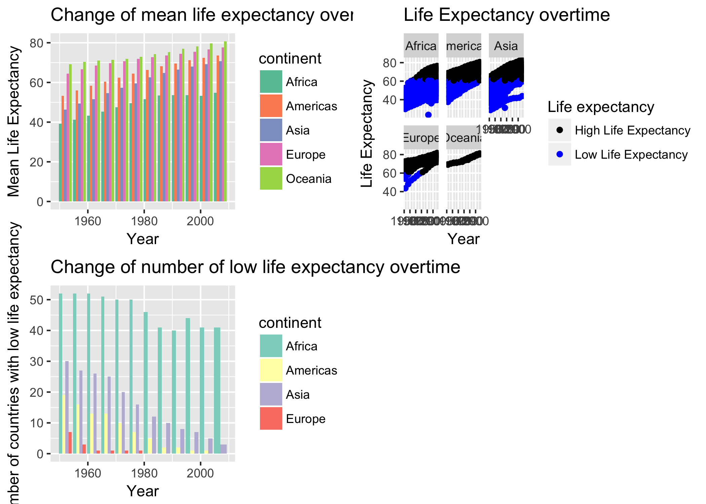

This is homework 05 from Lucy Mei.

# Homework05: Factor and figure management; Repo hygiene
## Goal
1. Reorder a factor in a principled way based on the data and demonstrate the effect in arranged data and in figures.

2. Improve a figure (or make one from scratch), using new knowledge, e.g., control the color scheme, use factor levels, smoother mechanics.

3. Implement visualization design principles.

4. Write some data to file and load it back into R. e.g. save a plot to file and include it in a R markdown report via ``.

5. Organize my github, to celebrate the completion of STAT 545.

## For this homework I am going to use gapminder
```{r}
library(gapminder)
library(tidyverse)
```

## Factor management
Step goals: 
- Define factor variables;
- Drop factor / levels;
- Reorder levels based on knowledge from data

### Drop Oceania.
First, I am going to check the number of rows in gapminder.
```{r}
nrow(gapminder)
```

1. Filter the Gapminder data to remove observations associated with the continent of Oceania and check how many rows are left.
```{r}
gapfiltered <- gapminder %>%
  filter(continent %in% c("Asia", "Americas", "Europe", "Africa"))
nrow(gapfiltered)
```

2. Additionally, remove unused factor levels. 
First, let's look at the levels of the gapfiltered (filtered out Oceania).
```{r}
nlevels(gapfiltered$continent)
```
Although I filtered Oceania in the first step, when we look at the level of continent, there are still 5 levels.

Now, I am going to remove the level using the base function droplevels().
```{r}
gapfiltered_dropped <- gapfiltered %>%
  droplevels()
nlevels(gapfiltered_dropped$continent)
nrow(gapfiltered_dropped)
```
After dropping the level, there are only 4 levels in continent. The number of rows is the same before and after dropping the unused level.


### Reorder the levels of country or continent.
In this section, I am interested in looking at the maximum GDP per capita of Europe countries in 1959 and 2007.
First, I will need to filter out the data I want.
```{r}
gdpPercap_1952 <- gapminder %>%
  filter(continent == "Europe", year == 1952)
nlevels(gdpPercap_1952$country)

gdpPercap_2007 <- gapminder %>%
  filter(continent == "Europe", year == 2007)
nlevels(gdpPercap_2007$country)
```
Since I only filtered the data, when I look at the level of countries, it still shows total of 142 levels.

So I am going to drop the unused levels now.
```{r}
gdpPercap_1952 <- gdpPercap_1952 %>%
  droplevels()
nlevels(gdpPercap_1952$country)

gdpPercap_2007 <- gdpPercap_2007 %>%
  droplevels()
nlevels(gdpPercap_2007$country)
```
Good, so the data I want only has 30 levels now.
Let's make a plot for maximum GDP per capita first.


```{r}
gdpPercap_1952 %>%
  group_by(country) %>%
  ggplot(aes(gdpPercap,country)) + 
  geom_point(aes((gdpPercap), country)) +
  labs(x="GDP per capita", y="Country", title = "GDP per capita of European countries in 1952")

gdpPercap_2007 %>%
  group_by(country) %>%
  ggplot(aes(gdpPercap,country)) + 
  geom_point(aes((gdpPercap), country)) +
  labs(x="GDP per capita", y="Country", title = "GDP per capita of European countries in 2007")
```
The plots do not give useful information.

Now, I am going to reorder the levels according to maximum GDP per capita.
```{r}
gdpPercap_1952 %>%
  ggplot(aes(gdpPercap, forcats::fct_reorder(country, gdpPercap))) + 
  geom_point() +
  labs(x="GDP per capita", y="Country", title = "GDP per capita of European countries in 1952")

gdpPercap_2007 %>%
  ggplot(aes(gdpPercap, forcats::fct_reorder(country, gdpPercap))) + 
  geom_point() +
  labs(x="GDP per capita", y="Country", title = "GDP per capita of European countries in 2007")
```
The plots are now arranged according to GDP per capita. From these two plots it is easy to tell that Norway and Switzerland had high GDP per capita in both 1952 and 2007. GDP per capita in Europe increased in general from 1952 to 2007.

### Look at continent 
If I look at the continent.
```{r}
gdpPercap_continent1952 <- gapminder %>%
  filter(year == 1952) %>%
  droplevels()
levels(gdpPercap_continent1952$continent)

gdpPercap_continent2007 <- gapminder %>%
  filter(year == 2007) %>%
  droplevels()
levels(gdpPercap_continent2007$continent)
```

```{r}
gdpPercap_continent1952 %>%
  ggplot(aes(continent,gdpPercap)) +
  geom_point(aes(continent,gdpPercap)) +
  labs(x="Continent", y="GDP per capita", title = "GDP per capita of continents in 1952")

gdpPercap_continent2007 %>%
  ggplot(aes(continent, gdpPercap)) + 
  geom_point(aes(continent, gdpPercap)) +
  labs(x="Continent", y="GDP per capita", title = "GDP per capita of continents in 2007")
```


And I reorder the level according to maximum GDP per capita of the continent. We can tell that GDP per capita of Europe is generallly higher than that of Africa.
```{r}
gdpPercap_continent1952 %>%
  ggplot(aes(forcats::fct_reorder(continent, gdpPercap, max),gdpPercap)) +
  geom_point(aes(forcats::fct_reorder(continent, gdpPercap, max),gdpPercap)) +
  labs(x="Continent", y="GDP per capita", title = "GDP per capita of continents in 1952")

gdpPercap_continent2007 %>%
  ggplot(aes(forcats::fct_reorder(continent, gdpPercap, max), gdpPercap)) + 
  geom_point(aes(forcats::fct_reorder(continent, gdpPercap, max), gdpPercap)) +
  labs(x="Continent", y="GDP per capita", title = "GDP per capita of continents in 2007")
```


### Common part
Characterize the (derived) data before and after your factor re-leveling.
- Explore the effects of arrange(). Does merely arranging the data have any effect on a figure?

If I arrange gapminder data of Europe in 1950 according to GDP per capita and then plot. The plot is not in the arranged order. However, the table generated is arranged according to ascending gdpPercap.
```{r}
gdpPercap_1952 %>%
  arrange(gdpPercap) %>%
  ggplot(aes(gdpPercap,country)) +
  geom_point() +
  labs(x="GDP per capita", y="Country", title = "GDP per capita of European countries in 1952")

gdpPercap_1952 %>%
  arrange(gdpPercap) %>%
  knitr::kable(align = 'c', format = 'markdown', digits = 2)
```


- Explore the effects of reordering a factor and factor reordering coupled with arrange(). Especially, what effect does this have on a figure?
If I reorder the level according to GDP per capita and plot the same thing as the previous plot.
```{r}
gdpPercap_1952reorder <- gdpPercap_1952 %>%
  mutate(country = forcats::fct_reorder(country,gdpPercap))
  
ggplot(gdpPercap_1952reorder, aes(gdpPercap, country)) + 
  geom_point() +
  labs(x="GDP per capita", y="Country", title = "GDP per capita of European countries in 1952")

ggplot(gdpPercap_1952reorder, aes(lifeExp, country)) +
  geom_point() +
  labs(x="Life Expectancy", y="Country", title = "Life Expectancy of European countries in 1952")
```
As shown before, it gives a new ordered plot.

If I use a combination of reordering and arrange(). For example, what if I arrange the reordered data according to life expectancy first and then I plot it. It shows that arrange() has no effect on the plot. The third plot shows life expectancy in order as a comparison.
```{r}
gdpPercap_1952reorder %>%
  arrange(lifeExp) %>%
  ggplot(aes(gdpPercap,country)) + 
  geom_point() +
  labs(x="GDP per capita", y="Country", title = "GDP per capita of European countries in 1952")

gdpPercap_1952reorder %>%
  arrange(lifeExp) %>%
  ggplot(aes(lifeExp,country)) + 
  geom_point() +
  labs(x="Life Expectancy", y="Country", title = "Life Expectancy of European countries in 1952")

gdpPercap_1952reorder %>%
  ggplot(aes(lifeExp, forcats::fct_reorder(country, lifeExp))) + 
  geom_point() +
  labs(x="Life Expectancy", y="Country", title = "Life Expectancy of European countries in 1952")
```


## File I/O
Experiment with one or more of write_csv()/read_csv() (and/or TSV friends), saveRDS()/readRDS(), dput()/dget(). 
Create something new, probably by filtering or grouped-summarization of Gapminder.
Incorporate factor levels.

First, I load gapminder data and turn country and continent to factors for later manipulation.
```{r}
(gap_tsv <- system.file("gapminder.tsv", package = "gapminder"))
gapminder <- read_tsv(gap_tsv)
str(gapminder, give.attr=FALSE)
gapminderfactor <- gapminder %>%
  mutate(country = factor(country),
         continent = factor(continent))
str(gapminderfactor)
```

```{r}
nlevels(gapminderfactor$country)
```

I am going to create a new dataset of gapminder data of Asia from 2001 to 2007 and reorder the level of country according to population.
First, I filtered out the data I want and check the levels of country.
```{r}
gap_asia2000 <- gapminderfactor %>%
  filter(continent=="Asia", year > 2000) %>%
  droplevels()
levels(gap_asia2000$country)
```

Then, I created a reordered set of data according to population.
```{r}
gap_asia2000reorder <- gap_asia2000 %>%
  mutate(country= forcats::fct_reorder(gap_asia2000$country, gap_asia2000$pop, max))
levels(gap_asia2000reorder$country)
```

Now, I am going to write the data.
```{r}
data.frame(gap_asia2000reorder)
write_csv(gap_asia2000reorder, "gap_asia2000reorder.csv")
```

And read it again. It seems that the reordered data is kept in its reordered form.
```{r}
read_csv("gap_asia2000reorder.csv")
levels(gap_asia2000reorder$country)
```

## Visualization design
Remake at least one figure or create a new one, in light of something I learned in the recent class meetings about visualization design and color. 
Juxtapose the first attempt and what I obtained after some time spent working on it.
Reflect on the differences. 

### First plot I want to improve
I want to plot change of mean life expectancy of the continent overtime. First, I created a new column for mean life expectancy of each continent.
```{r}
meanlifeExp <- gapminder %>%
  group_by(year,continent) %>%
  mutate(meanle = mean(lifeExp))
meanlifeExp
```

Then, I plot it as I would before.
```{r}
meanlifeExp %>%
  ggplot(aes(x=year, y=meanle)) +
  geom_point(aes(x=year, y=meanle, color=continent)) +
  labs(x="Year", y="Mean Life Expectancy", title="Change of mean life expectancy overtime")
```

Now, I try to improve the plot. I used a new set of colours. From this plot, I can not only see the trend of each continent but also to compare the mean life expectancy between continents for each year. 
```{r}
library(RColorBrewer)
my_plot <- ggplot(meanlifeExp, aes(x=year, y=meanle)) +
  geom_bar(aes(x=year, y=meanle, fill=continent),position="dodge", stat="identity") +
  scale_fill_manual(values=brewer.pal(n=5, "Set2")) +
  scale_y_continuous("Mean Life Expectancy") +
  scale_x_continuous("Year") +
  labs(title="Change of mean life expectancy overtime")
my_plot
```

### Low life expectancy plot

Another plot I want to try. I want to know the proportion of countries that have a life expectancy lower than the global median life expectancy.  

First, this is how I would do before. I would add a y-intercept line to indicate boundary.
```{r}
gapminder %>%
  ggplot(aes(year, lifeExp)) +
  geom_point(aes(x=year, y=lifeExp)) +
  facet_wrap(~continent) +
  geom_hline(yintercept=60.71, colour="red") +
  labs(x="Year", y="Life Expectancy", title="Life Expectancy overtime")
```


Now, I can plot the following. The colour change gives a more straightforward indication of the amount of countries have low life expectancy compare to the first plot. Also the legend gives a brief explanation to the colours. However, I think y-intercept gives a better sense of how life expectancy deviates from the mean value. For example, from the first plot, I can tell the life expectancy of Oceania is way above the mean. 
```{r}
colour_layer <- scale_colour_manual("Life expectancy",
                                    labels=c("High Life Expectancy", "Low Life Expectancy"),
                                    values=c("black", "blue"))
lowlifeplot <- gapminder %>%
  ggplot(aes(year, lifeExp)) +
  geom_point(aes(x=year, y=lifeExp, colour = lifeExp <60.71)) +
  colour_layer +
  scale_alpha_discrete(range=c(0.2, 1), guide=FALSE) +
  facet_wrap(~continent) +
  labs(x="Year", y="Life Expectancy", title="Life Expectancy overtime")

lowlifeplot
```

## Writing figures to file
Use ggsave() to explicitly save a plot to file.
Then use `` to load and embed it in my report. 

First, I want to combine the two plots together.
```{r}
library(gridExtra)
combined_plot <- grid.arrange(my_plot, lowlifeplot, nrow=2)
```


So now I want to save the two life expectancy plots in a file.
```{r}
ggsave("combined_plot.png", combined_plot)
```

Then, I load my plots.




# But I want to do more!
Make a deeper exploration of the forcats packages, i.e. try more of the factor level reordering functions.
Pick a handful of countries, each of which you can associate with a stereotypical animal. Create an excerpt of the Gapminder data, filtered to just these countries.
Create a new factor by mapping the existing country factor levels to the new levels.


