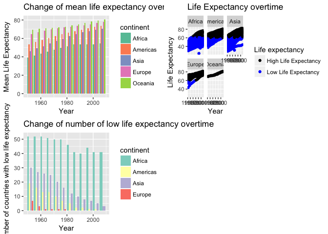
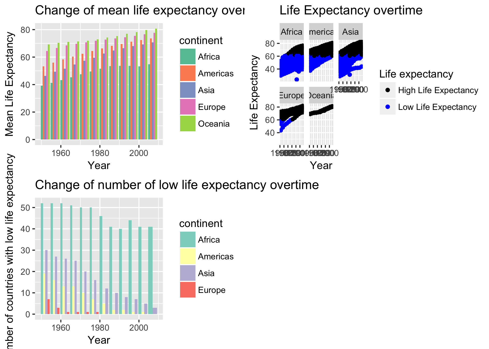

# Untitled

This is homework 05 from Lucy Mei.

# Homework05: Factor and figure management; Repo hygiene
## Goal
1. Reorder a factor in a principled way based on the data and demonstrate the effect in arranged data and in figures.

2. Improve a figure (or make one from scratch), using new knowledge, e.g., control the color scheme, use factor levels, smoother mechanics.

3. Implement visualization design principles.

4. Write some data to file and load it back into R. e.g. save a plot to file and include it in a R markdown report via ``.

5. Organize my github, to celebrate the completion of STAT 545.

## For this homework I am going to use gapminder

```r
library(gapminder)
library(tidyverse)
```

```
## Loading tidyverse: ggplot2
## Loading tidyverse: tibble
## Loading tidyverse: tidyr
## Loading tidyverse: readr
## Loading tidyverse: purrr
## Loading tidyverse: dplyr
```

```
## Conflicts with tidy packages ----------------------------------------------
```

```
## filter(): dplyr, stats
## lag():    dplyr, stats
```

## Factor management
Step goals: 
- Define factor variables;
- Drop factor / levels;
- Reorder levels based on knowledge from data

### Drop Oceania.
First, I am going to check the number of rows in gapminder.

```r
nrow(gapminder)
```

```
## [1] 1704
```

1. Filter the Gapminder data to remove observations associated with the continent of Oceania and check how many rows are left.

```r
gapfiltered <- gapminder %>%
  filter(continent %in% c("Asia", "Americas", "Europe", "Africa"))
nrow(gapfiltered)
```

```
## [1] 1680
```

2. Additionally, remove unused factor levels. 
First, let's look at the levels of the gapfiltered (filtered out Oceania).

```r
nlevels(gapfiltered$continent)
```

```
## [1] 5
```
Although I filtered Oceania in the first step, when we look at the level of continent, there are still 5 levels.

Now, I am going to remove the level using the base function droplevels().

```r
gapfiltered_dropped <- gapfiltered %>%
  droplevels()
nlevels(gapfiltered_dropped$continent)
```

```
## [1] 4
```

```r
nrow(gapfiltered_dropped)
```

```
## [1] 1680
```
After dropping the level, there are only 4 levels in continent. The number of rows is the same before and after dropping the unused level.


### Reorder the levels of country or continent.
In this section, I am interested in looking at the maximum GDP per capita of Europe countries in 1959 and 2007.
First, I will need to filter out the data I want.

```r
gdpPercap_1952 <- gapminder %>%
  filter(continent == "Europe", year == 1952)
nlevels(gdpPercap_1952$country)
```

```
## [1] 142
```

```r
gdpPercap_2007 <- gapminder %>%
  filter(continent == "Europe", year == 2007)
nlevels(gdpPercap_2007$country)
```

```
## [1] 142
```
Since I only filtered the data, when I look at the level of countries, it still shows total of 142 levels.

So I am going to drop the unused levels now.

```r
gdpPercap_1952 <- gdpPercap_1952 %>%
  droplevels()
nlevels(gdpPercap_1952$country)
```

```
## [1] 30
```

```r
gdpPercap_2007 <- gdpPercap_2007 %>%
  droplevels()
nlevels(gdpPercap_2007$country)
```

```
## [1] 30
```
Good, so the data I want only has 30 levels now.
Let's make a plot for maximum GDP per capita first.


```r
gdpPercap_1952 %>%
  group_by(country) %>%
  ggplot(aes(gdpPercap,country)) + 
  geom_point(aes((gdpPercap), country)) +
  labs(x="GDP per capita", y="Country", title = "GDP per capita of European countries in 1952")
```

<!-- -->

```r
gdpPercap_2007 %>%
  group_by(country) %>%
  ggplot(aes(gdpPercap,country)) + 
  geom_point(aes((gdpPercap), country)) +
  labs(x="GDP per capita", y="Country", title = "GDP per capita of European countries in 2007")
```

<!-- -->
The plots do not give useful information.

Now, I am going to reorder the levels according to maximum GDP per capita.

```r
gdpPercap_1952 %>%
  ggplot(aes(gdpPercap, forcats::fct_reorder(country, gdpPercap))) + 
  geom_point() +
  labs(x="GDP per capita", y="Country", title = "GDP per capita of European countries in 1952")
```

<!-- -->

```r
gdpPercap_2007 %>%
  ggplot(aes(gdpPercap, forcats::fct_reorder(country, gdpPercap))) + 
  geom_point() +
  labs(x="GDP per capita", y="Country", title = "GDP per capita of European countries in 2007")
```

<!-- -->
The plots are now arranged according to GDP per capita. From these two plots it is easy to tell that Norway and Switzerland had high GDP per capita in both 1952 and 2007. GDP per capita in Europe increased in general from 1952 to 2007.

### Look at continent 
If I look at the continent.

```r
gdpPercap_continent1952 <- gapminder %>%
  filter(year == 1952) %>%
  droplevels()
levels(gdpPercap_continent1952$continent)
```

```
## [1] "Africa"   "Americas" "Asia"     "Europe"   "Oceania"
```

```r
gdpPercap_continent2007 <- gapminder %>%
  filter(year == 2007) %>%
  droplevels()
levels(gdpPercap_continent2007$continent)
```

```
## [1] "Africa"   "Americas" "Asia"     "Europe"   "Oceania"
```


```r
gdpPercap_continent1952 %>%
  ggplot(aes(continent,gdpPercap)) +
  geom_point(aes(continent,gdpPercap)) +
  labs(x="Continent", y="GDP per capita", title = "GDP per capita of continents in 1952")
```

<!-- -->

```r
gdpPercap_continent2007 %>%
  ggplot(aes(continent, gdpPercap)) + 
  geom_point(aes(continent, gdpPercap)) +
  labs(x="Continent", y="GDP per capita", title = "GDP per capita of continents in 2007")
```

<!-- -->


And I reorder the level according to maximum GDP per capita of the continent. We can tell that GDP per capita of Europe is generallly higher than that of Africa.

```r
gdpPercap_continent1952 %>%
  ggplot(aes(forcats::fct_reorder(continent, gdpPercap, max),gdpPercap)) +
  geom_point(aes(forcats::fct_reorder(continent, gdpPercap, max),gdpPercap)) +
  labs(x="Continent", y="GDP per capita", title = "GDP per capita of continents in 1952")
```

<!-- -->

```r
gdpPercap_continent2007 %>%
  ggplot(aes(forcats::fct_reorder(continent, gdpPercap, max), gdpPercap)) + 
  geom_point(aes(forcats::fct_reorder(continent, gdpPercap, max), gdpPercap)) +
  labs(x="Continent", y="GDP per capita", title = "GDP per capita of continents in 2007")
```

<!-- -->


### Common part
Characterize the (derived) data before and after your factor re-leveling.
- Explore the effects of arrange(). Does merely arranging the data have any effect on a figure?

If I arrange gapminder data of Europe in 1950 according to GDP per capita and then plot. The plot is not in the arranged order. However, the table generated is arranged according to ascending gdpPercap.

```r
gdpPercap_1952 %>%
  arrange(gdpPercap) %>%
  ggplot(aes(gdpPercap,country)) +
  geom_point() +
  labs(x="GDP per capita", y="Country", title = "GDP per capita of European countries in 1952")
```

<!-- -->

```r
gdpPercap_1952 %>%
  arrange(gdpPercap) %>%
  knitr::kable(align = 'c', format = 'markdown', digits = 2)
```


|        country         | continent | year | lifeExp |   pop    | gdpPercap |
|:----------------------:|:---------:|:----:|:-------:|:--------:|:---------:|
| Bosnia and Herzegovina |  Europe   | 1952 |  53.82  | 2791000  |  973.53   |
|        Albania         |  Europe   | 1952 |  55.23  | 1282697  |  1601.06  |
|         Turkey         |  Europe   | 1952 |  43.59  | 22235677 |  1969.10  |
|        Bulgaria        |  Europe   | 1952 |  59.60  | 7274900  |  2444.29  |
|       Montenegro       |  Europe   | 1952 |  59.16  |  413834  |  2647.59  |
|        Portugal        |  Europe   | 1952 |  59.82  | 8526050  |  3068.32  |
|        Croatia         |  Europe   | 1952 |  61.21  | 3882229  |  3119.24  |
|        Romania         |  Europe   | 1952 |  61.05  | 16630000 |  3144.61  |
|         Greece         |  Europe   | 1952 |  65.86  | 7733250  |  3530.69  |
|         Serbia         |  Europe   | 1952 |  58.00  | 6860147  |  3581.46  |
|         Spain          |  Europe   | 1952 |  64.94  | 28549870 |  3834.03  |
|         Poland         |  Europe   | 1952 |  61.31  | 25730551 |  4029.33  |
|        Slovenia        |  Europe   | 1952 |  65.57  | 1489518  |  4215.04  |
|         Italy          |  Europe   | 1952 |  65.94  | 47666000 |  4931.40  |
|    Slovak Republic     |  Europe   | 1952 |  64.36  | 3558137  |  5074.66  |
|        Ireland         |  Europe   | 1952 |  66.91  | 2952156  |  5210.28  |
|        Hungary         |  Europe   | 1952 |  64.03  | 9504000  |  5263.67  |
|        Austria         |  Europe   | 1952 |  66.80  | 6927772  |  6137.08  |
|        Finland         |  Europe   | 1952 |  66.55  | 4090500  |  6424.52  |
|     Czech Republic     |  Europe   | 1952 |  66.87  | 9125183  |  6876.14  |
|         France         |  Europe   | 1952 |  67.41  | 42459667 |  7029.81  |
|        Germany         |  Europe   | 1952 |  67.50  | 69145952 |  7144.11  |
|        Iceland         |  Europe   | 1952 |  72.49  |  147962  |  7267.69  |
|        Belgium         |  Europe   | 1952 |  68.00  | 8730405  |  8343.11  |
|         Sweden         |  Europe   | 1952 |  71.86  | 7124673  |  8527.84  |
|      Netherlands       |  Europe   | 1952 |  72.13  | 10381988 |  8941.57  |
|        Denmark         |  Europe   | 1952 |  70.78  | 4334000  |  9692.39  |
|     United Kingdom     |  Europe   | 1952 |  69.18  | 50430000 |  9979.51  |
|         Norway         |  Europe   | 1952 |  72.67  | 3327728  | 10095.42  |
|      Switzerland       |  Europe   | 1952 |  69.62  | 4815000  | 14734.23  |


- Explore the effects of reordering a factor and factor reordering coupled with arrange(). Especially, what effect does this have on a figure?
If I reorder the level according to GDP per capita and plot the same thing as the previous plot.

```r
gdpPercap_1952reorder <- gdpPercap_1952 %>%
  mutate(country = forcats::fct_reorder(country,gdpPercap))
  
ggplot(gdpPercap_1952reorder, aes(gdpPercap, country)) + 
  geom_point() +
  labs(x="GDP per capita", y="Country", title = "GDP per capita of European countries in 1952")
```

<!-- -->

```r
ggplot(gdpPercap_1952reorder, aes(lifeExp, country)) +
  geom_point() +
  labs(x="Life Expectancy", y="Country", title = "Life Expectancy of European countries in 1952")
```

<!-- -->
As shown before, it gives a new ordered plot.

If I use a combination of reordering and arrange(). For example, what if I arrange the reordered data according to life expectancy first and then I plot it. It shows that arrange() has no effect on the plot. The third plot shows life expectancy in order as a comparison.

```r
gdpPercap_1952reorder %>%
  arrange(lifeExp) %>%
  ggplot(aes(gdpPercap,country)) + 
  geom_point() +
  labs(x="GDP per capita", y="Country", title = "GDP per capita of European countries in 1952")
```

<!-- -->

```r
gdpPercap_1952reorder %>%
  arrange(lifeExp) %>%
  ggplot(aes(lifeExp,country)) + 
  geom_point() +
  labs(x="Life Expectancy", y="Country", title = "Life Expectancy of European countries in 1952")
```

<!-- -->

```r
gdpPercap_1952reorder %>%
  ggplot(aes(lifeExp, forcats::fct_reorder(country, lifeExp))) + 
  geom_point() +
  labs(x="Life Expectancy", y="Country", title = "Life Expectancy of European countries in 1952")
```

<!-- -->


## File I/O
Experiment with one or more of write_csv()/read_csv() (and/or TSV friends), saveRDS()/readRDS(), dput()/dget(). 
Create something new, probably by filtering or grouped-summarization of Gapminder.
Incorporate factor levels.

First, I load gapminder data and turn country and continent to factors for later manipulation.

```r
(gap_tsv <- system.file("gapminder.tsv", package = "gapminder"))
```

```
## [1] "/Library/Frameworks/R.framework/Versions/3.3/Resources/library/gapminder/gapminder.tsv"
```

```r
gapminder <- read_tsv(gap_tsv)
```

```
## Parsed with column specification:
## cols(
##   country = col_character(),
##   continent = col_character(),
##   year = col_integer(),
##   lifeExp = col_double(),
##   pop = col_integer(),
##   gdpPercap = col_double()
## )
```

```r
str(gapminder, give.attr=FALSE)
```

```
## Classes 'tbl_df', 'tbl' and 'data.frame':	1704 obs. of  6 variables:
##  $ country  : chr  "Afghanistan" "Afghanistan" "Afghanistan" "Afghanistan" ...
##  $ continent: chr  "Asia" "Asia" "Asia" "Asia" ...
##  $ year     : int  1952 1957 1962 1967 1972 1977 1982 1987 1992 1997 ...
##  $ lifeExp  : num  28.8 30.3 32 34 36.1 ...
##  $ pop      : int  8425333 9240934 10267083 11537966 13079460 14880372 12881816 13867957 16317921 22227415 ...
##  $ gdpPercap: num  779 821 853 836 740 ...
```

```r
gapminderfactor <- gapminder %>%
  mutate(country = factor(country),
         continent = factor(continent))
str(gapminderfactor)
```

```
## Classes 'tbl_df', 'tbl' and 'data.frame':	1704 obs. of  6 variables:
##  $ country  : Factor w/ 142 levels "Afghanistan",..: 1 1 1 1 1 1 1 1 1 1 ...
##  $ continent: Factor w/ 5 levels "Africa","Americas",..: 3 3 3 3 3 3 3 3 3 3 ...
##  $ year     : int  1952 1957 1962 1967 1972 1977 1982 1987 1992 1997 ...
##  $ lifeExp  : num  28.8 30.3 32 34 36.1 ...
##  $ pop      : int  8425333 9240934 10267083 11537966 13079460 14880372 12881816 13867957 16317921 22227415 ...
##  $ gdpPercap: num  779 821 853 836 740 ...
```


```r
nlevels(gapminderfactor$country)
```

```
## [1] 142
```

I am going to create a new dataset of gapminder data of Asia from 2001 to 2007 and reorder the level of country according to population.
First, I filtered out the data I want and check the levels of country.

```r
gap_asia2000 <- gapminderfactor %>%
  filter(continent=="Asia", year > 2000) %>%
  droplevels()
levels(gap_asia2000$country)
```

```
##  [1] "Afghanistan"        "Bahrain"            "Bangladesh"        
##  [4] "Cambodia"           "China"              "Hong Kong, China"  
##  [7] "India"              "Indonesia"          "Iran"              
## [10] "Iraq"               "Israel"             "Japan"             
## [13] "Jordan"             "Korea, Dem. Rep."   "Korea, Rep."       
## [16] "Kuwait"             "Lebanon"            "Malaysia"          
## [19] "Mongolia"           "Myanmar"            "Nepal"             
## [22] "Oman"               "Pakistan"           "Philippines"       
## [25] "Saudi Arabia"       "Singapore"          "Sri Lanka"         
## [28] "Syria"              "Taiwan"             "Thailand"          
## [31] "Vietnam"            "West Bank and Gaza" "Yemen, Rep."
```

Then, I created a reordered set of data according to population.

```r
gap_asia2000reorder <- gap_asia2000 %>%
  mutate(country= forcats::fct_reorder(gap_asia2000$country, gap_asia2000$pop, max))
levels(gap_asia2000reorder$country)
```

```
##  [1] "Bahrain"            "Kuwait"             "Mongolia"          
##  [4] "Oman"               "Lebanon"            "West Bank and Gaza"
##  [7] "Singapore"          "Jordan"             "Israel"            
## [10] "Hong Kong, China"   "Cambodia"           "Syria"             
## [13] "Sri Lanka"          "Yemen, Rep."        "Taiwan"            
## [16] "Korea, Dem. Rep."   "Malaysia"           "Iraq"              
## [19] "Saudi Arabia"       "Nepal"              "Afghanistan"       
## [22] "Myanmar"            "Korea, Rep."        "Thailand"          
## [25] "Iran"               "Vietnam"            "Philippines"       
## [28] "Japan"              "Bangladesh"         "Pakistan"          
## [31] "Indonesia"          "India"              "China"
```

Now, I am going to write the data.

```r
data.frame(gap_asia2000reorder)
```

```
##               country continent year lifeExp        pop  gdpPercap
## 1         Afghanistan      Asia 2002  42.129   25268405   726.7341
## 2         Afghanistan      Asia 2007  43.828   31889923   974.5803
## 3             Bahrain      Asia 2002  74.795     656397 23403.5593
## 4             Bahrain      Asia 2007  75.635     708573 29796.0483
## 5          Bangladesh      Asia 2002  62.013  135656790  1136.3904
## 6          Bangladesh      Asia 2007  64.062  150448339  1391.2538
## 7            Cambodia      Asia 2002  56.752   12926707   896.2260
## 8            Cambodia      Asia 2007  59.723   14131858  1713.7787
## 9               China      Asia 2002  72.028 1280400000  3119.2809
## 10              China      Asia 2007  72.961 1318683096  4959.1149
## 11   Hong Kong, China      Asia 2002  81.495    6762476 30209.0152
## 12   Hong Kong, China      Asia 2007  82.208    6980412 39724.9787
## 13              India      Asia 2002  62.879 1034172547  1746.7695
## 14              India      Asia 2007  64.698 1110396331  2452.2104
## 15          Indonesia      Asia 2002  68.588  211060000  2873.9129
## 16          Indonesia      Asia 2007  70.650  223547000  3540.6516
## 17               Iran      Asia 2002  69.451   66907826  9240.7620
## 18               Iran      Asia 2007  70.964   69453570 11605.7145
## 19               Iraq      Asia 2002  57.046   24001816  4390.7173
## 20               Iraq      Asia 2007  59.545   27499638  4471.0619
## 21             Israel      Asia 2002  79.696    6029529 21905.5951
## 22             Israel      Asia 2007  80.745    6426679 25523.2771
## 23              Japan      Asia 2002  82.000  127065841 28604.5919
## 24              Japan      Asia 2007  82.603  127467972 31656.0681
## 25             Jordan      Asia 2002  71.263    5307470  3844.9172
## 26             Jordan      Asia 2007  72.535    6053193  4519.4612
## 27   Korea, Dem. Rep.      Asia 2002  66.662   22215365  1646.7582
## 28   Korea, Dem. Rep.      Asia 2007  67.297   23301725  1593.0655
## 29        Korea, Rep.      Asia 2002  77.045   47969150 19233.9882
## 30        Korea, Rep.      Asia 2007  78.623   49044790 23348.1397
## 31             Kuwait      Asia 2002  76.904    2111561 35110.1057
## 32             Kuwait      Asia 2007  77.588    2505559 47306.9898
## 33            Lebanon      Asia 2002  71.028    3677780  9313.9388
## 34            Lebanon      Asia 2007  71.993    3921278 10461.0587
## 35           Malaysia      Asia 2002  73.044   22662365 10206.9779
## 36           Malaysia      Asia 2007  74.241   24821286 12451.6558
## 37           Mongolia      Asia 2002  65.033    2674234  2140.7393
## 38           Mongolia      Asia 2007  66.803    2874127  3095.7723
## 39            Myanmar      Asia 2002  59.908   45598081   611.0000
## 40            Myanmar      Asia 2007  62.069   47761980   944.0000
## 41              Nepal      Asia 2002  61.340   25873917  1057.2063
## 42              Nepal      Asia 2007  63.785   28901790  1091.3598
## 43               Oman      Asia 2002  74.193    2713462 19774.8369
## 44               Oman      Asia 2007  75.640    3204897 22316.1929
## 45           Pakistan      Asia 2002  63.610  153403524  2092.7124
## 46           Pakistan      Asia 2007  65.483  169270617  2605.9476
## 47        Philippines      Asia 2002  70.303   82995088  2650.9211
## 48        Philippines      Asia 2007  71.688   91077287  3190.4810
## 49       Saudi Arabia      Asia 2002  71.626   24501530 19014.5412
## 50       Saudi Arabia      Asia 2007  72.777   27601038 21654.8319
## 51          Singapore      Asia 2002  78.770    4197776 36023.1054
## 52          Singapore      Asia 2007  79.972    4553009 47143.1796
## 53          Sri Lanka      Asia 2002  70.815   19576783  3015.3788
## 54          Sri Lanka      Asia 2007  72.396   20378239  3970.0954
## 55              Syria      Asia 2002  73.053   17155814  4090.9253
## 56              Syria      Asia 2007  74.143   19314747  4184.5481
## 57             Taiwan      Asia 2002  76.990   22454239 23235.4233
## 58             Taiwan      Asia 2007  78.400   23174294 28718.2768
## 59           Thailand      Asia 2002  68.564   62806748  5913.1875
## 60           Thailand      Asia 2007  70.616   65068149  7458.3963
## 61            Vietnam      Asia 2002  73.017   80908147  1764.4567
## 62            Vietnam      Asia 2007  74.249   85262356  2441.5764
## 63 West Bank and Gaza      Asia 2002  72.370    3389578  4515.4876
## 64 West Bank and Gaza      Asia 2007  73.422    4018332  3025.3498
## 65        Yemen, Rep.      Asia 2002  60.308   18701257  2234.8208
## 66        Yemen, Rep.      Asia 2007  62.698   22211743  2280.7699
```

```r
write_csv(gap_asia2000reorder, "gap_asia2000reorder.csv")
```

And read it again. It seems that the reordered data is kept in its reordered form.

```r
read_csv("gap_asia2000reorder.csv")
```

```
## Parsed with column specification:
## cols(
##   country = col_character(),
##   continent = col_character(),
##   year = col_integer(),
##   lifeExp = col_double(),
##   pop = col_integer(),
##   gdpPercap = col_double()
## )
```

```
## # A tibble: 66 x 6
##        country continent  year lifeExp        pop  gdpPercap
##          <chr>     <chr> <int>   <dbl>      <int>      <dbl>
##  1 Afghanistan      Asia  2002  42.129   25268405   726.7341
##  2 Afghanistan      Asia  2007  43.828   31889923   974.5803
##  3     Bahrain      Asia  2002  74.795     656397 23403.5593
##  4     Bahrain      Asia  2007  75.635     708573 29796.0483
##  5  Bangladesh      Asia  2002  62.013  135656790  1136.3904
##  6  Bangladesh      Asia  2007  64.062  150448339  1391.2538
##  7    Cambodia      Asia  2002  56.752   12926707   896.2260
##  8    Cambodia      Asia  2007  59.723   14131858  1713.7787
##  9       China      Asia  2002  72.028 1280400000  3119.2809
## 10       China      Asia  2007  72.961 1318683096  4959.1149
## # ... with 56 more rows
```

```r
levels(gap_asia2000reorder$country)
```

```
##  [1] "Bahrain"            "Kuwait"             "Mongolia"          
##  [4] "Oman"               "Lebanon"            "West Bank and Gaza"
##  [7] "Singapore"          "Jordan"             "Israel"            
## [10] "Hong Kong, China"   "Cambodia"           "Syria"             
## [13] "Sri Lanka"          "Yemen, Rep."        "Taiwan"            
## [16] "Korea, Dem. Rep."   "Malaysia"           "Iraq"              
## [19] "Saudi Arabia"       "Nepal"              "Afghanistan"       
## [22] "Myanmar"            "Korea, Rep."        "Thailand"          
## [25] "Iran"               "Vietnam"            "Philippines"       
## [28] "Japan"              "Bangladesh"         "Pakistan"          
## [31] "Indonesia"          "India"              "China"
```

## Visualization design
Remake at least one figure or create a new one, in light of something I learned in the recent class meetings about visualization design and color. 
Juxtapose the first attempt and what I obtained after some time spent working on it.
Reflect on the differences. 

### First plot I want to improve
I want to plot change of mean life expectancy of the continent overtime. First, I created a new column for mean life expectancy of each continent.

```r
meanlifeExp <- gapminder %>%
  group_by(year,continent) %>%
  mutate(meanle = mean(lifeExp))
meanlifeExp
```

```
## # A tibble: 1,704 x 7
## # Groups:   year, continent [60]
##        country continent  year lifeExp      pop gdpPercap   meanle
##          <chr>     <chr> <int>   <dbl>    <int>     <dbl>    <dbl>
##  1 Afghanistan      Asia  1952  28.801  8425333  779.4453 46.31439
##  2 Afghanistan      Asia  1957  30.332  9240934  820.8530 49.31854
##  3 Afghanistan      Asia  1962  31.997 10267083  853.1007 51.56322
##  4 Afghanistan      Asia  1967  34.020 11537966  836.1971 54.66364
##  5 Afghanistan      Asia  1972  36.088 13079460  739.9811 57.31927
##  6 Afghanistan      Asia  1977  38.438 14880372  786.1134 59.61056
##  7 Afghanistan      Asia  1982  39.854 12881816  978.0114 62.61794
##  8 Afghanistan      Asia  1987  40.822 13867957  852.3959 64.85118
##  9 Afghanistan      Asia  1992  41.674 16317921  649.3414 66.53721
## 10 Afghanistan      Asia  1997  41.763 22227415  635.3414 68.02052
## # ... with 1,694 more rows
```

Then, I plot it as I would before.

```r
meanlifeExp %>%
  ggplot(aes(x=year, y=meanle)) +
  geom_point(aes(x=year, y=meanle, color=continent)) +
  labs(x="Year", y="Mean Life Expectancy", title="Change of mean life expectancy overtime")
```

<!-- -->

Now, I try to improve the plot. I used a new set of colours. From this plot, I can not only see the trend of each continent but also to compare the mean life expectancy between continents for each year. 

```r
library(RColorBrewer)
my_plot <- ggplot(meanlifeExp, aes(x=year, y=meanle)) +
  geom_bar(aes(x=year, y=meanle, fill=continent),position="dodge", stat="identity") +
  scale_fill_manual(values=brewer.pal(n=5, "Set2")) +
  scale_y_continuous("Mean Life Expectancy") +
  scale_x_continuous("Year") +
  labs(title="Change of mean life expectancy overtime")
my_plot
```

<!-- -->

### Low life expectancy plot

Another plot I want to try. I want to know the proportion of countries that have a life expectancy lower than the global median life expectancy.  

First, this is how I would do before. I would add a y-intercept line to indicate boundary.

```r
gapminder %>%
  ggplot(aes(year, lifeExp)) +
  geom_point(aes(x=year, y=lifeExp)) +
  facet_wrap(~continent) +
  geom_hline(yintercept=60.71, colour="red") +
  labs(x="Year", y="Life Expectancy", title="Life Expectancy overtime")
```

<!-- -->


Now, I can plot the following. The colour change gives a more straightforward indication of the amount of countries have low life expectancy compare to the first plot. Also the legend gives a brief explanation to the colours. However, I think y-intercept gives a better sense of how life expectancy deviates from the mean value. For example, from the first plot, I can tell the life expectancy of Oceania is way above the mean. 

```r
colour_layer <- scale_colour_manual("Life expectancy",
                                    labels=c("High Life Expectancy", "Low Life Expectancy"),
                                    values=c("black", "blue"))
lowlifeplot <- gapminder %>%
  ggplot(aes(year, lifeExp)) +
  geom_point(aes(x=year, y=lifeExp, colour = lifeExp <60.71)) +
  colour_layer +
  scale_alpha_discrete(range=c(0.2, 1), guide=FALSE) +
  facet_wrap(~continent) +
  labs(x="Year", y="Life Expectancy", title="Life Expectancy overtime")

lowlifeplot
```

<!-- -->

## Writing figures to file
Use ggsave() to explicitly save a plot to file.
Then use `` to load and embed it in my report. 

First, I want to combine the two plots together.

```r
library(gridExtra)
```

```
## 
## Attaching package: 'gridExtra'
```

```
## The following object is masked from 'package:dplyr':
## 
##     combine
```

```r
combined_plot <- grid.arrange(my_plot, lowlifeplot, nrow=2)
```

<!-- -->


So now I want to save the two life expectancy plots in a file.

```r
ggsave("combined_plot.png", combined_plot)
```

```
## Saving 7 x 5 in image
```

Then, I load my plots.




# But I want to do more!
Make a deeper exploration of the forcats packages, i.e. try more of the factor level reordering functions.
Pick a handful of countries, each of which you can associate with a stereotypical animal. Create an excerpt of the Gapminder data, filtered to just these countries.
Create a new factor by mapping the existing country factor levels to the new levels.


