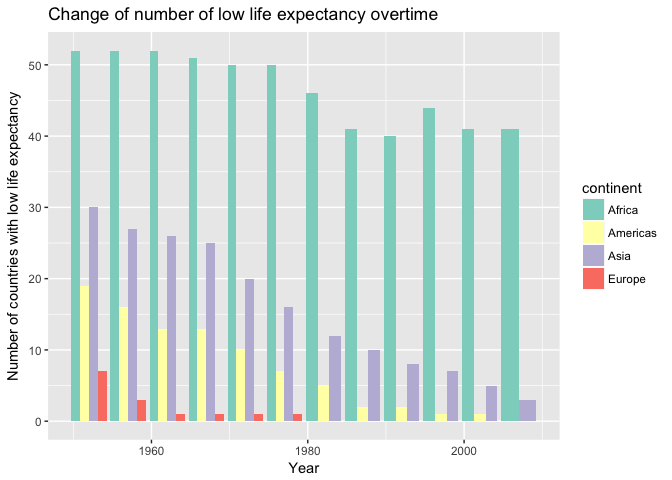

# Homework 05

This is homework 05 from Lucy Mei.

# Homework05: Factor and figure management; Repo hygiene
## Goal
1. Reorder a factor in a principled way based on the data and demonstrate the effect in arranged data and in figures.

2. Improve a figure (or make one from scratch), using new knowledge, e.g., control the color scheme, use factor levels, smoother mechanics.

3. Implement visualization design principles.

4. Write some data to file and load it back into R. e.g. save a plot to file and include it in a R markdown report via ``.

5. Organize my github, to celebrate the completion of STAT 545.

## For this homework I am going to use gapminder

```r
library(gapminder)
library(tidyverse)
```

```
## Loading tidyverse: ggplot2
## Loading tidyverse: tibble
## Loading tidyverse: tidyr
## Loading tidyverse: readr
## Loading tidyverse: purrr
## Loading tidyverse: dplyr
```

```
## Conflicts with tidy packages ----------------------------------------------
```

```
## filter(): dplyr, stats
## lag():    dplyr, stats
```

## Factor management
Step goals: 
- Define factor variables;
- Drop factor / levels;
- Reorder levels based on knowledge from data

### Drop Oceania.
First, I am going to check the number of rows in gapminder.

```r
nrow(gapminder)
```

```
## [1] 1704
```

1. Filter the Gapminder data to remove observations associated with the continent of Oceania and check how many rows are left.

```r
gapfiltered <- gapminder %>%
  filter(continent %in% c("Asia", "Americas", "Europe", "Africa"))
nrow(gapfiltered)
```

```
## [1] 1680
```

2. Additionally, remove unused factor levels. 
First, let's look at the levels of the gapfiltered (filtered out Oceania).

```r
nlevels(gapfiltered$continent)
```

```
## [1] 5
```
Although I filtered Oceania in the first step, when we look at the level of continent, there are still 5 levels.

Now, I am going to remove the level using the base function droplevels().

```r
gapfiltered_dropped <- gapfiltered %>%
  droplevels()
nlevels(gapfiltered_dropped$continent)
```

```
## [1] 4
```

```r
nrow(gapfiltered_dropped)
```

```
## [1] 1680
```
After dropping the level, there are only 4 levels in continent. The number of rows is the same before and after dropping the unused level.


### Reorder the levels of country or continent.
In this section, I am interested in looking at the maximum GDP per capita of Europe countries in 1959 and 2007.
First, I will need to filter out the data I want.

```r
gdpPercap_1952 <- gapminder %>%
  filter(continent == "Europe", year == 1952)
nlevels(gdpPercap_1952$country)
```

```
## [1] 142
```

```r
gdpPercap_2007 <- gapminder %>%
  filter(continent == "Europe", year == 2007)
nlevels(gdpPercap_2007$country)
```

```
## [1] 142
```
Since I only filtered the data, when I look at the level of countries, it still shows total of 142 levels.

So I am going to drop the unused levels now.

```r
gdpPercap_1952 <- gdpPercap_1952 %>%
  droplevels()
nlevels(gdpPercap_1952$country)
```

```
## [1] 30
```

```r
gdpPercap_2007 <- gdpPercap_2007 %>%
  droplevels()
nlevels(gdpPercap_2007$country)
```

```
## [1] 30
```
Good, so the data I want only has 30 levels now.
Let's make a plot for maximum GDP per capita first.


```r
gdpPercap_1952 %>%
  group_by(country) %>%
  ggplot(aes(gdpPercap,country)) + 
  geom_point(aes((gdpPercap), country)) +
  labs(x="GDP per capita", y="Country", title = "GDP per capita of European countries in 1952")
```

<!-- -->

```r
gdpPercap_2007 %>%
  group_by(country) %>%
  ggplot(aes(gdpPercap,country)) + 
  geom_point(aes((gdpPercap), country)) +
  labs(x="GDP per capita", y="Country", title = "GDP per capita of European countries in 2007")
```

<!-- -->
The plots do not give useful information.

Now, I am going to reorder the levels according to maximum GDP per capita.

```r
gdpPercap_1952 %>%
  ggplot(aes(gdpPercap, forcats::fct_reorder(country, gdpPercap))) + 
  geom_point() +
  labs(x="GDP per capita", y="Country", title = "GDP per capita of European countries in 1952")
```

<!-- -->

```r
gdpPercap_2007 %>%
  ggplot(aes(gdpPercap, forcats::fct_reorder(country, gdpPercap))) + 
  geom_point() +
  labs(x="GDP per capita", y="Country", title = "GDP per capita of European countries in 2007")
```

<!-- -->
The plots are now arranged according to GDP per capita. From these two plots it is easy to tell that Norway and Switzerland had high GDP per capita in both 1952 and 2007. GDP per capita in Europe increased in general from 1952 to 2007.

### Look at continent 
If I look at the continent.

```r
gdpPercap_continent1952 <- gapminder %>%
  filter(year == 1952) %>%
  droplevels()
levels(gdpPercap_continent1952$continent)
```

```
## [1] "Africa"   "Americas" "Asia"     "Europe"   "Oceania"
```

```r
gdpPercap_continent2007 <- gapminder %>%
  filter(year == 2007) %>%
  droplevels()
levels(gdpPercap_continent2007$continent)
```

```
## [1] "Africa"   "Americas" "Asia"     "Europe"   "Oceania"
```


```r
gdpPercap_continent1952 %>%
  ggplot(aes(continent,gdpPercap)) +
  geom_point(aes(continent,gdpPercap)) +
  labs(x="Continent", y="GDP per capita", title = "GDP per capita of continents in 1952")
```

<!-- -->

```r
gdpPercap_continent2007 %>%
  ggplot(aes(continent, gdpPercap)) + 
  geom_point(aes(continent, gdpPercap)) +
  labs(x="Continent", y="GDP per capita", title = "GDP per capita of continents in 2007")
```

<!-- -->

The plot is not in order now.


And I reorder the level according to maximum GDP per capita of the continent. We can tell that GDP per capita of Europe is generallly higher than that of Africa.

```r
gdpPercap_continent1952 %>%
  ggplot(aes(forcats::fct_reorder(continent, gdpPercap, max),gdpPercap)) +
  geom_point(aes(forcats::fct_reorder(continent, gdpPercap, max),gdpPercap)) +
  labs(x="Continent", y="GDP per capita", title = "GDP per capita of continents in 1952")
```

<!-- -->

```r
gdpPercap_continent2007 %>%
  ggplot(aes(forcats::fct_reorder(continent, gdpPercap, max), gdpPercap)) + 
  geom_point(aes(forcats::fct_reorder(continent, gdpPercap, max), gdpPercap)) +
  labs(x="Continent", y="GDP per capita", title = "GDP per capita of continents in 2007")
```

<!-- -->
Now we can clearly see that Europe has the highest GDP per capita whereas Africa has the lowest.

### Common part
Characterize the (derived) data before and after your factor re-leveling.
- Explore the effects of arrange(). Does merely arranging the data have any effect on a figure?

If I arrange gapminder data of Europe in 1950 according to GDP per capita and then plot. The plot is not in the arranged order. However, the table generated is arranged according to ascending gdpPercap.

```r
gdpPercap_1952 %>%
  arrange(gdpPercap) %>%
  ggplot(aes(gdpPercap,country)) +
  geom_point() +
  labs(x="GDP per capita", y="Country", title = "GDP per capita of European countries in 1952")
```

<!-- -->

```r
gdpPercap_1952 %>%
  arrange(gdpPercap) %>%
  knitr::kable(align = 'c', format = 'markdown', digits = 2)
```


|        country         | continent | year | lifeExp |   pop    | gdpPercap |
|:----------------------:|:---------:|:----:|:-------:|:--------:|:---------:|
| Bosnia and Herzegovina |  Europe   | 1952 |  53.82  | 2791000  |  973.53   |
|        Albania         |  Europe   | 1952 |  55.23  | 1282697  |  1601.06  |
|         Turkey         |  Europe   | 1952 |  43.59  | 22235677 |  1969.10  |
|        Bulgaria        |  Europe   | 1952 |  59.60  | 7274900  |  2444.29  |
|       Montenegro       |  Europe   | 1952 |  59.16  |  413834  |  2647.59  |
|        Portugal        |  Europe   | 1952 |  59.82  | 8526050  |  3068.32  |
|        Croatia         |  Europe   | 1952 |  61.21  | 3882229  |  3119.24  |
|        Romania         |  Europe   | 1952 |  61.05  | 16630000 |  3144.61  |
|         Greece         |  Europe   | 1952 |  65.86  | 7733250  |  3530.69  |
|         Serbia         |  Europe   | 1952 |  58.00  | 6860147  |  3581.46  |
|         Spain          |  Europe   | 1952 |  64.94  | 28549870 |  3834.03  |
|         Poland         |  Europe   | 1952 |  61.31  | 25730551 |  4029.33  |
|        Slovenia        |  Europe   | 1952 |  65.57  | 1489518  |  4215.04  |
|         Italy          |  Europe   | 1952 |  65.94  | 47666000 |  4931.40  |
|    Slovak Republic     |  Europe   | 1952 |  64.36  | 3558137  |  5074.66  |
|        Ireland         |  Europe   | 1952 |  66.91  | 2952156  |  5210.28  |
|        Hungary         |  Europe   | 1952 |  64.03  | 9504000  |  5263.67  |
|        Austria         |  Europe   | 1952 |  66.80  | 6927772  |  6137.08  |
|        Finland         |  Europe   | 1952 |  66.55  | 4090500  |  6424.52  |
|     Czech Republic     |  Europe   | 1952 |  66.87  | 9125183  |  6876.14  |
|         France         |  Europe   | 1952 |  67.41  | 42459667 |  7029.81  |
|        Germany         |  Europe   | 1952 |  67.50  | 69145952 |  7144.11  |
|        Iceland         |  Europe   | 1952 |  72.49  |  147962  |  7267.69  |
|        Belgium         |  Europe   | 1952 |  68.00  | 8730405  |  8343.11  |
|         Sweden         |  Europe   | 1952 |  71.86  | 7124673  |  8527.84  |
|      Netherlands       |  Europe   | 1952 |  72.13  | 10381988 |  8941.57  |
|        Denmark         |  Europe   | 1952 |  70.78  | 4334000  |  9692.39  |
|     United Kingdom     |  Europe   | 1952 |  69.18  | 50430000 |  9979.51  |
|         Norway         |  Europe   | 1952 |  72.67  | 3327728  | 10095.42  |
|      Switzerland       |  Europe   | 1952 |  69.62  | 4815000  | 14734.23  |


- Explore the effects of reordering a factor and factor reordering coupled with arrange(). Especially, what effect does this have on a figure?
If I reorder the level according to GDP per capita and plot the same thing as the previous plot.

```r
gdpPercap_1952reorder <- gdpPercap_1952 %>%
  mutate(country = forcats::fct_reorder(country,gdpPercap))
  
ggplot(gdpPercap_1952reorder, aes(gdpPercap, country)) + 
  geom_point() +
  labs(x="GDP per capita", y="Country", title = "GDP per capita of European countries in 1952")
```

<!-- -->
As shown before, it gives a new ordered plot.

If I use a combination of reordering and arrange(). For example, what if I arrange the reordered data according to life expectancy first and then I plot it life expectancy vs year. It shows that arrange() has no effect on the plot. 

```r
gdpPercap_1952reorder %>%
  arrange(lifeExp) %>%
  ggplot(aes(lifeExp,country)) + 
  geom_point() +
  labs(x="Life Expectancy", y="Country", title = "Life Expectancy of European countries in 1952")
```

<!-- -->

```r
gdpPercap_1952reorder %>%
  ggplot(aes(lifeExp, forcats::fct_reorder(country, lifeExp))) + 
  geom_point() +
  labs(x="Life Expectancy", y="Country", title = "Life Expectancy of European countries in 1952")
```

<!-- -->
Instead, when I reordered the level of country according to life expectancy, now the plot is ordered.


## File I/O
Experiment with one or more of write_csv()/read_csv() (and/or TSV friends), saveRDS()/readRDS(), dput()/dget(). 
Create something new, probably by filtering or grouped-summarization of Gapminder.
Incorporate factor levels.

1. First, I load gapminder data and get the data for the mean GDP per capita of European countries.

```r
Europe_gdp_percap <- gapminder %>%
  filter(continent=="Europe") %>%
  group_by(country) %>%
  summarise(gdp_percap = mean(gdpPercap)) 
Europe_gdp_percap
```

```
## # A tibble: 30 x 2
##                   country gdp_percap
##                    <fctr>      <dbl>
##  1                Albania   3255.367
##  2                Austria  20411.916
##  3                Belgium  19900.758
##  4 Bosnia and Herzegovina   3484.779
##  5               Bulgaria   6384.055
##  6                Croatia   9331.712
##  7         Czech Republic  13920.011
##  8                Denmark  21671.825
##  9                Finland  17473.723
## 10                 France  18833.570
## # ... with 20 more rows
```

2. Then reorder country according to GDP per capita.

```r
Europe_gdp_percap <- Europe_gdp_percap %>%
  mutate(country= forcats::fct_reorder(country, gdp_percap)) %>%
  droplevels()
head(levels(Europe_gdp_percap$country))
```

```
## [1] "Albania"                "Bosnia and Herzegovina"
## [3] "Turkey"                 "Bulgaria"              
## [5] "Montenegro"             "Romania"
```

```r
head(Europe_gdp_percap)
```

```
## # A tibble: 6 x 2
##                  country gdp_percap
##                   <fctr>      <dbl>
## 1                Albania   3255.367
## 2                Austria  20411.916
## 3                Belgium  19900.758
## 4 Bosnia and Herzegovina   3484.779
## 5               Bulgaria   6384.055
## 6                Croatia   9331.712
```

```r
compare_levels <- tibble(original=levels(Europe_gdp_percap$country))
```

3. Save as CSV and RDS.

```r
write_csv(Europe_gdp_percap, "Europe_gdp_percap.csv")
saveRDS(Europe_gdp_percap, "Europe_gdp_percap.rds")
```

4. Read it back. So CSV file will not keep the reordered levels but rds will maintain the reorder levels. 

```r
Europe_gdp_percap_csv <- read_csv("Europe_gdp_percap.csv") %>%
  mutate(country=factor(country))
```

```
## Parsed with column specification:
## cols(
##   country = col_character(),
##   gdp_percap = col_double()
## )
```

```r
Europe_gdp_percap_rds <- readRDS("Europe_gdp_percap.rds")

compare_levels <- compare_levels %>%
  mutate(csv_levels = (levels(Europe_gdp_percap_csv$country)),
         rds_levels = (levels(Europe_gdp_percap_rds$country)))
compare_levels
```

```
## # A tibble: 30 x 3
##                  original             csv_levels             rds_levels
##                     <chr>                  <chr>                  <chr>
##  1                Albania                Albania                Albania
##  2 Bosnia and Herzegovina                Austria Bosnia and Herzegovina
##  3                 Turkey                Belgium                 Turkey
##  4               Bulgaria Bosnia and Herzegovina               Bulgaria
##  5             Montenegro               Bulgaria             Montenegro
##  6                Romania                Croatia                Romania
##  7                 Poland         Czech Republic                 Poland
##  8                 Serbia                Denmark                 Serbia
##  9                Croatia                Finland                Croatia
## 10        Slovak Republic                 France        Slovak Republic
## # ... with 20 more rows
```


## Visualization design
Remake at least one figure or create a new one, in light of something I learned in the recent class meetings about visualization design and color. 
Juxtapose the first attempt and what I obtained after some time spent working on it.
Reflect on the differences. 

### First plot I want to improve
I want to plot change of mean life expectancy of the continent overtime. First, I created a new column for mean life expectancy of each continent.

```r
meanlifeExp <- gapminder %>%
  group_by(year,continent) %>%
  mutate(meanle = mean(lifeExp))
meanlifeExp
```

```
## # A tibble: 1,704 x 7
## # Groups:   year, continent [60]
##        country continent  year lifeExp      pop gdpPercap   meanle
##         <fctr>    <fctr> <int>   <dbl>    <int>     <dbl>    <dbl>
##  1 Afghanistan      Asia  1952  28.801  8425333  779.4453 46.31439
##  2 Afghanistan      Asia  1957  30.332  9240934  820.8530 49.31854
##  3 Afghanistan      Asia  1962  31.997 10267083  853.1007 51.56322
##  4 Afghanistan      Asia  1967  34.020 11537966  836.1971 54.66364
##  5 Afghanistan      Asia  1972  36.088 13079460  739.9811 57.31927
##  6 Afghanistan      Asia  1977  38.438 14880372  786.1134 59.61056
##  7 Afghanistan      Asia  1982  39.854 12881816  978.0114 62.61794
##  8 Afghanistan      Asia  1987  40.822 13867957  852.3959 64.85118
##  9 Afghanistan      Asia  1992  41.674 16317921  649.3414 66.53721
## 10 Afghanistan      Asia  1997  41.763 22227415  635.3414 68.02052
## # ... with 1,694 more rows
```

Then, I plot it as I would before.

```r
meanlifeExp %>%
  ggplot(aes(x=year, y=meanle)) +
  geom_point(aes(x=year, y=meanle, color=continent)) +
  labs(x="Year", y="Mean Life Expectancy", title="Change of mean life expectancy overtime")
```

<!-- -->

Now, I try to improve the plot. I used a new set of colours. From this plot, I can not only see the trend of each continent but also to compare the mean life expectancy between continents for each year. 

```r
library(RColorBrewer)
my_plot <- ggplot(meanlifeExp, aes(x=year, y=meanle)) +
  geom_bar(aes(x=year, y=meanle, fill=continent),position="dodge", stat="identity") +
  scale_fill_manual(values=brewer.pal(n=5, "Set2")) +
  scale_y_continuous("Mean Life Expectancy") +
  scale_x_continuous("Year") +
  labs(title="Change of mean life expectancy overtime")
my_plot
```

<!-- -->

### Low life expectancy plot

Another plot I want to try. In hw03, I explored low life expectancy already. I want to know the proportion of countries that have a life expectancy lower than the global median life expectancy.  

First, this is how I would do before. I would add a y-intercept line to indicate boundary.

```r
gapminder %>%
  ggplot(aes(year, lifeExp)) +
  geom_point(aes(x=year, y=lifeExp)) +
  facet_wrap(~continent) +
  geom_hline(yintercept=60.71, colour="red") +
  labs(x="Year", y="Life Expectancy", title="Life Expectancy overtime")
```

<!-- -->


Now, I can plot the following. The colour change gives a more straightforward indication of the amount of countries have low life expectancy compare to the first plot. Also the legend gives a brief explanation to the colours. However, I think y-intercept gives a better sense of how life expectancy deviates from the mean value. For example, from the first plot, I can tell the life expectancy of Oceania is way above the mean. 

```r
colour_layer <- scale_colour_manual("Life expectancy",
                                    labels=c("High Life Expectancy", "Low Life Expectancy"),
                                    values=c("black", "blue"))
lowlifeplot <- gapminder %>%
  ggplot(aes(year, lifeExp)) +
  geom_point(aes(x=year, y=lifeExp, colour = lifeExp <60.71)) +
  colour_layer +
  scale_alpha_discrete(range=c(0.2, 1), guide=FALSE) +
  facet_wrap(~continent) +
  labs(x="Year", y="Life Expectancy", title="Life Expectancy overtime")

lowlifeplot
```

<!-- -->


### Visualization trick from guest lecture
Sometimes derived data can be more significant and people seem to be more sensitive to length change, I am going to plot the number of countries that have low life expectancy each year in a bar plot.
This plot gives another view to present the number of countries with low life expectancy. It is very clear that the life expectancy of Oceania is always above average. 

```r
library(RColorBrewer)
numcountry_lowlife<- gapminder %>%
  filter(lifeExp < 60.71) %>%
  group_by(continent) %>%
  ggplot(aes(year)) +
  geom_bar(aes(x=year, fill=continent),position="dodge") +
  scale_fill_manual(values=brewer.pal(n=5, "Set3")) +
  scale_y_continuous("Number of countries with low life expectancy") +
  scale_x_continuous("Year") +
  labs(title="Change of number of low life expectancy overtime")
numcountry_lowlife
```

<!-- -->


## Writing figures to file
Use ggsave() to explicitly save a plot to file.
Then use `` to load and embed it in my report. 

First, I want to combine the two plots together.

```r
library(gridExtra)
```

```
## 
## Attaching package: 'gridExtra'
```

```
## The following object is masked from 'package:dplyr':
## 
##     combine
```

```r
combined_plot <- grid.arrange(my_plot, lowlifeplot, numcountry_lowlife, nrow=2)
```

<!-- -->


So now I want to save the two life expectancy plots in a file.

```r
ggsave("combined_plot.png", combined_plot)
```

```
## Saving 7 x 5 in image
```


# But I want to do more!
Make a deeper exploration of the forcats packages, i.e. try more of the factor level reordering functions.
Pick a handful of countries, each of which you can associate with a stereotypical animal. Create an excerpt of the Gapminder data, filtered to just these countries.
Create a new factor by mapping the existing country factor levels to the new levels.
1. First, I created a new data frame called country_animal.

```r
country <- c("Belgium", "Canada", "China", "Finland", "France", "Germany", "Greece", "Poland")
national_animal <- c("Lion", "Beaver", "Panda", "Brown bear", "Gallic rooster", "Eagle", "Dolphins", "European bison")
country_animal <- data.frame(country, national_animal)
```
2. Then, I checked the level of the national animal in this data frame, which is alphabetical.

```r
country_animal$national_animal %>% 
  levels()
```

```
## [1] "Beaver"         "Brown bear"     "Dolphins"       "Eagle"         
## [5] "European bison" "Gallic rooster" "Lion"           "Panda"
```
I reordered them according to how I want it to be.

```r
country_animal <- country_animal %>%
  mutate(national_animal= forcats::fct_relevel(national_animal, "Dolphins", "Panda"))
levels(country_animal$national_animal)
```

```
## [1] "Dolphins"       "Panda"          "Beaver"         "Brown bear"    
## [5] "Eagle"          "European bison" "Gallic rooster" "Lion"
```

3. Filtered gapminder data and drop unused levels.

```r
filtered_country <- gapminder %>%
  filter(country %in% c("Belgium", "Canada", "China", "Finland", "France", "Germany", "Greece", "Poland")) %>%
  droplevels()
levels(filtered_country$country)
```

```
## [1] "Belgium" "Canada"  "China"   "Finland" "France"  "Germany" "Greece" 
## [8] "Poland"
```

4. I then join the data.

```r
gapnational <- left_join(filtered_country, country_animal)
```

```
## Joining, by = "country"
```

```r
gapnational %>%
  filter(year==2007)
```

```
## # A tibble: 8 x 7
##   country continent  year lifeExp        pop gdpPercap national_animal
##    <fctr>    <fctr> <int>   <dbl>      <int>     <dbl>          <fctr>
## 1 Belgium    Europe  2007  79.441   10392226 33692.605            Lion
## 2  Canada  Americas  2007  80.653   33390141 36319.235          Beaver
## 3   China      Asia  2007  72.961 1318683096  4959.115           Panda
## 4 Finland    Europe  2007  79.313    5238460 33207.084      Brown bear
## 5  France    Europe  2007  80.657   61083916 30470.017  Gallic rooster
## 6 Germany    Europe  2007  79.406   82400996 32170.374           Eagle
## 7  Greece    Europe  2007  79.483   10706290 27538.412        Dolphins
## 8  Poland    Europe  2007  75.563   38518241 15389.925  European bison
```

Then I am stuck here. I am not sure how to map the existing country factor levels to the new levels. 

## Report my progress
1. I think reordering the level is definitely very helpful when comes to plotting since `arrange()` does not do the ordering in ggplot.

2. Also I think it is very useful to combine the plots in one figure but I am not sure if I can scale individual plot within that page. For example, I know the size of the figure I want but within the figure I want to manipulate the sizes of individual plots.

3. Another question I want to ask is that for the visualization section, the plot Change of number of low life expectancy overtime. For `geom_bar` plot, when there is no value for Oceania, I notice the bars for Africa for 2007 (the very last year) become wider since there are only two continents. Is there a way to make the bars as a fixed size so they don't change sizes?

4. It is very interesting to explore visualization of the plots. Especially after the guest lecture, I think more before I make plots.

5. For the additional question at the very last. I tried to search online but most of the tutorials only talk about how to reorder factor levels according to numeric values. I am not sure if I understand the question correctly. I think the question wants us to map one factor levels to a new level order of a second factor. I don't know how to do that.


