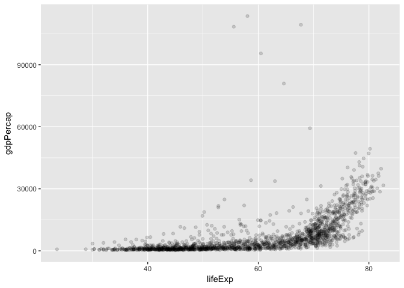
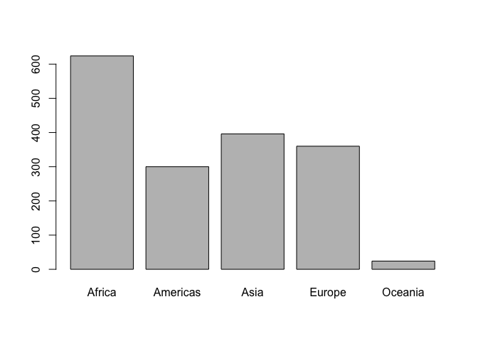
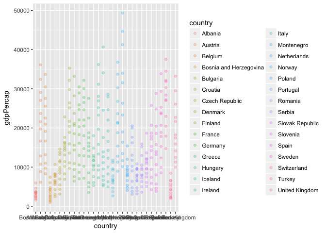
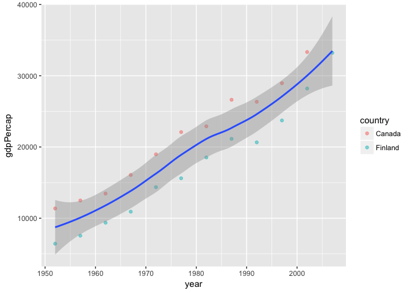

#This is STAT545 hw02 from Lucy Mei
# Bring rectangular data in

```r
library(gapminder)
library(tidyverse)
```

```
## Loading tidyverse: ggplot2
## Loading tidyverse: tibble
## Loading tidyverse: tidyr
## Loading tidyverse: readr
## Loading tidyverse: purrr
## Loading tidyverse: dplyr
```

```
## Conflicts with tidy packages ----------------------------------------------
```

```
## filter(): dplyr, stats
## lag():    dplyr, stats
```


# Smell test the data

```r
typeof(gapminder)
```

```
## [1] "list"
```

```r
str(gapminder)
```

```
## Classes 'tbl_df', 'tbl' and 'data.frame':	1704 obs. of  6 variables:
##  $ country  : Factor w/ 142 levels "Afghanistan",..: 1 1 1 1 1 1 1 1 1 1 ...
##  $ continent: Factor w/ 5 levels "Africa","Americas",..: 3 3 3 3 3 3 3 3 3 3 ...
##  $ year     : int  1952 1957 1962 1967 1972 1977 1982 1987 1992 1997 ...
##  $ lifeExp  : num  28.8 30.3 32 34 36.1 ...
##  $ pop      : int  8425333 9240934 10267083 11537966 13079460 14880372 12881816 13867957 16317921 22227415 ...
##  $ gdpPercap: num  779 821 853 836 740 ...
```
gapminder is data.frame and if use typeof function it gives it as a list.
Its class is data.frame.
There are 6 variables and 1704 rows.
Yes, there are different ways of getting the extend or size. str() can give an overall view of the data whereas dim() and ncol(), nrow() give a specific answer to the size.

```r
str(gapminder)
```

```
## Classes 'tbl_df', 'tbl' and 'data.frame':	1704 obs. of  6 variables:
##  $ country  : Factor w/ 142 levels "Afghanistan",..: 1 1 1 1 1 1 1 1 1 1 ...
##  $ continent: Factor w/ 5 levels "Africa","Americas",..: 3 3 3 3 3 3 3 3 3 3 ...
##  $ year     : int  1952 1957 1962 1967 1972 1977 1982 1987 1992 1997 ...
##  $ lifeExp  : num  28.8 30.3 32 34 36.1 ...
##  $ pop      : int  8425333 9240934 10267083 11537966 13079460 14880372 12881816 13867957 16317921 22227415 ...
##  $ gdpPercap: num  779 821 853 836 740 ...
```

```r
dim(gapminder)
```

```
## [1] 1704    6
```

```r
ncol(gapminder)
```

```
## [1] 6
```

```r
nrow(gapminder)
```

```
## [1] 1704
```
The data type of each variable.

```r
sapply(gapminder, class)
```

```
##   country continent      year   lifeExp       pop gdpPercap 
##  "factor"  "factor" "integer" "numeric" "integer" "numeric"
```
  country continent      year   lifeExp       pop gdpPercap 
 "factor"  "factor" "integer" "numeric" "integer" "numeric" 
 
# Explore individual variables
For country and gdpPercap:
1) What are possible values of the variables?
The min value of gdp per capita is 241.2 and the max is 113500.

2) What's the spread? Whats the distribution?
The variability of gdpPercap is within 0-60000 with most of the countries have gdpPercap between 0-1000. A large proportion of countries are in Africa and similar amount of countries from Americas, Asia and Europe with only fewer than 50 countries from Oceania.


```r
summary(gapminder$gdpPercap)
```

```
##     Min.  1st Qu.   Median     Mean  3rd Qu.     Max. 
##    241.2   1202.0   3532.0   7215.0   9325.0 113500.0
```

```r
hist(gapminder$gdpPercap)
```

<!-- -->

```r
barplot(table(gapminder$continent))
```

<!-- -->

# Explore various ploty types
1) A scatterplot of two quantitative variables.
2) A plot of one quantitative variable.
3) A plot of one quantitative variable and one categorical.

```r
ggplot(gapminder, aes(x=lifeExp, y=gdpPercap)) + geom_point(alpha=0.15)
```

<!-- -->

```r
barplot(table(gapminder$continent))
```

<!-- -->

```r
ggplot(filter(gapminder, continent=="Europe"), aes(x=country, y=gdpPercap)) + geom_point(aes(color=country), alpha=0.25)
```

<!-- -->


# Use filter(), select() and %>%
A plot that shows the trends of gdp per capita less than 35000 of Canada and Finland.

```r
select(filter(gapminder, 
              country %in% c("Canada", "Finland"), 
              gdpPercap < 35000), 
       country, year, gdpPercap) %>%
  ggplot(aes(x=year, y=gdpPercap)) + geom_point(aes(color=country), alpha=0.5) + geom_smooth(method="lm")
```

<!-- -->


# But I want to do more!
This code filters the data of Afghanistan and Rwanda as a set/vector according to the order of year. For example, Rwanda 1952 and Afghanistan 1957 are included but Afghanistan 1952 and Rwanda 1957 are not included. Since Rwanda is the first term in the vector, therefore, the filtered data starts with Rwanda 1952. 
It is not the correct way to select data for Rwanda and Afghanistan since half of the data from Rwanda and Afghanistan is not included in this filtered list.
The correct way should be the following.

```r
filter(gapminder, country == "Rwanda" | country == "Afghanistan")
```

```
## # A tibble: 24 x 6
##        country continent  year lifeExp      pop gdpPercap
##         <fctr>    <fctr> <int>   <dbl>    <int>     <dbl>
##  1 Afghanistan      Asia  1952  28.801  8425333  779.4453
##  2 Afghanistan      Asia  1957  30.332  9240934  820.8530
##  3 Afghanistan      Asia  1962  31.997 10267083  853.1007
##  4 Afghanistan      Asia  1967  34.020 11537966  836.1971
##  5 Afghanistan      Asia  1972  36.088 13079460  739.9811
##  6 Afghanistan      Asia  1977  38.438 14880372  786.1134
##  7 Afghanistan      Asia  1982  39.854 12881816  978.0114
##  8 Afghanistan      Asia  1987  40.822 13867957  852.3959
##  9 Afghanistan      Asia  1992  41.674 16317921  649.3414
## 10 Afghanistan      Asia  1997  41.763 22227415  635.3414
## # ... with 14 more rows
```

```r
library(gapminder)
library(tidyverse)
x <- select(filter(gapminder, continent =="Americas", year >= 1970, year <= 1979), country, year, gdpPercap)
library(knitr)

knitr::kable(x,
             digits = 4,
             caption = "GDP per capita of Asian",
             align = c("l"),
             padding = 3)
```


Table: GDP per capita of Asian

country                 year     gdpPercap   
----------------------  -------  ------------
Argentina               1972     9443.039    
Argentina               1977     10079.027   
Bolivia                 1972     2980.331    
Bolivia                 1977     3548.098    
Brazil                  1972     4985.712    
Brazil                  1977     6660.119    
Canada                  1972     18970.571   
Canada                  1977     22090.883   
Chile                   1972     5494.024    
Chile                   1977     4756.764    
Colombia                1972     3264.660    
Colombia                1977     3815.808    
Costa Rica              1972     5118.147    
Costa Rica              1977     5926.877    
Cuba                    1972     5305.445    
Cuba                    1977     6380.495    
Dominican Republic      1972     2189.874    
Dominican Republic      1977     2681.989    
Ecuador                 1972     5280.995    
Ecuador                 1977     6679.623    
El Salvador             1972     4520.246    
El Salvador             1977     5138.922    
Guatemala               1972     4031.408    
Guatemala               1977     4879.993    
Haiti                   1972     1654.457    
Haiti                   1977     1874.299    
Honduras                1972     2529.842    
Honduras                1977     3203.208    
Jamaica                 1972     7433.889    
Jamaica                 1977     6650.196    
Mexico                  1972     6809.407    
Mexico                  1977     7674.929    
Nicaragua               1972     4688.593    
Nicaragua               1977     5486.371    
Panama                  1972     5364.250    
Panama                  1977     5351.912    
Paraguay                1972     2523.338    
Paraguay                1977     3248.373    
Peru                    1972     5937.827    
Peru                    1977     6281.291    
Puerto Rico             1972     9123.042    
Puerto Rico             1977     9770.525    
Trinidad and Tobago     1972     6619.551    
Trinidad and Tobago     1977     7899.554    
United States           1972     21806.036   
United States           1977     24072.632   
Uruguay                 1972     5703.409    
Uruguay                 1977     6504.340    
Venezuela               1972     10505.260   
Venezuela               1977     13143.951   


# Report your process
In general I can figure out most of the questions. 
The additional part of the hw is a little bit challenging. I found out the answer to filter(gapminder, country == c("Rwanda", "Afghanistan")) by comparing the differences between using vectors and the normal way I would do it. 
There are many ways to organize a table and I think it is important to find a way make a table tailored to my own purpose. I am interested in learning more about this through online tutorial and tools.
